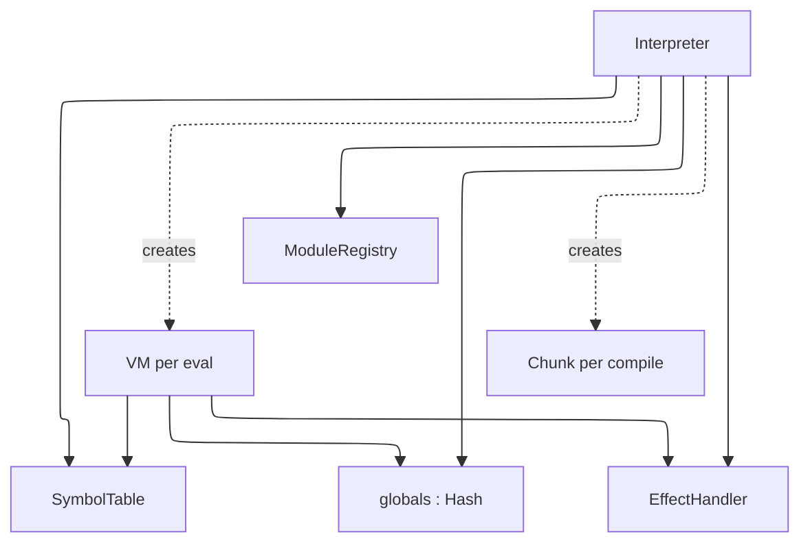
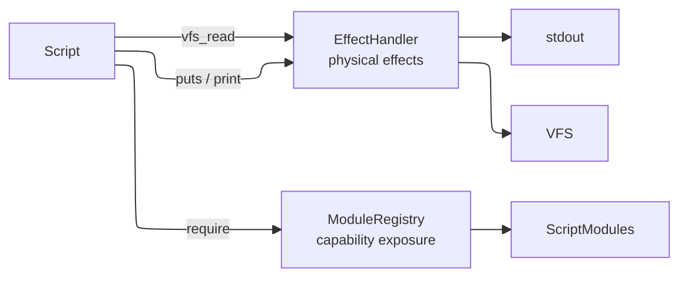
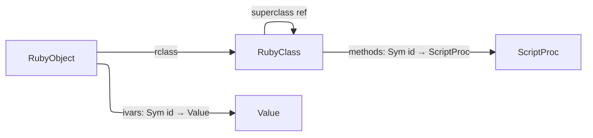

# Development Guide

This document explains how `adjutant` works internally. It is written for contributors and maintainers who need to understand, debug, or extend the library.

## Dependencies

1. Make sure you have `ops` installed, in one of the following ways:
    - as a gem via `gem install ops_team` or
    - as a tool via `brew tap nickthecook/crops && brew install ops`
2. If you not using macOS, or a Linux that uses `apt`, please [install Crystal](https://crystal-lang.org/install/)

## Getting started

|Command                        |Description                                                                       |
|-------------------------------|----------------------------------------------------------------------------------|
|`ops up`                       |Gets everything setup including `crystal` via `apt` or `brew` if applicable.      |
|`ops build-debug` or `ops bd`  |Make a debug build of `benchmark` sample, in `bin/debug` folder.                  |
|`ops build-release` or `ops br`|Make a release / production build of `benchmark` sample,  in `bin/release` folder.|
|`ops lint`                     |Run `ameba` on the source code                                                    |
|`ops clean`                    |Remove debug and release build files                                              |
|`ops wipe`                     |In addition to cleaning, remove all compiler caches                               |
|`ops test`                     |Run Crystal test specs.                                                           |

### Run test scripts

> `ops test` does not run test scripts, only Crystal test specs

Test scripts are Ruby files that test the Adjutant language features.

```
ops build
bin/debug/test_runner
```

This will run all the test scripts in `spec/scripts` folder.

### Run samples

Run the following command to see `adjutant` in action with a sample runner (based on the example in the README) and sample Ruby script.

```
ops -q run samples/run_script -- samples/scripts/fib_10.rb
```

You should receive the following output:

```
Result: 55
```

## How Adjutant works

Adjutant is a bytecode interpreter for a Ruby-like scripting language. Its design is shaped by four goals: safe execution of untrusted scripts, a clear and auditable effect boundary, syntax familiar to LLMs trained on Ruby, and a foundation for information flow control.

### Pipeline overview

A script moves through five stages before producing a result:


Each stage produces a self-contained artifact — `Array(Token)`, `Body` (AST), `Chunk` (bytecode), and finally a `Value`. Stages are independently testable and the compiler and VM can be used without going through the full pipeline.

### Ownership and lifetime



The `Interpreter` is long-lived and intended to span a full agent session. The `SymbolTable`, `ModuleRegistry`, and globals hash all persist across `eval` calls. A fresh `VM` is created for each execution but shares the interpreter's globals, so variables set in one `eval` are visible in the next.

### The Lexer

`Lexer` reads from an `IO` (eagerly into a `String` since random access is needed for peeking and lexeme slicing). It produces `Token` values carrying a `TokenKind`, lexeme string, line, and column. The source string is UTF-8 via Crystal's native `String`/`Char` handling — string and comment content in any language passes through verbatim. Identifier scanning uses `ascii_alphanumeric?` by design, so identifier names are currently ASCII-only.

### The Parser

`Parser` is a hand-written recursive descent parser with a Pratt loop for expression precedence. It consumes tokens from a `Lexer` and produces an `Body` — the root of the AST. AST nodes are Crystal classes rooted at `abstract class Node`, each carrying source position. The parser handles the full Ruby-like grammar including interpolated strings, blocks, modifier forms (`x if cond`), multi-assignment, and keyword arguments.

Bare calls without parentheses (`puts x`) are only supported when the argument is an unambiguous literal. Identifiers as bare arguments are intentionally unsupported — this simplifies the grammar and produces clearer scripts for LLM generation.

### The Compiler

`Compiler` walks the AST and emits bytecode into a `Chunk`. It takes a `SymbolTable` reference so all symbol names are interned consistently across compilations in the same session.

A `Chunk` contains an instruction array and a constant pool (`Array(Value)`). Instructions are fixed-size structs with an opcode and three immediates (`a : UInt8`, `b : UInt16`, `c : UInt32`). Jump targets are patched after the fact using `emit_jump` / `patch_jump`.

**Scopes and locals.** Each method body and block body compiles in a fresh child `Compiler` instance with a `CompilerScope`. The scope maps local variable names to integer slot indices. Parameters are defined as the first slots; subsequent assignments in the body add more slots. `GetLocal`/`SetLocal` opcodes index into the frame's locals array by slot number rather than name.

Blocks carry a `parent` reference to the enclosing `CompilerScope` for single-level closure capture. When a block references a name not in its own scope, it checks the parent — if found, it emits `GetOuter`/`SetOuter` which read and write the enclosing frame's locals array at runtime. Names unresolvable in any scope fall through to `GetGlobal`/`SetGlobal`. Blocks do not auto-define new locals for unresolved names; only method bodies do.

Each method or block body compiles into a `ScriptProc` value stored directly in the parent chunk's constant pool. `MakeProc` pushes it onto the stack; `SetGlobal` (for top-level defs) or `DefMethod` (inside a class) stores it.

### The VM

`VM` is a stack-based bytecode interpreter. It maintains a value stack (`Array(Value)`), a frame stack (`Array(Frame)`), and a shared globals hash. Each `Frame` holds a `ScriptProc`, an instruction pointer, a stack base offset, a `locals` array sized from the proc's `local_count`, and an optional `outer_locals` reference for block closures.

The dispatch loop is a `case` on `Op` enum values, which LLVM compiles to a jump table. Each opcode handler is a short inline block — no method dispatch overhead on the hot path. Instrumentation hooks (for IFC or tracing) can be added as a single conditional before the dispatch without affecting the jump table.

**Non-recursive dispatch.** Script method calls do not recurse into `execute` — `call_script_proc` simply pushes a new `Frame` and returns a sentinel. The single `execute` loop picks up the new frame on its next iteration, and `Op::Ret` restores the caller frame. This means arbitrarily deep script recursion uses only one Crystal call frame, bounded only by the VM's configurable `call_depth_limit`.

**Closure model.** When `Op::Yield` fires, the yielding frame's `locals` array is passed as `outer_locals` to the block frame. `GetOuter`/`SetOuter` read and write slots in that array directly — since blocks execute synchronously while the outer frame is still alive, no upvalue hoisting is needed. Blocks defined outside a method (at the top level) resolve unrecognised names through globals rather than outer locals.

Execution limits (instruction count, call depth) are checked on every frame push and tick respectively.

### The effect boundary

The containment design separates physical effects from capability exposure:



`EffectHandler` handles physical effects — stdout writes and VFS reads. `ModuleRegistry` handles capability exposure — which native functions and objects a script can access. Scripts can only access capabilities that have been explicitly registered. The registry is auditable: `registered_paths` and `loaded_paths` show exactly what a script has access to and what it has used.

### The Value model

All runtime values are represented as `Value`, a Crystal struct:

```crystal
struct Value
  getter raw   : Nil | Bool | Int64 | Float64 | String | Sym | ScriptProc |
                 Array(Value) | Hash(Value, Value) | RubyClass | RubyObject
  getter label : SecurityLabel?
end
```

Using a struct means values are stack-allocated and copied on assignment — no per-value heap allocation for scalars. Crystal's union type carries its own discriminant, eliminating the need for a separate tag. Type predicates (`null?`, `bool?`, `int?`, etc.) use `is_a?` on the union.

Symbols are represented as `Sym` — a struct carrying an integer ID and an interned name string. The `SymbolTable` assigns stable IDs so symbol comparison is an integer equality check rather than a string comparison. A `SymbolTable` is owned by the `Interpreter` and shared across all compilations, so `:foo` always has the same ID regardless of which script introduced it.

### The Object model

`RubyClass` and `RubyObject` are plain Crystal classes, not `Value` variants wrapping something else — they sit directly in the `ValueRaw` union like any other type.



`RubyClass` holds a method table keyed by interned symbol ID (same keying scheme as globals and ivars), a superclass reference, and an `is_module` flag. `MakeClass` resolves the superclass by looking it up as an existing global `RubyClass` and raises `uninitialized constant` if it isn't one. `DefMethod` writes into the current class's method table — `@current_self` holds the enclosing `RubyClass` while a class body executes, via `GetClass`/`SetClass`, so nested class bodies save and restore the outer context.

This is the first phase of the object model. Method dispatch through the class hierarchy (`obj.method`), `self` binding per frame, `.new`/instance construction, and ivar storage on `RubyObject` rather than globals are follow-on work — see the handoff notes for the full sequence.

### Information flow control

Every `Value` carries an optional `SecurityLabel` reference. Labels are heap-allocated classes so they can be shared across values without copying. When two labeled values are combined, their labels are joined via `SecurityLabel.join`, which computes the least upper bound in the label lattice.

This is currently a stub — the lattice is a simple name-concatenation join and labels must be attached manually by native code (e.g. a module returning network data labels its values `{source: :network}`). The full IFC design will:

- Define a proper lattice with partial order and meet/join operations
- Track label propagation automatically through the VM dispatch loop
- Enforce declassification policies at the effect boundary
- Surface label information to the harness so the user can reason about data provenance

The `SecurityLabel` field adds one pointer width to every `Value` struct. When no label is present the field is `nil`, which is a predictable nil-check on the hot path — easily branch-predicted and potentially eliminated by the compiler when IFC is disabled.

### Writing a ScriptModule

A `ScriptModule` is the unit of capability exposure. Implement the abstract class:

```crystal
class MyModule < Adjutant::ScriptModule
  def name : String
    "agent/mymodule"
  end

  def load(interp : Adjutant::Interpreter) : Nil
    interp.define_native("my_func") do |args|
      # args is Array(Adjutant::Value)
      result = do_something(args.first.as_string)
      Adjutant::Value.string(result)
    end
  end
end

interp.modules.register(MyModule.new)
```

For simpler cases, register with a block:

```crystal
interp.modules.register("agent/mymodule") do |i|
  i.define_native("my_func") { |args| Adjutant::Value.string("hello") }
end
```

Scripts load the module with `require "agent/mymodule"`. Each module is loaded at most once per interpreter instance regardless of how many times the script calls `require`.

For IFC, attach labels to values your module returns:

```crystal
interp.define_native("fetch_data") do |args|
  data = http_get(args.first.as_string)
  label = Adjutant::SecurityLabel.new("network")
  Adjutant::Value.string(data, label)
end
```
