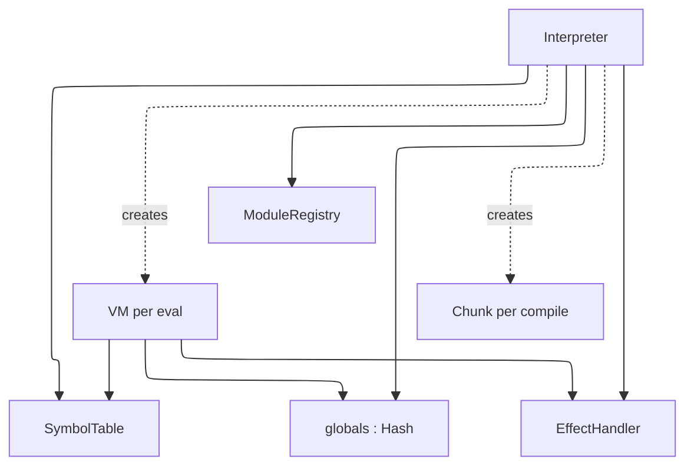
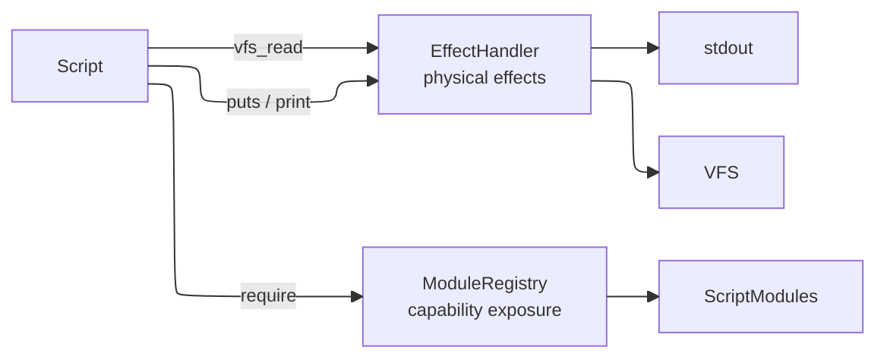
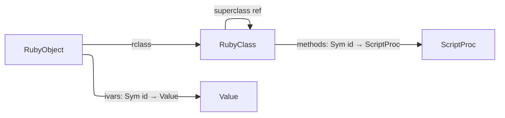
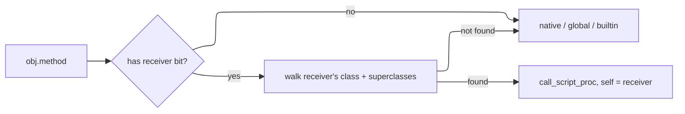
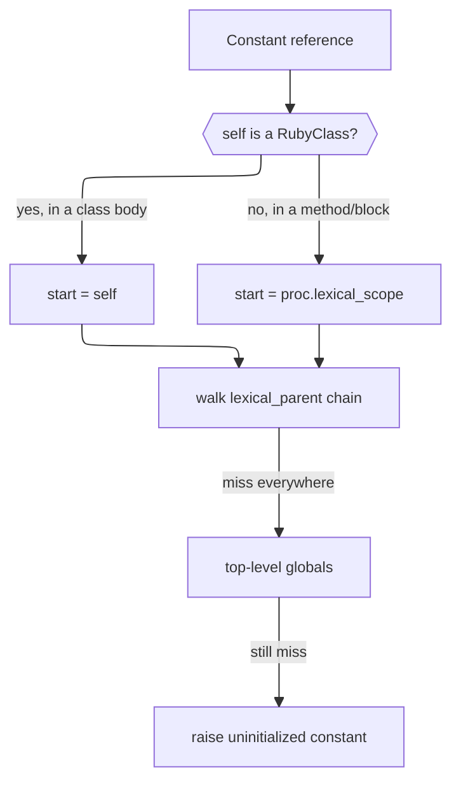
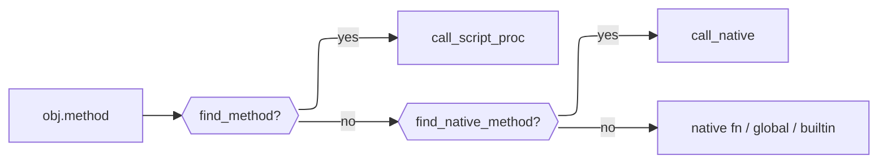
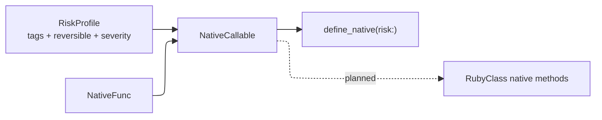
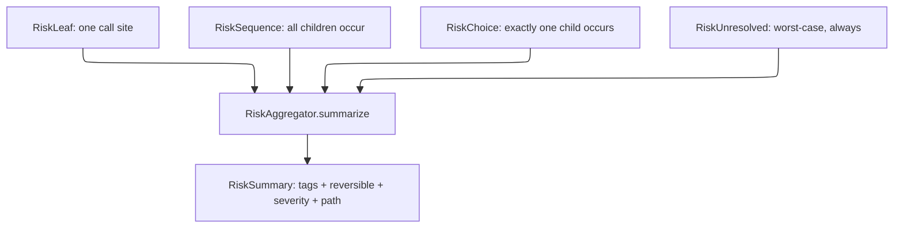
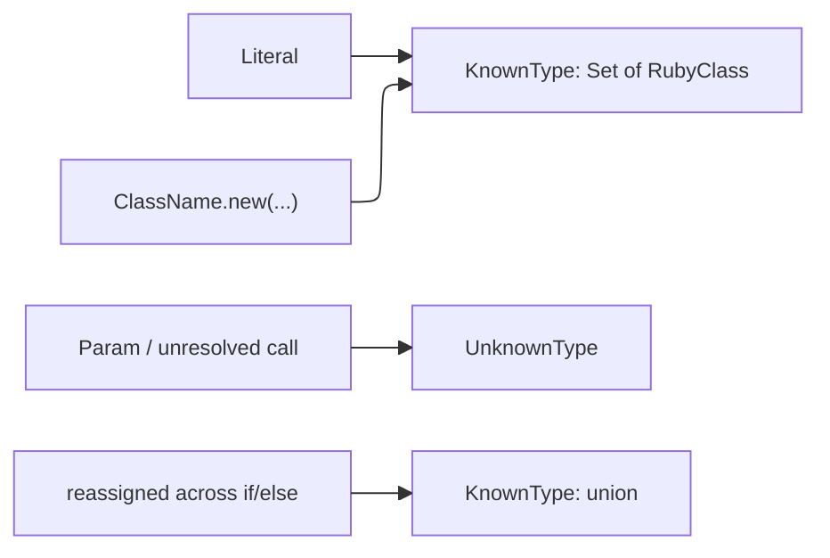
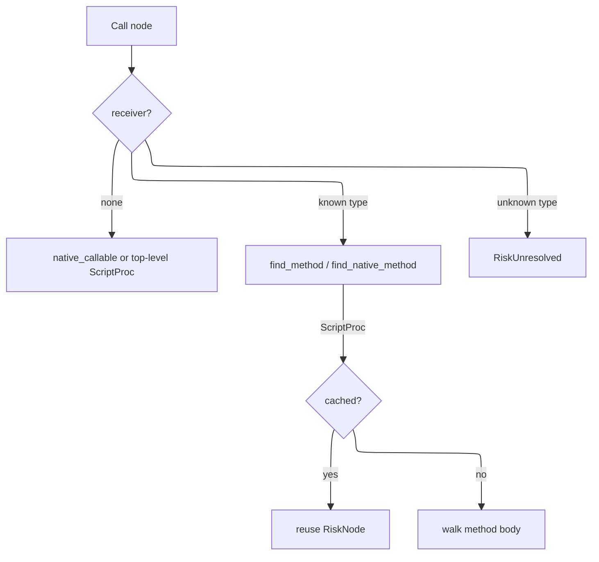

# Development Guide

This document explains how `adjutant` works internally. It is written for contributors and maintainers who need to understand, debug, or extend the library.

## Dependencies

1. Make sure you have `ops` installed, in one of the following ways:
    - as a gem via `gem install ops_team` or
    - as a tool via `brew tap nickthecook/crops && brew install ops`
2. If you not using macOS, or a Linux that uses `apt`, please [install Crystal](https://crystal-lang.org/install/)

## Getting started

|Command                        |Description                                                                       |
|-------------------------------|----------------------------------------------------------------------------------|
|`ops up`                       |Gets everything setup including `crystal` via `apt` or `brew` if applicable.      |
|`ops build-debug` or `ops bd`  |Make a debug build of `benchmark` sample, in `bin/debug` folder.                  |
|`ops build-release` or `ops br`|Make a release / production build of `benchmark` sample,  in `bin/release` folder.|
|`ops lint`                     |Run `ameba` on the source code                                                    |
|`ops clean`                    |Remove debug and release build files                                              |
|`ops wipe`                     |In addition to cleaning, remove all compiler caches                               |
|`ops test`                     |Run Crystal test specs.                                                           |

### Run test scripts

> `ops test` does not run test scripts, only Crystal test specs

Test scripts are Ruby files that test the Adjutant language features.

```
ops build
bin/debug/test_runner
```

This will run all the test scripts in `spec/scripts` folder.

### Run samples

Run the following command to see `adjutant` in action with a sample runner (based on the example in the README) and sample Ruby script.

```
ops -q run samples/run_script -- samples/scripts/fib_10.rb
```

You should receive the following output:

```
Result: 55
```

## How Adjutant works

Adjutant is a bytecode interpreter for a Ruby-like scripting language. Its design is shaped by four goals: safe execution of untrusted scripts, a clear and auditable effect boundary, syntax familiar to LLMs trained on Ruby, and a foundation for information flow control.

### Pipeline overview

A script moves through five stages before producing a result:


Each stage produces a self-contained artifact — `Array(Token)`, `Body` (AST), `Chunk` (bytecode), and finally a `Value`. Stages are independently testable and the compiler and VM can be used without going through the full pipeline.

### Ownership and lifetime



The `Interpreter` is long-lived and intended to span a full agent session. The `SymbolTable`, `ModuleRegistry`, and globals hash all persist across `eval` calls. A fresh `VM` is created for each execution but shares the interpreter's globals, so variables set in one `eval` are visible in the next.

### The Lexer

`Lexer` reads from an `IO` (eagerly into a `String` since random access is needed for peeking and lexeme slicing). It produces `Token` values carrying a `TokenKind`, lexeme string, line, and column. The source string is UTF-8 via Crystal's native `String`/`Char` handling — string and comment content in any language passes through verbatim. Identifier scanning uses `ascii_alphanumeric?` by design, so identifier names are currently ASCII-only.

### The Parser

`Parser` is a hand-written recursive descent parser with a Pratt loop for expression precedence. It consumes tokens from a `Lexer` and produces an `Body` — the root of the AST. AST nodes are Crystal classes rooted at `abstract class Node`, each carrying source position. The parser handles the full Ruby-like grammar including interpolated strings, blocks, modifier forms (`x if cond`), multi-assignment, and keyword arguments.

Bare calls without parentheses (`puts x`) are supported for literals, identifiers, and constants as the first argument (`arg_follows_no_paren?`) — covers `puts x`, `assert_equal add(3, 5), 8`, `raise SomeError`. A leading unary `-` is not yet handled as an argument start (ambiguous with a bare identifier reference minus something).

**`$name` globals** (Ruby's special global-variable sigil, distinct from a `def`/top-level-assignment global living in `@globals`) are lexed (`TokenKind::GVar`) but have no parser, AST, compiler, or VM support — referencing one is currently a parse error. Not yet scoped to a chunk.

### The Compiler

`Compiler` walks the AST and emits bytecode into a `Chunk`. It takes a `SymbolTable` reference so all symbol names are interned consistently across compilations in the same session.

A `Chunk` contains an instruction array and a constant pool (`Array(Value)`). Instructions are fixed-size structs with an opcode and three immediates (`a : UInt8`, `b : UInt16`, `c : UInt32`). Jump targets are patched after the fact using `emit_jump` / `patch_jump`.

**Scopes and locals.** Each method body and block body compiles in a fresh child `Compiler` instance with a `CompilerScope`. The scope maps local variable names to integer slot indices. Parameters are defined as the first slots; subsequent assignments in the body add more slots. `GetLocal`/`SetLocal` opcodes index into the frame's locals array by slot number rather than name.

Blocks carry a `parent` reference to the enclosing `CompilerScope` for single-level closure capture. When a block references a name not in its own scope, it checks the parent — if found, it emits `GetOuter`/`SetOuter` which read and write the enclosing frame's locals array at runtime. Names unresolvable in any scope fall through to `GetGlobal`/`SetGlobal`. Blocks do not auto-define new locals for unresolved names; only method bodies do.

Each method or block body compiles into a `ScriptProc` value stored directly in the parent chunk's constant pool. `MakeProc` pushes it onto the stack; `SetGlobal` (for top-level defs) or `DefMethod` (inside a class) stores it.

### The VM

`VM` is a stack-based bytecode interpreter. It maintains a value stack (`Array(Value)`), a frame stack (`Array(Frame)`), and a shared globals hash. Each `Frame` holds a `ScriptProc`, an instruction pointer, a stack base offset, a `locals` array sized from the proc's `local_count`, and an optional `outer_locals` reference for block closures.

The dispatch loop is a `case` on `Op` enum values, which LLVM compiles to a jump table. Each opcode handler is a short inline block — no method dispatch overhead on the hot path. Instrumentation hooks (for IFC or tracing) can be added as a single conditional before the dispatch without affecting the jump table.

**Non-recursive dispatch.** Script method calls do not recurse into `execute` — `call_script_proc` simply pushes a new `Frame` and returns a sentinel. The single `execute` loop picks up the new frame on its next iteration, and `Op::Ret` restores the caller frame. This means arbitrarily deep script recursion uses only one Crystal call frame, bounded only by the VM's configurable `call_depth_limit`.

**Closure model.** When `Op::Yield` fires, the yielding frame's `locals` array is passed as `outer_locals` to the block frame. `GetOuter`/`SetOuter` read and write slots in that array directly — since blocks execute synchronously while the outer frame is still alive, no upvalue hoisting is needed. Blocks defined outside a method (at the top level) resolve unrecognised names through globals rather than outer locals.

**Globals and bare calls.** `@globals` is a single namespace shared by top-level `def`s and top-level variable assignments — unlike Ruby, which keeps methods and variables separate. `Op::GetGlobal` resolves this: if the fetched value is a `ScriptProc`, it must have come from `def`, so a bare reference (`foo`, no parens) calls it with zero args, matching Ruby's implicit-method-call semantics for non-local identifiers; otherwise the value is pushed as-is. Known limitation: a top-level variable holding a lambda is also auto-invoked on bare reference, since there's no separate namespace to distinguish it from a `def`.

Execution limits (instruction count, call depth) are checked on every frame push and tick respectively.

### Exception handling

`begin`/`rescue`/`ensure` is bytecode, not a VM-level try/catch. Each `Frame` carries a `handlers` stack of `HandlerEntry` — one entry per active `begin` construct, holding an optional `rescue_ip` and an optional `ensure_ip` (a construct can have either, both, or neither). `Op::Try` pushes an entry; `Op::SetEnsure` either adds its target to the entry `Op::Try` just pushed (same construct) or pushes a fresh one (ensure-only construct) — a combine flag on the instruction tells it which. This one-entry-per-construct design, rather than separate rescue/ensure stacks, matters: it preserves the actual push order between different constructs on the same frame, so a more-recently-entered ensure-only `begin` is found before an outer, earlier-pushed `rescue` — checking "any pending rescue" before "any pending ensure" via two independent stacks gets this wrong when they belong to different constructs.

The dispatch loop wraps each instruction in a Crystal `begin/rescue RuntimeError`. On error, it walks `@frames`, peeking each frame's top `HandlerEntry`: a `rescue_ip` present means a possible match — jump there (`clear_rescue_portion` clears just the rescue portion, popping the whole entry only if it has no linked `ensure_ip`, mirroring what `Op::EndTry` does on the success path); no `rescue_ip` but an `ensure_ip` present means jump into the ensure body instead (`Op::EnterEnsure` pops the entry once reached — the single place an entry is fully removed, on either path, so it can't go stale). If a class filter doesn't match, `Op::Reraise` triggers a fresh unwind pass, which naturally finds the next entry — the same construct's own `ensure_ip` if it has one, an enclosing `begin` on the same frame, or an outer call frame — since the mismatched portion was already cleared. If nothing is found anywhere, the error re-raises past the VM as an uncaught Crystal exception.

`Op::PushError` pushes the caught error for the rescue variable — a `RubyObject` of a real error class when one was constructed (`RuntimeError#error_value`), else a plain string for internal errors that haven't been retrofitted yet. `Interpreter#bootstrap_error_classes` registers `Exception → StandardError → {RuntimeError, TypeError, ArgumentError, ZeroDivisionError, NameError → NoMethodError, IndexError → KeyError}` into `@globals` once per interpreter. `raise "msg"`, `raise ClassName`, and `raise ClassName, "msg"` all build a `RubyObject` with a `message` ivar (readable via `.message`); internal VM errors (division by zero, etc.) go through the same path via the `runtime_error` helper. `rescue ClassName => e` filters by class (or subclass, via `is_a?`) on any single `rescue` clause; a bare `rescue` defaults the filter to `StandardError`, matching Ruby (`Exception`-only fatal errors propagate past it). **Not yet implemented:** multiple `rescue` clauses on one `begin`.

`ensure` bodies run on the success path inline, and now also when an error propagates through: the unwind loop stashes the original error in `VM#@pending_reraise` before jumping into the ensure body, and `Op::EndEnsure` (emitted right after the body) re-raises it once the ensure body finishes — unless the ensure body raises its own error first, which supersedes the original via the ordinary Crystal-exception path before `EndEnsure` is ever reached, matching Ruby. `@pending_reraise` is cleared at the top of every fresh catch so a superseded value can't leak into an unrelated later error. Either way, the ensure block's own trailing value is discarded so it doesn't clobber the `begin` expression's result.

### The effect boundary

The containment design separates physical effects from capability exposure:



`EffectHandler` handles physical effects — stdout writes and VFS reads. `ModuleRegistry` handles capability exposure — which native functions and objects a script can access. Scripts can only access capabilities that have been explicitly registered. The registry is auditable: `registered_paths` and `loaded_paths` show exactly what a script has access to and what it has used.

### The Value model

All runtime values are represented as `Value`, a Crystal struct:

```crystal
struct Value
  getter raw   : Nil | Bool | Int64 | Float64 | String | Sym | ScriptProc |
                 Array(Value) | Hash(Value, Value) | RubyClass | RubyObject
  getter label : SecurityLabel?
end
```

Using a struct means values are stack-allocated and copied on assignment — no per-value heap allocation for scalars. Crystal's union type carries its own discriminant, eliminating the need for a separate tag. Type predicates (`null?`, `bool?`, `int?`, etc.) use `is_a?` on the union.

Symbols are represented as `Sym` — a struct carrying an integer ID and an interned name string. The `SymbolTable` assigns stable IDs so symbol comparison is an integer equality check rather than a string comparison. A `SymbolTable` is owned by the `Interpreter` and shared across all compilations, so `:foo` always has the same ID regardless of which script introduced it.

### The Object model

`RubyClass` and `RubyObject` are plain Crystal classes, not `Value` variants wrapping something else — they sit directly in the `ValueRaw` union like any other type.



`RubyClass` holds a method table keyed by interned symbol ID (same keying scheme as globals and ivars), a superclass reference, and an `is_module?` flag. `MakeClass` resolves the superclass by looking it up as an existing global `RubyClass` and raises `uninitialized constant` if it isn't one.

**`self` lives on `Frame`**, not the VM — each call frame carries its own `self_val`, isolated automatically when a frame is pushed/popped. `GetClass`/`SetClass` read and write the *current* frame's `self`; a class body runs in the same frame as its surrounding code, so entering/leaving one is a save-and-restore of that single value rather than a frame push. `DefMethod` writes into `self`'s method table, so it only succeeds when `self` is a `RubyClass` — i.e. inside a class or module body.

**Method dispatch.** `.` calls carry a receiver bit in the bytecode (distinguishing `obj.method()` from `method(obj)`, where a plain argument that happens to be an object must not be mistaken for a receiver). When present, `dispatch_call` checks the receiver's class — walking the superclass chain — before falling through to native functions, global procs, and builtins. A matched method runs in a new frame with `self` bound to the receiver.

**`.new`** allocates a `RubyObject` and, if `initialize` is defined (on the class or an ancestor), runs it via `VM#invoke` — the same synchronous nested-execution path already used to call blocks from native functions — so its return value can be discarded and `.new` always returns the object itself.



**Ivars and cvars** route through `self`, not globals. `GetIvar`/`SetIvar` read/write `self.ivars` when `self` is a `RubyObject`; outside an object they're a silent no-op/`nil`, matching Ruby's forgiving ivar semantics. `GetCvar`/`SetCvar` resolve via `self`'s class (the receiver's class for an instance, `self` itself inside a class body), walking `superclass` — a write lands on the nearest ancestor that already defines the variable, or the current class if none does. Cvar access outside a class context raises, since Ruby has no cvar scope there either.

**Constants are lexically scoped**, not flat globals — `class A; class B; X = 1; end; end` puts `X` on `B`, not in a shared namespace. This needs two links distinct from the ones above: `RubyClass#lexical_parent` (source nesting, set at `MakeClass` time from `self` — *not* `superclass`, which tracks inheritance) and `ScriptProc#lexical_scope` (the class a method was `def`'d in, captured once at `DefMethod` time, since a method's `self` at call time is its receiver, not its lexical home).



A plain `Constant` reference (`X`) walks that lexical chain. An explicit path (`A::B::X`, parsed as `ConstPath`) instead does a direct, non-walking lookup in each resolved namespace's own table — closer to Ruby, where `::` doesn't re-trigger lexical search. Blocks are lexically *transparent* (inherit the enclosing frame's `lexical_scope`, same mechanism as `self` inheritance); methods are opaque (fixed at `def` time, ignores the caller).

Not yet implemented: `include`, and class-side (singleton) methods.

**Native methods.** `RubyClass` also holds a `native_methods` table (`Sym id → NativeCallable`), parallel to `methods` but for Crystal-implemented instance methods — the mechanism base types (`String`, `Array`, `Integer`, ...) will use once implemented. `find_native_method` walks the superclass chain the same way `find_method` does. Dispatch checks `find_method` first, so a script-defined method always shadows a native one of the same name.

Unlike `Interpreter#define_native`, `RubyClass#define_native_method` takes `risk : RiskProfile` with **no default** — base types are registered in bulk in one place, exactly where it's easiest to wave a whole batch through as `RiskProfile.none` without thinking; the missing default forces that judgment call per method.



### Information flow control

Every `Value` carries an optional `SecurityLabel` reference. Labels are heap-allocated classes so they can be shared across values without copying. When two labeled values are combined, their labels are joined via `SecurityLabel.join`, which computes the least upper bound in the label lattice.

This is currently a stub — the lattice is a simple name-concatenation join and labels must be attached manually by native code (e.g. a module returning network data labels its values `{source: :network}`). The full IFC design will:

- Define a proper lattice with partial order and meet/join operations
- Track label propagation automatically through the VM dispatch loop
- Enforce declassification policies at the effect boundary
- Surface label information to the harness so the user can reason about data provenance

The `SecurityLabel` field adds one pointer width to every `Value` struct. When no label is present the field is `nil`, which is a predictable nil-check on the hot path — easily branch-predicted and potentially eliminated by the compiler when IFC is disabled.

### Writing a ScriptModule

A `ScriptModule` is the unit of capability exposure. Implement the abstract class:

```crystal
class MyModule < Adjutant::ScriptModule
  def name : String
    "agent/mymodule"
  end

  def load(interp : Adjutant::Interpreter) : Nil
    interp.define_native("my_func", risk: Adjutant::RiskProfile.none) do |args|
      # args is Array(Adjutant::Value)
      result = do_something(args.first.as_string)
      Adjutant::Value.string(result)
    end
  end
end

interp.modules.register(MyModule.new)
```

For simpler cases, register with a block:

```crystal
interp.modules.register("agent/mymodule") do |i|
  i.define_native("my_func") { |args| Adjutant::Value.string("hello") }
end
```

Scripts load the module with `require "agent/mymodule"`. Each module is loaded at most once per interpreter instance regardless of how many times the script calls `require`.

For IFC, attach labels to values your module returns:

```crystal
interp.define_native("fetch_data") do |args|
  data = http_get(args.first.as_string)
  label = Adjutant::SecurityLabel.new("network")
  Adjutant::Value.string(data, label)
end
```

### Side-effect risk

Every native callable carries a static `RiskProfile`, declared at registration time, so the harness can warn a user about a script's effects *before* running it — independent of IFC, which only tracks data flow once a script is running.



`RiskTag` names *why* a call is risky (`ReadsFiles`, `WritesFiles`, `DeletesFiles`, `Recursive`, `ExecutesCode`, `NetworkEgress`, `ElevatedPrivilege`, `ModifiesEnvironment`). `Reversibility` (`Yes`/`No`/`Depends`) and `Severity` (`Info`/`Warning`/`Error`) are *conclusions* drawn from those tags.

Tags are the reason; reversibility and severity are consequences — a `RiskProfile` with no tags must be `Reversibility::Yes` and `Severity::Info`. Setting either otherwise on an empty-tag profile raises immediately, by design: it means a `RiskTag` is missing, not that the fields should be set freely.

```crystal
# Pure — the default, no need to state it explicitly.
interp.define_native("square") { |args| ... }

# Effectful:
interp.define_native("delete_file",
  risk: Adjutant::RiskProfile.new(
    tags: Set{Adjutant::RiskTag::DeletesFiles},
    reversible: Adjutant::Reversibility::No,
    severity: Adjutant::Severity::Error,
  )) { |args| ... }
```

`Reversibility::Depends` requires a `note` explaining the call-site condition that determines it (e.g. a flag toggling in-place writes) — this can't be resolved statically and is treated as "escalate and ask" until argument-level analysis exists.

`NativeCallable` pairs a `NativeFunc` with its `RiskProfile` and is the shared representation for any Crystal-implemented callable — currently `ScriptModule` functions via `define_native`; planned: `RubyClass` native methods for base types (`String`, `Array`, `Integer`, ...), once implemented, so a risk-manifest walker has exactly one place to look regardless of whether a call resolves to a required module or a base type's method.

#### Structured risk: RiskNode and RiskAggregator

A flat union of `RiskProfile`s across a script loses conditionality: an `if`/`else` with a safe branch and a destructive branch would merge into one tag set, as if both could happen in one run. `RiskNode` (`risk_node.cr`) mirrors the AST's control-flow shape instead, so aggregation respects it.



- `RiskSequence` — straight-line code and loop bodies (`iterated: true` for the latter, since a script can't generally know its own iteration count statically). Aggregates by union: all children's tags apply, severity/reversibility take the worst single child.
- `RiskChoice` — `if`/`elsif`/`else`, `case`/`when`, rescue clauses. Aggregates by taking the **single worst-case branch**, not a union — `origin` (`"if"`, `"case"`, ...) is preserved so the summary's `path` names which branch caused it.
- `RiskUnresolved` — a call site the walker couldn't statically resolve. Always ranks worst-case (`Severity::Error`). Should be rare, since dynamic dispatch is a forbidden language feature (see below) specifically to keep every call site staticaly resolvable; a common `RiskUnresolved` is a signal something needs fixing in the walker or the forbidden list, not a case to silently downgrade.

`RiskAggregator.summarize(node) : RiskSummary` walks a tree once and returns the single worst-case path through it — not every possible path, since presentation needs one concrete story ("this script may delete files if the `--force` branch is taken"), not a combinatorial list.

#### TypeInference

A `Call` node can only resolve to a `NativeCallable`/`ScriptProc` if its receiver's class is known. `TypeInference` (`type_inference.cr`) infers this statically, without running the script — a minimal pass, not full type inference.



`TypeHint` (`type_hint.cr`) mirrors `RiskNode`'s sum-type reasoning: a local var reassigned a different known type in each branch of an `if`/`case` is a real union, not an inference failure — only genuinely untraceable values (params, unresolved call returns) are `UnknownType`. Loops merge the same way, treating "ran 0 times" vs. "ran once" as a 2-way branch.

#### RiskWalker

`RiskWalker` (`risk_walker.cr`) builds the actual `RiskNode` tree from a parsed `Body`, using `TypeInference` to resolve each `Call`'s receiver.



Two things worth calling out:

- **Method bodies are memoized by `ScriptProc` identity**, walked once using only their own parameter scope — not the caller's inferred argument types. This is correct for memoization (a method's risk can't depend on which call site happens to invoke it) but is a real precision loss: **`def process(f); f.read; end` always sees `f` as `UnknownType` inside `process`**, regardless of what any call site passes, so `f.read` resolves as `RiskUnresolved` even when every caller passes a known `File`. Fixing this properly means adding real parameter type declarations to the language (more Crystal-like, less Ruby-like) — not a bigger inference pass, since the ambiguity is inherent to having no per-method contract at all.
- **Recursion** gets the same treatment as loops: a `ScriptProc` already being walked (direct or mutual recursion) short-circuits to a plain `RiskLeaf` instead of re-descending, so the walker always terminates.

`ScriptProc` carries an optional `ast_body`/`ast_params` (set by the compiler at `compile_def`) purely so `RiskWalker` can walk a method's real control-flow shape — the VM itself never reads these fields.

The AST walker that builds a `RiskNode` tree from parsed source is planned but not yet implemented.

## Forbidden features

Some Ruby-like features are intentionally excluded, not merely unimplemented — they'd break static risk assessment by making a call site's target unknowable without running the script. Anyone tempted to add one of these should read this first.

- **Dynamic dispatch by computed method name** (`send`, `public_send`, `method_missing`, `define_method` with a runtime-computed name). `Call#method` in the AST is always a literal `String`; keeping it that way is what makes every call site staticaly resolvable to a `NativeCallable`/`ScriptProc` for risk aggregation. If this ever changes, `RiskUnresolved` (see above) is the fallback — but the goal is for it to stay rare.
- **`eval`/`instance_eval` on runtime strings.** Same reasoning — a script that can construct and run arbitrary code at runtime has no static risk profile at all.
- **Reflection that exposes native/Crystal internals** (e.g. arbitrary FFI, `ObjectSpace`-style introspection). Not yet needed for anything on the roadmap, and it would let a script route around the effect boundary (`EffectHandler`/`ModuleRegistry`) entirely.

This list should grow as new features are proposed — the test is always "does this let a call site's target or effect become unknowable before running the script."
