# Development Guide

This document explains how `adjutant` works internally. It is written for contributors and maintainers who need to understand, debug, or extend the library.

## Dependencies

1. Make sure you have `ops` installed, in one of the following ways:
    - as a gem via `gem install ops_team` or
    - as a tool via `brew tap nickthecook/crops && brew install ops`
2. If you not using macOS, or a Linux that uses `apt`, please [install Crystal](https://crystal-lang.org/install/)

## Getting started

|Command                        |Description                                                                       |
|-------------------------------|----------------------------------------------------------------------------------|
|`ops up`                       |Gets everything setup including `crystal` via `apt` or `brew` if applicable.      |
|`ops build-debug` or `ops bd`  |Make a debug build of `benchmark` sample, in `bin/debug` folder.                  |
|`ops build-release` or `ops br`|Make a release / production build of `benchmark` sample,  in `bin/release` folder.|
|`ops lint`                     |Run `ameba` on the source code                                                    |
|`ops clean`                    |Remove debug and release build files                                              |
|`ops wipe`                     |In addition to cleaning, remove all compiler caches                               |
|`ops test`                     |Run Crystal test specs.                                                           |

### Run test scripts

> `ops test` does not run test scripts, only Crystal test specs

Test scripts are Ruby files that test the Adjutant language features.

```
ops build
bin/debug/test_runner
```

This will run all the test scripts in `spec/scripts` folder.

### Run samples

#### Sample `run_script`

The sample `run_script.cr` shows a simple script runner with some low-risk native functions.
- Run `ops build` and
- then run `bin/debug/run_script samples/scripts/fib_10.rb`

You should receive the following output:

```
Result: 55
```

#### Sample `assess_script`

The sample `assess_script.cr` shows an example of how to load and assess the risk of a script and present the risk assessment.
- Run `ops build`, then
- run `bin/debug/assess_script samples/scripts/risky_example_01.rb`

You should receive the following output:

```
=== Risk assessment: samples/scripts/risky_example_01.rb ===

Worst case: Error / reversible=No
Tags: NetworkEgress, DeletesFiles
Path: fetch_url -> if branch -> delete_file

All findings (3):
  line 13: fetch_url (iterated) — Warning, tags: NetworkEgress
  line 5: delete_file [if branch] — Error, tags: DeletesFiles
  line 7: puts_args [if branch] — Info, tags: none
```

## How Adjutant works

Adjutant is a bytecode interpreter for a Ruby-like scripting language. Its design is shaped by four goals: safe execution of untrusted scripts, a clear and auditable effect boundary, syntax familiar to LLMs trained on Ruby, and a foundation for information flow control.

### Pipeline overview

A script moves through five stages before producing a result:


Each stage produces a self-contained artifact — `Array(Token)`, `Body` (AST), `Chunk` (bytecode), and finally a `Value`. Stages are independently testable and the compiler and VM can be used without going through the full pipeline.

### Ownership and lifetime

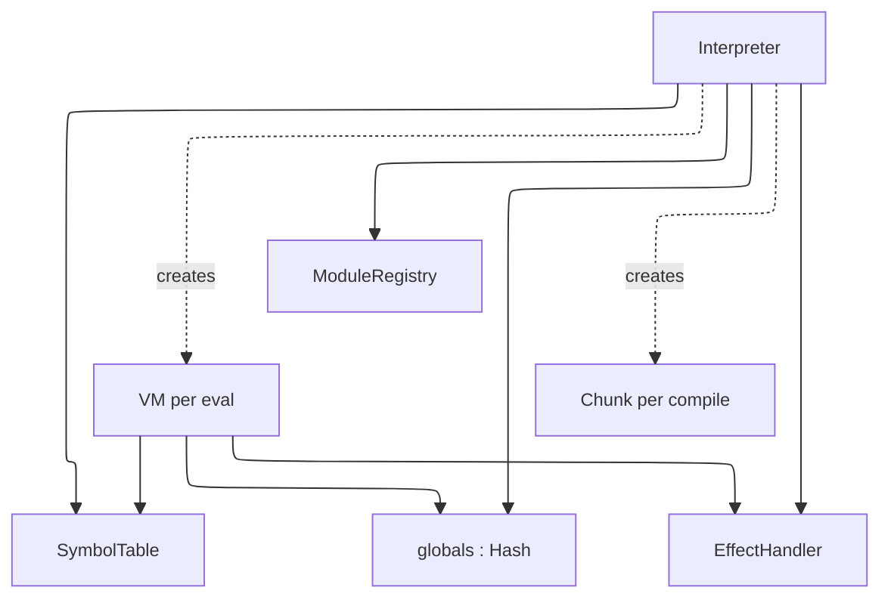

The `Interpreter` is long-lived and intended to span a full agent session. The `SymbolTable`, `ModuleRegistry`, and globals hash all persist across `eval` calls. A fresh `VM` is created for each execution but shares the interpreter's globals, so variables set in one `eval` are visible in the next.

### The Lexer

`Lexer` reads from an `IO` (eagerly into a `String` since random access is needed for peeking and lexeme slicing). It produces `Token` values carrying a `TokenKind`, lexeme string, line, and column. The source string is UTF-8 via Crystal's native `String`/`Char` handling — string and comment content in any language passes through verbatim. Identifier scanning uses `ascii_alphanumeric?` by design, so identifier names are currently ASCII-only.

### The Parser

`Parser` is a hand-written recursive descent parser with a Pratt loop for expression precedence. It consumes tokens from a `Lexer` and produces an `Body` — the root of the AST. AST nodes are Crystal classes rooted at `abstract class Node`, each carrying source position. The parser handles the full Ruby-like grammar including interpolated strings, blocks, modifier forms (`x if cond`), multi-assignment, and keyword arguments.

Bare calls without parentheses (`puts x`) are supported for literals, identifiers, and constants as the first argument (`arg_follows_no_paren?`) — covers `puts x`, `assert_equal add(3, 5), 8`, `raise SomeError`. A leading unary `-` is not yet handled as an argument start (ambiguous with a bare identifier reference minus something).

**`$name` globals** (Ruby's special global-variable sigil, distinct from a `def`/top-level-assignment global living in `@globals`) are lexed (`TokenKind::GVar`) but have no parser, AST, compiler, or VM support — referencing one is currently a parse error. Not yet scoped to a chunk.

### The Compiler

`Compiler` walks the AST and emits bytecode into a `Chunk`. It takes a `SymbolTable` reference so all symbol names are interned consistently across compilations in the same session.

A `Chunk` contains an instruction array and a constant pool (`Array(Value)`). Instructions are fixed-size structs with an opcode and three immediates (`a : UInt8`, `b : UInt16`, `c : UInt32`). Jump targets are patched after the fact using `emit_jump` / `patch_jump`.

**Scopes and locals.** Each method body and block body compiles in a fresh child `Compiler` instance with a `CompilerScope`. The scope maps local variable names to integer slot indices. Parameters are defined as the first slots; subsequent assignments in the body add more slots. `GetLocal`/`SetLocal` opcodes index into the frame's locals array by slot number rather than name.

Blocks carry a `parent` reference to the enclosing `CompilerScope` for single-level closure capture. When a block references a name not in its own scope, it checks the parent — if found, it emits `GetOuter`/`SetOuter` which read and write the enclosing frame's locals array at runtime. Names unresolvable in any scope fall through to `GetGlobal`/`SetGlobal`. Blocks do not auto-define new locals for unresolved names; only method bodies do.

Each method or block body compiles into a `ScriptProc` value stored directly in the parent chunk's constant pool. `MakeProc` pushes it onto the stack; `SetGlobal` (for top-level defs) or `DefMethod` (inside a class) stores it.

### The VM

`VM` is a stack-based bytecode interpreter. It maintains a value stack (`Array(Value)`), a frame stack (`Array(Frame)`), and a shared globals hash. Each `Frame` holds a `ScriptProc`, an instruction pointer, a stack base offset, a `locals` array sized from the proc's `local_count`, and an optional `outer_locals` reference for block closures.

The dispatch loop is a `case` on `Op` enum values, which LLVM compiles to a jump table. Each opcode handler is a short inline block — no method dispatch overhead on the hot path. Instrumentation hooks (for IFC or tracing) can be added as a single conditional before the dispatch without affecting the jump table.

**Non-recursive dispatch.** Script method calls do not recurse into `execute` — `call_script_proc` simply pushes a new `Frame` and returns a sentinel. The single `execute` loop picks up the new frame on its next iteration, and `Op::Ret` restores the caller frame. This means arbitrarily deep script recursion uses only one Crystal call frame, bounded only by the VM's configurable `call_depth_limit`.

**Closure model.** When `Op::Yield` fires, the yielding frame's `locals` array is passed as `outer_locals` to the block frame. `GetOuter`/`SetOuter` read and write slots in that array directly — since blocks execute synchronously while the outer frame is still alive, no upvalue hoisting is needed. Blocks defined outside a method (at the top level) resolve unrecognised names through globals rather than outer locals.

**Globals and bare calls.** `@globals` is a single namespace shared by top-level `def`s and top-level variable assignments — unlike Ruby, which keeps methods and variables separate. `Op::GetGlobal` resolves this: if the fetched value is a `ScriptProc`, it must have come from `def`, so a bare reference (`foo`, no parens) calls it with zero args, matching Ruby's implicit-method-call semantics for non-local identifiers; otherwise the value is pushed as-is. Known limitation: a top-level variable holding a lambda is also auto-invoked on bare reference, since there's no separate namespace to distinguish it from a `def`.

Execution limits (instruction count, call depth) are checked on every frame push and tick respectively.

### Exception handling

`begin`/`rescue`/`ensure` is bytecode, not a VM-level try/catch. Each `Frame` carries a `handlers` stack of `HandlerEntry` — one entry per active `begin` construct, holding an optional `rescue_ip` and an optional `ensure_ip` (a construct can have either, both, or neither). `Op::Try` pushes an entry; `Op::SetEnsure` either adds its target to the entry `Op::Try` just pushed (same construct) or pushes a fresh one (ensure-only construct) — a combine flag on the instruction tells it which. This one-entry-per-construct design, rather than separate rescue/ensure stacks, matters: it preserves the actual push order between different constructs on the same frame, so a more-recently-entered ensure-only `begin` is found before an outer, earlier-pushed `rescue` — checking "any pending rescue" before "any pending ensure" via two independent stacks gets this wrong when they belong to different constructs.

The dispatch loop wraps each instruction in a Crystal `begin/rescue RuntimeError`. On error, it walks `@frames`, peeking each frame's top `HandlerEntry`: a `rescue_ip` present means a possible match — jump there (`clear_rescue_portion` clears just the rescue portion, popping the whole entry only if it has no linked `ensure_ip`, mirroring what `Op::EndTry` does on the success path); no `rescue_ip` but an `ensure_ip` present means jump into the ensure body instead (`Op::EnterEnsure` pops the entry once reached — the single place an entry is fully removed, on either path, so it can't go stale). If a class filter doesn't match, `Op::Reraise` triggers a fresh unwind pass, which naturally finds the next entry — the same construct's own `ensure_ip` if it has one, an enclosing `begin` on the same frame, or an outer call frame — since the mismatched portion was already cleared. If nothing is found anywhere, the error re-raises past the VM as an uncaught Crystal exception.

`Op::PushError` pushes the caught error for the rescue variable — a `RubyObject` of a real error class when one was constructed (`RuntimeError#error_value`), else a plain string for internal errors that haven't been retrofitted yet. `Interpreter#bootstrap_error_classes` registers `Exception → StandardError → {RuntimeError, TypeError, ArgumentError, ZeroDivisionError, NameError → NoMethodError, IndexError → KeyError}` into `@globals` once per interpreter. `raise "msg"`, `raise ClassName`, and `raise ClassName, "msg"` all build a `RubyObject` with a `message` ivar (readable via `.message`); internal VM errors (division by zero, etc.) go through the same path via the `runtime_error` helper. `rescue ClassName => e` filters by class (or subclass, via `is_a?`) on any single `rescue` clause; a bare `rescue` defaults the filter to `StandardError`, matching Ruby (`Exception`-only fatal errors propagate past it). **Not yet implemented:** multiple `rescue` clauses on one `begin`.

`ensure` bodies run on the success path inline, and now also when an error propagates through: the unwind loop stashes the original error in `VM#@pending_reraise` before jumping into the ensure body, and `Op::EndEnsure` (emitted right after the body) re-raises it once the ensure body finishes — unless the ensure body raises its own error first, which supersedes the original via the ordinary Crystal-exception path before `EndEnsure` is ever reached, matching Ruby. `@pending_reraise` is cleared at the top of every fresh catch so a superseded value can't leak into an unrelated later error. Either way, the ensure block's own trailing value is discarded so it doesn't clobber the `begin` expression's result.

### The effect boundary

The containment design separates physical effects from capability exposure:

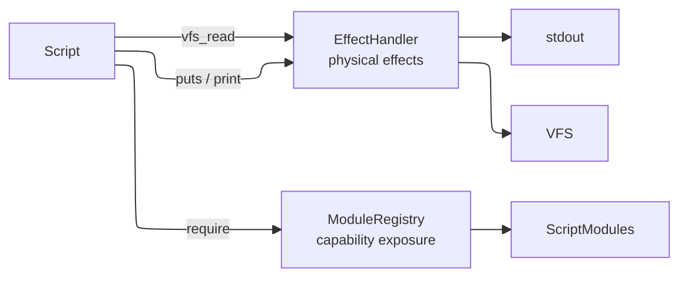

`EffectHandler` handles physical effects — stdout writes and VFS reads. `ModuleRegistry` handles capability exposure — which native functions and objects a script can access. Scripts can only access capabilities that have been explicitly registered. The registry is auditable: `registered_paths` and `loaded_paths` show exactly what a script has access to and what it has used.

### The Value model

All runtime values are represented as `Value`, a Crystal struct:

```crystal
struct Value
  getter raw   : Nil | Bool | Int64 | Float64 | String | Sym | ScriptProc |
                 Array(Value) | Hash(Value, Value) | RubyClass | RubyObject
  getter label : SecurityLabel?
end
```

Using a struct means values are stack-allocated and copied on assignment — no per-value heap allocation for scalars. Crystal's union type carries its own discriminant, eliminating the need for a separate tag. Type predicates (`null?`, `bool?`, `int?`, etc.) use `is_a?` on the union.

Symbols are represented as `Sym` — a struct carrying an integer ID and an interned name string. The `SymbolTable` assigns stable IDs so symbol comparison is an integer equality check rather than a string comparison. A `SymbolTable` is owned by the `Interpreter` and shared across all compilations, so `:foo` always has the same ID regardless of which script introduced it.

**`to_s` and `inspect` genuinely differ for `nil`**, matching real Ruby: `nil.to_s == ""` (an empty string — `puts nil` prints a blank line, `"#{nil}"` interpolates to nothing), while `nil.inspect == "nil"` (the word, for debugging output). This is easy to regress since three call sites independently need to agree on it rather than one shared path: `Value#to_s`/`Value#inspect` themselves, `Op::Concat` (string interpolation), and `exec_builtin`'s `"puts"` case each do their own `Nil` case rather than all funneling through one. `print` and every OTHER string-producing path (`.to_s` the dispatchable method, error messages, `Op::Throw`, ...) delegate to `Value#to_s` directly and so inherit the fix automatically — it's specifically `Op::Concat` and `"puts"` that hardcode their own per-kind formatting and need checking individually if this class of bug shows up again for some other kind.

### The Object model

`RubyClass` and `RubyObject` are plain Crystal classes, not `Value` variants wrapping something else — they sit directly in the `ValueRaw` union like any other type.

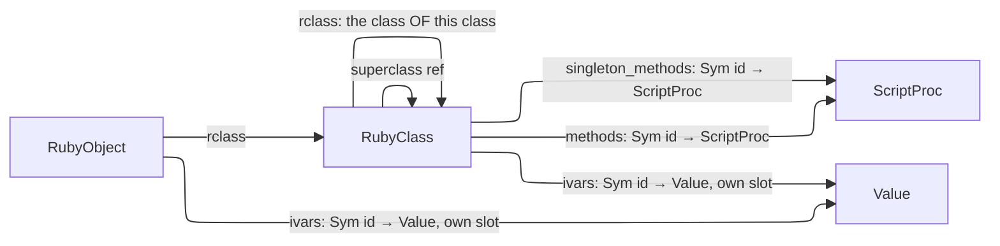

`RubyClass` holds a method table keyed by interned symbol ID (same keying scheme as globals and ivars), a `superclass` reference, an `rclass` reference (the class of this class — `Integer.rclass == Class`), and an `is_module?` flag. `RubyObject#rclass` and `RubyClass#rclass` are the same relationship ("what class is this an instance of") at two different levels, sharing a name deliberately — `obj.class` and `SomeClass.class` are genuinely the same method in real Ruby, not a coincidence.

**Every class defaults to real ancestors, not `nil`.** A script-written `class Foo; end` with no explicit `< Bar` inherits from `Object`; every class or module's own `rclass` is `Class` (a module's own class is `Class` too, not some separate `Module`-of-modules — `Module` itself is an instance of `Class`, same as any other class object). `Object`, `Class`, and `Module` are bootstrapped once per `Interpreter`, before anything else — see `Interpreter#bootstrap_core_hierarchy` below, since the three have a genuine circular dependency in real Ruby (`Class.superclass == Module`, and everything's `rclass` is `Class` except `Class.rclass == Class` itself, self-referential) that can't be resolved in a single construction pass. `MakeClass` resolves an explicit superclass by looking it up as an existing global `RubyClass` (raising `uninitialized constant` if it isn't one) and otherwise defaults to `Object`; a builtin class not built via `Interpreter#define_builtin_class` directly (e.g. `Integer`, built in the separate `Builtins` module) gets the same defaulting patched on afterward by `Interpreter#register_builtin_class`.

**`Class.new`/`Module.new` are explicitly out of scope** — see "Forbidden and out-of-scope features" below. This bootstrap only makes `Class`/`Module` exist as real `RubyClass`es for `.class`/`is_a?`/`superclass` to work correctly; it does not make them instantiable from script.

**Universal methods** (`.class`, `.superclass`, `is_a?`/`kind_of?`, `respond_to?`, `equal?`) are implemented as `exec_builtin` VM-level fallback cases, the same mechanism `to_s`/`to_i`/`puts` already use — NOT as real inherited methods living on `Object`'s own method table. This is a known simplification: real Ruby resolves these by walking to `Object`/`Kernel` like any other method, so `respond_to?` in particular can't yet see them (asking `x.respond_to?(:to_s)` returns `false` even though `x.to_s` would work) — see `respond_to?`'s own doc comment in `vm.cr` for the exact boundary. Revisiting this — making these real `Object` methods discovered through normal dispatch — is a reasonable future cleanup once something actually needs `respond_to?` to see them, not a correctness bug today.

**`self` lives on `Frame`**, not the VM — each call frame carries its own `self_val`, isolated automatically when a frame is pushed/popped. `GetClass`/`SetClass` read and write the *current* frame's `self`; a class body runs in the same frame as its surrounding code, so entering/leaving one is a save-and-restore of that single value rather than a frame push. `DefMethod` writes into `self`'s method table, so it only succeeds when `self` is a `RubyClass` — i.e. inside a class or module body.

**Method dispatch.** `.` calls carry a receiver bit in the bytecode (distinguishing `obj.method()` from `method(obj)`, where a plain argument that happens to be an object must not be mistaken for a receiver). When present, `dispatch_call` branches on what kind of receiver it is: a `RubyObject` resolves against its class's *instance* tables (`find_method` → `find_native_method`, walking the superclass chain); a `RubyClass` resolves against its OWN *singleton* tables instead (`find_singleton_method` → `find_native_singleton_method`) — never the instance tables, since e.g. `A.foo` is a call on the class itself, not on some instance of it. A matched method runs in a new frame with `self` bound to the receiver — the class itself, in the singleton case.

**`.new`** checks the class (or an ancestor) for a registered native singleton method first — see "Native singleton methods" below — and only falls back to the generic path if none exists. The generic path allocates a `RubyObject` and, if `initialize` is defined (on the class or an ancestor), runs it via `VM#invoke` — the same synchronous nested-execution path a native method uses to call a script-provided block (`NativeCallContext#invoke`, exposed to any native method's block — see `Array#each`/`#map` in `src/adjutant/builtins/array.cr` for the first real end-to-end exercise of this, not just an architectural claim) — so its return value can be discarded and `.new` always returns the object itself.

**`NativeCallContext`** is what a native method's block receives as its third block parameter (`|args, blk, ncc|`), giving it two things a plain Crystal closure couldn't do on its own: `ncc.invoke(script_block, args)` to call a script-provided block (see `.new`/`each`/`map` above), and `ncc.values_equal?(a, b)` to compare two `Value`s using Adjutant's real `==` semantics (deep/structural for `Array`/`Hash`, identity for `RubyObject`, value equality for scalars) — delegating to `VM#values_equal?` rather than duplicating its logic, so a native method's notion of equality (e.g. `Array#include?`) can never drift out of sync with what `Op::Eq` actually does for the same comparison written directly in script.

**Some operators are overloaded across base types and can't live in `native_methods` at all**, since arithmetic/comparison/`<<` compile to dedicated opcodes (`Op::Add`, `Op::Shl`, ...) that never consult `find_native_method` — same reasoning as `Integer`/`Float`'s own arithmetic. `arith_add` (backing `+`) has real cases for `Integer`/`Float` mixing, `String` concatenation, and `Array` concatenation (returns a NEW array, non-mutating); `exec_shl` (backing `<<`, split out from the otherwise-Integer-only `int_op` so `&`/`|`/`^`/`>>` don't silently gain array behavior) dispatches to in-place `Array` append — returning the receiver so `a << 1 << 2` chains — for an array receiver, falling back to bit-shift otherwise.

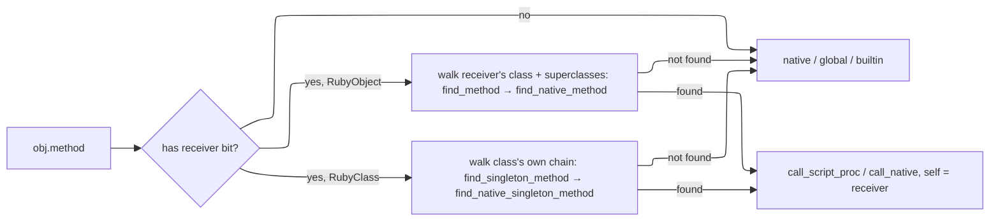

**Ivars and cvars** route through `self`, not globals. `GetIvar`/`SetIvar` read/write `self`'s OWN ivars table — `self.ivars` when `self` is a `RubyObject` (an instance's own storage), or the class's separate `ivars` table when `self` is a `RubyClass` itself (a class body's top-level statements, or a `def self.foo` singleton method). These are genuinely different slots even for the same `@name` — not inherited, not shared, not a fallback of one onto the other; `class A; @x = 6; def initialize; @x = 2; end; end` really does hold two independent `6` and `2`. Outside either context ivars are a silent no-op/`nil`, matching Ruby's forgiving semantics. `GetCvar`/`SetCvar` are unrelated storage, always on `self`'s class regardless of whether `self` is an instance or the class itself (`cvar_class` handles both), walking `superclass` — a write lands on the nearest ancestor that already defines the variable, or the current class if none does. Cvar access outside a class context raises, since Ruby has no cvar scope there either.

**Constants are lexically scoped**, not flat globals — `class A; class B; X = 1; end; end` puts `X` on `B`, not in a shared namespace. This needs two links distinct from the ones above: `RubyClass#lexical_parent` (source nesting, set at `MakeClass` time from `self` — *not* `superclass`, which tracks inheritance) and `ScriptProc#lexical_scope` (the class a method was `def`'d in, captured once at `DefMethod` time, since a method's `self` at call time is its receiver, not its lexical home).

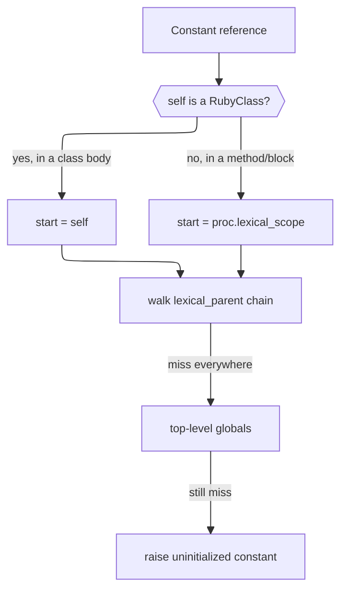

A plain `Constant` reference (`X`) walks that lexical chain. An explicit path (`A::B::X`, parsed as `ConstPath`) instead does a direct, non-walking lookup in each resolved namespace's own table — closer to Ruby, where `::` doesn't re-trigger lexical search. Blocks are lexically *transparent* (inherit the enclosing frame's `lexical_scope`, same mechanism as `self` inheritance); methods are opaque (fixed at `def` time, ignores the caller).

Not yet implemented: `include`. Script-defined class-side (singleton) methods (`def self.foo`) ARE implemented — see "Script-defined singleton methods" below.

**Native methods.** `RubyClass` also holds a `native_methods` table (`Sym id → NativeCallable`), parallel to `methods` but for Crystal-implemented instance methods — the mechanism base types use. `Integer`, `Float`, `NilClass`, `TrueClass`, `FalseClass`, `Symbol`, `String`, `Array`, and `Hash` are all implemented this way (see `src/adjutant/builtins/`) — the base-types work is complete at this level; further base types (`Range`, `Regexp`, ...) would follow the same pattern if ever needed. `find_native_method` walks the superclass chain the same way `find_method` does. Dispatch checks `find_method` first, so a script-defined method always shadows a native one of the same name.

Unlike `Interpreter#define_native`, `RubyClass#define_native_method` takes `risk : RiskProfile` with **no default** — base types are registered in bulk in one place, exactly where it's easiest to wave a whole batch through as `RiskProfile.none` without thinking; the missing default forces that judgment call per method.

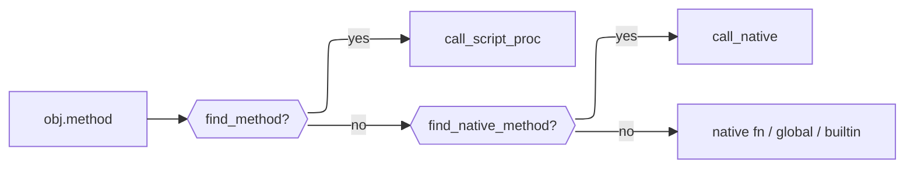

**Script-defined singleton methods.** `def self.foo` inside a class body attaches to a separate `singleton_methods` table on `RubyClass` (`Sym id → ScriptProc`, parallel to `methods`), via `Op::DefSingleton`. The receiver is resolved from `self` at the point the `def` runs — inside a class body `self` is the class itself (same mechanism `GetClass`/`SetClass` already use for the class body generally), so the parser must recognize `self` as a real `SelfNode`, not treat it as an ordinary identifier: `def self.foo` and `def some_other_object.foo` share one receiver-parsing path, but only the `self` case reliably means "the enclosing class." `find_singleton_method` walks the superclass chain, same shape as `find_method` — a subclass with no singleton method of its own inherits its ancestor's, and can shadow it by defining its own.

**Native singleton methods.** `RubyClass` also holds a separate `native_singleton_methods` table (`Sym id → NativeCallable`), for Crystal-implemented *class-level* methods — today used exclusively for a native `new`. This is how a stateful builtin (e.g. a future `File`) gets constructed: `RubyObject` is open to subclassing (`FileObject < RubyObject` with real typed ivars, e.g. an open handle, instead of the shared `ivars : Hash(Int32, Value)` table), and a native `new` allocates that subclass directly and returns it — the generic path can't express this, since it always allocates a bare `RubyObject`.

`.new` dispatch checks `find_native_singleton_method` first (walking the superclass chain, same shape as `find_native_method`) and only falls through to the generic `initialize`-driven path if the class has none. A native singleton method receives the `RubyClass` itself as `args.first` (there's no receiver instance yet — that's the point of `new`), followed by the constructor arguments, and is responsible for its own allocation.

Native singleton methods and script-defined singleton methods share dispatch order (script `find_singleton_method` checked first, native `find_native_singleton_method` second — same shadowing rule as instance methods) but are otherwise independent tables; a class can freely mix a native `new` with script-defined `def self.foo` methods, as long as `new` itself is never redefined in script (native `new` always wins if registered — `.new` dispatch checks it before falling through to the generic `initialize` path, and does not consult `find_singleton_method` at all).

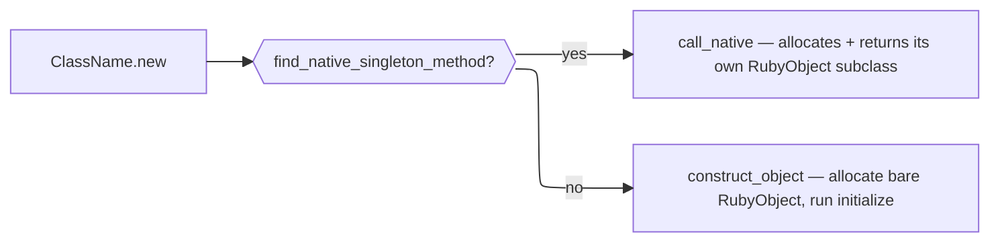

### Information flow control

Every `Value` carries an optional `SecurityLabel` reference. Labels are heap-allocated classes so they can be shared across values without copying. When two labeled values are combined, their labels are joined via `SecurityLabel.join`, which computes the least upper bound in the label lattice — currently a powerset lattice over `ProvenanceTag`, ordered by set inclusion (join = tag-set union). See `research/IFC_DESIGN.md` for the full design rationale.

A `SecurityLabel` holds a `Set(ProvenanceTag)`. Each `ProvenanceTag` is `{kind, origin, sensitivity}`:

- `kind` is a `ProvenanceKind` enum member (`File`, `Network`, `Env`, `UserInput`, ...) — a closed set, not a bare symbol, so it's typo-checked at compile time.
- `origin` is a concrete identifier for the source (a path, host, env var name, ...) — always recorded, since it's what makes a later sink-time prompt or audit entry meaningful ("about to POST `/etc/passwd`", not "about to POST some file").
- `sensitivity` (`Sensitivity::None`/`Elevated`/`High`) is looked up from policy at tag-creation time — not hardcoded per module, since a module has no way to know on its own that `/etc/passwd` matters differently from `/etc/hosts`. The sensitivity policy itself is not yet implemented (see below).

Two same-origin tags merge to the worse (more sensitive) of the two rather than duplicating; sensitivity is monotonic — no operation lowers it once joined onto a value (declassification was considered and explicitly rejected, see `research/IFC_DESIGN.md`).

Labels and tags are `JSON::Serializable` (a custom converter handles the `Set(ProvenanceTag)` field, since Crystal's `JSON::Serializable` only supports `Array` natively). `Interpreter#flow_log` exists — a `FlowLog` (also `JSON::Serializable`) that can record a `FlowEvent` per join for post-hoc audit/debugging, separate from the live label on each `Value`, enabled via `Interpreter.new(flow_tracking: true)` and defaulting to disabled. `#record` is currently a no-op with respect to actual VM behavior: **no join site in the dispatch loop calls it yet** — this is VM-propagation work, not yet done (see below).

**Currently implemented**: the `SecurityLabel`/`ProvenanceTag`/`Sensitivity` types, their join semantics, and the `FlowLog` recording mechanism. **Not yet implemented**: the VM dispatch loop does not actually call `.join_label` anywhere — every binary op, `Concat`, `MakeArray`/`MakeHash`/`MakeRange`, and `SetIndex` currently constructs its result with `label: nil`, discarding operand labels rather than joining them (see `research/IFC_DESIGN.md`'s "VM propagation" section for the exact list of call sites and the container-accumulation design for `SetIndex`). Also not yet implemented: the sensitivity policy (origin → sensitivity lookup), the sink check (comparing a `RiskProfile` against a label's sensitivity to decide whether to interrupt execution), and the agent-facing API for surfacing an interrupt/audit. Labels must currently be attached manually by native code (see "Writing a ScriptModule" below), and nothing yet reads them back out.

The `SecurityLabel` field adds one pointer width to every `Value` struct. When no label is present the field is `nil`, which is a predictable nil-check on the hot path — easily branch-predicted and potentially eliminated by the compiler when IFC is disabled.

### Writing a ScriptModule

A `ScriptModule` is the unit of capability exposure. Implement the abstract class:

```crystal
class MyModule < Adjutant::ScriptModule
  def name : String
    "agent/mymodule"
  end

  def load(interp : Adjutant::Interpreter) : Nil
    interp.define_native("my_func", risk: Adjutant::RiskProfile.none) do |args|
      # args is Array(Adjutant::Value)
      result = do_something(args.first.as_string)
      Adjutant::Value.string(result)
    end
  end
end

interp.modules.register(MyModule.new)
```

For simpler cases, register with a block:

```crystal
interp.modules.register("agent/mymodule") do |i|
  i.define_native("my_func") { |args| Adjutant::Value.string("hello") }
end
```

Scripts load the module with `require "agent/mymodule"`. Each module is loaded at most once per interpreter instance regardless of how many times the script calls `require`.

For IFC, attach labels to values your module returns. `sensitivity` should come from policy once that exists (see "Information flow control" above); until then, pass `Sensitivity::None` or a manually-chosen level:

```crystal
interp.define_native("fetch_data") do |args|
  data = http_get(args.first.as_string)
  label = Adjutant::SecurityLabel.of(Adjutant::ProvenanceKind::Network, args.first.as_string)
  Adjutant::Value.string(data, label)
end
```

### Side-effect risk

Every native callable carries a static `RiskProfile`, declared at registration time, so the harness can warn a user about a script's effects *before* running it — independent of IFC, which only tracks data flow once a script is running.

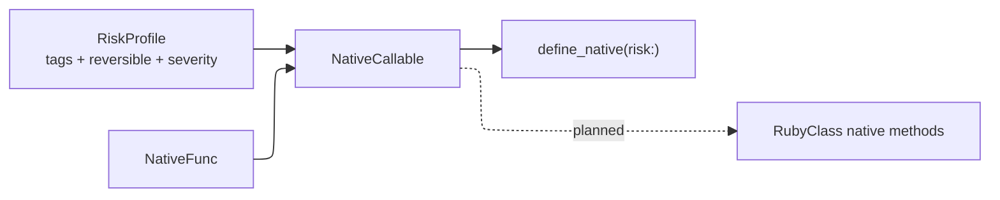

`RiskTag` names *why* a call is risky (`ReadsFiles`, `WritesFiles`, `DeletesFiles`, `Recursive`, `ExecutesCode`, `NetworkEgress`, `ElevatedPrivilege`, `ModifiesEnvironment`). `Reversibility` (`Yes`/`No`/`Depends`) and `Severity` (`Info`/`Warning`/`Error`) are *conclusions* drawn from those tags.

Tags are the reason; reversibility and severity are consequences — a `RiskProfile` with no tags must be `Reversibility::Yes` and `Severity::Info`. Setting either otherwise on an empty-tag profile raises immediately, by design: it means a `RiskTag` is missing, not that the fields should be set freely.

```crystal
# Pure — the default, no need to state it explicitly.
interp.define_native("square") { |args| ... }

# Effectful:
interp.define_native("delete_file",
  risk: Adjutant::RiskProfile.new(
    tags: Set{Adjutant::RiskTag::DeletesFiles},
    reversible: Adjutant::Reversibility::No,
    severity: Adjutant::Severity::Error,
  )) { |args| ... }
```

`Reversibility::Depends` requires a `note` explaining the call-site condition that determines it (e.g. a flag toggling in-place writes) — this can't be resolved statically and is treated as "escalate and ask" until argument-level analysis exists.

`NativeCallable` pairs a `NativeFunc` with its `RiskProfile` and is the shared representation for any Crystal-implemented callable — `ScriptModule` functions via `define_native`, and `RubyClass` native methods for base types (`Integer`, `Float`, `NilClass`, `TrueClass`, `FalseClass`, `Symbol`, `String`, `Array`, `Hash`) — so a risk-manifest walker has exactly one place to look regardless of whether a call resolves to a required module or a base type's method.

#### Structured risk: RiskNode and RiskAggregator

A flat union of `RiskProfile`s across a script loses conditionality: an `if`/`else` with a safe branch and a destructive branch would merge into one tag set, as if both could happen in one run. `RiskNode` (`risk_node.cr`) mirrors the AST's control-flow shape instead, so aggregation respects it.

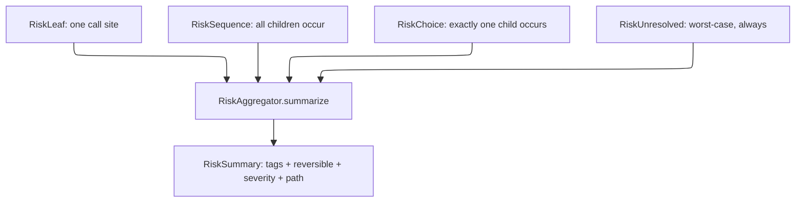

- `RiskSequence` — straight-line code and loop bodies (`iterated: true` for the latter, since a script can't generally know its own iteration count statically). Aggregates by union: all children's tags apply, severity/reversibility take the worst single child.
- `RiskChoice` — `if`/`elsif`/`else`, `case`/`when`, rescue clauses. Aggregates by taking the **single worst-case branch**, not a union — `origin` (`"if"`, `"case"`, ...) is preserved so the summary's `path` names which branch caused it.
- `RiskUnresolved` — a call site the walker couldn't statically resolve. Always ranks worst-case (`Severity::Error`). Should be rare, since dynamic dispatch is a forbidden language feature (see below) specifically to keep every call site staticaly resolvable; a common `RiskUnresolved` is a signal something needs fixing in the walker or the forbidden list, not a case to silently downgrade.

`RiskAggregator.summarize(node) : RiskSummary` walks a tree once and returns the single worst-case path through it — not every possible path, since presentation needs one concrete story ("this script may delete files if the `--force` branch is taken"), not a combinatorial list.

`RiskAggregator.all_findings(node) : Array(RiskFinding)` is the complementary entry point: every `RiskLeaf`/`RiskUnresolved` anywhere in the tree, each with its own `branch_path` (which `Choice` branches led there) and `iterated?` flag — not collapsed to one worst-case story. `RiskAggregator` takes no view on presentation; a host UX groups, filters, or sorts `RiskFinding`s itself (e.g. dedup repeated calls to the same function, or show only `Severity::Error` entries).

#### TypeInference

A `Call` node can only resolve to a `NativeCallable`/`ScriptProc` if its receiver's class is known. `TypeInference` (`type_inference.cr`) infers this statically, without running the script — a minimal pass, not full type inference.

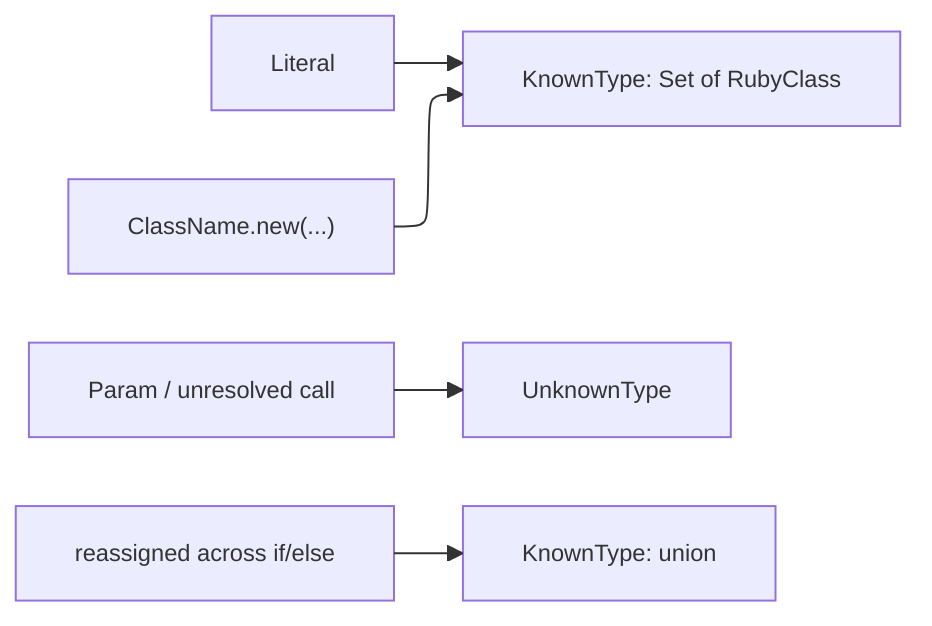

`TypeHint` (`type_hint.cr`) mirrors `RiskNode`'s sum-type reasoning: a local var reassigned a different known type in each branch of an `if`/`case` is a real union, not an inference failure — only genuinely untraceable values (params, unresolved call returns) are `UnknownType`. Loops merge the same way, treating "ran 0 times" vs. "ran once" as a 2-way branch.

#### RiskWalker

`RiskWalker` (`risk_walker.cr`) builds the actual `RiskNode` tree from a parsed `Body`, using `TypeInference` to resolve each `Call`'s receiver. The walker never runs `interp.eval` — it only parses and walks, so it must discover `def`/`class`/`module` declarations itself as it goes, rather than relying on the interpreter's already-executed globals.

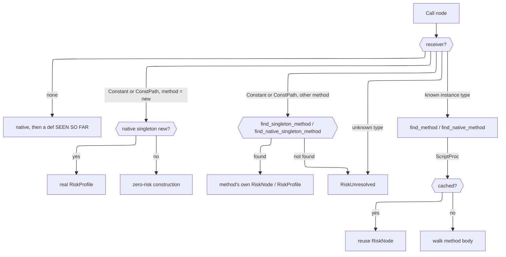

**Def/class discovery follows the same order rule the VM's linear execution would.** A top-level `def`/`class`/`module` is only visible to calls *after* it in the walk — a call before its definition is `RiskUnresolved`, matching the `NameError` the same script would raise at runtime. This is a deliberate design choice, not an accident of implementation: the walker never executes anything, so there's no "hoisting" pass to fall back on, and mirroring the runtime's own order sensitivity keeps the assessment honest about what would actually run.

The one place order does NOT matter is **calls between a class's own methods**: a method body is only ever invoked after `.new`, by which point the whole class body has finished executing and every method is registered — so `walk_class` walks a class body's bare statements in order (registering `def`s and running any non-`def` statement immediately, same rule as top-level) while method bodies themselves (walked lazily via `walk_script_method`, on first call) always see the class's final, complete method table regardless of source order within it.

`walk_class`/`walk_module` register three different statement shapes into three different places, mirroring how the VM itself would: a plain `def` into `methods`, `def self.foo` (a `SelfNode` receiver — see "Script-defined singleton methods" above) into `singleton_methods`, and a nested `class`/`module` statement into the ENCLOSING class's own `constants` table via `walk_nested` — this last one is what makes `M::A` resolvable as a `ConstPath` afterward; without it, `A` would only be reachable in the walker's flat `@known_classes` map by its bare name, not through `M` specifically, which is not how Ruby scoping actually works.

**`ClassName.new` (or `M::A.new`) resolves to a real `RiskLeaf`, not unconditional zero risk, when the class registered a native singleton `new`** (see "Native singleton methods" above) — `walk_constructor_call` checks `find_native_singleton_method` the same way `resolve_on_class` checks `find_native_method` for an ordinary receiver call. A class with no native `new` still resolves construction as zero risk, matching prior behavior for the common (script-`initialize`-only) case.

**Any other `ClassName.method` or `M::A.method` call resolves against the class's own singleton tables**, not its instance tables — `walk_class_receiver_call` checks `find_singleton_method` then `find_native_singleton_method`, mirroring the VM's dispatch fix for the same distinction (a `RubyClass` receiver is never looked up in `find_method`, which is for instances of that class). `.new` keeps its own dedicated sub-path above rather than going through this generic one, since it alone has an always-available fallback when nothing is registered. A bare `Constant` receiver resolves directly via `resolve_class`; a `ConstPath` receiver (`M::A`, or deeper nesting) resolves via `resolve_const_path`, which walks the namespace chain through each resolved class's own `constants` table — the same non-lexical, direct-lookup semantics as the VM's `Op::GetConstantFrom` (see "Constants are lexically scoped" above), NOT the lexical-parent walk a bare `Constant` reference would use.

`RiskWalker` keeps two of its own tables for this — `@top_level_procs` (defs seen so far) and `@known_classes` (classes built so far) — checked before falling back to `@interp`'s live state, which only reflects genuinely pre-existing things (builtins, or classes from a prior `interp.eval` in the host program). `TypeInference` gained two injectable resolvers so its own `ClassName.new`/`M::A.new` inference can see the walker's own not-yet-executed classes too, without `TypeInference` needing to know `RiskWalker` exists: `class_resolver : String -> RubyClass?` (bare names, defaulting to a live-global lookup) and `const_path_resolver : ConstPath -> RubyClass?` (namespaced paths, defaulting to the same namespace-chain walk `resolve_const_path` does, against `@interp`'s live state instead of the walker's own tables).

**Node coverage.** Every AST shape isomorphic to one already handled reuses the same `RiskNode` shape:

|AST node                                                        |Treated as                                                                                                                                                     |
|----------------------------------------------------------------|---------------------------------------------------------------------------------------------------------------------------------------------------------------|
|`IfNode`, `UnlessNode`, `CaseNode`                              |`RiskChoice` — exactly one branch runs                                                                                                                         |
|`WhileNode`, `LoopNode`, `ForNode`, `ModifierWhile`             |`RiskSequence` with `iterated: true`                                                                                                                           |
|`ModifierIf`                                                    |`RiskChoice` of one statement vs. nothing                                                                                                                      |
|`BeginNode`                                                     |`RiskChoice(body, rescue)` wrapped in a `RiskSequence` with `ensure` — body/rescue are mutually exclusive, but ensure always runs afterward regardless of which|
|`ClassNode`, `ModuleNode`                                       |Body walked immediately (bare statements), nested `def`s registered onto a `RubyClass`/module being built                                                      |
|`Assign`, `OpAssign`, `CondAssign`, `MultiAssign`, `IndexAssign`|Value expression(s) walked for risk (not just inferred for type) — a risky call used as an initializer or right-hand side is never silently dropped            |

Not yet handled: `Lambda` and block bodies passed to a `Call` (`each { ... }`, `do...end`), and `YieldNode` — these involve higher-order call semantics (a block may run 0, 1, or N times, or be stored and called later by the callee) that the walker doesn't model yet.

Two things worth calling out beyond node coverage:

- **Method bodies are memoized by `ScriptProc` identity**, walked once using only their own parameter scope — not the caller's inferred argument types. This is correct for memoization (a method's risk can't depend on which call site happens to invoke it) but is a real precision loss: **`def process(f); f.read; end` always sees `f` as `UnknownType` inside `process`**, regardless of what any call site passes, so `f.read` resolves as `RiskUnresolved` even when every caller passes a known `File`. Fixing this properly means adding real parameter type declarations to the language (more Crystal-like, less Ruby-like) — not a bigger inference pass, since the ambiguity is inherent to having no per-method contract at all.
- **Recursion** gets the same treatment as loops: a `ScriptProc` already being walked (direct or mutual recursion) short-circuits to a plain `RiskLeaf` instead of re-descending, so the walker always terminates.

`ScriptProc` carries an optional `ast_body`/`ast_params` (set by the compiler at `compile_def`) purely so `RiskWalker` can walk a method's real control-flow shape — the VM itself never reads these fields. `RiskWalker` also builds throwaway `ScriptProc`s (empty `Chunk`, real `ast_body`) for the `def`s it discovers itself — never executed, only walked.

A worked example: `samples/assess_script.cr` parses a script file (never running it) and prints both `RiskAggregator.summarize`'s worst-case path and every `RiskAggregator.all_findings` entry; `samples/scripts/risky_example.rb` exercises the `if`/`while`/def-discovery paths together.

## Forbidden and out-of-scope features

Some Ruby-like features are intentionally excluded — either because they'd break static risk assessment, or because they're a deliberate scoping cut. Anyone tempted to add one of these should read this first.

- **Dynamic dispatch by computed method name** (`send`, `public_send`, `method_missing`, `define_method` with a runtime-computed name). `Call#method` in the AST is always a literal `String`; keeping it that way is what makes every call site staticaly resolvable to a `NativeCallable`/`ScriptProc` for risk aggregation. If this ever changes, `RiskUnresolved` (see above) is the fallback — but the goal is for it to stay rare.
- **`eval`/`instance_eval` on runtime strings.** Same reasoning — a script that can construct and run arbitrary code at runtime has no static risk profile at all.
- **Reflection that exposes native/Crystal internals** (e.g. arbitrary FFI, `ObjectSpace`-style introspection). Not yet needed for anything on the roadmap, and it would let a script route around the effect boundary (`EffectHandler`/`ModuleRegistry`) entirely.

This list should grow as new features are proposed — the test is always "does this let a call site's target or effect become unknowable before running the script."

The three above are excluded because they'd break static analysis — no amount of implementation effort makes them safe to add. The following are a different kind of exclusion: real Ruby features that are simply out of scope, cut as a deliberate scoping decision rather than a static-analysis hazard. Revisiting one of these is a normal scoping conversation, not a "this breaks the model" one.

- **`Class.new`/`Module.new`** — dynamically defining a class or module at runtime (optionally with a block as its body). Cut when designing the `Object`/`Class`/`Module` bootstrap: it would need a native singleton `new` on `Class` capable of executing an arbitrary block as a class body, which is materially harder than the rest of that bootstrap and wasn't needed by anything driving the base-types work. `class Foo; end` (the literal, static form) is unaffected.

## Not yet implemented / known missing

- **Exponential float literals** (`1e10`, `1.5e-3`). `Lexer#scan_number` has no `e`/`E` exponent handling at all — `1e10` lexes as `Integer(1)` followed by a separate identifier `e10`, not a clean parse error. Noticed while bootstrapping the `Float` builtin class (Phase 3 of base types), which is otherwise unaffected — `Float` the class/its methods work fine on any float `Value`, however it was constructed (a plain decimal literal, `to_f`, division, ...); this is purely about the lexer not accepting one particular literal spelling. Small, mechanical fix whenever it's worth doing.
- **String repetition** (`"ab" * 3`). `arith_op` (the opcode backing `*`) has real `Integer`/`Float` cases but no `String` one — `+`, `==`, and `<`/`<=`/`>`/`>=` all DO already work for strings at the opcode level (see `arith_add`/`values_equal?`/`compare_op`), so this is narrowly about `*` specifically. Noticed while bootstrapping the `String` builtin class (Phase 4a of base types); out of scope there since that work only wires up native METHODS, not opcodes.
- **Symbol-shorthand hash literal syntax** (`{k: v}`). `Parser#parse_hash_or_block_brace` only ever calls `expect(TokenKind::HashRocket)` — there's no branch checking for a colon after a bare identifier key, so `{a: 1}` doesn't parse at all today; only `{"a" => 1}` (hash-rocket) does. Noticed while bootstrapping the `Hash` builtin class (Phase 4c of base types), which is otherwise unaffected — every `Hash` method works on however the hash `Value` was constructed. Small parser addition whenever it's worth doing.
- **`Array`/`Hash` as a `Hash` key hash by reference, not content.** `Value` has no custom `hash(hasher)` override, so a `Hash(Value, Value)` key lookup relies on Crystal's auto-generated struct hash — fine for `Nil`/`Bool`/`Int64`/`Float64`/`String`/`Sym` (all of which Crystal hashes consistently, INCLUDING cross-type for numerics: `5.hash == 5.0.hash` when `5 == 5.0`, confirmed by `hash_spec.cr`'s own passing regression test, not assumed), but an `Array` or `Hash` used AS a key hashes by Crystal's default reference identity, not by the elements/pairs it contains — so `{[1,2] => "a"}[[1,2]]` (a different `Array` object with equal contents) would NOT find `"a"`, even though `values_equal?([1,2], [1,2])` is `true`. Same root cause as the note in `values_equal?`'s own comment (`vm.cr`) — noted here too since it's the kind of gap easy to rediscover the hard way inside a `Hash`-keyed-by-container script. Fixing this properly would mean giving `Value` a real custom `hash(hasher)` for the `array?`/`hash?` cases specifically (hashing by contents, recursively) — a deliberate, scoped change, not a quick patch, and only matters for the (currently rare) case of a container used as a hash key.
