# Development Guide

This document explains how `adjutant` works internally. It is written for contributors and maintainers who need to understand, debug, or extend the library.

## Dependencies

1. Make sure you have `ops` installed, in one of the following ways:
    - as a gem via `gem install ops_team` or
    - as a tool via `brew tap nickthecook/crops && brew install ops`
2. If you not using macOS, or a Linux that uses `apt`, please [install Crystal](https://crystal-lang.org/install/)

## Getting started

|Command                        |Description                                                                       |
|-------------------------------|----------------------------------------------------------------------------------|
|`ops up`                       |Gets everything setup including `crystal` via `apt` or `brew` if applicable.      |
|`ops build-debug` or `ops bd`  |Make a debug build of `benchmark` sample, in `bin/debug` folder.                  |
|`ops build-release` or `ops br`|Make a release / production build of `benchmark` sample,  in `bin/release` folder.|
|`ops lint`                     |Run `ameba` on the source code                                                    |
|`ops clean`                    |Remove debug and release build files                                              |
|`ops wipe`                     |In addition to cleaning, remove all compiler caches                               |
|`ops test`                     |Run Crystal test specs.                                                           |

### Run test scripts

> `ops test` does not run test scripts, only Crystal test specs

Test scripts are Ruby files that test the Adjutant language features.

```
ops build
bin/debug/test_runner
```

This will run all the test scripts in `spec/scripts` folder.

### Run samples

#### Sample `run_script`

The sample `run_script.cr` runs a script end to end through both risk layers: a static risk assessment pass before execution, then live risk flow (dynamic IFC) enforcement during execution, with an `IO.gets`-based approval prompt for any `Ask` decision. See the sample's own comments for how its native module (`read_file`, `fetch_url`, `delete_file`, `post_data`) labels data and declares sensitivity.
- Run `ops build`, then
- run `bin/debug/run_script samples/scripts/risk_flow_ask.rb`

You'll see a static assessment summary first (the `RiskTag`s the script's calls could trigger, independent of any data), then the script actually running — pausing to prompt you for a decision when it reaches the call that triggers `RiskFlowAction::Ask`. Try the other `samples/scripts/risk_flow_*.rb` scripts too: `risk_flow_allowed.rb` runs straight through with no prompt, `risk_flow_reject.rb` demonstrates a hard policy rejection *and* a live `Ask` in the same run, and `risk_flow_declared_literal.rb`/`risk_flow_declared_variable.rb` show `declare_sensitivity` catching a risky call that carries no propagated label at all (see "Information flow control (risk flow)" below for why that's a separate mechanism from label propagation).

Plain scripts with no native calls (e.g. `samples/scripts/fib_10.rb`) still work the same as before — the static assessment reports no tags, and execution proceeds with no risk flow interruptions.

#### Sample `assess_script`

The sample `assess_script.cr` shows an example of how to load and assess the risk of a script and present the risk assessment.
- Run `ops build`, then
- run `bin/debug/assess_script samples/scripts/risky_example_01.rb`

You should receive the following output:

```
=== Risk assessment: samples/scripts/risky_example_01.rb ===

Worst case: Error / reversible=No
Tags: NetworkEgress, DeletesFiles
Path: fetch_url -> if branch -> delete_file

All findings (3):
  line 13: fetch_url (iterated) — Warning, tags: NetworkEgress
  line 5: delete_file [if branch] — Error, tags: DeletesFiles
  line 7: puts_args [if branch] — Info, tags: none
```

## How Adjutant works

Adjutant is a bytecode interpreter for a Ruby-like scripting language. Its design is shaped by four goals: safe execution of untrusted scripts, a clear and auditable effect boundary, syntax familiar to LLMs trained on Ruby, and a foundation for information flow control.

### Pipeline overview

A script moves through five stages before producing a result:


Each stage produces a self-contained artifact — `Array(Token)`, `Body` (AST), `Chunk` (bytecode), and finally a `Value`. Stages are independently testable and the compiler and VM can be used without going through the full pipeline.

### Ownership and lifetime

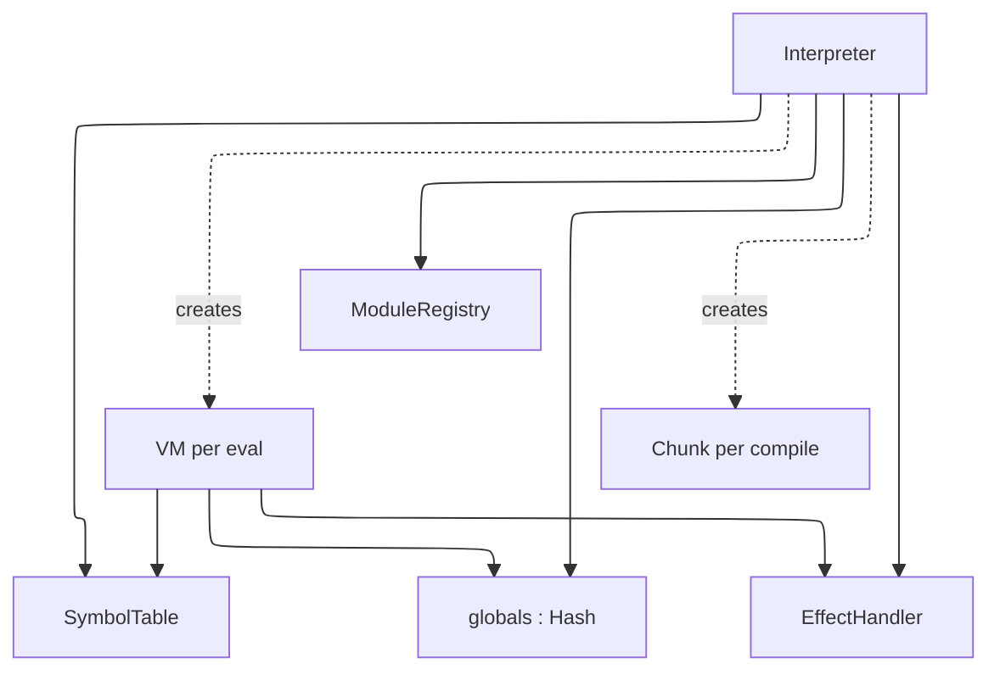

The `Interpreter` is long-lived and intended to span a full agent session. The `SymbolTable`, `ModuleRegistry`, and globals hash all persist across `eval` calls. A fresh `VM` is created for each execution but shares the interpreter's globals, so variables set in one `eval` are visible in the next.

### The Lexer

`Lexer` reads from an `IO` (eagerly into a `String` since random access is needed for peeking and lexeme slicing). It produces `Token` values carrying a `TokenKind`, lexeme string, line, and column. The source string is UTF-8 via Crystal's native `String`/`Char` handling — string and comment content in any language passes through verbatim. Identifier scanning uses `ascii_alphanumeric?` by design, so identifier names are currently ASCII-only.

### The Parser

`Parser` is a hand-written recursive descent parser with a Pratt loop for expression precedence. It consumes tokens from a `Lexer` and produces an `Body` — the root of the AST. AST nodes are Crystal classes rooted at `abstract class Node`, each carrying source position. The parser handles the full Ruby-like grammar including interpolated strings, blocks, modifier forms (`x if cond`), multi-assignment, and keyword arguments.

Bare calls without parentheses (`puts x`) are supported for literals, identifiers, and constants as the first argument (`arg_follows_no_paren?`) — covers `puts x`, `assert_equal add(3, 5), 8`, `raise SomeError`. A leading unary `-` is not yet handled as an argument start (ambiguous with a bare identifier reference minus something).

**`$name` globals** (Ruby's special global-variable sigil, distinct from a `def`/top-level-assignment global living in `@globals`) are lexed (`TokenKind::GVar`) but have no parser, AST, compiler, or VM support — referencing one is currently a parse error. Not yet scoped to a chunk.

### The Compiler

`Compiler` walks the AST and emits bytecode into a `Chunk`. It takes a `SymbolTable` reference so all symbol names are interned consistently across compilations in the same session.

A `Chunk` contains an instruction array and a constant pool (`Array(Value)`). Instructions are fixed-size structs with an opcode and three immediates (`a : UInt8`, `b : UInt16`, `c : UInt32`). Jump targets are patched after the fact using `emit_jump` / `patch_jump`.

**Scopes and locals.** Every body that can hold local variables gets its own `CompilerScope` — method bodies, block bodies, the top-level program itself, and class/module bodies. The scope maps local variable names to integer slot indices. `GetLocal`/`SetLocal` opcodes index into the frame's locals array by slot number rather than name.

Method and block bodies each compile in a fresh child `Compiler` instance (see `Compiler.compile_proc`) with a genuinely new `CompilerScope` starting at slot 0, since each gets its own `Frame` at runtime (`Op::MakeProc` + a later call pushes a new frame with its own `locals` array). The top-level program (`Compiler.compile`) also gets a real root `CompilerScope`, since `VM#run` wraps the whole top-level chunk in a synthetic `Frame` too — this is what makes top-level `x = 1` a real local instead of falling through to a global.

Class and module bodies are different: they do **not** get a new `Frame` at all — they run inline in whatever frame reached the `class`/`module` statement, with `self` swapped via `Op::SetClass` (see below). So a class/module body's own `CompilerScope` (pushed by `Compiler#with_nested_scope`, bracketing `compile_class`/`compile_module`'s existing `@class_depth` increment) must NOT start at slot 0 — it continues numbering from wherever the enclosing scope left off (`CompilerScope#starting_slot`), or two unrelated locals sharing one `Frame#locals` array would silently alias the same slot. This scope also gets `parent: nil` — deliberately, since a class/module body's locals are lexically isolated: they're invisible outside the body, and (unlike a block) the body does **not** close over its enclosing scope's locals either. `def`s compiled inside a class/module body reinforce this: `Compiler.compile_proc` for a `def` never passes `parent_scope`, so a method body can't see its class/module body's own locals, only its `ivars`/`cvars`/constants.

`begin`/`rescue`/`ensure` (`compile_begin`) deliberately does **not** push a `CompilerScope` of its own, even nested several levels deep — confirmed against real Ruby, where `begin; begin; a = 1; end; end; a` is perfectly valid (nested `begin`/`end` shares the enclosing scope, unlike a method/class/module/block boundary). A variable assigned inside a `begin` block, or a `rescue => e` binding (see "Exception handling" below), is scoped to whatever body the `begin` sits in — visible afterward in that same body, not just within the `begin`/`end` — and only stops being visible once a real scope boundary (method, class/module body, block, or the end of a top-level program) is crossed.

Blocks carry a `parent` reference to the enclosing `CompilerScope` for single-level closure capture. When a block references a name not in its own scope, it checks the parent — if found, it emits `GetOuter`/`SetOuter` which read and write the enclosing frame's locals array at runtime. Names unresolvable in any scope (including a class/module body's own, since it has no `parent`) fall through to `GetGlobal`/`SetGlobal`, which now genuinely mean "not a local anywhere in scope" rather than "not inside a def/block" — see `Op::GetGlobal` below. Blocks do not auto-define new locals for unresolved names; only non-block scopes (methods, top-level, class/module bodies) do, matching Ruby's actual local-variable rule.

Each method, block, or lambda body compiles into a `ScriptProc` value stored directly in the parent chunk's constant pool. `MakeProc` pushes it onto the stack — for a `def` body or a call-site block literal (`a=0`, the default) it pushes the bare `ScriptProc` `Value` as-is; for a `Lambda` node (`->(){}`, `a=1` — Adjutant has no Kernel `lambda { }` function, only the arrow form) it instead wraps that `ScriptProc` in a real `Proc` `RubyObject` (see `builtins/proc.cr`, `VM#make_lambda_object`), giving lambdas `.class`/`is_a?`/`.call` that bare def/block procs deliberately don't have. `SetGlobal` (for top-level defs) or `DefMethod` (inside a class) stores the def case; a `Lambda`'s wrapped result is just an ordinary local/expression value like any other `RubyObject`.

### The VM

`VM` is a stack-based bytecode interpreter. It maintains a value stack (`Array(Value)`), a frame stack (`Array(Frame)`), and a shared globals hash. Each `Frame` holds a `ScriptProc`, an instruction pointer, a stack base offset, a `locals` array sized from the proc's `local_count`, and an optional `outer_locals` reference for block closures.

The dispatch loop is a `case` on `Op` enum values, which LLVM compiles to a jump table. Each opcode handler is a short inline block — no method dispatch overhead on the hot path. Instrumentation hooks (for IFC or tracing) can be added as a single conditional before the dispatch without affecting the jump table.

**Non-recursive dispatch.** Script method calls do not recurse into `execute` — `call_script_proc` simply pushes a new `Frame` and returns a sentinel. The single `execute` loop picks up the new frame on its next iteration, and `Op::Ret` restores the caller frame. This means arbitrarily deep script recursion uses only one Crystal call frame, bounded only by the VM's configurable `call_depth_limit`.

**Closure model.** A block's closure capture is fixed at the moment it's attached to a call, not re-derived later. `Op::SetBlock` snapshots the *currently executing frame's* `locals` into `@current_block_locals` — this is the block literal's true creation site, since `SetBlock` always runs immediately after the `MakeProc` that pushed the block, in the same frame the block was written in. `Op::Call` threads that snapshot through `dispatch_call`/`call_script_proc` onto the **callee's** new `Frame#block_outer_locals` (distinct from `Frame#outer_locals`, which is for when the frame's own proc is itself a block). When `Op::Yield` later fires — possibly many instructions into the callee's body — it reads `f.block_outer_locals`, not `f.locals`, so the block correctly closes over the scope it was *written* in rather than whichever frame happens to be running `yield`. `GetOuter`/`SetOuter` then read and write slots in that captured array directly — since blocks execute synchronously while the outer frame is still alive, no upvalue hoisting is needed. Blocks defined outside any local scope with nothing above them (i.e. truly free-floating references) still fall through to `GetGlobal`/`GetOuter` failing to resolve, same as anywhere else.

**`self` at every level, and implicit-self dispatch.** `self` is never `nil` in any real execution context, matching Ruby exactly rather than approximating it: at the top level, `self` is `Interpreter#main` — a genuine `RubyObject` whose class is `Object` — not a placeholder. `Op::DefMethod`/`Op::DefSingleton` both target `self`'s class uniformly (a `RubyClass` directly when `self` is one — inside a class/module body — or a `RubyObject`'s own `rclass` otherwise), so a bare top-level `def` becomes a real, inherited method of `Object`, reachable from any object anywhere, matching Ruby's actual top-level-def-becomes-a-private-Object-method behavior (Adjutant doesn't model method visibility, so it's reachable via an explicit receiver too — a real, narrow divergence from Ruby, not a design goal). Native functions registered via `Interpreter#define_native` land in `Object`'s own `native_methods` table for the same reason — matching Ruby's Kernel-methods-are-Object-methods model, not a separate top-level-only table.

`dispatch_call`'s implicit-self step is what finds all of this again on a later bare/receiverless call — and it genuinely branches on what kind of thing `self` is, not one shared lookup, since the two cases mean different things:
- **`self` is a `RubyObject`** (an ordinary instance — `main` at top level, or any object inside its own method body): checks that object's own class (`find_method`, then `find_native_method`) — the same table an explicit `self.foo`/`obj.foo` call on it would use.
- **`self` is a `RubyClass`** (inside a class/module body): checks `self`'s own *singleton* tables first (`find_singleton_method`/`find_native_singleton_method` — a `def self.foo` called bare from elsewhere in the same body), then **`self.rclass`'s instance-method chain** (`Module`/`Class` walking up to `Object`) for anything Kernel-style. `self`'s own *instance*-method table (`self.find_method` — what `Foo.new` would see, not `Foo` itself) is deliberately **not** checked here: a class/module body can't bare-call its own future instance methods, matching real Ruby exactly (only an actual instance can). This distinction is also why `Module.superclass` must be `Object` (see "Every class defaults to real ancestors" below) — a module has no superclass of its own at all, so a bare Kernel-style call (`puts`, or any `define_native` function) inside a `module M` body only resolves by walking `M.rclass`'s (`Module`'s) chain, not `M`'s own.

Either way, implicit-self falls through to constants/builtins and finally a script-catchable `NameError` if nothing matches. `@globals` now holds only constants and classes — `Op::GetGlobal`/`Op::SetConstant` — nothing else writes into it in any currently-parseable script.

**Constants are assign-once.** `Op::SetConstant` (both branches — a plain top-level `FOO = 1`, which has no enclosing class/module so it routes through `@globals`, and a constant defined inside a `class`/`module` body, which routes through that `RubyClass`'s own `constants` table) raises if the name is already bound, rather than silently overwriting it the way real Ruby (which only warns) allows. `class Foo; end` and `module Foo; end` are the same `Op::SetConstant` path under the hood (see `compile_class`/`compile_module`), so a second `class Foo; end` for an already-defined name — real Ruby's reopening/monkey-patching mechanism — is a hard error too, not silent data loss: `Op::MakeClass` always allocates a fresh, disconnected `RubyClass` for every `class Foo; end` it compiles (no reuse-if-already-exists check), so without this guard a reopen would silently orphan the original class's methods, not merge into it — confirmed concretely: reopening a builtin like `String` to add one method, before this guard existed, made `.upcase` and every other native `String` method vanish, since they lived only on the now-unreachable original class. Real class reopening isn't supported and isn't planned (see `SCOPE.md`'s Won't Fix list) — Adjutant scripts are LLM-generated and typically don't need it, and failing loudly here is strictly better than that silent breakage. The practical effect for native singleton methods specifically: a native `new` (or any `native_singleton_method`) has to be registered on a class before script code first defines it via `class Foo; end`, in that same definition — there's no way for a later, separate script-level `class Foo; end` to extend an already-existing class anymore.

**Known gap:** `Op::DefSingleton` approximates `def self.foo` when `self` is a `RubyObject` (not a `RubyClass`) by targeting the receiver's *class*, not a true per-instance singleton method — `RubyObject` has no singleton-method table of its own. This is observably correct for the one case that matters in practice (`def self.foo` at top level, where `self` is always `main`, the one and only instance of `Object` a script typically has as `self`) but means the method becomes callable as `Object.foo` (an explicit-receiver call), not via a later *bare* `foo` the way real Ruby's true per-object singleton method would be. A real per-instance singleton-method table on `RubyObject` would close this properly, if it's ever worth the size of that change.

Execution limits (instruction count, call depth) are checked on every frame push and tick respectively.

### Exception handling

`begin`/`rescue`/`ensure` is bytecode, not a VM-level try/catch. Each `Frame` carries a `handlers` stack of `HandlerEntry` — one entry per active `begin` construct, holding an optional `rescue_ip` and an optional `ensure_ip` (a construct can have either, both, or neither). `Op::Try` pushes an entry; `Op::SetEnsure` either adds its target to the entry `Op::Try` just pushed (same construct) or pushes a fresh one (ensure-only construct) — a combine flag on the instruction tells it which. This one-entry-per-construct design, rather than separate rescue/ensure stacks, matters: it preserves the actual push order between different constructs on the same frame, so a more-recently-entered ensure-only `begin` is found before an outer, earlier-pushed `rescue` — checking "any pending rescue" before "any pending ensure" via two independent stacks gets this wrong when they belong to different constructs.

The dispatch loop wraps each instruction in a Crystal `begin/rescue RuntimeError`. On error, it walks `@frames`, peeking each frame's top `HandlerEntry`: a `rescue_ip` present means a possible match — jump there (`clear_rescue_portion` clears just the rescue portion, popping the whole entry only if it has no linked `ensure_ip`, mirroring what `Op::EndTry` does on the success path); no `rescue_ip` but an `ensure_ip` present means jump into the ensure body instead (`Op::EnterEnsure` pops the entry once reached — the single place an entry is fully removed, on either path, so it can't go stale). If a class filter doesn't match, `Op::Reraise` triggers a fresh unwind pass, which naturally finds the next entry — the same construct's own `ensure_ip` if it has one, an enclosing `begin` on the same frame, or an outer call frame — since the mismatched portion was already cleared. If nothing is found anywhere, the error re-raises past the VM as an uncaught Crystal exception.

`Op::PushError` pushes the caught error for the rescue variable — a `RubyObject` of a real error class when one was constructed (`RuntimeError#error_value`), else a plain string for internal errors that haven't been retrofitted yet. `rescue => e` binds `e` through the same `CompilerScope` mechanism every other variable uses (`Compiler#emit_store_name`, with `force_define: true` — see "Scopes and locals" above), not a special case: it reuses an existing same-scope local named `e` if one exists, otherwise defines a fresh one in the *current* scope specifically (skipping the "maybe an enclosing scope has it" check ordinary assignment does, and never falling through to a global) — so `e` is scoped correctly even inside a block, and never collides with an unrelated top-level `def e`. `Interpreter#bootstrap_error_classes` registers `Exception → StandardError → {RuntimeError, TypeError, ArgumentError, ZeroDivisionError, NameError → NoMethodError, IndexError → KeyError}` into `@globals` once per interpreter. `raise "msg"`, `raise ClassName`, and `raise ClassName, "msg"` all build a `RubyObject` with a `message` ivar (readable via `.message`); internal VM errors (division by zero, etc.) go through the same path via the `runtime_error` helper. `rescue ClassName => e` filters by class (or subclass, via `is_a?`) on any single `rescue` clause; a bare `rescue` defaults the filter to `StandardError`, matching Ruby (`Exception`-only fatal errors propagate past it). **Not yet implemented:** multiple `rescue` clauses on one `begin`.

`ensure` bodies run on the success path inline, and now also when an error propagates through: the unwind loop stashes the original error in `VM#@pending_reraise` before jumping into the ensure body, and `Op::EndEnsure` (emitted right after the body) re-raises it once the ensure body finishes — unless the ensure body raises its own error first, which supersedes the original via the ordinary Crystal-exception path before `EndEnsure` is ever reached, matching Ruby. `@pending_reraise` is cleared at the top of every fresh catch so a superseded value can't leak into an unrelated later error. Either way, the ensure block's own trailing value is discarded so it doesn't clobber the `begin` expression's result.

### The effect boundary

The containment design separates physical effects from capability exposure:

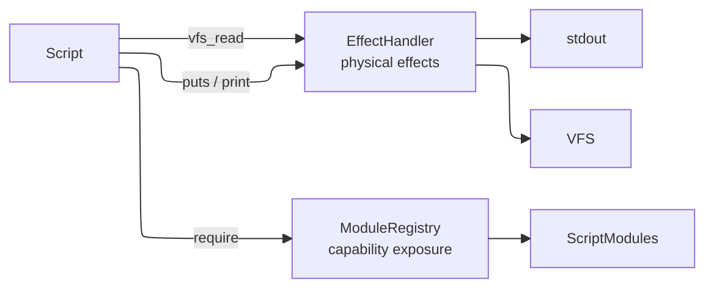

`EffectHandler` handles physical effects — stdout writes and VFS reads. `ModuleRegistry` handles capability exposure — which native functions and objects a script can access. Scripts can only access capabilities that have been explicitly registered. The registry is auditable: `registered_paths` and `loaded_paths` show exactly what a script has access to and what it has used.

### The Value model

All runtime values are represented as `Value`, a Crystal struct:

```crystal
struct Value
  getter raw   : Nil | Bool | Int64 | Float64 | String | Sym | ScriptProc |
                 LabeledArray | LabeledHash | RubyClass | RubyObject
  # label is stored for scalars; for LabeledArray/LabeledHash values it's
  # computed from the live container's own label instead — see
  # "Information flow control (risk flow)" below.
  def label : RiskFlowLabel?
  end
end
```

Using a struct means values are stack-allocated and copied on assignment — no per-value heap allocation for scalars. Crystal's union type carries its own discriminant, eliminating the need for a separate tag. Type predicates (`null?`, `bool?`, `int?`, etc.) use `is_a?` on the union.

Symbols are represented as `Sym` — a struct carrying an integer ID and an interned name string. The `SymbolTable` assigns stable IDs so symbol comparison is an integer equality check rather than a string comparison. A `SymbolTable` is owned by the `Interpreter` and shared across all compilations, so `:foo` always has the same ID regardless of which script introduced it.

**`to_s` and `inspect` genuinely differ for `nil`**, matching real Ruby: `nil.to_s == ""` (an empty string — `puts nil` prints a blank line, `"#{nil}"` interpolates to nothing), while `nil.inspect == "nil"` (the word, for debugging output). This is easy to regress since three call sites independently need to agree on it rather than one shared path: `Value#to_s`/`Value#inspect` themselves, `Op::Concat` (string interpolation), and `exec_builtin`'s `"puts"` case each do their own `Nil` case rather than all funneling through one. `print` and every OTHER string-producing path (`.to_s` the dispatchable method, error messages, `Op::Throw`, ...) delegate to `Value#to_s` directly and so inherit the fix automatically — it's specifically `Op::Concat` and `"puts"` that hardcode their own per-kind formatting and need checking individually if this class of bug shows up again for some other kind.

### The Object model

`RubyClass` and `RubyObject` are plain Crystal classes, not `Value` variants wrapping something else — they sit directly in the `ValueRaw` union like any other type.

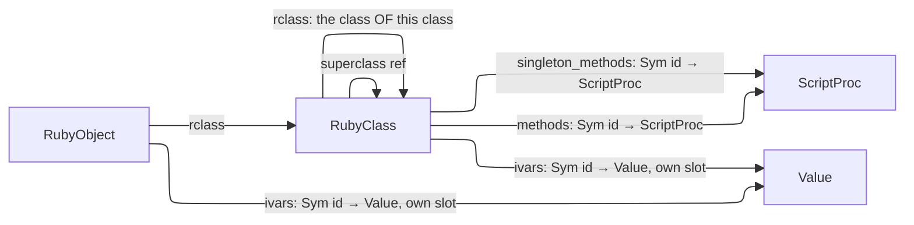

`RubyClass` holds a method table keyed by interned symbol ID (same keying scheme as globals and ivars), a `superclass` reference, an `rclass` reference (the class of this class — `Integer.rclass == Class`), and an `is_module?` flag. `RubyObject#rclass` and `RubyClass#rclass` are the same relationship ("what class is this an instance of") at two different levels, sharing a name deliberately — `obj.class` and `SomeClass.class` are genuinely the same method in real Ruby, not a coincidence.

**Every class defaults to real ancestors, not `nil`.** A script-written `class Foo; end` with no explicit `< Bar` inherits from `Object`; every class or module's own `rclass` is `Class` (a module's own class is `Class` too, not some separate `Module`-of-modules — `Module` itself is an instance of `Class`, same as any other class object). `Object`, `Class`, and `Module` are bootstrapped once per `Interpreter`, before anything else — see `Interpreter#bootstrap_core_hierarchy` below, since the three have a genuine circular dependency in real Ruby (`Class.superclass == Module`, `Module.superclass == Object`, and everything's `rclass` is `Class` except `Class.rclass == Class` itself, self-referential) that can't be resolved in a single construction pass. `Object.superclass` is `nil` — the deliberate root (real Ruby's is `BasicObject`, which Adjutant doesn't model). `MakeClass` resolves an explicit superclass by looking it up as an existing global `RubyClass` (raising `uninitialized constant` if it isn't one) and otherwise defaults to `Object`; a builtin class not built via `Interpreter#define_builtin_class` directly (e.g. `Integer`, built in the separate `Builtins` module) gets the same defaulting patched on afterward by `Interpreter#register_builtin_class`.

**`Class.new`/`Module.new` are explicitly out of scope** — see "Forbidden and out-of-scope features" below. This bootstrap only makes `Class`/`Module` exist as real `RubyClass`es for `.class`/`is_a?`/`superclass` to work correctly; it does not make them instantiable from script.

**Universal methods** (`.class`, `.superclass`, `is_a?`/`kind_of?`, `respond_to?`, `equal?`) are implemented as `exec_builtin` VM-level fallback cases, the same mechanism `to_s`/`to_i`/`puts` already use — NOT as real inherited methods living on `Object`'s own method table. This is a known simplification: real Ruby resolves these by walking to `Object`/`Kernel` like any other method, so `respond_to?` in particular can't yet see them (asking `x.respond_to?(:to_s)` returns `false` even though `x.to_s` would work) — see `respond_to?`'s own doc comment in `vm.cr` for the exact boundary. Revisiting this — making these real `Object` methods discovered through normal dispatch — is a reasonable future cleanup once something actually needs `respond_to?` to see them, not a correctness bug today.

**`self` lives on `Frame`**, not the VM — each call frame carries its own `self_val`, isolated automatically when a frame is pushed/popped. `GetClass`/`SetClass` read and write the *current* frame's `self`; a class body runs in the same frame as its surrounding code, so entering/leaving one is a save-and-restore of that single value rather than a frame push. `self` is never `nil` in any real execution context — see `Interpreter#main` above — so `DefMethod`/`DefSingleton` always have a class to target: `self`'s own `RubyClass` directly (inside a class/module body), or a `RubyObject`'s `rclass` otherwise (top level, or `def` written inside a method body — both legal in real Ruby, matching "self at the point this def executes").

**Method dispatch.** `.` calls carry a receiver bit in the bytecode (distinguishing `obj.method()` from `method(obj)`, where a plain argument that happens to be an object must not be mistaken for a receiver). When present, `dispatch_call` branches on what kind of receiver it is: a `RubyObject` resolves against its class's *instance* tables (`find_method` → `find_native_method`, walking the superclass chain); a `RubyClass` resolves against its OWN *singleton* tables instead (`find_singleton_method` → `find_native_singleton_method`) — never the instance tables, since e.g. `A.foo` is a call on the class itself, not on some instance of it. A matched method runs in a new frame with `self` bound to the receiver — the class itself, in the singleton case. When no explicit receiver is present, `dispatch_call` tries the same kind of lookup against `self` instead (implicit-self dispatch — see "`self` at every level" above, which checks one further table beyond this when `self` is a `RubyClass`: `self.rclass`'s own instance-method chain, not just `self`'s singleton tables) before falling through to constants/builtins.

**`.new`** checks the class (or an ancestor) for a registered native singleton method first — see "Native singleton methods" below — and only falls back to the generic path if none exists. The generic path allocates a `RubyObject` and, if `initialize` is defined (on the class or an ancestor), runs it via `VM#invoke` — the same synchronous nested-execution path a native method uses to call a script-provided block (`NativeCallContext#invoke`, exposed to any native method's block — see `Array#each`/`#map` in `src/adjutant/builtins/array.cr` for the first real end-to-end exercise of this, not just an architectural claim) — so its return value can be discarded and `.new` always returns the object itself.

**`NativeCallContext`** is what a native method's block receives as its third block parameter (`|args, blk, ncc|`), giving it capabilities a plain Crystal closure couldn't reach on its own: `ncc.invoke(script_block, args)` to call a script-provided block (see `.new`/`each`/`map` above); `ncc.values_equal?(a, b)` and `ncc.compare(a, b, op)` to compare two `Value`s using Adjutant's real `==`/`<=>` semantics (deep/structural for `Array`/`Hash`, identity for `RubyObject`, value equality for scalars) — both delegate to `ValueOps` (`value_ops.cr`), the single shared implementation every opcode (`Op::Eq`, `Op::Lt`, ...) also uses, so a native method's notion of equality/ordering (e.g. `Array#include?`, `Range#include?`/`#each`) can never drift out of sync with script-level comparison; and `ncc.call_method(recv, name, args)` to call a method by name on an arbitrary `Value` receiver the way `recv.name(*args)` would from script — resolving through the normal dispatch order, not a fixed native table — used by `Range#each` to advance via `#succ` generically, without hardcoding `Integer#succ` specifically.

**`VM#invoke`'s stack isolation.** `invoke` runs a genuinely nested `execute` loop for its script_block/proc call — not a recursive Crystal call into the outer `execute`, a second, self-contained pass through the same loop, reached by temporarily swapping `@frames` to a fresh single-frame array so `execute`'s own `break if @frames.empty?` terminates it correctly once that one frame returns. `@stack` is swapped the same way, for a reason that isn't obvious from `@frames` alone: `execute`'s actual return value is `@stack.last? || result`, not something threaded explicitly through the call chain, and `Op::Ret` only pushes its result back onto `@stack` `unless @frames.empty?` — a check that means something different inside `invoke`'s temporarily-swapped, single-frame `@frames` than it does for the real, outer call stack. Without `@stack` also isolated, a call made from inside a still-pending compound expression (e.g. `sq.call(3)` as the second element of `[sq.call(2), sq.call(3), sq.call(4)]`, with `sq.call(2)`'s `4` still sitting on the shared stack) would read that stale, unrelated leftover via `@stack.last?` instead of its own result — a real bug found and fixed - precisely because `@stack` wasn't swapped originally, only `@frames` was.

**`VM#invoke`/`VM#invoke_proc` — why a lambda needs its own closure snapshot, and why calling one is two separate methods.** A `->(){}` literal's body can reference names from its enclosing scope, compiled to `GetOuter`/`SetOuter` against a `Frame#outer_locals` array — the same single-level-closure mechanism ordinary blocks use. Blocks get this right via `Op::SetBlock`, which snapshots the *creation-site* frame's locals the moment the block literal is pushed, before the call it's attached to even runs (see `Frame#block_outer_locals`'s comment above). `Op::MakeProc`'s lambda branch (`a=1`) had no equivalent snapshot: nothing captured the defining frame's locals at all, so `VM#invoke` (what `Proc#call` routed through) fell back to whichever frame happened to be *calling* `.call` — correct only when that coincided with the frame that wrote the lambda, which it always did in every spec until one specifically returned a lambda out of its defining function and called it later from elsewhere (`make_adder(n) { ->(x){x+n} }`, called from top level). Fixed 2026-07-20: `RubyObject` gained a Proc-only `outer_locals : Array(Value)?` field — a plain Crystal field, not routed through `ivars`, since `ivars` can only hold real `Value`s and this is VM-internal plumbing no script can read or assign, exactly like `Frame#outer_locals` itself. `Op::MakeProc` populates it at the lambda's true creation site.

The first version of this fix gave `VM#invoke`/`NativeCallContext#invoke` a single optional `outer_locals` override param, passed explicitly by `Proc#call` and defaulted to the (correct, unchanged) calling-frame fallback for every other caller (`Array#each`/`Range#each`/`Hash#each`'s `blk` param — always a live call-site block literal invoked in the frame that wrote it, so no defining/calling-frame gap exists there). That shape was replaced the same day after review surfaced the actual risk it still carried: any FUTURE native method accepting a stored `Proc` as a plain argument (none exist yet, but nothing prevented one) could call `ncc.invoke(sproc, args)` and silently forget the override, reintroducing the exact same bug at a new call site — an optional param a caller has to remember to use is the same failure shape as the original bug, just moved. Split instead into two methods with no shared optional param: `invoke(proc, args)` — unchanged from before this whole fix, always uses the current frame, for live call-site blocks only — and `invoke_proc(proc_obj : RubyObject, args)`, which takes the `Proc` object itself and pulls both the wrapped `ScriptProc` and `proc_obj.outer_locals` internally, so there is no raw locals array for any caller to see or forget. `Proc#call` (`builtins/proc.cr`) is currently the only `invoke_proc` caller; any future native method that wants to call a stored `Proc` argument should use it too, not `invoke` plus a hand-extracted `ScriptProc`. A `RubyObject` subclass for `Proc` specifically was considered and rejected for the closure-snapshot field itself: nothing else can construct a `RubyObject` whose `rclass` is `Proc`, so there's no ambiguity a subtype would guard against — the field is simply unused (`nil`) for every other class, the same way `ivars` already holds different keys depending on which class populated it. Full history: `research/IFC_DESIGN.md`'s "VM propagation" section (found while scoping the "verify IFC label propagation through lambdas" work — see `SCOPE.md` — since this had to be fixed before that question was even answerable).

With the VALUE-level closure mechanism fixed, the original dynamic-IFC question this arc set out to answer — does a `RiskFlowLabel` survive capture into a lambda's closure, and a `.call`'s return, correctly — was itself confirmed, closing out that Must Fix item. `risk_flow_propagation_spec.cr`'s `"lambdas and Proc#call"` describe block covers the label-plumbing side directly: a labeled value captured across a defining-frame/calling-frame gap (the same shape as the VALUE-level regression above), a lambda's own computed result (not just a bare captured value) surviving `.call`'s return, two tainted values still joining correctly inside a lambda body, and an unlabeled value staying unlabeled (negative case). No special-cased label-propagation logic was needed for any of this — it falls out of "free propagation" (`Value` is a struct, `RiskFlowLabel` travels with it through `GetOuter`/`SetOuter`/`Ret` like any other field) now that `outer_locals` itself resolves correctly. Confirmed once more at the *policy-enforcement* layer, not just label-plumbing, via a hand-run `samples/run_script.cr` script: a constant-held lambda (`SAFE = ->(name){ delete_file(name) }`), passed as a plain argument into a second method (`invoke(fn, arg) { fn.call(arg) }`), and called from inside that method's own frame — a `RiskFlowPolicyError` was still raised and rescuable in the script exactly as expected, confirming the RiskWalker-side `RiskDeferred`/`CONST.call` static handling (see the `RiskWalker` node-coverage table above) and the dynamic enforcement this section documents agree with each other end to end.

**Some operators are overloaded across base types and can't live in `native_methods` at all**, since arithmetic/comparison/`<<` compile to dedicated opcodes (`Op::Add`, `Op::Shl`, ...) that never consult `find_native_method` — same reasoning as `Integer`/`Float`'s own arithmetic. All of this logic lives in `ValueOps` (`value_ops.cr`), not scattered across `VM` — see "The Value model" below. `ValueOps.add` (backing `+`) has real cases for `Integer`/`Float` mixing, `String` concatenation, and `Array` concatenation (returns a NEW array, non-mutating); `ValueOps.shl` (backing `<<`, split out from the otherwise-Integer-only `ValueOps.int_op` so `&`/`|`/`^`/`>>` don't silently gain array behavior) dispatches to in-place `Array` append — returning the receiver so `a << 1 << 2` chains — for an array receiver, falling back to bit-shift otherwise.

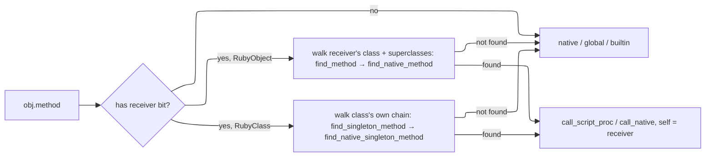

**Ivars and cvars** route through `self`, not globals. `GetIvar`/`SetIvar` read/write `self`'s OWN ivars table — `self.ivars` when `self` is a `RubyObject` (an instance's own storage), or the class's separate `ivars` table when `self` is a `RubyClass` itself (a class body's top-level statements, or a `def self.foo` singleton method). These are genuinely different slots even for the same `@name` — not inherited, not shared, not a fallback of one onto the other; `class A; @x = 6; def initialize; @x = 2; end; end` really does hold two independent `6` and `2`. Outside either context ivars are a silent no-op/`nil`, matching Ruby's forgiving semantics. `GetCvar`/`SetCvar` are unrelated storage, always on `self`'s class regardless of whether `self` is an instance or the class itself (`cvar_class` handles both), walking `superclass` — a write lands on the nearest ancestor that already defines the variable, or the current class if none does. Cvar access outside a class context raises, since Ruby has no cvar scope there either.

**Constants are lexically scoped**, not flat globals — `class A; class B; X = 1; end; end` puts `X` on `B`, not in a shared namespace. This needs two links distinct from the ones above: `RubyClass#lexical_parent` (source nesting, set at `MakeClass` time from `self` — *not* `superclass`, which tracks inheritance) and `ScriptProc#lexical_scope` (the class a method was `def`'d in, captured once at `DefMethod` time, since a method's `self` at call time is its receiver, not its lexical home).

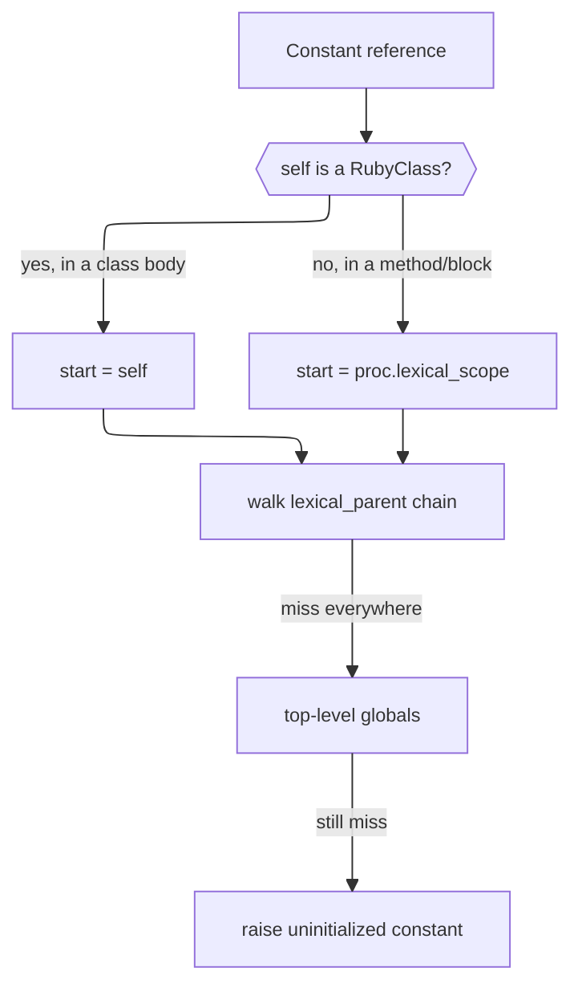

A plain `Constant` reference (`X`) walks that lexical chain. An explicit path (`A::B::X`, parsed as `ConstPath`) instead does a direct, non-walking lookup in each resolved namespace's own table — closer to Ruby, where `::` doesn't re-trigger lexical search. Blocks are lexically *transparent* (inherit the enclosing frame's `lexical_scope`, same mechanism as `self` inheritance); methods are opaque (fixed at `def` time, ignores the caller).

Not yet implemented: `include`. Script-defined class-side (singleton) methods (`def self.foo`) ARE implemented — see "Script-defined singleton methods" below.

**Native methods.** `RubyClass` also holds a `native_methods` table (`Sym id → NativeCallable`), parallel to `methods` but for Crystal-implemented instance methods — the mechanism base types use. `Integer`, `Float`, `NilClass`, `TrueClass`, `FalseClass`, `Symbol`, `String`, `Array`, `Hash`, and `Range` are all implemented this way (see `src/adjutant/builtins/`) — the base-types work is complete at this level; further base types (`Regexp`, ...) would follow the same pattern if ever needed. `find_native_method` walks the superclass chain the same way `find_method` does. Dispatch checks `find_method` first, so a script-defined method always shadows a native one of the same name.

Unlike `Interpreter#define_native`, `RubyClass#define_native_method` takes `risk : RiskProfile` with **no default** — base types are registered in bulk in one place, exactly where it's easiest to wave a whole batch through as `RiskProfile.none` without thinking; the missing default forces that judgment call per method.

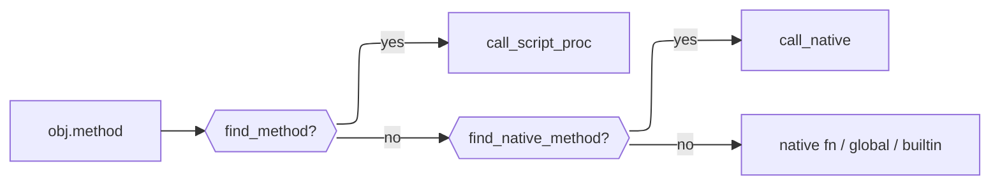

**Script-defined singleton methods.** `def self.foo` inside a class body attaches to a separate `singleton_methods` table on `RubyClass` (`Sym id → ScriptProc`, parallel to `methods`), via `Op::DefSingleton`. The receiver is resolved from `self` at the point the `def` runs — inside a class body `self` is the class itself (same mechanism `GetClass`/`SetClass` already use for the class body generally), so the parser must recognize `self` as a real `SelfNode`, not treat it as an ordinary identifier: `def self.foo` and `def some_other_object.foo` share one receiver-parsing path, but only the `self` case reliably means "the enclosing class." `find_singleton_method` walks the superclass chain, same shape as `find_method` — a subclass with no singleton method of its own inherits its ancestor's, and can shadow it by defining its own.

**Native singleton methods.** `RubyClass` also holds a separate `native_singleton_methods` table (`Sym id → NativeCallable`), for Crystal-implemented *class-level* methods — today used exclusively for a native `new`. This is how a stateful builtin (e.g. a future `File`) gets constructed: `RubyObject` is open to subclassing (`FileObject < RubyObject` with real typed ivars, e.g. an open handle, instead of the shared `ivars : Hash(Int32, Value)` table), and a native `new` allocates that subclass directly and returns it — the generic path can't express this, since it always allocates a bare `RubyObject`.

`.new` dispatch checks `find_native_singleton_method` first (walking the superclass chain, same shape as `find_native_method`) and only falls through to the generic `initialize`-driven path if the class has none. A native singleton method receives the `RubyClass` itself as `args.first` (there's no receiver instance yet — that's the point of `new`), followed by the constructor arguments, and is responsible for its own allocation.

Native singleton methods and script-defined singleton methods share dispatch order (script `find_singleton_method` checked first, native `find_native_singleton_method` second — same shadowing rule as instance methods) but are otherwise independent tables — as long as both are registered on the SAME `RubyClass` instance, which in practice means: a native `new` (or other native singleton method) must be registered on a class before any script-level `def self.foo` targeting it runs, and that has to happen within the class's original definition (a class body executes against the specific `RubyClass` object `Op::MakeClass` allocates for it, fresh, every time `class Foo; end` is compiled and run — see "Constants are assign-once" above; there is no later, separate script-side `class Foo; end` that could extend an already-existing class, since that would be reopening, which Adjutant deliberately doesn't support).

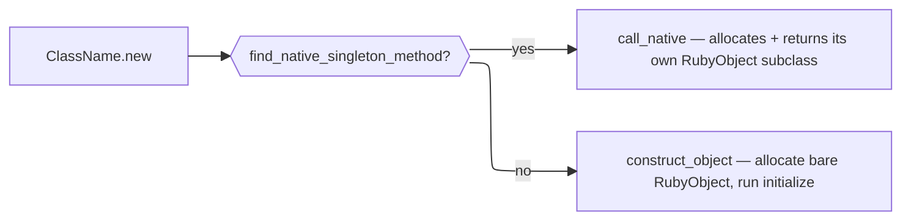

### Information flow control (risk flow)

Every `Value` carries an optional `RiskFlowLabel` — for scalars this is a plain stored field; for array/hash values it's computed from the live `LabeledArray`/`LabeledHash` object instead (see below), so a `Value` copy never goes stale even after the container it wraps is mutated elsewhere. When two labeled values are combined, their labels are joined via `RiskFlowLabel.join`, which computes the least upper bound in the label lattice — a powerset lattice over `ProvenanceTag`, ordered by set inclusion (join = tag-set union). See `research/IFC_DESIGN.md` for the full design rationale.

A `RiskFlowLabel` holds a `Set(ProvenanceTag)`. Each `ProvenanceTag` is `{kind, origin, sensitivity}`:

- `kind` is a `ProvenanceKind` enum member (`File`, `Host`, `Env`, `UserInput`, ...) — a closed set, not a bare symbol, so it's typo-checked at compile time.
- `origin` is a concrete identifier for the source (a path, host, env var name, ...) — always recorded, since it's what makes a later risk-flow prompt or audit entry meaningful ("about to POST `/etc/passwd`", not "about to POST some file").
- `sensitivity` (`Sensitivity::None`/`Elevated`/`High`) is looked up from a `RiskFlowPolicy` at tag-creation time via `RiskFlowPolicy#sensitivity_for` — not hardcoded per module, since a module has no way to know on its own that `/etc/passwd` matters differently from `/etc/hosts`.

Two same-origin tags merge to the worse (more sensitive) of the two rather than duplicating; sensitivity is monotonic — no operation lowers it once joined onto a value (declassification was considered and explicitly rejected, see `research/IFC_DESIGN.md`).

**Containers** (`Array`/`Hash`-typed values) don't store their label on the `Value` struct at all — `Value#raw` wraps a `LabeledArray`/`LabeledHash`, and the label lives as a mutable field on *that* object, shared by reference the same way the underlying elements already are. This is why `Op::SetIndex` and `arr << x` can accumulate a pushed/assigned value's label onto the container permanently (monotonic, same as scalar sensitivity — overwriting or removing the tainted element does not clear the container's label). See `research/IFC_DESIGN.md`'s "Container labeling" section for why the simpler "join onto the `Value`'s own label field" design doesn't work (a `Value` is a struct popped off the stack; there's no slot to write an updated label back to) and why `LabeledArray`/`LabeledHash` hand-write their read/mutate methods rather than including `Indexable`/`Enumerable` (both trigger a Crystal 1.20.3 compiler stack overflow over `Value`'s self-referential union type).

Labels and tags are `JSON::Serializable` (a custom converter handles the `Set(ProvenanceTag)` field, since Crystal's `JSON::Serializable` only supports `Array` natively). `Interpreter#risk_flow_log` is a `RiskFlowLog` (also `JSON::Serializable`) that records a `RiskFlowEvent` per join for post-hoc audit/debugging, separate from the live label on each `Value` — enabled via `Interpreter.new(risk_flow_tracking: true)`, defaulting to disabled (`#record` is then a no-op, so every join site can call it unconditionally without branching on the flag itself).

`Interpreter#risk_flow_policy` is a required `RiskFlowPolicy` (agent-loaded `JSON::Serializable`; Adjutant never reads a policy path off disk itself) with two lookups: `#sensitivity_for(kind, origin)` (origin → sensitivity, via `SensitivityPattern` rules matched by `exact` or `regex` pattern type, highest explicit `priority` wins, a tie at the top priority raises `AmbiguousRiskFlowPolicyError`) and `#action_for(tag, sensitivity)` (the `(RiskTag, Sensitivity) → RiskFlowAction` table, via `RiskFlowRule` rows; `Sensitivity::None` always resolves to `RiskFlowAction::Allow` regardless of table contents, and returns the matched `RiskFlowRule?` alongside the action). `RiskFlowAction` is `Allow`/`Ask`/`Reject`.

There is no `Interpreter.new` default that means "skip risk assessment" — `risk_flow_policy` and `on_risk_flow_decision` (a `RiskFlowDecisionRequest -> RiskFlowDecision` callback) are both required constructor params, always, with no defaults. An embedder who genuinely wants no risk assessment must say so explicitly via `RiskFlowPolicy.reject_all` (a policy that rejects every non-`None`-sensitivity flow unconditionally, with no `risk_flow_rules` needed) rather than by omission — Adjutant does not silently permit risky calls just because an integration didn't think about IFC. The callback is required unconditionally too, even for a `reject_all` policy that will never actually call it — Crystal can't express "required only if the policy could produce `Ask`" as a type constraint, so requiring it always is what makes the guarantee a checked one rather than a runtime surprise deep in a script.

**Enforcement** is implemented: `VM#call_native` runs a risk flow check before every native call whose `RiskProfile` has any `RiskTag` and whose arguments include a labeled value. For each `(RiskTag, ProvenanceTag)` pair, `action_for` decides `Allow`/`Ask`/`Reject`; non-`Allow` results become `RiskFlowMatch`es (rule + triggering tag), sorted worst-first (`Reject` > `Ask`, then `Sensitivity`) into a `RiskFlowDecisionRequest`. A `Reject` (from a rule, or from `reject_all`, or from the `on_risk_flow_decision` callback answering an `Ask` with `Reject`) raises a script-catchable error: script-visible class `RiskFlowRejectedError` (a `RiskFlowPolicyError` subclass, itself a `StandardError`), following the same `RuntimeError` + `error_value` mechanism every other script-raised error uses — not a separate Crystal exception hierarchy, since the dispatch loop's rescue-and-unwind machinery only catches `RuntimeError` specifically. A script can `rescue RiskFlowRejectedError`, `rescue RiskFlowPolicyError`, or a bare `rescue` to catch it; the script (and the LLM that authored it) never needs to know whether the rejection came from a hard policy rule or a live decision — both look identical from inside the script.

**Label propagation alone has a real blind spot**: it only ever sees taint that flowed *through* a labeling call. A script that writes a sensitive-looking value directly (`delete_file("/etc/passwd")`, no intermediate `read_file` call or variable at all) produces no `RiskFlowLabel` for anything to track — the automatic, label-driven check above has nothing to see. `NativeCallContext#declare_sensitivity(tag, kind, origin, sensitivity = nil)` closes this: a native function whose own argument *is* the risky subject (a path being deleted, a URL being posted to) calls it directly on that argument's literal content, consulting `sensitivity_for` itself (or using an already-known `sensitivity` to skip the lookup) and feeding the result into the same `RiskFlowMatch`/`RiskFlowDecisionRequest`/enforcement machinery as the automatic check — same sorting, same callback, same script-catchable error. This is why `declare_sensitivity` exists as a distinct, explicit call rather than something the VM could infer automatically: only the native function itself knows which of its arguments (if any) is the dangerous one, and in what role (Ruby has no static typing or required argument-naming to infer this from). See `samples/run_script.cr`'s `delete_file` for the pattern, and `samples/scripts/risk_flow_declared_literal.rb`/`risk_flow_declared_variable.rb` for scripts that specifically exercise it (a bare literal and a misleadingly-named variable, respectively — both invisible to label propagation, both caught by this).

**Currently implemented**: `RiskFlowLabel`/`ProvenanceTag`/`Sensitivity` and their join semantics; `LabeledArray`/`LabeledHash` container labeling; the `RiskFlowLog` recording mechanism; every VM dispatch-loop join site; `RiskFlowPolicy`/`SensitivityPattern`/`RiskFlowRule`/`RiskFlowAction` and their lookup logic; the full `call_native` enforcement check and `declare_sensitivity` described above. **Not yet implemented**: no higher-level agent-facing API beyond the raw `RiskFlowDecisionRequest`/`RiskFlowDecision` callback shape (no helper for rendering a request as a human-readable string, no structured audit-trail export beyond what `RiskFlowLog` already provides); no approval cache (an `Ask` for the same origin→sink flow re-prompts every time within one script run — see `research/IFC_DESIGN.md`'s open questions); no real, shippable File IO/HTTP native module — `samples/run_script.cr`'s `SampleModule` demonstrates the labeling/`declare_sensitivity` pattern with simulated I/O, but isn't itself a production module.

The `RiskFlowLabel` field adds one pointer width to every `Value` struct. When no label is present the field is `nil`, which is a predictable nil-check on the hot path — easily branch-predicted and potentially eliminated by the compiler when risk flow tracking is disabled.

### Writing a ScriptModule

A `ScriptModule` is the unit of capability exposure. Implement the abstract class:

```crystal
class MyModule < Adjutant::ScriptModule
  def name : String
    "agent/mymodule"
  end

  def load(interp : Adjutant::Interpreter) : Nil
    interp.define_native("my_func", risk: Adjutant::RiskProfile.none) do |args|
      # args is Array(Adjutant::Value)
      result = do_something(args.first.as_string)
      Adjutant::Value.string(result)
    end
  end
end

interp.modules.register(MyModule.new)
```

For simpler cases, register with a block:

```crystal
interp.modules.register("agent/mymodule") do |i|
  i.define_native("my_func") { |args| Adjutant::Value.string("hello") }
end
```

Scripts load the module with `require "agent/mymodule"`. Each module is loaded at most once per interpreter instance regardless of how many times the script calls `require`.

For risk flow tracking, a module has two responsibilities depending on what kind of function it's writing:

**A function that produces data** (reads a file, fetches a URL, ...) attaches a label to the value it returns, looking up sensitivity from the interpreter's policy (native code closes over `interp` already, via the `define`/`define_native` block, so no extra plumbing is needed):

```crystal
interp.define_native("fetch_data") do |args|
  url = args.first.as_string
  data = http_get(url)
  sensitivity = interp.risk_flow_policy.sensitivity_for(Adjutant::ProvenanceKind::Host, url)
  label = Adjutant::RiskFlowLabel.of(Adjutant::ProvenanceKind::Host, url, sensitivity)
  Adjutant::Value.string(data, label)
end
```

**A function that consumes a risky argument directly** (deletes a path, posts to a URL, ...) should call `ncc.declare_sensitivity` on that argument's literal content, rather than relying only on whatever label the caller happened to attach — otherwise a script that never touched a labeling function at all (a bare `delete_file("/etc/passwd")`, or a misleadingly-named variable holding the same string) produces no label and goes entirely unnoticed. `declare_sensitivity` feeds the same enforcement machinery — including the possibility of an `Ask` prompt or a `RiskFlowRejectedError` — as the automatic, label-driven check:

```crystal
interp.define_native("delete_file",
  risk: Adjutant::RiskProfile.new(tags: Set{Adjutant::RiskTag::DeletesFiles})) do |args, _blk, ncc|
  path = args.first.as_string
  ncc.declare_sensitivity(Adjutant::RiskTag::DeletesFiles, Adjutant::ProvenanceKind::File, path)
  File.delete(path)
  Adjutant::Value.bool(true)
end
```

A function can do both if it both consumes a risky argument and returns risky data.

### Side-effect risk

Every native callable carries a static `RiskProfile`, declared at registration time, so the harness can warn a user about a script's effects *before* running it — independent of IFC, which only tracks data flow once a script is running.

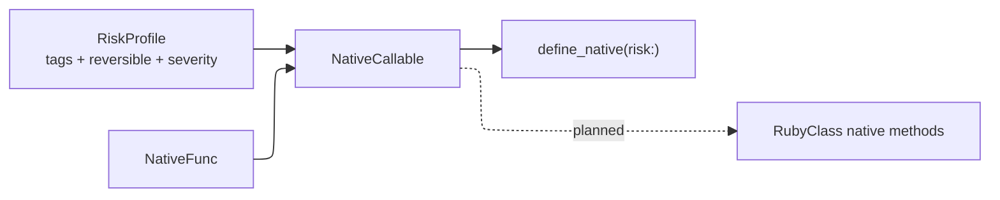

`RiskTag` names *why* a call is risky (`ReadsFiles`, `WritesFiles`, `DeletesFiles`, `Recursive`, `ExecutesCode`, `NetworkEgress`, `ElevatedPrivilege`, `ModifiesEnvironment`). `Reversibility` (`Yes`/`No`/`Depends`) and `Severity` (`Info`/`Warning`/`Error`) are *conclusions* drawn from those tags.

Tags are the reason; reversibility and severity are consequences — a `RiskProfile` with no tags must be `Reversibility::Yes` and `Severity::Info`. Setting either otherwise on an empty-tag profile raises immediately, by design: it means a `RiskTag` is missing, not that the fields should be set freely.

```crystal
# Pure — the default, no need to state it explicitly.
interp.define_native("square") { |args| ... }

# Effectful:
interp.define_native("delete_file",
  risk: Adjutant::RiskProfile.new(
    tags: Set{Adjutant::RiskTag::DeletesFiles},
    reversible: Adjutant::Reversibility::No,
    severity: Adjutant::Severity::Error,
  )) { |args| ... }
```

`Reversibility::Depends` requires a `note` explaining the call-site condition that determines it (e.g. a flag toggling in-place writes) — this can't be resolved statically and is treated as "escalate and ask" until argument-level analysis exists.

`NativeCallable` pairs a `NativeFunc` with its `RiskProfile` and is the shared representation for any Crystal-implemented callable — `ScriptModule` functions via `define_native`, and `RubyClass` native methods for base types (`Integer`, `Float`, `NilClass`, `TrueClass`, `FalseClass`, `Symbol`, `String`, `Array`, `Hash`) — so a risk-manifest walker has exactly one place to look regardless of whether a call resolves to a required module or a base type's method.

#### Structured risk: RiskNode and RiskAggregator

A flat union of `RiskProfile`s across a script loses conditionality: an `if`/`else` with a safe branch and a destructive branch would merge into one tag set, as if both could happen in one run. `RiskNode` (`risk_node.cr`) mirrors the AST's control-flow shape instead, so aggregation respects it.

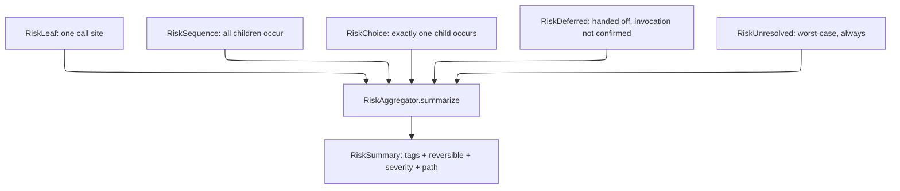

- `RiskSequence` — straight-line code and loop bodies (`iterated: true` for the latter, since a script can't generally know its own iteration count statically). Aggregates by union: all children's tags apply, severity/reversibility take the worst single child.
- `RiskChoice` — `if`/`elsif`/`else`, `case`/`when`, rescue clauses. Aggregates by taking the **single worst-case branch**, not a union — `origin` (`"if"`, `"case"`, ...) is preserved so the summary's `path` names which branch caused it.
- `RiskDeferred` — a `Lambda` literal or constant-held lambda passed as a call argument (see the `RiskWalker` node-coverage table below). Wraps the lambda's own walked-body risk, but unlike `RiskSequence`, the wrapped risk isn't confirmed to run — the callee MIGHT invoke it, or might not, and the walker can't see into the callee's own body to tell. Deliberately aggregated at the child's FULL severity (same philosophy as `RiskUnresolved` always ranking worst-case below — this project treats "can't confirm" as a reason to surface loudly, not a reason to under-report), with the path prefixed `"deferred: <reason>"` so presentation can still distinguish "this will happen" from "this was handed off, invocation not confirmed."
- `RiskUnresolved` — a call site the walker couldn't statically resolve. Always ranks worst-case (`Severity::Error`). Should be rare, since dynamic dispatch is a forbidden language feature (see below) specifically to keep every call site staticaly resolvable; a common `RiskUnresolved` is a signal something needs fixing in the walker or the forbidden list, not a case to silently downgrade.

`RiskAggregator.summarize(node) : RiskSummary` walks a tree once and returns the single worst-case path through it — not every possible path, since presentation needs one concrete story ("this script may delete files if the `--force` branch is taken"), not a combinatorial list.

`RiskAggregator.all_findings(node) : Array(RiskFinding)` is the complementary entry point: every `RiskLeaf`/`RiskUnresolved` anywhere in the tree, each with its own `branch_path` (which `Choice` branches led there) and `iterated?` flag — not collapsed to one worst-case story. `RiskAggregator` takes no view on presentation; a host UX groups, filters, or sorts `RiskFinding`s itself (e.g. dedup repeated calls to the same function, or show only `Severity::Error` entries).

#### TypeInference

A `Call` node can only resolve to a `NativeCallable`/`ScriptProc` if its receiver's class is known. `TypeInference` (`type_inference.cr`) infers this statically, without running the script — a minimal pass, not full type inference.

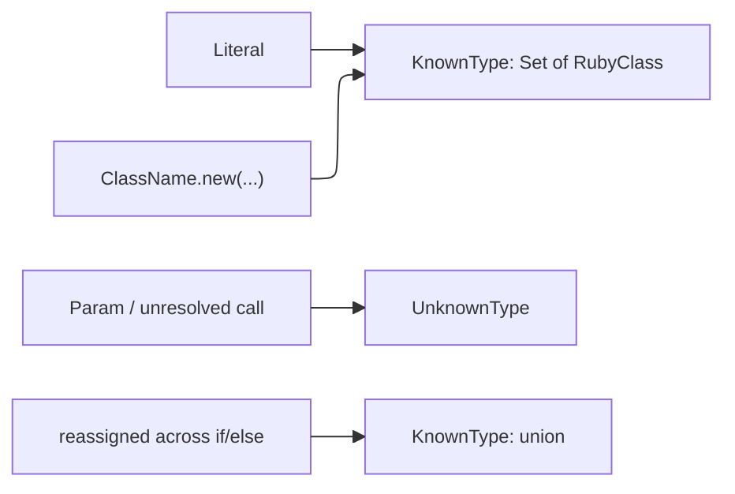

`TypeHint` (`type_hint.cr`) mirrors `RiskNode`'s sum-type reasoning: a local var reassigned a different known type in each branch of an `if`/`case` is a real union, not an inference failure — only genuinely untraceable values (params, unresolved call returns) are `UnknownType`. Loops merge the same way, treating "ran 0 times" vs. "ran once" as a 2-way branch.

#### RiskWalker

`RiskWalker` (`risk_walker.cr`) builds the actual `RiskNode` tree from a parsed `Body`, using `TypeInference` to resolve each `Call`'s receiver. The walker never runs `interp.eval` — it only parses and walks, so it must discover `def`/`class`/`module` declarations itself as it goes, rather than relying on the interpreter's already-executed globals.

The diagram below covers `Call` receiver resolution specifically — `walk_call`'s full picture also unconditionally walks every argument and receiver expression, and folds in a `BlockNode`/wraps a `Lambda`-literal-argument `RiskDeferred`, before combining with whichever receiver-resolution path below applies; see the node-coverage table further down for those.

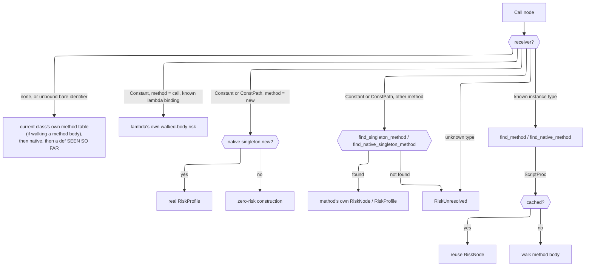

**Def/class discovery follows the same order rule the VM's linear execution would.** A top-level `def`/`class`/`module` is only visible to calls *after* it in the walk — a call before its definition is `RiskUnresolved`, matching the `NameError` the same script would raise at runtime. This is a deliberate design choice, not an accident of implementation: the walker never executes anything, so there's no "hoisting" pass to fall back on, and mirroring the runtime's own order sensitivity keeps the assessment honest about what would actually run.

The one place order does NOT matter is **calls between a class's own methods**: a method body is only ever invoked after `.new`, by which point the whole class body has finished executing and every method is registered — so `walk_class` walks a class body's bare statements in order (registering `def`s and running any non-`def` statement immediately, same rule as top-level) while method bodies themselves (walked lazily via `walk_script_method`, on first call) always see the class's final, complete method table regardless of source order within it.

`walk_class`/`walk_module` register three different statement shapes into three different places, mirroring how the VM itself would: a plain `def` into `methods`, `def self.foo` (a `SelfNode` receiver — see "Script-defined singleton methods" above) into `singleton_methods`, and a nested `class`/`module` statement into the ENCLOSING class's own `constants` table via `walk_nested` — this last one is what makes `M::A` resolvable as a `ConstPath` afterward; without it, `A` would only be reachable in the walker's flat `@known_classes` map by its bare name, not through `M` specifically, which is not how Ruby scoping actually works.

**`ClassName.new` (or `M::A.new`) resolves to a real `RiskLeaf`, not unconditional zero risk, when the class registered a native singleton `new`** (see "Native singleton methods" above) — `walk_constructor_call` checks `find_native_singleton_method` the same way `resolve_on_class` checks `find_native_method` for an ordinary receiver call. A class with no native `new` still resolves construction as zero risk, matching prior behavior for the common (script-`initialize`-only) case.

**Any other `ClassName.method` or `M::A.method` call resolves against the class's own singleton tables**, not its instance tables — `walk_class_receiver_call` checks `find_singleton_method` then `find_native_singleton_method`, mirroring the VM's dispatch fix for the same distinction (a `RubyClass` receiver is never looked up in `find_method`, which is for instances of that class). `.new` keeps its own dedicated sub-path above rather than going through this generic one, since it alone has an always-available fallback when nothing is registered. A bare `Constant` receiver resolves directly via `resolve_class`; a `ConstPath` receiver (`M::A`, or deeper nesting) resolves via `resolve_const_path`, which walks the namespace chain through each resolved class's own `constants` table — the same non-lexical, direct-lookup semantics as the VM's `Op::GetConstantFrom` (see "Constants are lexically scoped" above), NOT the lexical-parent walk a bare `Constant` reference would use.

`RiskWalker` keeps two of its own tables for this — `@top_level_procs` (defs seen so far) and `@known_classes` (classes built so far) — checked before falling back to `@interp`'s live state, which only reflects genuinely pre-existing things (builtins, or classes from a prior `interp.eval` in the host program). `TypeInference` gained two injectable resolvers so its own `ClassName.new`/`M::A.new` inference can see the walker's own not-yet-executed classes too, without `TypeInference` needing to know `RiskWalker` exists: `class_resolver : String -> RubyClass?` (bare names, defaulting to a live-global lookup) and `const_path_resolver : ConstPath -> RubyClass?` (namespaced paths, defaulting to the same namespace-chain walk `resolve_const_path` does, against `@interp`'s live state instead of the walker's own tables).

**Node coverage.** Every AST shape isomorphic to one already handled reuses the same `RiskNode` shape:

|AST node                                                                                     |Treated as                                                                                                                                                                                                                                                                                                                                                                                                                          |
|---------------------------------------------------------------------------------------------|------------------------------------------------------------------------------------------------------------------------------------------------------------------------------------------------------------------------------------------------------------------------------------------------------------------------------------------------------------------------------------------------------------------------------------|
|`IfNode`, `UnlessNode`, `CaseNode`                                                           |`RiskChoice` — exactly one branch runs                                                                                                                                                                                                                                                                                                                                                                                              |
|`WhileNode`, `LoopNode`, `ForNode`, `ModifierWhile`                                          |`RiskSequence` with `iterated: true` (a `ForNode`'s loop variable(s) also declared `UnknownType` in the inner scope — see "Bare identifiers" below)                                                                                                                                                                                                                                                                                 |
|`ModifierIf`                                                                                 |`RiskChoice` of one statement vs. nothing                                                                                                                                                                                                                                                                                                                                                                                           |
|`BeginNode`                                                                                  |`RiskChoice(body, rescue)` wrapped in a `RiskSequence` with `ensure` — body/rescue are mutually exclusive, but ensure always runs afterward regardless of which (`rescue => e`'s exception variable is also declared `UnknownType` in the rescue scope)                                                                                                                                                                             |
|`ClassNode`, `ModuleNode`                                                                    |Body walked immediately (bare statements), nested `def`s registered onto a `RubyClass`/module being built                                                                                                                                                                                                                                                                                                                           |
|`Assign`, `OpAssign`, `CondAssign`, `MultiAssign`, `IndexAssign`                             |Value expression(s) walked for risk (not just inferred for type) — a risky call used as an initializer or right-hand side is never silently dropped                                                                                                                                                                                                                                                                                 |
|`Call`'s `args` and receiver expression                                                      |Each walked unconditionally (`walk_call_arg`/`walk_node`) — an argument or receiver expression runs synchronously at the call site regardless of what the callee does with its value afterward, so this is safe and certain, same footing as any other expression                                                                                                                                                                   |
|`BlockNode` (`{ }`/`do...end` attached to a `Call`)                                          |Folded unconditionally into that call's own risk, wrapped `iterated: true`, walked with the block's own params declared `UnknownType` in the *enclosing* env (real closure semantics — a block can read/write outer locals, unlike a method body's isolated scope) — `yield` inside the callee is a real, statically-visible invocation contract, so (unlike a `Lambda` passed as an argument, below) invocation itself is confirmed|
|`Lambda` literal, or a constant-held `Lambda` (`CONST = ->(){}`), passed as a `Call` argument|Walked eagerly (same memoized-by-identity treatment `walk_script_method` gives a `def`), wrapped `RiskDeferred` — invocation by the callee isn't confirmed the way a block's `yield` is, only possible, so folding it in unconditionally would overstate risk                                                                                                                                                                       |
|`CONST.call(...)` where `CONST` is a known constant-held `Lambda`                            |Resolves directly to the lambda's own walked-body risk, no `RiskDeferred` — the invocation is confirmed, happening at this exact call site, not handed off elsewhere                                                                                                                                                                                                                                                                |

**Bare identifiers mirror the VM's own local-vs-call disambiguation rule, not a simpler "always a value read" assumption.** A bare name with nothing following it (`delete_file`, no parens/args/block) is genuinely ambiguous at parse time — the same ambiguity real Ruby has, which the compiler resolves via `scope.resolve_local`: a name already bound as a local wins; otherwise it compiles to `Op::GetGlobal`, which itself falls through to an implicit zero-arg method call attempt at runtime if no global/constant of that name exists (see "Constants are assign-once" above). `walk_identifier` mirrors this exactly using `env` (the walker's own equivalent of compile-time local scope — params, prior assignments, and the loop/block/rescue-variable declarations noted in the table above) via `env.has_key?(name)`: present means a real local read (no risk of its own); absent falls through to the same `walk_bare_name_call` helper an explicit `foo()` call already used, so both forms resolve identically. This was a genuine, previously-silent gap (found via the person's own testing) — before this, EVERY bare identifier was treated as a harmless value read regardless of whether a same-named callable actually existed, so a risky function called without parens was invisible to static assessment while the parenthesized form was correctly caught.

**A bare call also resolves against the CURRENT class's own method table first, when walking a method body**, not just native functions/top-level defs — `@current_self_class` (and `@current_self_is_singleton`, since a singleton method body resolves bare sibling calls against a different table pair than an instance method body does) is set for the duration of `walk_script_method`'s body walk, save/restored the same way `@in_progress` already is, so a class's own methods calling each other bare (`def first; second; end`) resolve correctly regardless of definition order — matching the VM's own real dispatch order (`obj.rclass.find_method` checked before anything else for an instance-method implicit-self call), which already walks the ancestor chain up to `Object`, so this one check subsumes native-function/top-level-def resolution too for anything already registered there.

Two things worth calling out beyond node coverage:

- **Method bodies are memoized by `ScriptProc` identity**, walked once using only their own parameter scope — not the caller's inferred argument types. This is correct for memoization (a method's risk can't depend on which call site happens to invoke it) but is a real precision loss: **`def process(f); f.read; end` always sees `f` as `UnknownType` inside `process`**, regardless of what any call site passes, so `f.read` resolves as `RiskUnresolved` even when every caller passes a known `File`. Fixing this properly means adding real parameter type declarations to the language (more Crystal-like, less Ruby-like) — not a bigger inference pass, since the ambiguity is inherent to having no per-method contract at all. The one narrow exception: a `Lambda` bound to a CONSTANT (`F1 = ->(){}`) is resolvable regardless of how it's later referenced, not because of parameter-type inference but because `Op::SetConstant` enforces assign-once at runtime (see "Constants are assign-once" above) — the walker can trust `F1` never silently became something else, so `F1.call(...)` resolves directly and `F1` passed as an argument resolves via `RiskDeferred`. An ordinary (non-constant) variable holding a lambda gets no such treatment — genuine aliasing, same `UnknownType` fate as `f` above.
- **Recursion** gets the same treatment as loops: a `ScriptProc` already being walked (direct or mutual recursion) short-circuits to a plain `RiskLeaf` instead of re-descending, so the walker always terminates.

`ScriptProc` carries an optional `ast_body`/`ast_params` (set by the compiler at `compile_def`) purely so `RiskWalker` can walk a method's real control-flow shape — the VM itself never reads these fields. `RiskWalker` also builds throwaway `ScriptProc`s (empty `Chunk`, real `ast_body`) for the `def`s it discovers itself — never executed, only walked.

A worked example: `samples/assess_script.cr` parses a script file (never running it) and prints both `RiskAggregator.summarize`'s worst-case path and every `RiskAggregator.all_findings` entry; `samples/scripts/risky_example.rb` exercises the `if`/`while`/def-discovery paths together.

## Forbidden and out-of-scope features

Some Ruby-like features are intentionally excluded — either because they'd break static risk assessment, or because they're a deliberate scoping cut. Anyone tempted to add one of these should read this first.

- **Dynamic dispatch by computed method name** (`send`, `public_send`, `method_missing`, `define_method` with a runtime-computed name). `Call#method` in the AST is always a literal `String`; keeping it that way is what makes every call site staticaly resolvable to a `NativeCallable`/`ScriptProc` for risk aggregation. If this ever changes, `RiskUnresolved` (see above) is the fallback — but the goal is for it to stay rare.
- **`eval`/`instance_eval` on runtime strings.** Same reasoning — a script that can construct and run arbitrary code at runtime has no static risk profile at all.
- **Reflection that exposes native/Crystal internals** (e.g. arbitrary FFI, `ObjectSpace`-style introspection). Not yet needed for anything on the roadmap, and it would let a script route around the effect boundary (`EffectHandler`/`ModuleRegistry`) entirely.

This list should grow as new features are proposed — the test is always "does this let a call site's target or effect become unknowable before running the script."

The three above are excluded because they'd break static analysis — no amount of implementation effort makes them safe to add. The following are a different kind of exclusion: real Ruby features that are simply out of scope, cut as a deliberate scoping decision rather than a static-analysis hazard. Revisiting one of these is a normal scoping conversation, not a "this breaks the model" one.

- **`Class.new`/`Module.new`** — dynamically defining a class or module at runtime (optionally with a block as its body). Cut when designing the `Object`/`Class`/`Module` bootstrap: it would need a native singleton `new` on `Class` capable of executing an arbitrary block as a class body, which is materially harder than the rest of that bootstrap and wasn't needed by anything driving the base-types work. `class Foo; end` (the literal, static form) is unaffected.

## Not yet implemented / known missing

Known gaps and not-yet-implemented features (beyond the risk-model exclusions above) are tracked in [SCOPE.md](./SCOPE.md), which includes "Must Fix", "Will Fix" and "Won't Fix" items.
