# Development Guide

This document explains how `adjutant` works internally. It is written for contributors and maintainers who need to understand, debug, or extend the library.

## Dependencies

1. Make sure you have `ops` installed, in one of the following ways:
    - as a gem via `gem install ops_team` or
    - as a tool via `brew tap nickthecook/crops && brew install ops`
2. If you not using macOS, or a Linux that uses `apt`, please [install Crystal](https://crystal-lang.org/install/)

## Getting started

Command                        |Description                                                                       
-------------------------------|----------------------------------------------------------------------------------
`ops up`                       |Gets everything setup including `crystal` via `apt` or `brew` if applicable.      
`ops build-debug` or `ops bd`  |Make a debug build of `benchmark` sample, in `bin/debug` folder.                  
`ops build-release` or `ops br`|Make a release / production build of `benchmark` sample,  in `bin/release` folder.
`ops lint`                     |Run `ameba` on the source code                                                    
`ops clean`                    |Remove debug and release build files                                              
`ops wipe`                     |In addition to cleaning, remove all compiler caches                               
`ops test_specs`               |Run Crystal test specs.                                                           
`ops test_scripts`             |Build test script runner and run the test scripts                                 
`ops test`                     |Run test specs, test scripts, and linter.                                         

### Run samples

#### Sample `run_script`

The sample `run_script.cr` runs a script end to end through both risk layers: a static risk assessment pass before execution, then live risk flow (dynamic IFC) enforcement during execution, with an `IO.gets`-based approval prompt for any `Ask` decision. See the sample's own comments for how its native module (`read_file`, `fetch_url`, `delete_file`, `post_data`) labels data and declares sensitivity. `remove_path` and `configure` demonstrate native keyword arguments specifically (see "Native keyword arguments" above) — `remove_path(path:)` is risk-tagged and all-keyword (no positional args at all), `configure(timeout:)` is a plain, non-risky example of the self-serve-default convention. `samples/scripts/risk_static/risk_static_kwargs.rb` and `samples/scripts/risk_flow/risk_flow_kwargs_*.rb` exercise them through both risk layers.
- Run `ops build`, then
- run `bin/debug/run_script samples/scripts/risk_flow_ask.rb`

You'll see a static assessment summary first (the `RiskTag`s the script's calls could trigger, independent of any data), then the script actually running — pausing to prompt you for a decision when it reaches the call that triggers `RiskFlowAction::Ask`. Try the other `samples/scripts/risk_flow_*.rb` scripts too: `risk_flow_allowed.rb` runs straight through with no prompt, `risk_flow_reject.rb` demonstrates a hard policy rejection *and* a live `Ask` in the same run, and `risk_flow_declared_literal.rb`/`risk_flow_declared_variable.rb` show `declare_sensitivity` catching a risky call that carries no propagated label at all (see "Information flow control (risk flow)" below for why that's a separate mechanism from label propagation).

Plain scripts with no native calls (e.g. `samples/scripts/fib_10.rb`) still work the same as before — the static assessment reports no tags, and execution proceeds with no risk flow interruptions.

#### Sample `assess_script`

The sample `assess_script.cr` shows an example of how to load and assess the risk of a script and present the risk assessment.
- Run `ops build`, then
- run `bin/debug/assess_script samples/scripts/risky_example_01.rb`

You should receive the following output:

```
=== Risk assessment: samples/scripts/risky_example_01.rb ===

Worst case: Error / reversible=No
Tags: NetworkEgress, DeletesFiles
Path: fetch_url -> if branch -> delete_file

All findings (3):
  line 13: fetch_url (iterated) — Warning, tags: NetworkEgress
  line 5: delete_file [if branch] — Error, tags: DeletesFiles
  line 7: puts_args [if branch] — Info, tags: none
```

## How Adjutant works

Adjutant is a bytecode interpreter for a Ruby-like scripting language. Its design is shaped by four goals: safe execution of untrusted scripts, a clear and auditable effect boundary, syntax familiar to LLMs trained on Ruby, and a foundation for information flow control.

### Pipeline overview

A script moves through five stages before producing a result:


```mermaid
---
displayMode: compact
config:
  layout: elk
  themeVariables:
    fontSize: 12px
---
flowchart LR
    src[Source IO]
    lex[Lexer]
    par[Parser]
    com[Compiler]
    vm[VM]
    val[Value]

    src --> lex --> par --> com --> vm --> val
```

Each stage produces a self-contained artifact — `Array(Token)`, `Body` (AST), `Chunk` (bytecode), and finally a `Value`. Stages are independently testable and the compiler and VM can be used without going through the full pipeline.

### Ownership and lifetime

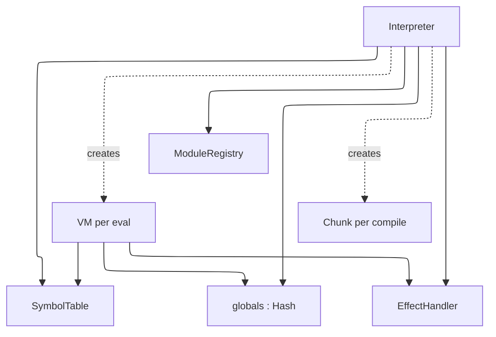
```mermaid
---
displayMode: compact
config:
  layout: elk
  themeVariables:
    fontSize: 12px
---
flowchart TD
    interp[Interpreter]
    sym[SymbolTable]
    reg[ModuleRegistry]
    globals[globals : Hash]
    ef[EffectHandler]
    vm[VM per eval]
    chunk[Chunk per compile]

    interp --> sym
    interp --> reg
    interp --> globals
    interp --> ef
    interp -.creates.-> vm
    interp -.creates.-> chunk
    vm --> sym
    vm --> globals
    vm --> ef
```

The `Interpreter` is long-lived and intended to span a full agent session. The `SymbolTable`, `ModuleRegistry`, and globals hash all persist across `eval` calls. A fresh `VM` is created for each execution but shares the interpreter's globals, so variables set in one `eval` are visible in the next.

### The Lexer

`Lexer` reads from an `IO` (eagerly into a `String` since random access is needed for peeking and lexeme slicing). It produces `Token` values carrying a `TokenKind`, lexeme string, line, column, and (since 2026-07-26) `space_before? : Bool` — whether whitespace or a comment immediately preceded this token. The source string is UTF-8 via Crystal's native `String`/`Char` handling — string and comment content in any language passes through verbatim. Identifier scanning uses `ascii_alphanumeric?` by design, so identifier names are currently ASCII-only.

`space_before?` is set once per token: `Lexer#skip_whitespace_and_comments` now returns whether it actually consumed anything (space/tab/`\r`, or a `#` comment — a comment counts as space here, since a comment always runs to end-of-line and a real `Newline` token still follows separately), and `next_token` stashes that into a `@space_before` ivar for `make_token` to attach to whichever token gets scanned next. An ivar rather than a threaded parameter, deliberately — the alternative was passing the bit through every `scan_*`/`make_token` call site (30+), a far larger, noisier diff for the same result; safe as instance state because it's write-once-then-read within a single `next_token` call, same lifecycle as the `line`/`col`/`start` locals already used there. A `Newline` token is a real exception worth knowing about: `\n` is consumed directly by `next_token`'s own `c == '\n'` check, never by `skip_whitespace_and_comments`, so a `Newline` token itself never reports `space_before? == true` regardless of what preceded it on the line, and — because nothing then ran `skip_whitespace_and_comments` to produce it — the token immediately *after* a `Newline` also starts fresh with `space_before? == false` unless something else precedes it. `continue_interp_string` (resuming a string body right after an interpolation's closing `}`) is a separate code path from `next_token`'s normal flow and explicitly resets `@space_before = false` itself rather than risk leaking whatever the `}` token happened to carry.

This one field replaced several bespoke, ad-hoc reconstructions of the same fact the parser had been doing after the fact via column arithmetic — see "Adjacency, lexer state, and `Token#space_before?`" under The Parser below for the design conversation and what it replaced.

#### `%w[]`/`%i[]` and heredocs

Added 2026-08-19 (SCOPE.md's top Must Fix entry at the time) — before this, neither existed anywhere in `lexer.cr`/`token.cr`.

`%w[...]`/`%i[...]` are a single lexer-level scan (`scan_percent_literal`): the raw body between the delimiters becomes one `TokenKind::PercentWords`/`PercentSymbols` token, with bracket-pair delimiters (`()`, `[]`, `{}`, `<>`) nesting and any other same-char delimiter (`%w|a b|`) not, matching real Ruby. The parser (`split_percent_literal`) splits that raw body into words on whitespace, honoring a backslash as "keep the next character literally, don't split here" — the only escaping real `%w`/`%i` recognize — and builds an ordinary `ArrayLiteral` of `StringLiteral`/`SymbolLiteral`. Only `%w`/`%i` are supported; the interpolating `%W`/`%I` forms and the general `%q`/`%Q`/`%r` forms are a real, separate gap.

Heredocs (`<<ID`, `<<-ID`, `<<~ID`, each optionally `'ID'`/`"ID"`-quoted) are resolved **eagerly**, in full, the moment the opener is scanned (`scan_heredoc_opener`) — header, body, and terminator all in one call — because the STRING token they produce belongs at the opener's own grammatical position even though its body text sits physically later in `@source`. Concretely:

- The opener's own header (`<<`/`~`/`-`/quote/identifier) is consumed normally, advancing `@pos` as usual.
- The body and terminator are located via **pure `@source` indexing** — no cursor movement — so the caller (the outer `scan()` dispatch) can go on to scan the *rest of the current physical line* completely normally once `scan_heredoc_opener` returns (e.g. `foo(<<~ID, x)` scans `, x)` the ordinary way).
- The extracted body (dedented, for `<<~`) becomes either a single literal `String` token (single-quoted heredocs — wrapped in synthetic `'...'` so the parser's existing `decode_single_quoted_escapes` applies unchanged) or, for an interpolating body, is handed to a **throwaway sub-`Lexer` instance** (`Lexer#heredoc_body_tokens`) whose entire `@source` *is* that body text — this reuses the exact same `StringPart`/`InterpEnd`/`StringEnd` interpolation machinery `"..."` strings already use (a new `InterpKind::Heredoc` + `continue_interp_heredoc`, differing only in that end-of-source is the terminator instead of a closing `"`). Because the result is the same token shape `parse_interp_string` already consumes, **no parser changes were needed for heredoc content itself**.
- Since the physical body+terminator block has already been fully consumed this way, it must not be lexed again as ordinary top-level code once the cursor naturally reaches it. `@pending_heredoc_skip_at`/`_to_pos`/`_to_line` record where to jump: when `next_token_inner` consumes the newline that starts that block, it jumps straight past it instead of continuing into it. `@pending_tokens` queues the rest of a multi-token (interpolating) heredoc body for `next_token_inner` to drain before scanning anything else.

`<<~`/`<<-` are unambiguous heredoc openers (real Ruby has no other meaning for `<<~`/`<<-`); bare `<<ID` additionally requires an uppercase-or-quoted identifier AND the same "previous token can't end an expression" condition `regex_starts_here?` already uses for `/` — the same scoped, previous-token-only approximation of real Ruby's expr-beg parser state, not full tracking.

**Scoped limitation, not yet lifted:** only one heredoc opener is supported per physical line. Real Ruby allows stacking several (`foo(<<~A, <<~B)`), each consuming its own body block in order; this design's eager single-opener resolution doesn't extend to that case. Rare enough in practice that it wasn't blocking — see `SCOPE.md` if a script ever needs it.

### The Parser

`Parser` is a hand-written recursive descent parser with a Pratt loop for expression precedence. It consumes tokens from a `Lexer` and produces an `Body` — the root of the AST. AST nodes are Crystal classes rooted at `abstract class Node`, each carrying source position. The parser handles the full Ruby-like grammar including interpolated strings, blocks, modifier forms (`x if cond`), multi-assignment, and keyword arguments.

Bare calls without parentheses (`puts x`) are supported for literals, identifiers, and constants as the first argument (`arg_follows_no_paren?`) — covers `puts x`, `assert_equal add(3, 5), 8`, `raise SomeError`. A leading unary `-` is not yet handled as an argument start (ambiguous with a bare identifier reference minus something).

**`identifier [expr]` disambiguation (indexing vs. bare call).** Fixed 2026-07-21 — previously `arg_follows_no_paren?`'s allowlist simply lacked `TokenKind::LBracket`, which made `assert_equal [3, 9, 16], ar` unparseable (see SCOPE.md's former entry for the original symptom trace). The actual fix needed more than adding the token kind, because `name [expr]` is a genuine ambiguity in Ruby's own grammar — is `[expr]` indexing `name`, or is `name` a call taking `[expr]` as its first argument? Real Ruby resolves this purely from whether `name` was already established as a local *earlier in the currently open scope*, decided once at parse time with no runtime fallback (confirmed via a series of `irb` experiments: `c = 5; c [1]` dispatches to `Integer#[]`; `d = true; d [1]` raises `NoMethodError` rather than a parse-time or variable-lookup error; `totally_undefined [1,2,3]` raises `NoMethodError` for `'totally_undefined'` itself, proving it parsed as a *call*, not an attempted index of a nonexistent variable; and running `module A; c = [1,2,3]; c [1]; end` twice in the same session, with a fresh `c [2]` reference in the second run, shows the tracking is purely syntactic to one parse — no residual runtime binding carries over).

`Parser` now carries its own `@local_scopes : Array(Set(String))` — a stack tracking which bare names have been assigned or bound as a parameter so far in the current parse. `def`/`class`/`module` bodies push a **fresh, empty** scope (matching real Ruby: none of these close over the enclosing scope's locals). Block and lambda bodies push a scope that **inherits** a copy of the enclosing one (blocks/lambdas do close over outer locals in Ruby) — a copy, not a live reference, so a name newly assigned inside the block doesn't leak back out. `for`-loop variables and `rescue`-bound variables register directly into the *current* scope with no push/pop at all, since neither construct opens its own scope in Ruby (both remain valid locals after the construct ends). At `identifier [`, `parse_identifier_or_call` checks `known_local?(name)` against the top of this stack: known → falls through to a bare `Identifier`, letting `parse_postfix`'s existing `LBracket` case build an `Index` node as normal; unknown → parses `[...]` as an `ArrayLiteral` first argument to a bare `Call`, same as any other bare-call argument.

This is deliberately a much shallower mechanism than `CompilerScope` below, existing a full phase earlier, purely to answer one narrow parse-time question ("is this name known as a local yet") the same way Ruby's own parser does — it does not replace or duplicate `CompilerScope`'s actual scope/slot resolution, and does not need to handle every case `CompilerScope` does (e.g. it has no notion of `ivars`/`cvars`/constants at all, since those never participate in this specific ambiguity — `@ivar [0]`/`CONST [0]` are lexically unambiguous already, no bare-identifier lookup involved).

**Unary minus + adjacent numeric literal fusion.** Fixed 2026-07-25 — found by the person via mruby's `spec/scripts/mruby/float.rb` fixture (`-0.0.to_s` raised `cannot negate 0.0 (String)`: `.to_s` ran first, on positive `0.0`, and only then did negation try to apply to the resulting `String`). This is NOT a general "unary minus binds tighter than postfix" question — that would be wrong, and would incorrectly change `-a.to_s` (`a` a variable) too, which real Ruby parses as `-(a.to_s)`, same as Adjutant's unchanged behavior for that case. The actual rule, confirmed via Ruby's own `parse.y` grammar (a distinct lexer-level token, `tUMINUS_NUM`, for `-` immediately adjacent to a digit) and empirically in `irb` (`-0.0.to_s` → `"-0.0"`, fused; `- 0.0.to_s` → `"0.0"`, i.e. unary-minus-of-the-call-result; `4-3.to_s` → ordinary binary subtraction, `TypeError`, completely unaffected): a `-` with **no whitespace** immediately before a numeric literal token fuses into that literal itself, before any postfix chain applies — whitespace, not operand shape, is what actually distinguishes fusion from the general `Unary`-wraps-postfix case, since `-2.upto` and `- 2.upto`/`-a.to_s` are different parses of superficially similar-looking source.

`Parser#parse_unary`'s `TokenKind::Minus` branch checks column-adjacency (`current.column == minus_column + 1`, since `-` is always exactly one character — tokens don't carry a dedicated whitespace-preceding flag, so column arithmetic stands in for it) against an immediately-following `Integer`/`Float` token. On a match, it builds the fused literal by prepending `-` directly to the literal's own lexeme string (`IntLiteral`/`FloatLiteral` already store the raw, unparsed lexeme — `compile_int` parses it via `to_i64` at compile time; `compile_float` similarly, though not via a raw `to_f64` call — see "Float literal underflow/overflow" below) and applies `parse_postfix` to that literal directly — giving `(-0.0).to_s` its correct grouping "for free," the same way the `identifier [expr]` fix above makes indexing "free" once the right node is built. Every other case — a space before the literal, a variable, a call result, a parenthesized expression — is entirely unaffected and still produces the original `Unary(Minus, ...)` node, now compiled via the pre-existing `Op::Neg` exactly as before.

**Bare call with a negative-literal (or unary-minus) first argument.** Fixed 2026-07-25 — found by the person: `eq -1, -1` (no parens, `eq` a plain 2-arg method) raised a parse error, since `Parser#arg_follows_no_paren?`'s allowlist had an explicit `false` for `TokenKind::Minus`, marked with a long-standing `# REVISIT` comment asking exactly this question. `eq(-1, -1)` (parens) already worked, confirming the gap was specific to the no-paren bare-call path — `eq` parsed as a standalone `Identifier` with nothing after it, then `-1, -1` was parsed completely separately, producing an "unexpected token Comma" once the second `-1`'s comma had nowhere valid to go.

A first attempt keyed the fix off `known_local?` — the same disambiguator the `identifier [expr]` fix above already uses correctly — reasoning that `eq` (unknown) should mean "bare call" while a known local should mean "binary operator." This was WRONG, caught via two pre-existing specs breaking before the fix shipped: plain `a + b`/`a - b`, where `a` is NOT a known local (never assigned, not a parameter), must still parse as `Binary`, not `a(-b)`. Confirmed precisely via a real Ruby session: `def a; 999; end; def b; 111; end; p a + b` → `1110` — both `a` and `b` get called with zero arguments, THEN added; and separately, `def a; 999; end; p a -1` → `ArgumentError: given 1, expected 0` — proving this specific shape parsed as `a(-1)`, a one-argument call, even though `a` has exactly the same "not a known local" status as the `a + b` case that must NOT be a call. `known_local?` cannot distinguish these two cases from each other at all — the real disambiguator is something else entirely: whether the operator is immediately adjacent (no whitespace) to its operand. `a - b` has a space on both sides of `-`; `a -1`/`eq -1` has a space before `-` but none between `-` and the literal that follows it. This matches Ruby's own "`-' after local variable or literal is interpreted as binary operator, even though it seems like unary operator" lexer warning, which fires precisely for the space-before-none-after shape and documents that Ruby's default in that case is binary.

`Parser#parse_identifier_or_call` therefore has its own dedicated `Minus`/`Plus`-handling branch (checked before the generic, name-agnostic `arg_follows_no_paren?` fallback, which still exists solely for `parse_raise`'s `raise -1` — a keyword call site with no ambiguity at all, since `raise` can never be a local), guarded by `signed_literal_starts_bare_call?` (originally `operand_immediately_follows?` alone, Minus-only — see below for the full history of how this branch evolved, including a second wrong design found after the one described above). No `known_local?` involvement at all for this branch; adjacency alone decides it.

**Adjacency, lexer state, and `Token#space_before?`.** As of the previous entry, three whitespace-sensitive parsing rules existed (minus-literal fusion, the Minus-only bare-call branch above, and — not yet fixed — unary `+`'s identical ambiguity and a bare call whose first argument is itself parenthesized, `eq (6/3), 2`), each reconstructing "was there space here" a different way (column-adjacency math in two places, nothing at all for the third). This prompted a design conversation, parked in `SCOPE.md` for a session, about whether to keep patching this piecemeal in the parser or give the lexer real state instead — closer to how MRI/mruby's own lexer actually resolves these ambiguities (an `EXPR_BEG`/`EXPR_ARG`-style `lex_state` plus a `space_seen` flag, updated per token).

Resolved 2026-07-26: the person chose to try the lexer-state route, and it turned out to be a small change rather than the large one "give the lexer `EXPR_BEG`/`EXPR_ARG`-style modal state" implied — none of Adjutant's three ambiguities actually needed lexer *mode*, only same-line whitespace adjacency. `Token` gained one new field, `space_before? : Bool` (see The Lexer section above for how the lexer populates it). All three ambiguities were then re-expressed directly in terms of it:

- `operand_immediately_follows?` (used by the Minus/Plus branch above) is now simply `!@next.space_before?` — no column arithmetic.
- The minus-literal-fusion check in `parse_unary` (previous entry) is now `!@current.space_before?` on the literal token itself (since `advance` has already consumed the `-` by that point) — same idea, same call site, no column arithmetic.
- `eq (6/3), 2` (previously an outright parse error — `parse_identifier_or_call`'s original `if at_kind?(TokenKind::LParen)` had no lookahead beyond "is the current token `(`" at all, so it always assumed the paren was the identifier's own call-argument-list syntax) is fixed by requiring `!@current.space_before?` there too: a space before `(` now falls through to `arg_follows_no_paren?`, which already treats `LParen` as a valid bare-call argument-start token, so `(6/3)` gets parsed as a normal parenthesized sub-expression and becomes `eq`'s first argument. Confirmed via Ruby's own issue tracker (bugs.ruby-lang.org/issues/20922) that `assert_equal (-1), minus_one` — the same shape — is valid, working Ruby.

**Unary `+` shipped in the same pass**, since once `Token#space_before?` existed, extending the Minus-only branch to also cover `Plus` needed no new mechanism — Ruby's own unary-vs-binary ambiguity for `+` follows the identical adjacency rule as `-` (both are covered by the same "space before but not after" warning class in Ruby's own parser). The combined condition — `(Minus or Plus) && @current.space_before? && operand_immediately_follows?` — was extracted into its own `signed_literal_starts_bare_call?` predicate specifically to keep `parse_identifier_or_call`'s cyclomatic complexity under Ameba's threshold once the condition grew a second clause (Ameba flagged `[11/10]`); no behavior change, purely a readability/lint extraction, same motivation as the earlier `parse_bare_call_args` extraction this same arc.

**A second wrong design, caught the same way as the `known_local?` one above — by a failing pre-existing test script, not a new spec.** The Minus/Plus branch's condition originally checked ONLY `operand_immediately_follows?` (no space *after* the operator) — carried forward unchanged from the Minus-only version, since it had passed every spec written for it (`eq -1`, `a - b`, `n - 1`). It never also required space *before* the operator, so `a-b`/`a+b` (no space anywhere) satisfied "no space after" exactly as much as `eq -1` does, and got misidentified as a bare-call start. This gap predates this session entirely — it was latent in the very first Minus-only fix, simply never exercised, since no spec had tried the no-space-at-all shape. `spec/scripts/methods.rb`'s pre-existing `def self.add(a,b); a+b; end` caught it immediately once the Plus branch shipped: `a+b` parsed as `a(+b)`, a bare call passing `+b` as an argument, so `a` — a real local parameter in scope — was looked up as a callable and raised `undefined method or variable: a`. Fixed by requiring `@current.space_before? && operand_immediately_follows?` together — space before the operator AND none after, matching the actual Ruby rule (confirmed: `a-b`/`a+b`, no space at all, is unambiguously binary in real Ruby, same as the spaced form — there's no bare-call reading of `a-b` at all). Regression specs for both no-space forms now sit in `operators/parser_spec.cr` alongside the pre-existing spaced-form coverage.

The `eq (6/3), 2` fix deliberately did NOT extend to `parse_raise`/`parse_super`, which have the identical unconditional `LParen` pattern — flagged in `SCOPE.md`'s `Will Fix` instead of fixed alongside, since neither was the reported bug and fixing them too would have silently widened that session's scope.

**Float literal underflow/overflow.** Fixed 2026-07-25 — found by the person via mruby's `spec/scripts/mruby/float.rb` "Float literal underflow" regression (`1.0e-400`, `9.99e-344`, and a 41-digit-mantissa `-92170141183460469231731687303715884105729e-383` must all round cleanly to a signed `0.0`, per IEEE-754 and mruby's own float parser — Crystal's `String#to_f64` instead raised `ArgumentError: Invalid Float64`). `#to_f64?` (the nilable variant) doesn't help on its own: confirmed empirically (asked the person to check directly, since this can't be observed from a clone-only workspace) that it returns a bare `nil` for all three, with no signal about which direction the range was exceeded or what the correctly-rounded result should be.

`Compiler#compile_float` therefore computes the lexeme's TRUE base-10 exponent itself first, via plain string/integer arithmetic (`true_decimal_exponent` — no float parsing involved, so no range concerns of its own): the exponent of the most-significant mantissa digit, combined with any explicit `e`/`E` suffix — critically, combined, not just read off the suffix alone, since a 41-digit mantissa's own magnitude (exponent ~40) has to fold into whatever explicit exponent follows it, or a literal like the one above would be misjudged as ~40 orders of magnitude closer to representable than it actually is. Literals whose true exponent falls comfortably inside Float64's real range (approximately -323.3 to 308.25, per `Float64::MIN`/`Float64::MAX`) go through `to_f64?` as normal, with any surprise `nil` there (e.g. a literal that lands just inside the deliberately-generous safety margin but is still genuinely out of range — found and fixed as a real edge case while implementing this, not merely theoretical) falling back to the same signed-zero/signed-`Infinity` logic used for the unambiguously-out-of-range case. An all-zero mantissa (`"0.0e400"`) is special-cased before any of this — checked directly rather than left to the general exponent calculation, which would otherwise treat it the same as a genuine leading-zero run and misjudge it as a large *positive* exponent, incorrectly routing a literal that's mathematically zero into the overflow branch.

**`$name` globals** (Ruby's special global-variable sigil, distinct from a `def`/top-level-assignment global living in `@globals`) are lexed (`TokenKind::GVar`) but have no parser, AST, compiler, or VM support — referencing one is currently a parse error. Not yet scoped to a chunk.

**A block/lambda param's default value (`|x = 9|`) failed to parse at all.** Found 2026-08-04, while adding unit-level test coverage for the (already-shipped) default-parameter binding fix below — `{ |x = 9| x }` raised a `ParseError` expecting `Pipe` but finding `}`. `Pipe` is both the block-param-list delimiter and a real binary operator (bitwise-or, `PRECEDENCE` 7), and `parse_param`'s default-value branch called the general `parse_expression(0)` with no way to tell those two meanings apart — it parsed `9`, then kept consuming past the closing `|` as if it continued a `9 | x` expression, running straight into the block body and eventually erroring on the stray `}`. Invisible for `def`-param defaults (never followed by `|`), and never caught earlier because nothing had exercised a default value on a *block* param specifically until this session's new specs tried it.

Fixed with `@no_pipe`, an instance flag in the same family as `@no_do_block` above: armed only for the duration of the single `parse_expression` call parsing one param's default (`begin @no_pipe = true; parse_expression(0); ensure @no_pipe = false end`), and checked as an unconditional early `break` at the top of `parse_expression`'s operator loop whenever the current token is `Pipe`, regardless of what `min_prec` would otherwise allow through. The identical latent bug existed in the neighboring keyword-argument-default branch too (`name: 9`) — its existing `Pipe` guard only covered an *empty* default (`name:` immediately followed by `|`), not a real expression — fixed the same way.

The one real subtlety: a default value can itself contain a nested block literal (`def f(g = xs.each { |y| y })`), and that inner block's own `|y|` and body have nothing to do with the outer param list — if `@no_pipe` simply stayed armed for the whole outer `parse_expression(0)` call, it would incorrectly suppress the inner block's `Pipe` handling too (both its own param-list delimiters, if the outer flag were checked there, and any bare `|` used as bitwise-or in its body). `parse_block` therefore saves and restores `@no_pipe` (not a hardcoded reset to `false`) around its entire body — both the `do...end` and `{...}` branches — so entering any block literal at any nesting depth always starts with the restriction lifted, then correctly resumes whatever the enclosing state was on the way out. `methods_and_calls/parser_spec.cr`'s `"blocks"` describe block covers this nesting case directly (a default value containing its own nested block with a bare `|` in the inner block's body), alongside the originally-failing shapes and the same fix in the kwarg-default branch.

Deliberately narrower than a general "suspend inside any bracket" mechanism: an unparenthesized bitwise-or directly inside a block-param default (`{ |x = a | b| }`) remains unsupported — nothing needs it, and matching real Ruby's own restriction here (which has the identical ambiguity) was judged lower-risk than adding paren/bracket-tracking for a case with no live use.

**`attr_reader`/`attr_writer`/`attr_accessor`.** Found 2026-08-08 as a real gap while writing a sample script for the (separately-shipped, same session) `dup`/`clone` work: all three had real lexer keyword tokens (`token.cr`) but zero parser handling — `attr_accessor :x, :y` raised `P002`, "can't start an expression here." `Parser#parse_attr` desugars each at PARSE time into the exact DefNode shape a hand-written `def x; @x; end` (reader) / `def x=(value); @x = value; end` (writer) would produce, for every `:symbol` name given — deliberately requiring a literal symbol per name (matching every real-world example, including this project's own `UNSUPPORTED.md` U009 entry) rather than a runtime-computed String, since a computed name couldn't desugar at parse time at all. Optional parens accepted (`attr_accessor(:x, :y)`), matching real Ruby's own optional-parens-on-any-call syntax even though this isn't a real method call here.

Returning N synthetic DefNodes from a single `parse_statement` call needed one more piece, not just the desugar itself: `parse_attr` wraps them in a `Body` (the same multi-statement-as-one-Node trick a class/def/module body is already built from), and `Parser#append_statement` — now the single choke point `parse` / `parse_body_until` / `parse_body_until_any` all route through — flattens a returned `Body`'s statements directly into the enclosing list rather than nesting it as one child. This flattening is load-bearing, not cosmetic: `RiskWalker#walk_class`/`#walk_module` (risk_walker.cr) specifically pattern-match `stmt.is_a?(DefNode)` on each of a class/module body's DIRECT statements to register it on the static class model those methods build (`register_class_method`) — a DefNode arriving one level deep inside a nested `Body` would silently fall through to the generic `else` branch instead (walked for risk, but never registered as a real method), producing a real vs. static-model divergence: the compiled bytecode (which dispatches `Body` generically via `compile_body`, with no flattening requirement of its own) would run an `attr_accessor`-defined method fine, while `RiskWalker`'s own model of the class wouldn't know it existed. Caught before shipping by tracing through `walk_class`'s exact dispatch, not discovered at runtime — see `append_statement`'s own comment in parser.cr for the full trace.

**`recv.attr = value` (attribute-assignment call syntax).** A second gap surfaced immediately by the `attr_accessor` work above — `attr_writer`/`attr_accessor` define a real `attr=` method, but nothing let a script actually CALL it via `recv.attr = value` syntax at all (`emit_store`, compiler.cr, only ever handled `Identifier`/`Constant`/`IVar`/`CVar`/`Index` targets; a `Call` target raised `C001`, "cannot assign to a method call," unconditionally). Fixed with a new dedicated AST node, `AttrAssign` (ast.cr), built directly by `Parser#maybe_assignment` when its `lhs` is a receiver-based, arg-less `Call` immediately followed by `=` — mirroring how `parse_postfix` already builds `IndexAssign` directly for `a[i] = v`, rather than routing through generic `Assign`. A dedicated node, not `Assign` wrapping a `Call`, specifically so the receiver expression compiles exactly ONCE: `emit_store`'s existing `Index` case (used only by `OpAssign`/`CondAssign`/`MultiAssign`, since plain `a[i] = v` has its own `IndexAssign` too) pushes in the OPPOSITE order from `compile_index_assign`'s own dedicated path, an existing, unrelated inconsistency noticed while working on this — copying that shape for attributes would have reproduced the same issue for a `Call` receiver with side effects (`get_config().name = x`) instead of avoiding it. `Compiler#compile_attr_assign` pushes `[receiver, value]` (receiver first, exactly once), and the new `Op::SetAttr` opcode calls the setter via `VM#call_method` — not a raw `dispatch_call` — specifically because it needs the setter's real return value in hand SYNCHRONOUSLY so it can be discarded in favor of pushing `value` back instead, matching every other `Set*` opcode's contract (an assignment expression's own value is what was assigned, never whatever the called method returns). `RiskWalker` gained a matching `walk_attr_assign` (flat `RiskSequence` over receiver and value, same shape as `walk_index_assign`); `TypeInference` needed no case at all, since `IndexAssign` itself already has none — both fall through to the same safe `UnknownType` default. Deliberately NOT extended to `OpAssign`/`CondAssign` on an attribute target (`obj.count += 1`) in this same pass — `emit_store`'s generic fallback still raises `C001` for that shape — see `SCOPE.md`'s new entry. `Op::SetAttr` needed no new risk-flow propagation logic of its own — a script-defined setter's own `Op::SetIvar` write already carries the assigned value's label correctly, and `Op::SetAttr`'s own `push(value)` passes the same `Value` struct through unchanged — but this went untested at the IFC layer specifically until `risk_flow_propagation_spec.cr`'s `Op::SetAttr` block and `risk_flow_enforcement_spec.cr`'s matching block (covering the case where `Op::SetAttr` reaches a *native* setter — dormant today, since no native `native_methods` entry ending in `=` exists yet, but a real, exercised path via the same `dispatch_call`/`call_native`/`check_risk_flow` chain everything else uses).

**`def name=(value)` (a hand-written setter method definition) had never actually been parseable at all.** Found 2026-08-08 — not while writing `attr_accessor` itself, but while writing a TEST for the `AttrAssign` work above that happened to hand-write `def value=(v)` rather than using `attr_writer`, and hit a confusing `P002` ("`=` can't start an expression here") partway into what should have been the method body. The exact same class of bug `"==="` needed a dedicated `TripleEq` lexer token for (see `OVERLOADABLE_OPERATOR_NAMES`'s own comment, compiler.cr, which already flagged `[]=` as a live instance of this same family): `parse_def` takes whatever single token follows `def` (or `def self.`/`def obj.`) as the ENTIRE method name, unconditionally — for `value=(v)`, that grabbed `value` alone, left the following `=` as an ordinary `Eq` token, found no `(` immediately after `value` (so params stayed empty), and fell straight into parsing the method BODY starting at that stray `=`. `attr_writer`/`attr_accessor` themselves never exercised this path at all, since `Parser#parse_attr` builds its synthetic `DefNode`s with a `"name="`-suffixed Crystal string directly — bypassing token-by-token name parsing entirely — so this had been silently unreachable by any hand-written script this whole time.

Fixed via adjacency (`Token#space_before?`), the same mechanism the unary-minus/plus ambiguities elsewhere in this parser already use, rather than a new lexer token: right after `parse_def` resolves its final `name_tok` (after any `obj.`/`self.` receiver has already been peeled off), a plain `Identifier` immediately (no space) followed by a lone `Eq` — never `EqEq`/`NEq`/`TripleEq`, which are their own distinct token kinds, so there's no ambiguity with a real `def ==`/`def !=`/`def ===` — unambiguously means a setter-name suffix in this position, and gets folded into the name before normal param/body parsing continues unchanged. `def foo == (x)` (a real `==` operator def) is completely unaffected, since it tokenizes as `Identifier` + `EqEq`, never `Identifier` + an adjacent lone `Eq`.

**`x[i] += 1` / `x[i] ||= v` / a `MultiAssign` target that's an index — completely broken, discovered entirely by accident via the SAME test that found the setter-def gap above.** `compile_index_assign` (the dedicated path for plain `x[i] = v`) pushes `[target, index, value]`, value LAST — matching `Op::SetIndex`'s pop contract (`val = pop; idx = pop; target = pop`) exactly. `emit_store`'s `Index` case, by contrast, is reached only from `compile_op_assign`/`compile_cond_assign`/`compile_multi_assign`, every one of which has ALREADY pushed the value being assigned before `emit_store` ever runs — so this branch's actual stack shape was `[value, target, index]`, the OPPOSITE order, while still emitting the SAME `Op::SetIndex` opcode with its ONE fixed pop order. The result: `val`/`idx`/`target` were completely scrambled at runtime (`val` actually held `index`, `idx` held `target`, `target` held the original value) — handed to `exec_set_index` as nonsense types, which silently no-ops rather than crashing, so the bug never surfaced as an error, just as data that quietly never changed. No spec anywhere in the suite had ever exercised `x[i] += 1` or any sibling shape before this. Fixed with a new, second opcode, `Op::SetIndexFromValue` (bytecode.cr), whose pop order (`idx = pop; target = pop; val = pop`) matches this call site's ACTUAL push order — `compile_index_assign`'s own path is completely untouched and still emits plain `Op::SetIndex`. See `assignment/compiler_spec.cr`/`assignment/vm_spec.cr` for the functional regression coverage, including a `MultiAssign`-into-index case (the third affected call site) and a `Hash` index target, not just `Array` — and `risk_flow_propagation_spec.cr`'s `Op::SetIndexFromValue` block for the IFC side specifically: `exec_set_index` (shared verbatim with `Op::SetIndex`) does a real label JOIN onto the container, which means the original bug wasn't just a functional no-op — it ran that join on the scrambled, wrong operands too. No propagation test existed for this opcode before, which is exactly the kind of gap that let a join-on-garbage bug hide.

**String literal escape sequences went undecoded entirely until 2026-08-13.** Found while adding `String#chomp`/`#gsub`/etc and their spec coverage: `strip_quotes` (this section, below) only ever removed the surrounding quote characters, and `Compiler#compile_string` fed that raw, still-escaped text straight into a `Value.string` constant — every double-quoted string containing `\n`, `\t`, `\\`, etc. silently held the literal TWO-CHARACTER sequence instead of the intended control character, with no error anywhere. Invisible for the same reason the setter-def and `x[i] += 1` bugs elsewhere in this section were: nothing in the suite had ever exercised an escape sequence inside Adjutant-*parsed* source, as opposed to a real newline typed directly into a Crystal spec's own heredoc, which needs no decoding to begin with. Fixed via `decode_string_escapes`/`decode_single_quoted_escapes` (parser.cr), applied at both string-literal construction sites — plain `StringLiteral` and interpolated `StringFragment` (the latter always double-quoted, since single-quoted strings can't interpolate in Ruby at all). Supports the common escape set (`\n \t \r \\ \" \' \0 \a \b \e \f \v \s \#`) plus `\xHH` and `\uHHHH`/`\u{H...}`; an unrecognized escape drops the backslash and keeps the character, matching real Ruby's own rule rather than raising. Single-quoted strings correctly decode only `\\`/`\'`, real Ruby's own narrower rule (`'\n'` stays the two literal characters `\` and `n`). **Deliberately not fixed in the same pass:** the quoted-Symbol literal construction site (`:"..."`), which strips its quotes via a different, chained `lstrip`/`strip` approach rather than `strip_quotes` — filed in `SCOPE.md` as its own smaller item rather than risk a rushed edit to that differently-shaped code alongside everything else landing in this fix.


`Compiler` walks the AST and emits bytecode into a `Chunk`. It takes a `SymbolTable` reference so all symbol names are interned consistently across compilations in the same session.

A `Chunk` contains an instruction array and a constant pool (`Array(Value)`). Instructions are fixed-size structs with an opcode and three immediates (`a : UInt8`, `b : UInt16`, `c : UInt32`). Jump targets are patched after the fact using `emit_jump` / `patch_jump`.

**Scopes and locals.** Every body that can hold local variables gets its own `CompilerScope` — method bodies, block bodies, the top-level program itself, and class/module bodies. The scope maps local variable names to integer slot indices. `GetLocal`/`SetLocal` opcodes index into the frame's locals array by slot number rather than name.

Method and block bodies each compile in a fresh child `Compiler` instance (see `Compiler.compile_proc`) with a genuinely new `CompilerScope` starting at slot 0, since each gets its own `Frame` at runtime (`Op::MakeProc` + a later call pushes a new frame with its own `locals` array). The top-level program (`Compiler.compile`) also gets a real root `CompilerScope`, since `VM#run` wraps the whole top-level chunk in a synthetic `Frame` too — this is what makes top-level `x = 1` a real local instead of falling through to a global.

Class and module bodies are different: they do **not** get a new `Frame` at all — they run inline in whatever frame reached the `class`/`module` statement, with `self` swapped via `Op::SetClass` (see below). So a class/module body's own `CompilerScope` (pushed by `Compiler#with_nested_scope`, bracketing `compile_class`/`compile_module`'s existing `@class_depth` increment) must NOT start at slot 0 — it continues numbering from wherever the enclosing scope left off (`CompilerScope#starting_slot`), or two unrelated locals sharing one `Frame#locals` array would silently alias the same slot. This scope also gets `parent: nil` — deliberately, since a class/module body's locals are lexically isolated: they're invisible outside the body, and (unlike a block) the body does **not** close over its enclosing scope's locals either. `def`s compiled inside a class/module body reinforce this: `Compiler.compile_proc` for a `def` never passes `parent_scope`, so a method body can't see its class/module body's own locals, only its `ivars`/`cvars`/constants.

`begin`/`rescue`/`ensure` (`compile_begin`) deliberately does **not** push a `CompilerScope` of its own, even nested several levels deep — confirmed against real Ruby, where `begin; begin; a = 1; end; end; a` is perfectly valid (nested `begin`/`end` shares the enclosing scope, unlike a method/class/module/block boundary). A variable assigned inside a `begin` block, or a `rescue => e` binding (see "Exception handling" below), is scoped to whatever body the `begin` sits in — visible afterward in that same body, not just within the `begin`/`end` — and only stops being visible once a real scope boundary (method, class/module body, block, or the end of a top-level program) is crossed.

Blocks carry a `parent` reference to the enclosing `CompilerScope` for single-level closure capture. When a block references a name not in its own scope, it checks the parent — if found, it emits `GetOuter`/`SetOuter` which read and write the enclosing frame's locals array at runtime. Names unresolvable in any scope (including a class/module body's own, since it has no `parent`) fall through to `GetGlobal`/`SetGlobal`, which now genuinely mean "not a local anywhere in scope" rather than "not inside a def/block" — see `Op::GetGlobal` below. Blocks do not auto-define new locals for unresolved names; only non-block scopes (methods, top-level, class/module bodies) do, matching Ruby's actual local-variable rule.

Each method, block, or lambda body compiles into a `ScriptProc` value stored directly in the parent chunk's constant pool. `MakeProc` pushes it onto the stack — for a `def` body or a call-site block literal (`a=0`, the default) it pushes the bare `ScriptProc` `Value` as-is; for a `Lambda` node (`->(){}`, `a=1` — Adjutant has no Kernel `lambda { }` function, only the arrow form) it instead wraps that `ScriptProc` in a real `Proc` `RubyObject` (see `builtins/proc.cr`, `VM#make_lambda_object`), giving lambdas `.class`/`is_a?`/`.call` that bare def/block procs deliberately don't have. `SetGlobal` (for top-level defs) or `DefMethod` (inside a class) stores the def case; a `Lambda`'s wrapped result is just an ordinary local/expression value like any other `RubyObject`.

**Assignment as a real expression, not a statement-only construct.** Fixed 2026-08-21 — `SCOPE.md`'s "Assignment isn't a real expression" entry, both manifestations (`c = b = 5` chained assignment; `x = (w.attr = 5)` parenthesized/nested assignment) traced to one root cause: `=`/compound-assign (`maybe_assignment`) was only ever invoked once, from `parse_expr_statement`, AFTER `parse_expression(0)` had already returned — never from inside `parse_expression`'s own Pratt loop. Anything parsed via a nested `parse_expression` call (a parenthesized group, a call/index argument, an array/hash element, a ternary branch, chained `=`'s own rhs, ...) structurally couldn't contain an assignment, since that recursive call never itself checked for one.

Fixed by moving the check into `parse_expression` itself. **First attempt gated it on `min_prec == 0`** — checked once, only after the ordinary Pratt loop had already fully run — reasoning that assignment only needed to reach the "give me one complete expression" entry points (`()`, call args, ternary branches, ...) every one of those call sites already uses. **Wrong, caught by `spec/scripts/expressions.rb`'s own pre-existing (previously-commented-out) "Assignment as expression" case**, `7 == tot = sum(3, 4)`, expected to evaluate `true`: with the `min_prec == 0` gate, the `==`-level loop iteration ran to completion FIRST (reducing `7 == tot` into one `Binary` node, since `==` has a real `PRECEDENCE` table entry the ordinary loop honors), and only once that finished — back at the outer, min_prec-0 call — did the assignment check run, by which point `left` was already the `Binary` node, an invalid lvalue, raising C001 at compile time instead of parsing at all.

Confirmed against real Ruby before re-fixing (docs.ruby-lang.org's own precedence table lists `=` below `==`, which reads as "binds looser" — that's true of the table, but not of how the grammar actually resolves this specific shape): assignment is recognized **locally**, the instant a bare lvalue-shaped primary is parsed and immediately followed by `=`, regardless of what precedence level the enclosing recursive `parse_expression` call was invoked at — real Ruby's grammar has assignment as its own dedicated production keyed off the lhs shape (`var_lhs '=' arg`), not a generic Pratt-chain operator competing purely on precedence. `7 == tot = sum(3, 4)` is therefore `7 == (tot = sum(3, 4))`. The actual fix: check for `=`/compound-assign immediately after `left = parse_unary`, **before** the binary-operator loop runs at all, unconditionally (no `min_prec` gate) — so `tot`'s assignment resolves and consumes `sum(3, 4)` before `==`'s own loop iteration ever gets a chance to combine `7` and `tot` into a `Binary`. `a + b = 1` now likewise parses as `a + (b = 1)`, also confirmed as real Ruby's actual behavior, not a regression. Right-associativity (`c = b = 5` → `c = (b = 5)`) still falls out for free, unaffected by this correction: `maybe_assignment`'s existing `rhs = parse_multi_rhs` recurses into `parse_expression(0)`, which resolves a further `=` itself if one follows, same mechanism, not a second code path.

The one deliberate opt-out is `resolve_assignment: false`, an added `parse_expression` parameter (default `true`) passed only by `parse_multi_assign`'s own target-list loop: a target there (`b` in `a, b = 1, 2`) always ends at the next `,` or the multi-assign's own `=` — that `=` belongs to the multi-assign construct itself, not to a nested assignment on the target — so `resolve_assignment: false` there stops `b`'s own parse from greedily consuming `= 1, 2` before `parse_multi_assign`'s subsequent `expect(TokenKind::Eq)` gets a chance to see it (`trailing_command_newline_spec.cr`'s multi-assign case caught this exact regression when the fix first landed with no opt-out at all).

`parse_expr_statement` simplified correspondingly — it no longer calls `maybe_assignment` itself (redundant now; `parse_expression(0)` already returns a fully-resolved assignment node when one is present), keeping only the multi-target `a, b = ...` check, which still needs the not-yet-assignment-resolved first target to decide whether a `,` follows it. The `begin...end while cond`-assigned-form check in `Compiler#compile_modifier_while` (`do_while_begin`, see U016 in `UNSUPPORTED.md`) needed no change — the final AST shape for `x = begin...end while cond` is identical to before, just built one level earlier in the call chain.

**Default-parameter binding.** `Compiler.compile_proc` takes full `Param` nodes (not bare names) so it can emit a small prologue — one conditional block per param with a `default` — before the body's own bytecode. For an ordinary param, each block checks `Op::GetArgc` (the actual caller-supplied arg count, pushed by the `Op::GetArgc` opcode reading `Frame#argc`) against that param's declared slot index; for a `kwarg?` param, it checks `Op::HasKwarg` (name-based — `kwarg?` params don't occupy a fixed slot the way positional ones do) instead. Either way, if the caller didn't supply it, the default expression compiles and runs inline (via the ordinary `compile_node` path, so it can reference earlier params — `def add(a, b = a + 1)` — the same way any other expression in the body could) and its result is stored to the param's slot. This lives in the compiler, not the VM, specifically because evaluating an arbitrary default expression means running compiled bytecode, and only the compiler produces that; `VM#bind_args` (below) explicitly leaves the slot at `nil_value` for the prologue to fill in — for a *required* `kwarg?` param (no default), `bind_args` doesn't defer to this prologue at all, since a missing keyword with nothing to fall back to is a fixed fact, not an expression to evaluate; it raises directly (`R011`).

### The VM

`VM` is a stack-based bytecode interpreter. It maintains a value stack (`Array(Value)`), a frame stack (`Array(Frame)`), and a shared globals hash. Each `Frame` holds a `ScriptProc`, an instruction pointer, a stack base offset, a `locals` array sized from the proc's `local_count`, and an optional `outer_locals` reference for block closures.

The dispatch loop is a `case` on `Op` enum values, which LLVM compiles to a jump table. Each opcode handler is a short inline block — no method dispatch overhead on the hot path. Instrumentation hooks (for IFC or tracing) can be added as a single conditional before the dispatch without affecting the jump table.

**Non-recursive dispatch.** Script method calls do not recurse into `execute` — `call_script_proc` simply pushes a new `Frame` and returns a sentinel. The single `execute` loop picks up the new frame on its next iteration, and `Op::Ret` restores the caller frame. This means arbitrarily deep script recursion uses only one Crystal call frame, bounded only by the VM's configurable `call_depth_limit`.

**Argument binding.** `call_script_proc` delegates to `VM#bind_args`, which walks a proc's `ast_params` (the `Param` nodes from the def/lambda/block-literal AST, carried on `ScriptProc` alongside the compiled chunk) in declared order against the caller's actual `args` (positional) and `kwargs` (a `Hash(String, Value)?`, present only when the call site actually used `name: value` syntax). A splat param (`Param#splat?`) collects every remaining positional arg into a risk-flow-labeled `Array` (`VM#collect_splat` — labeled the same way `Op::MakeArray` labels a literal array, by joining the elements' labels, and recording a `RiskFlowEvent` under that same `"MakeArray"` op name against the call site's line); an ordinary required or default param binds one positional arg by index, same as before. A `kwarg?` param never touches positional binding at all — it's looked up in `kwargs` by name: present, it binds immediately (a plain Hash lookup, no bytecode needed); absent with a default, it's left at `nil_value` for the compiled prologue (above) to fill; absent with no default, `bind_args` raises directly (`ArgumentError`, diagnostic `R011`) — real Ruby's own behavior for a keyword contract nothing supplied, not the silent-nil treatment a missing positional arg still gets. After binding, any name left over in `kwargs` that no `kwarg?` param declared raises too (`R012`, also `ArgumentError`) — Adjutant is a subset of Ruby, so an unrecognized keyword fails the same way real Ruby's does rather than being silently accepted. Native functions and builtins don't have a `Param` list to check keyword names against at all, so any keyword argument reaching one of those (`VM#call_native`'s own `reject_kwargs!`) still raises `R012` unconditionally — genuinely no shape to bind against, not deferred scope. `Class.new`/`initialize` used to share that same unconditional rejection, but as of 2026-08-08 `VM#dispatch_call`'s `.new` branch threads `kwargs` through `construct` -> `construct_object` -> `invoke` -> `call_script_proc`, so a script-defined `initialize` with `kwarg?` params gets the exact same by-name binding, `R011`/`R012` behavior as any other method call. `construct_object` still calls `reject_kwargs!` itself when the target class has no `initialize` at all (nowhere for a keyword arg to go), and `construct`'s native-`.new` path still passes kwargs into `call_native`, which rejects them the same as any other native call — native construction has no kwarg-aware mechanism and this didn't change that. `ast_params` is `nil` only for `RiskWalker`'s placeholder `ScriptProc`s (built for static analysis, never executed) and for procs built directly from a `Chunk` with no AST at all, in which case `bind_args` falls back to the old unconditional positional index-copy.

**Closure model.** A block's closure capture is fixed at the moment it's attached to a call, not re-derived later. `Op::SetBlock` snapshots the *currently executing frame's* `locals` into `@current_block_locals` — this is the block literal's true creation site, since `SetBlock` always runs immediately after the `MakeProc` that pushed the block, in the same frame the block was written in. `Op::Call` threads that snapshot through `dispatch_call`/`call_script_proc` onto the **callee's** new `Frame#block_outer_locals` (distinct from `Frame#outer_locals`, which is for when the frame's own proc is itself a block). When `Op::Yield` later fires — possibly many instructions into the callee's body — it reads `f.block_outer_locals`, not `f.locals`, so the block correctly closes over the scope it was *written* in rather than whichever frame happens to be running `yield`. `GetOuter`/`SetOuter` then read and write slots in that captured array directly — since blocks execute synchronously while the outer frame is still alive, no upvalue hoisting is needed. Blocks defined outside any local scope with nothing above them (i.e. truly free-floating references) still fall through to `GetGlobal`/`GetOuter` failing to resolve, same as anywhere else.

**`self` at every level, and implicit-self dispatch.** `self` is never `nil` in any real execution context, matching Ruby exactly rather than approximating it: at the top level, `self` is `Interpreter#main` — a genuine `RubyObject` whose class is `Object` — not a placeholder. `Op::DefMethod`/`Op::DefSingleton` both target `self`'s class uniformly (a `RubyClass` directly when `self` is one — inside a class/module body — or a `RubyObject`'s own `rclass` otherwise), so a bare top-level `def` becomes a real, inherited method of `Object`, reachable from any object anywhere, matching Ruby's actual top-level-def-becomes-a-private-Object-method behavior (Adjutant doesn't model method visibility, so it's reachable via an explicit receiver too — a real, narrow divergence from Ruby, not a design goal). Native functions registered via `Interpreter#define_native` land in `Object`'s own `native_methods` table for the same reason — matching Ruby's Kernel-methods-are-Object-methods model, not a separate top-level-only table.

`dispatch_call`'s implicit-self step is what finds all of this again on a later bare/receiverless call — and it genuinely branches on what kind of thing `self` is, not one shared lookup, since the two cases mean different things:
- **`self` is a `RubyObject`** (an ordinary instance — `main` at top level, or any object inside its own method body): checks that object's own class (`find_method`, then `find_native_method`) — the same table an explicit `self.foo`/`obj.foo` call on it would use.
- **`self` is a `RubyClass`** (inside a class/module body): checks `self`'s own *singleton* tables first (`find_singleton_method`/`find_native_singleton_method` — a `def self.foo` called bare from elsewhere in the same body), then **`self.rclass`'s instance-method chain** (`Module`/`Class` walking up to `Object`) for anything called without a receiver. `self`'s own *instance*-method table (`self.find_method` — what `Foo.new` would see, not `Foo` itself) is deliberately **not** checked here: a class/module body can't bare-call its own future instance methods, matching real Ruby exactly (only an actual instance can). This distinction is also why `Module.superclass` must be `Object` (see "Every class defaults to real ancestors" below) — a module has no superclass of its own at all, so a bare receiverless call (`puts`, or any `define_native` function) inside a `module M` body only resolves by walking `M.rclass`'s (`Module`'s) chain, not `M`'s own.

Either way, implicit-self falls through to constants/builtins and finally a script-catchable `NameError` if nothing matches. `@globals` now holds only constants and classes — `Op::GetGlobal`/`Op::SetConstant` — nothing else writes into it in any currently-parseable script.

**Constants are assign-once.** `Op::SetConstant` (both branches — a plain top-level `FOO = 1`, which has no enclosing class/module so it routes through `@globals`, and a constant defined inside a `class`/`module` body, which routes through that `RubyClass`'s own `constants` table) raises if the name is already bound, rather than silently overwriting it the way real Ruby (which only warns) allows. `class Foo; end` and `module Foo; end` are the same `Op::SetConstant` path under the hood (see `compile_class`/`compile_module`), so a second `class Foo; end` for an already-defined name — real Ruby's reopening/monkey-patching mechanism — is a hard error too, not silent data loss: `Op::MakeClass` always allocates a fresh, disconnected `RubyClass` for every `class Foo; end` it compiles (no reuse-if-already-exists check), so without this guard a reopen would silently orphan the original class's methods, not merge into it — confirmed concretely: reopening a builtin like `String` to add one method, before this guard existed, made `.upcase` and every other native `String` method vanish, since they lived only on the now-unreachable original class. Real class reopening isn't supported and isn't planned (see [UNSUPPORTED.md](./UNSUPPORTED.md), U003) — Adjutant scripts are LLM-generated and typically don't need it, and failing loudly here is strictly better than that silent breakage. The practical effect for native singleton methods specifically: a native `new` (or any `native_singleton_method`) has to be registered on a class before script code first defines it via `class Foo; end`, in that same definition — there's no way for a later, separate script-level `class Foo; end` to extend an already-existing class anymore.

**Known gap:** `Op::DefSingleton` approximates `def self.foo` when `self` is a `RubyObject` (not a `RubyClass`) by targeting the receiver's *class*, not a true per-instance singleton method — `RubyObject` has no singleton-method table of its own. This is observably correct for the one case that matters in practice (`def self.foo` at top level, where `self` is always `main`, the one and only instance of `Object` a script typically has as `self`) but means the method becomes callable as `Object.foo` (an explicit-receiver call), not via a later *bare* `foo` the way real Ruby's true per-object singleton method would be. A real per-instance singleton-method table on `RubyObject` would close this properly, if it's ever worth the size of that change.

Execution limits (instruction count, call depth) are checked on every frame push and tick respectively.

### Comparison operators — `==`/`===` fixed, `<=>` the sole exception

Three operators answer overlapping-sounding questions (equal? matches-the-pattern? how-does-it-order?), but only one of the three is script-overridable, and the other two were deliberately made to match `==`'s shape rather than `<=>`'s. `Compiler#compile_def`'s `OVERLOADABLE_OPERATOR_NAMES` set (see `UNSUPPORTED.md`'s U017) draws the actual line: `<=>` alone dispatches through a real receiver-based `Op::Call` (`compile_spaceship`) that a script class's own `def <=>` can intercept; every other operator here, `==`/`===` included, compiles to a fixed VM opcode that never consults a class's method table at all.

**`===` joined `==` on the fixed-opcode side of that line, 2026-08-21** — not the receiver-dispatch side `<=>`/`=~` (`compile_spaceship`/`compile_match`) already model. `Op::TripleEq` (`vm.cr`) hardcodes the same branches `exec_builtin`'s old `"==="` fallback case used to (`Class`/`Module` pattern → `is_a?`, via `is_a_target?`; `Range` pattern → membership, via `range_include?`; `Regexp` pattern → real regex match, hardcoded directly rather than calling out to a method; fallback → plain `==`, via `values_equal?`) plus one new branch not in the original fallback: a `Proc`/lambda pattern calls it with the subject and checks the result's truthiness (`->(x) { x.even? } === 4`) — real Ruby's own `Proc#===`, included from the start since Adjutant's lambdas (`builtins/proc.cr`) already make it reachable, not a stub for later. `Method#===` (Ruby 3.2+) was considered and left out — Adjutant has no `Method` object type for it to apply to.

**`==` gained a `<=>`-derived fallback, 2026-08-23** — the compile-time story above is unchanged (`Op::Eq` is still the one fixed opcode `==` always compiles to; `OVERLOADABLE_OPERATOR_NAMES` gained nothing new), but `VM#values_equal?` now conditionally reaches past `ValueOps.equal?`'s own plain-identity `RubyObject` case: when both operands are `RubyObject`s and `script_responds_to?(a, "<=>")`, `==` derives its answer from `<=>` instead (`robject_equal_via_spaceship?`, `vm.cr`) — real Ruby's own `Comparable`-mixin behavior, standing in for a mixin system Adjutant doesn't have, the exact same pattern `compare`/`compare_via_spaceship` already established for `<`/`<=`/`>`/`>=` (see the section above). Found while designing a real `Time` builtin type that needed value equality (`Time.at(2) == Time.at(2)` — two distinct objects, same instant) and discovered `==` for any two `RubyObject`s was hard-coded to reference identity with no dispatch path at all, unlike `<`/`<=`/`>`/`>=`, which already special-cased this. A class with no `<=>` of its own is completely unaffected — same plain identity as before. One real asymmetry worth remembering, confirmed against MRI rather than assumed: `<`/`<=`/`>`/`>=` **raise** (R013/`ArgumentError`) when `<=>` returns something other than an Integer; `==` **never raises** — a `nil` result, a wrong-type result, or `<=>` itself raising all just mean "not equal," swallowed inside `robject_equal_via_spaceship?` (a deliberate `rescue RuntimeError => false`, the one place in this codebase a script-raised error is intentionally swallowed rather than surfaced). `Range`'s own established content-equality special case (`range_values_equal?`, checked first in `values_equal?`) is unaffected — Range has no `<=>` of its own, so it was never reachable via this new path either way.

This single opcode is shared by TWO call sites, not duplicated logic that happens to agree: bare infix `a === b` (`compile_triple_eq`, wired into `compile_binary` via `TokenKind::TripleEq`, which also joined `PRECEDENCE` at the same tier as `==`/`!=`/`=~`/`!~` for the first time this session — previously deliberately absent, `UNSUPPORTED.md`'s U017 used to say so explicitly) and `compile_case`'s own per-`when`-pattern check, which used to build a real `Op::Call` to a `"==="` symbol with no receiver bit set (`SCOPE.md`'s "missing receiver bit" entry, now resolved by becoming moot rather than fixed — there's no receiver dispatch left to get the bit wrong for). Making `===` a fixed opcode is what actually resolves that: a bug in the shape of "the receiver-based call never got its receiver bit set" can't recur once there's no receiver-based call at all.

**Operand order needed care, since the shared opcode's two call sites don't naturally produce the same stack shape.** `compile_case` pushes the subject once (outside the `when` loop), then `Op::Dup`s it and pushes each pattern on top per iteration — subject deeper, pattern on top, an order fixed by "evaluate the subject exactly once, reuse it across every `when`," not by operator semantics. Ordinary left-to-right compilation of `a === b` would push `a` (the pattern) then `b` (the subject) — pattern deeper, subject on top, the OPPOSITE order. Reconciling these was the real content of the old "missing receiver bit" SCOPE.md item, which considered a new `Swap` opcode or a synthetic local to make `compile_case` match the ordinary convention. Neither was needed: `compile_triple_eq` instead pushes `node.right` (subject) then `node.left` (pattern) — deliberately reversed from every other binary op's left-then-right shape — matching `compile_case`'s cheaper, already-existing order instead of forcing `compile_case` to match convention. `Op::TripleEq`'s own VM handler and `triple_eq_matches?`'s parameter order (`pattern, subject`) are built around this — see both methods' own comments for the exact derivation, since getting this backwards silently swaps what "pattern" and "subject" mean without any error.

**No dot-call for `===`, matching `==`.** Confirmed before deciding this: `exec_builtin` has no `"=="` case at all, so `a.==(b)` has always raised a plain undefined-method error (R008) — nothing special-cased it. `RegexpObject`'s real, registered native `"==="` method (`builtins/regexp.cr`) — the one path that used to let `a.===(b)` reach genuine per-receiver dispatch for `Regexp` specifically — was removed alongside this work, so `===` now matches `==`'s dot-call story exactly: undefined-method, not a silently-wrong answer. This closes a real, previously-undiscovered bug found while planning this work: `SomeClass.===(x)`/`some_range.===(x)` dot-call used to reach `exec_builtin`'s hardcoded case with the receiver still included in `args` at its original (receiver-first) position — backwards from what that fallback case's own `subject`/`pattern` naming assumed, since it was written expecting `compile_case`'s specific push order, not a receiver-dispatched call's. `Class#===(x)`/`Range#===(x)` via dot-call would have silently evaluated `values_equal?(SomeClass, x)` instead of `x.is_a?(SomeClass)` — always false in practice, no error, untested. Removing dot-call access to this logic entirely (rather than fixing that argument order) closes the bug the same way deleting unreachable code closes a bug in it.

**`Range#===` on a beginless/endless range — a real, separate bug this same work surfaced, fixed 2026-08-22.** `range_include?` (`vm.cr`, `triple_eq_matches?`'s Range branch) called `compare(x, min, :>=)` unconditionally — but a missing bound (`compile_range`'s own comment: `(..10)`/`(1..)` compile a real `Value.nil_value` for the omitted side, not a sentinel `compare` knows about) has no matching branch in `ValueOps.compare`'s type-pair `case`, which falls to that `case`'s own `else -> false`. `range_include?`'s `return false unless compare(x, min, :>=)` then short-circuited immediately, so `(..10) === 5` silently answered `false` instead of `true` — no error, found while uncommenting `spec/scripts/mruby/range.rb`'s own `Range#===` test (SCOPE.md's Must Fix entry, now resolved). Fixed with an explicit `min.null?`/`max.null?` check at each bound rather than routing the missing-bound case through `compare` at all: a nil `min` means "no lower bound, always satisfied" and short-circuits the lower check to pass; a nil `max` means the same for the upper one and returns `true` immediately once the lower check has (there's nothing left to fail). This is the right place for the check — `compare`/`ValueOps.compare` have no principled way to special-case "this comparison side doesn't apply" from a bare `nil` operand alone, since a `nil` there could just as easily mean "genuinely compare against nil" in some other caller's context; only `range_include?` actually knows a missing ivar here means "unbounded."

### Exception handling

`begin`/`rescue`/`ensure` is bytecode, not a VM-level try/catch. Each `Frame` carries a `handlers` stack of `HandlerEntry` — one entry per active `begin` construct, holding an optional `rescue_ip` and an optional `ensure_ip` (a construct can have either, both, or neither). `Op::Try` pushes an entry; `Op::SetEnsure` either adds its target to the entry `Op::Try` just pushed (same construct) or pushes a fresh one (ensure-only construct) — a combine flag on the instruction tells it which. This one-entry-per-construct design, rather than separate rescue/ensure stacks, matters: it preserves the actual push order between different constructs on the same frame, so a more-recently-entered ensure-only `begin` is found before an outer, earlier-pushed `rescue` — checking "any pending rescue" before "any pending ensure" via two independent stacks gets this wrong when they belong to different constructs.

The dispatch loop wraps each instruction in a Crystal `begin/rescue RuntimeError`. On error, it walks `@frames`, peeking each frame's top `HandlerEntry`: a `rescue_ip` present means a possible match — jump there (`clear_rescue_portion` clears just the rescue portion, popping the whole entry only if it has no linked `ensure_ip`, mirroring what `Op::EndTry` does on the success path); no `rescue_ip` but an `ensure_ip` present means jump into the ensure body instead (`Op::EnterEnsure` pops the entry once reached — the single place an entry is fully removed, on either path, so it can't go stale). If a class filter doesn't match, `Op::Reraise` triggers a fresh unwind pass, which naturally finds the next entry — the same construct's own `ensure_ip` if it has one, an enclosing `begin` on the same frame, or an outer call frame — since the mismatched portion was already cleared. If nothing is found anywhere, the error re-raises past the VM as an uncaught Crystal exception.

`Op::PushError` pushes the caught error for the rescue variable — a `RubyObject` of a real error class when one was constructed (`RuntimeError#error_value`), else a plain string for internal errors that haven't been retrofitted yet. `rescue => e` binds `e` through the same `CompilerScope` mechanism every other variable uses (`Compiler#emit_store_name`, with `force_define: true` — see "Scopes and locals" above), not a special case: it reuses an existing same-scope local named `e` if one exists, otherwise defines a fresh one in the *current* scope specifically (skipping the "maybe an enclosing scope has it" check ordinary assignment does, and never falling through to a global) — so `e` is scoped correctly even inside a block, and never collides with an unrelated top-level `def e`. `Interpreter#bootstrap_error_classes` registers `Exception → StandardError → {RuntimeError, TypeError, ArgumentError, ZeroDivisionError, NameError → NoMethodError, IndexError → KeyError, RangeError → FloatDomainError}` into `@globals` once per interpreter. `raise "msg"`, `raise ClassName`, and `raise ClassName, "msg"` all build a `RubyObject` with a `message` ivar (readable via `.message`); internal VM errors (division by zero, a bad arithmetic operand type, `Float#to_i`/`#round`-family on Infinity/NaN, etc.) go through the same path via the `runtime_error`/`raise_native_error` helpers, now correctly classified per failure (`ZeroDivisionError`, `TypeError`, `FloatDomainError`) rather than everything collapsing into a generic `RuntimeError` regardless of what actually went wrong. `rescue ClassName => e` filters by class (or subclass, via `is_a?`) on a `rescue` clause; a bare clause defaults the filter to `StandardError`, matching Ruby (`Exception`-only fatal errors propagate past it).

**Native-raised errors can carry structured attributes beyond `message` (added 2026-08-30).** `ncc.raise_error_class(message, error_class, attributes)` takes an optional `Hash(String, Value)` whose entries `make_error_object` sets as further ivars on the error object alongside `message`. This exists because an error that expects a script to BRANCH on something it knows — an HTTP status, an exit code, a byte count — cannot express that through a message alone: recovering the value means string-matching prose written for a human, and rewording that prose silently breaks the script. Keys are plain ivar names with no `@` or `__` prefix, matching how `message` itself is stored. Attaching an ivar makes a value present but not reachable — the error's CLASS must also define a reader method returning it, which is the raising side's responsibility and is deliberately not validated here (an ivar with no reader is inert, and enforcing the pairing would mean this method needed to know about class definitions). `Legate::Redirect` (`legate/exceptions.cr`) is the reference user, and the only Legate error that carries data. The parameter is optional, so every caller that predates it is unaffected and its errors carry nothing extra.

A `begin` can carry multiple `rescue` clauses (`BeginNode#rescue_clauses : Array(RescueClause)`); `compile_rescue_clauses` chains them in source order behind one shared `Op::Try` — each clause's `is_a?` check(s) fall through to the next clause's on a miss, and a final `Reraise` covers the case where none matched. A single clause can also list multiple classes (`rescue A, B => e`), OR'd left-to-right within that clause via the same short-circuiting `is_a?` chain, before falling through to the next clause. Both are pure source-order, first-match semantics — never "most specific wins." `super` called from within any rescue clause resolves identically no matter which clause is active — every clause of a `begin` runs in the SAME frame as the method body itself, and `super`'s resolution depends only on that frame (see "Super dispatch" below); this was flagged as a possible gap (`SCOPE.md`'s former U010 entry) before `super` itself existed, and confirmed not to be one once it did.

`begin`/`rescue` can also carry an `else` clause (`BeginNode#else_body`), which real Ruby only runs when the body raised nothing at all — it is not sugar for "append to the body," and an error raised inside `else` is deliberately **not** caught by that same `begin`'s own `rescue` clauses. The parser enforces this can't be misused: `else` with no `rescue` clause at all, or a second `else`, are both rejected as real Ruby `SyntaxError`s too (`P004`/`P005`, confirmed against `irb`), not Adjutant-specific restrictions. `compile_begin` compiles `else_body` right after `Op::EndTry` — which already clears the construct's `rescue_ip` (see `clear_rescue_portion` below) while leaving a linked `ensure_ip` alive — so an error inside `else`'s bytecode still correctly reaches this construct's own `ensure`, just never its `rescue` clauses, entirely for free from the existing handler-entry design; nothing new was needed there. `else`'s value replaces the body's as the overall expression's result on success (`Op::Pop` discards the body's leftover value first). The risk walker's `walk_begin` treats `else` as chained onto the success path, not a fresh branch of its own — `else_body` is walked with the SAME env the body produced (`body_env`, not a fresh `env.dup`), since `else` only ever runs once the body has genuinely completed, unlike every rescue/ensure branch (which forks fresh from the outer env, since the walker can't know how far the body got before an error).

`ensure` bodies run on the success path inline, and now also when an error propagates through: the unwind loop stashes the original error in `VM#@pending_reraise` before jumping into the ensure body, and `Op::EndEnsure` (emitted right after the body) re-raises it once the ensure body finishes — unless the ensure body raises its own error first, which supersedes the original via the ordinary Crystal-exception path before `EndEnsure` is ever reached, matching Ruby. `@pending_reraise` is cleared at the top of every fresh catch so a superseded value can't leak into an unrelated later error. Either way, the ensure block's own trailing value is discarded so it doesn't clobber the `begin` expression's result.

**`break` inside a block (as opposed to inside a literal loop).** `compile_break`'s `@loop_stack`-nonempty branch (a literal `while`/`for`) compiles `break` as a bytecode `Jump` straight to the loop's own end — one frame, no issue. The other branch — used for `break` inside a BLOCK, whether that block was invoked via a native method's `ncc.invoke` (`Array#each`, `Range#each`, ...) or via `yield` — has no fixed compile-time jump target at all, since the block might be invoked from anywhere; it emits `Op::BlockBreak` instead, and the real work happens at the VM level (`vm.cr`), split across two genuinely different mechanisms depending on how the block was reached.

`Op::BlockBreak`'s handler first unwinds consecutive block frames (same shape either way): while `@frames.last.proc.is_block?`, pop it, draining `@stack` back to that frame's `stack_base`. What happens once that unwind is done is where the two cases diverge. **Landing on nothing** (`@frames` fully emptied) means every frame just popped belonged to an ISOLATED `@frames`/`@stack` array `VM#invoke_internal` swaps in for the duration of one `ncc.invoke` call (see "`NativeCallContext`," above, and `invoke_internal`'s own comment) — nothing else could ever be in that array. This is the native-method case: `BlockBreakSignal` (a plain `Exception`, deliberately NOT a `RuntimeError` subclass, so `execute`'s own `rescue ex : RuntimeError` — and therefore any script-level `rescue` — never catches it) is raised with the break's value, unwinds as an ordinary Crystal exception straight out of the nested `execute` call (`invoke_internal`'s `ensure` still restores the OUTER `@frames`/`@stack` regardless of raise-vs-return, so no manual restoration is needed before raising), up through however many un-rescuing frames of native Crystal code sit above it, until it reaches the nearest `VM#call_native` — the single choke point every native method call in the whole VM funnels through — which catches it and returns the break's value as that call's own ordinary result. This is what makes nested native calls with their own blocks resolve correctly for free (`outer.each { inner.each { break } }` — only `inner`'s own call ends; `outer`'s own Crystal loop just sees `ncc.invoke` return an ordinary value, same as any other iteration): the signal always lands at the NEAREST enclosing `call_native`, which is exactly how a Crystal call stack naturally scopes it, with no explicit target/token bookkeeping needed at all. No individual native method (`array.cr`, `range.cr`, ...) needed a single line changed for this — every one of them already just calls `ncc.invoke` un-rescued, which is exactly right once this one catch point exists.

**Landing on a REAL frame still present in the array** means the block was invoked via `Op::Yield` instead, which shares `@frames` with its CALLING method (`call_script_proc` pushes the yielded-to block's frame directly onto the same array the calling method's own frame is already sitting in — no isolation swap the way `ncc.invoke` gets). Real Ruby: `break` inside a yielded-to block ends the WHOLE calling method's own call immediately (`def foo; yield; "after"; end; foo { break }` returns `nil`, `"after"` never runs) — so this landed-on frame needs to be terminated too, not just resumed past the `yield` site. `Frame#block` (exactly what `Op::Yield` itself reads to find the block to invoke) identifies whether the landed frame genuinely yielded to this exact chain — tracked by remembering the OUTERMOST block frame's own `.proc` as the unwind loop pops (the one `Op::Yield` pushed directly atop its caller, if this traces back to a `yield` at all) and comparing it against `@frames.last.block`. A match means terminate the landed frame too, mirroring `Op::Ret`'s own logic exactly (drain to its `stack_base`, pop it, push the break's value for whatever's now on top) rather than resuming its own execution past `yield`. No match (the landed frame never yielded anything — a genuinely bare `break` with no enclosing loop OR block at all, top-level or inside an ordinary method) falls back to the original push-the-value-and-continue behavior; real Ruby raises `LocalJumpError` there, Adjutant doesn't yet (a separate, still-open, lower-priority gap).

**`break`/`next`/`redo` through a `begin`/`rescue`/`ensure` region.** A loop's `LoopScope` (`compiler.cr`) is not the only compile-time stack tracking where control flow can go — `@ensure_stack` (`Array(EnsureRegion)`) tracks which `begin`/rescue/ensure constructs are lexically open around the code being compiled right now, pushed by `compile_begin` narrowly around `node.body` only (not its rescue/ensure clauses, which run after that construct's own handler entry is already being torn down, so a `break` inside one of those is already past it, not skipping over it). `LoopScope` gets one more field, `ensure_depth_at_entry`, snapshotting `@ensure_stack.size` at the moment each loop is entered — the count of regions already open *around* the loop, as distinct from ones opened fresh inside its body. `compile_break`/`compile_next`/`compile_redo` diff the two: if `@ensure_stack.size` exceeds the loop's snapshot at the point the jump compiles, the jump is leaving one or more `begin`/rescue/ensure regions behind, and `emit_ensure_unwind` (originally `emit_ensure_unwind_for_loop_jump` — renamed 2026-08-18, see below) inline-compiles each region's ensure body (innermost first, matching Ruby's own nested-ensure unwind order) plus an `Op::EnterEnsure` per region — reusing that opcode purely for its `f.handlers.pop?` side effect, with no jump of its own, so it works equally whether the region has an ensure body to run or is rescue-only (no ensure clause, but the `Try` handler it pushed is exactly as stale if left unpopped). Without this, a bare `Op::Jump` out of the loop landed past `Op::EnterEnsure` entirely — the ensure body's side effects were silently skipped (no error, nothing to notice) and the `HandlerEntry` `Op::Try`/`Op::SetEnsure` had pushed stayed on `f.handlers`, live to wrongly intercept a later, unrelated error in the same frame. Fixed 2026-08-05; see git history for the original bug report and fix.

**Extended to `break`/`next` inside a block, 2026-08-18.** The 2026-08-05 fix above only ever touched `compile_break`/`compile_next`'s `@loop_stack`-nonempty branch (a literal `while`/`for`) — their OTHER branch, used for `break`/`next` inside a BLOCK with no enclosing loop at all (regardless of whether that block is invoked via a native method's `ncc.invoke` or via `yield` — see "`break` inside a block passed to a native method" and "break inside a yielded-to block," both above), emitted no ensure-unwind at all: `arr.each { begin; break; ensure; puts "x" end }` silently skipped `"x"`. Found auditing `compile_break` while building those two fixes, in the same session. Fixed by generalizing the loop-only helper (renamed `emit_ensure_unwind_for_loop_jump` → `emit_ensure_unwind`) to take a plain target depth instead of a `LoopScope` — the loop branch still passes `loop.ensure_depth_at_entry` (a loop can sit inside an ensure region opened *outside* it, in the same `Compiler` instance, so that snapshot is genuinely load-bearing), but the block branch always passes a bare `0`, needing no snapshot at all: `Compiler.compile_proc` gives every block/method body its own brand-new `Compiler` instance with a *fresh* `@ensure_stack`, so nothing on it can ever belong to anything outside the current body — by construction, "the target" is always "zero regions open." No VM change was needed; the emitted instructions (`Op::EnterEnsure`, inline ensure body, `Op::Pop`) are identical regardless of which branch emits them, so `Op::BlockBreak`/`Op::Ret` see the same bytecode shape either way.

Two adjacent, independently pre-existing bugs surfaced while building and testing that fix, both also fixed the same session: `compile_while` set `LoopScope#body_pos` on the local `scope` variable *after* `@loop_stack.push(scope)` had already copied it — `LoopScope` is a struct, so that mutation never reached the array's own copy, meaning `redo`'s jump target (`@loop_stack.last.body_pos`) had silently always been the struct default (`0`) for any `while`/`until` loop, not the real body start; fixed by a read-modify-write through the array index (`@loop_stack[-1] = ...`) rather than `.last.field =`, which hits the identical copy trap one level down. Separately, `compile_while`/`compile_loop` unconditionally emit a trailing `emit_nil` after all patched break-jumps land, meant to be the loop's own value when nothing broke out of it — but every `break` (valued or bare) already pushes its own value before jumping, so a break landing on that same `emit_nil` and falling through it pushed a second, spurious `nil` on top; fixed by patching breaks to a position *after* `emit_nil` instead of the position it starts at. Neither bug had ever been caught before, since no test in this repo's history had executed a `break`-with-value or a `redo` through the VM at all prior to this session's regression coverage.

**`compile_modifier_while` (`expr while cond` / `expr until cond`) needed a genuinely different fix than `compile_while`'s, and the do-while form it used to also handle is gone entirely — see [UNSUPPORTED.md](./UNSUPPORTED.md), U016.** Real Ruby gives `begin...end while cond` (do-while: body always runs once, condition checked *after*) different semantics than every other `while`/`until` modifier (check-first: body may run zero times) — one `ModifierWhile` AST shape silently meaning something different depending on whether its body happened to be a `BeginNode` was exactly the kind of local-reasoning trap this subset exists to avoid, so U016 excludes the do-while form outright rather than trying to preserve it correctly. Two different rejection points cover the two ways it can be written: a bare `begin...end while cond` statement never even builds a `ModifierWhile` — `Parser#reject_do_while` catches it at parse time, right where `parse_statement`'s `KwBegin` case would otherwise let a trailing `while`/`until` fall through to a confusing, unrelated "missing `end`" error. The assigned form (`x = begin...end while cond`, or a `+=`/`-=`/etc. sibling) does reach a real `ModifierWhile`, so `compile_modifier_while` catches it at compile time instead, via a `do_while_begin` helper that unwraps one layer of `Assign`/`OpAssign`/`CondAssign` before checking for a `BeginNode` — the modifier wraps the *assignment*, not the `begin...end` directly, so checking `node.body` for a `BeginNode` without unwrapping first misses every assigned case entirely (an early version of this fix did exactly that).

With do-while gone, `compile_modifier_while`'s only remaining job is the ordinary form, and it now compiles with genuine check-first semantics — condition, then body, mirroring `compile_while`'s shape (including that method's same struct-copy trap for `LoopScope#body_pos`, fixed the identical way: a read-modify-write through the array index). This replaced what was there before, which is worth naming since it was a real, separate, previously-uncaught bug: the original `compile_modifier_while` compiled *every* `ModifierWhile` — do-while and ordinary alike — with check-last semantics unconditionally, correct only for do-while and silently wrong for the far more common `expr while cond` (`x -= 1 while x > 10` starting at `x = 5` decremented `x` once even though `5 > 10` is false from the first check). No test anywhere had exercised either form at the VM level before this was found, so neither the bug nor the do-while/ordinary distinction it depended on had ever surfaced.

**Method-body (implicit) rescue.** Real Ruby treats a `def` body as an implicit `begin` — `def foo; risky; rescue Bar; ...; end` needs no `begin`/`end` wrapper. Previously unsupported entirely (`P002` at the `rescue` keyword — found 2026-08-10 while testing `super` inside a rescue clause, which had needed an explicit wrapper to get a passing test at all; see `SCOPE.md`'s git history for the `Must Fix` entry this became). `Parser#parse_def` shared none of `parse_begin`'s rescue/else/ensure-parsing logic before this — it parsed its body with a plain `parse_body_until(KwEnd)`, unconditionally. Fixed by extracting that logic out of `parse_begin` into `parse_rescue_else_ensure` (parses the `rescue`/`else`/`ensure` tail; does NOT consume the trailing `KwEnd` itself, since `parse_begin` and `parse_def` have different bookkeeping around that point) and having `parse_def` call it too, wrapping its parsed body in a synthetic `BeginNode` whenever a `rescue` clause or an `ensure` was actually present. Nothing downstream needed to change at all: `DefNode#body` is just an ordinary `Body`, compiled via plain `compile_body` and walked via plain `walk_body` — a `Body` containing one `BeginNode` statement already compiles (`compile_begin`) and walks (`walk_begin`) through the exact same paths a hand-written `begin`/`end` uses, both already fully implemented. A plain `def foo; x; end` with no `rescue`/`ensure` at all is untouched — the wrap only happens when there's something to wrap (`parse_begin_else` already rejects `else` with no preceding `rescue`, matching real Ruby, so `else_body` alone can never trigger it on its own). Scoped to `def` only; whether `class`/`module` bodies want the identical treatment is filed as an open question, not yet confirmed against real Ruby (see `SCOPE.md`'s Parser/lexer gaps).

### The effect boundary

The containment design separates physical effects from capability exposure:

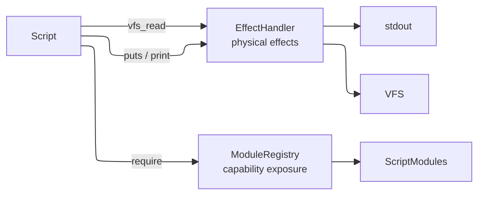
```mermaid
---
displayMode: compact
config:
  layout: elk
  themeVariables:
    fontSize: 12px
---
flowchart LR
    script[Script]
    ef[EffectHandler
physical effects]
    reg[ModuleRegistry
capability exposure]
    stdout[stdout]
    vfs[VFS]
    mods[ScriptModules]

    script -->|puts / print| ef --> stdout
    script -->|vfs_read| ef --> vfs
    script -->|require| reg --> mods
```

`EffectHandler` handles physical effects — stdout writes and VFS reads. `ModuleRegistry` handles capability exposure — which native functions and objects a script can access. Scripts can only access capabilities that have been explicitly registered. The registry is auditable: `registered_paths` and `loaded_paths` show exactly what a script has access to and what it has used.

### The Value model

All runtime values are represented as `Value`, a Crystal struct:

```crystal
struct Value
  getter raw   : Nil | Bool | Int64 | Float64 | String | Sym | ScriptProc |
                 LabeledArray | LabeledHash | RubyClass | RubyObject
  # label is stored for scalars; for LabeledArray/LabeledHash values it's
  # computed from the live container's own label instead — see
  # "Information flow control (risk flow)" below.
  def label : RiskFlowLabel?
  end
end
```

Using a struct means values are stack-allocated and copied on assignment — no per-value heap allocation for scalars. Crystal's union type carries its own discriminant, eliminating the need for a separate tag. Type predicates (`null?`, `bool?`, `int?`, etc.) use `is_a?` on the union.

Symbols are represented as `Sym` — a struct carrying an integer ID and an interned name string. The `SymbolTable` assigns stable IDs so symbol comparison is an integer equality check rather than a string comparison. A `SymbolTable` is owned by the `Interpreter` and shared across all compilations, so `:foo` always has the same ID regardless of which script introduced it.

### The Object model

`RubyClass` and `RubyObject` are plain Crystal classes, not `Value` variants wrapping something else — they sit directly in the `ValueRaw` union like any other type.

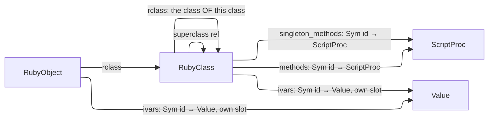
```mermaid
---
displayMode: compact
config:
  layout: elk
  themeVariables:
    fontSize: 12px
---
flowchart LR
    RubyClass -->|superclass ref| RubyClass
    RubyClass -->|rclass: the class OF this class| RubyClass
    RubyClass -->|methods: Sym id → ScriptProc| ScriptProc
    RubyClass -->|singleton_methods: Sym id → ScriptProc| ScriptProc
    RubyClass -->|ivars: Sym id → Value, own slot| Value
    RubyObject -->|rclass| RubyClass
    RubyObject -->|ivars: Sym id → Value, own slot| Value
```

`RubyClass` holds a method table keyed by interned symbol ID (same keying scheme as globals and ivars), a `superclass` reference, an `rclass` reference (the class of this class — `Integer.rclass == Class`), and an `is_module?` flag. `RubyObject#rclass` and `RubyClass#rclass` are the same relationship ("what class is this an instance of") at two different levels, sharing a name deliberately — `obj.class` and `SomeClass.class` are genuinely the same method in real Ruby, not a coincidence.

**Every class defaults to real ancestors, not `nil`.** A script-written `class Foo; end` with no explicit `< Bar` inherits from `Object`; every class or module's own `rclass` is `Class` (a module's own class is `Class` too, not some separate `Module`-of-modules — `Module` itself is an instance of `Class`, same as any other class object). `Object`, `Class`, and `Module` are bootstrapped once per `Interpreter`, before anything else — see `Interpreter#bootstrap_core_hierarchy` below, since the three have a genuine circular dependency in real Ruby (`Class.superclass == Module`, `Module.superclass == Object`, and everything's `rclass` is `Class` except `Class.rclass == Class` itself, self-referential) that can't be resolved in a single construction pass. `Object.superclass` is `nil` — the deliberate root (real Ruby's is `BasicObject`, which Adjutant doesn't model). `MakeClass` resolves an explicit superclass by looking it up as an existing global `RubyClass` (raising `uninitialized constant` if it isn't one) and otherwise defaults to `Object`; a builtin class not built via `Interpreter#define_builtin_class` directly (e.g. `Integer`, built in the separate `Builtins` module) gets the same defaulting patched on afterward by `Interpreter#register_builtin_class`.

**`Class.new`/`Module.new` are explicitly out of scope** — see [UNSUPPORTED.md](./UNSUPPORTED.md), U002. This bootstrap only makes `Class`/`Module` exist as real `RubyClass`es for `.class`/`is_a?`/`superclass` to work correctly; it does not make them instantiable from script.

**Universal methods** (`.class`, `.superclass`, `is_a?`/`kind_of?`, `respond_to?`, `equal?`, `dup`/`clone`) are implemented as `exec_builtin` VM-level fallback cases, the same mechanism `to_s`/`to_i`/`puts` already use — NOT as real inherited methods living on `Object`'s own method table. This is a known simplification: real Ruby resolves these by walking to `Object`/`Kernel` like any other method, so `respond_to?` in particular can't yet see them (asking `x.respond_to?(:to_s)` returns `false` even though `x.to_s` would work) — see `respond_to?`'s own doc comment in `vm.cr` for the exact boundary. Revisiting this — making these real `Object` methods discovered through normal dispatch — is a reasonable future cleanup once something actually needs `respond_to?` to see them, not a correctness bug today.

**`dup`/`clone`** (2026-08-08) are RubyObject-only: a fresh `RubyObject` of the same `rclass`, with `ivars` shallow-copied into a new `Hash` (same Value references, new container — matching real Ruby, where a copied reference ivar still points at the shared original until reassigned). `initialize` never re-runs; a class-defined `initialize_copy` does, if present (`obj.rclass.find_method`, called via `invoke` with the copy as `self` and the original as its one argument) — the hook real Ruby gives a class that needs to deep-copy a specific field rather than share it. No `freeze`/`frozen?` model exists yet, so `dup` and `clone` are behaviorally identical — real Ruby's only difference between them has nothing to attach to. Builtin-kind receivers (Integer, String, Array, Hash, ...) are deliberately unhandled (falls through to the ordinary undefined-method raise) rather than half-matching real Ruby's immediate-vs-collection split — see SCOPE.md's "Data & builtin types" entry, which ties this to the same content-vs-reference identity gap `equal?`'s own comment documents.

**`self` lives on `Frame`**, not the VM — each call frame carries its own `self_val`, isolated automatically when a frame is pushed/popped. `GetClass`/`SetClass` read and write the *current* frame's `self`; a class body runs in the same frame as its surrounding code, so entering/leaving one is a save-and-restore of that single value rather than a frame push. `self` is never `nil` in any real execution context — see `Interpreter#main` above — so `DefMethod`/`DefSingleton` always have a class to target: `self`'s own `RubyClass` directly (inside a class/module body), or a `RubyObject`'s `rclass` otherwise (top level, or `def` written inside a method body — both legal in real Ruby, matching "self at the point this def executes").

**Method dispatch.** `.` calls carry a receiver bit in the bytecode (distinguishing `obj.method()` from `method(obj)`, where a plain argument that happens to be an object must not be mistaken for a receiver). When present, `dispatch_call` branches on what kind of receiver it is: a `RubyObject` resolves against its class's *instance* tables (`find_method` → `find_native_method`, walking the superclass chain); a `RubyClass` resolves against its OWN *singleton* tables instead (`find_singleton_method` → `find_native_singleton_method`) — never the instance tables, since e.g. `A.foo` is a call on the class itself, not on some instance of it. A matched method runs in a new frame with `self` bound to the receiver — the class itself, in the singleton case. When no explicit receiver is present, `dispatch_call` tries the same kind of lookup against `self` instead (implicit-self dispatch — see "`self` at every level" above, which checks one further table beyond this when `self` is a `RubyClass`: `self.rclass`'s own instance-method chain, not just `self`'s singleton tables) before falling through to constants/builtins.

**`.new`** checks the class (or an ancestor) for a registered native singleton method first — see "Native singleton methods" below — and only falls back to the generic path if none exists. The generic path allocates a `RubyObject` and, if `initialize` is defined (on the class or an ancestor), runs it via `VM#invoke` — the same synchronous nested-execution path a native method uses to call a script-provided block (`NativeCallContext#invoke`, exposed to any native method's block — see `Array#each`/`#map` in `src/adjutant/builtins/array.cr` for the first real end-to-end exercise of this, not just an architectural claim) — so its return value can be discarded and `.new` always returns the object itself.

**`NativeCallContext`** is what a native method's block receives as its third block parameter (`|args, blk, ncc|`), giving it capabilities a plain Crystal closure couldn't reach on its own: `ncc.invoke(script_block, args)` to call a script-provided block (see `.new`/`each`/`map` above); `ncc.values_equal?(a, b)` and `ncc.compare(a, b, op)` to compare two `Value`s using Adjutant's real `==`/`<=>` semantics (deep/structural for `Array`/`Hash`, `<=>`-derived when a `RubyObject`'s class defines one and plain identity otherwise, value equality for scalars) — both delegate to `ValueOps` (`value_ops.cr`), the single shared implementation every opcode (`Op::Eq`, `Op::Lt`, ...) also uses, so a native method's notion of equality/ordering (e.g. `Array#include?`, `Range#include?`/`#each`) can never drift out of sync with script-level comparison, with one addition as of 2026-08-06: `ncc.compare` also dispatches through a script-defined `<=>` when either operand is a `RubyObject` (see `SCOPE.md`'s `<=>` item — `ValueOps` itself still knows nothing about `RubyObject`, that dispatch is `VM#compare`'s own addition layered in front of it); and `ncc.call_method(recv, name, args)` to call a method by name on an arbitrary `Value` receiver the way `recv.name(*args)` would from script — resolving through the normal dispatch order, not a fixed native table — used by `Range#each` to advance via `#succ` generically, without hardcoding `Integer#succ` specifically. `call_method` correctly runs a *script-defined* target to completion, not just a native one, only since 2026-08-06 — before that it silently returned `nil` for any script-method target, unnoticed because `Range#each`'s `#succ` had only ever exercised the native path (see `VM#call_method`'s own comment for the fix).

**Two more `NativeCallContext` capabilities landed 2026-08-13, both worth reaching for rather than reinventing:** `ncc.raise_error(code, data, error_class)` lets a native method raise a real, script-catchable diagnostic — an `ErrorCatalog` code, substitution data, and the target Ruby error class to raise as — instead of letting a raw Crystal exception escape and get flattened into an opaque internal `N001` by `call_native`'s catch-all rescue. First needed by `Integer#to_s(base)`'s out-of-range check; by the time `String#gsub`/`#sub`/`#index`/`#rindex`/`Hash#merge`/`Range#step` all needed their own real errors, six more catalog codes (`R015`–`R020`) existed using it — see `ERRORS.md`. And `ncc.add(a, b)` does for `+` what `compare` already does for `<=>`/`</<=/>/>=`: some operators are opcode-only and never registered in `native_methods` at all (see "Some operators are overloaded across base types," below) — a native method that needs `+` generically (`Range#step`'s advance-by-n, not just `#each`'s `+1`-via-`#succ`) can't reach it through `call_method(a, "+", [b])` the way it can reach `#succ`, since there's no native-method table entry for `call_method` to find. `ncc.add` delegates to `ValueOps.add` with the same `error_raiser` wiring `Op::Add` itself uses, closing that gap the same way `compare`/`values_equal?` already closed the equivalent one for ordering/equality.

**A bypass worth knowing about if touching equality-adjacent code again:** `values_equal?`'s own real implementation (`VM#values_equal?`) is not the only thing in this codebase that decides Value equality — `Op::Eq` and `testing/assert_module.cr`'s `assert_equal`/`assert_not_equal` each independently called `ValueOps.equal?` *directly* rather than through the `values_equal?` wrapper, discovered only once `Range` needed real content-equality (`values_equal?` gained a `Range`-specific case — see `range_values_equal?`, next to `values_equal?` in `vm.cr` — that both bypasses silently skipped). Fixed by routing both through `values_equal?`/`ncc.values_equal?` instead. Any future case-by-type special-casing added to `values_equal?` needs checking against this same risk: something that "obviously" should already be going through it might not be.

**`VM#invoke`'s stack isolation.** `invoke` runs a genuinely nested `execute` loop for its script_block/proc call — not a recursive Crystal call into the outer `execute`, a second, self-contained pass through the same loop, reached by temporarily swapping `@frames` to a fresh single-frame array so `execute`'s own `break if @frames.empty?` terminates it correctly once that one frame returns. `@stack` is swapped the same way, for a reason that isn't obvious from `@frames` alone: `execute`'s actual return value is `@stack.last? || result`, not something threaded explicitly through the call chain, and `Op::Ret` only pushes its result back onto `@stack` `unless @frames.empty?` — a check that means something different inside `invoke`'s temporarily-swapped, single-frame `@frames` than it does for the real, outer call stack. Without `@stack` also isolated, a call made from inside a still-pending compound expression (e.g. `sq.call(3)` as the second element of `[sq.call(2), sq.call(3), sq.call(4)]`, with `sq.call(2)`'s `4` still sitting on the shared stack) would read that stale, unrelated leftover via `@stack.last?` instead of its own result — a real bug found and fixed - precisely because `@stack` wasn't swapped originally, only `@frames` was.

**`VM#invoke`/`VM#invoke_proc` — why a lambda needs its own closure snapshot, and why calling one is two separate methods.** A `->(){}` literal's body can reference names from its enclosing scope, compiled to `GetOuter`/`SetOuter` against a `Frame#outer_locals` chain (see "Multi-level closures" below for the full, current shape — at the time of this fix it was still a single flat array, since the multi-level rework hadn't happened yet) — the same closure mechanism ordinary blocks use. Blocks get this right via `Op::SetBlock`, which snapshots the *creation-site* frame's own scope the moment the block literal is pushed, before the call it's attached to even runs (see `Frame#block_outer_locals`'s comment above). `Op::MakeProc`'s lambda branch (`a=1`) had no equivalent snapshot: nothing captured the defining frame's locals at all, so `VM#invoke` (what `Proc#call` routed through) fell back to whichever frame happened to be *calling* `.call` — correct only when that coincided with the frame that wrote the lambda, which it always did in every spec until one specifically returned a lambda out of its defining function and called it later from elsewhere (`make_adder(n) { ->(x){x+n} }`, called from top level). Fixed 2026-07-20: `RubyObject` gained a Proc-only `outer_locals` field (type since updated to `OuterChain?` — see below; a plain Crystal field either way, not routed through `ivars`, since `ivars` can only hold real `Value`s and this is VM-internal plumbing no script can read or assign, exactly like `Frame#outer_locals` itself). `Op::MakeProc` populates it at the lambda's true creation site.

The first version of this fix gave `VM#invoke`/`NativeCallContext#invoke` a single optional `outer_locals` override param, passed explicitly by `Proc#call` and defaulted to the (correct, unchanged) calling-frame fallback for every other caller (`Array#each`/`Range#each`/`Hash#each`'s `blk` param — always a live call-site block literal invoked in the frame that wrote it, so no defining/calling-frame gap exists there). That shape was replaced the same day after review surfaced the actual risk it still carried: any FUTURE native method accepting a stored `Proc` as a plain argument (none exist yet, but nothing prevented one) could call `ncc.invoke(sproc, args)` and silently forget the override, reintroducing the exact same bug at a new call site — an optional param a caller has to remember to use is the same failure shape as the original bug, just moved. Split instead into two methods with no shared optional param: `invoke(proc, args)` — unchanged from before this whole fix, always uses the current frame, for live call-site blocks only — and `invoke_proc(proc_obj : RubyObject, args)`, which takes the `Proc` object itself and pulls both the wrapped `ScriptProc` and `proc_obj.outer_locals` internally, so there is no raw locals array for any caller to see or forget. `Proc#call` (`builtins/proc.cr`) is currently the only `invoke_proc` caller; any future native method that wants to call a stored `Proc` argument should use it too, not `invoke` plus a hand-extracted `ScriptProc`. A `RubyObject` subclass for `Proc` specifically was considered and rejected for the closure-snapshot field itself: nothing else can construct a `RubyObject` whose `rclass` is `Proc`, so there's no ambiguity a subtype would guard against — the field is simply unused (`nil`) for every other class, the same way `ivars` already holds different keys depending on which class populated it. Full history: `research/IFC_DESIGN.md`'s "VM propagation" section (found while scoping the "verify IFC label propagation through lambdas" work — see `SCOPE.md` — since this had to be fixed before that question was even answerable).

With the VALUE-level closure mechanism fixed, the original dynamic-IFC question this arc set out to answer — does a `RiskFlowLabel` survive capture into a lambda's closure, and a `.call`'s return, correctly — was itself confirmed, closing out that Must Fix item. `risk_flow_propagation_spec.cr`'s `"lambdas and Proc#call"` describe block covers the label-plumbing side directly: a labeled value captured across a defining-frame/calling-frame gap (the same shape as the VALUE-level regression above), a lambda's own computed result (not just a bare captured value) surviving `.call`'s return, two tainted values still joining correctly inside a lambda body, and an unlabeled value staying unlabeled (negative case). No special-cased label-propagation logic was needed for any of this — it falls out of "free propagation" (`Value` is a struct, `RiskFlowLabel` travels with it through `GetOuter`/`SetOuter`/`Ret` like any other field) now that `outer_locals` itself resolves correctly. Confirmed once more at the *policy-enforcement* layer, not just label-plumbing, via a hand-run `samples/run_script.cr` script: a constant-held lambda (`SAFE = ->(name){ delete_file(name) }`), passed as a plain argument into a second method (`invoke(fn, arg) { fn.call(arg) }`), and called from inside that method's own frame — a `RiskFlowPolicyError` was still raised and rescuable in the script exactly as expected, confirming the RiskWalker-side `RiskDeferred`/`CONST.call` static handling (see the `RiskWalker` node-coverage table above) and the dynamic enforcement this section documents agree with each other end to end.

**Multi-level closures.** Everything above fixed a *defining-frame-vs-calling-frame* gap — a lambda called from somewhere other than where it was written. It didn't fix a separate, deeper gap: even called from exactly the right place, a block or lambda nested **two or more** closure-creation levels deep couldn't see a variable from anything past its immediate enclosing scope at all (`R008`, undefined variable — a confirmed, reproducible break, not a hypothetical). Found 2026-08-10 while triaging `SCOPE.md`'s old "Long-standing language gaps" bundle — filed there at the time as a "Closures / block scoping" entry, since removed as resolved (this section is the permanent record) — and confirmed against two real person-provided reproductions — one using lambdas, one using nothing but plain nested `do...end` blocks — that failed identically, ruling out "lambda-specific" as the cause.

Two independent bugs stacked to produce this, one at compile time and one at runtime:

- **Compile time:** `CompilerScope#resolve_outer` only ever checked the immediate parent scope's own `vars` and gave up — never walking `@parent.parent`, even though `CompilerScope#parent` already forms a proper chain mirroring the real lexical nesting (every block/lambda's `Compiler.compile_proc` call passes `parent_scope: @scope`, and `compile_def` never does, so the chain naturally terminates at method boundaries with no extra logic needed for that part).
- **Runtime:** even if resolution *had* found the name two hops out, there was nowhere to read it from. `Frame#outer_locals` was a single flat array, and both capture sites (`Op::MakeProc` for lambdas, `Op::SetBlock` for ordinary blocks) snapshotted only the immediate creating frame's own `locals` — never chaining in that frame's *own* `outer_locals` too. A third site had the identical shape and wasn't part of the original two suspects: `invoke_internal`'s fallback (`effective_outer = outer_locals || f.locals`), used whenever a native builtin like `Array#each` invokes a block synchronously with no explicit override — exactly the path both `do...end`-only reproductions go through.

Real Ruby closures need live write-back, not just reads — a nested block mutating a grandparent's variable has to affect the *real* variable, not a snapshot. Since Adjutant's locals arrays are Crystal reference types, single-hop closures already got this for free (the captured array *is* the same object the outer frame mutates); any fix had to preserve that at arbitrary depth. This ruled out the simpler-looking alternative of flattening everything into one merged array at capture time — that would have silently broken write-back, since mutations would land on a copy, not the real ancestor array. The actual fix: a **chain of array references**, nearest-first, each entry the real `Frame#locals` object of one enclosing level (`OuterChain = Array(Array(Value))`, `vm.cr`) — built once, at closure-creation time, by prepending the creating frame's own `locals` onto whatever chain that frame itself already had. `Op::GetOuter`/`Op::SetOuter` gained a depth operand (`a`) alongside the existing slot operand (`c`) — `frame.outer_locals[depth][slot]` — and `resolve_outer` now walks the full parent chain, returning `{depth, slot}` once found, with depth counted the same way the runtime chain is built (0 = the scope active when *this* block/lambda's own creator was itself created, incrementing outward).

Landed as five small, independently-tested steps rather than one large change: (1) the `OuterChain` runtime foundation alone, compiler still always emitting depth 0 — a pure refactor, behavior-preserving, existing single-hop closures unaffected; (2) `resolve_outer`'s chain walk — the step that actually turns this into working multi-level closures, for blocks; (3) confirming lambdas and *mixed* block/lambda nesting (alternating capture mechanisms in one chain, not the same one repeated) work with no further code changes, since both capture sites got the identical Step 1 fix; (4) confirming write-back is real reference sharing — separate closures observing each other's writes, state persisting correctly across repeated calls to the same stored closure, not just "write-then-immediately-read-back" which wouldn't have distinguished a copy from a reference; (5) confirming `RiskWalker` needed no changes at all — it has its own simpler, unrelated closure model (`env.dup`-based for blocks, deliberately fresh/isolated scope for lambda bodies — see the `RiskWalker` section above for why bare lambda literals aren't walked at all), never coupled to the VM's actual storage layout in the first place.


**Some operators are overloaded across base types and can't live in `native_methods` at all**, since arithmetic/comparison/`<<` compile to dedicated opcodes (`Op::Add`, `Op::Shl`, ...) that never consult `find_native_method` — same reasoning as `Integer`/`Float`'s own arithmetic. This has a real consequence for native code, not just script-level dot-call syntax: `NativeCallContext#call_method(recv, "+", [b])` — the mechanism `Range#each` uses to reach `#succ` generically — CANNOT reach `+` the same way, since `call_method` walks `find_native_method`/`find_method`, and none of these operators are registered there for any type to find. `ncc.add` (see "`NativeCallContext`," above) exists specifically as the one primitive that closes this gap for `+`; no equivalent yet exists for `-`/`*`/`/`, since nothing native has needed them generically yet — follow the same pattern (a thin `VM` method wrapping the relevant `ValueOps` function with `error_raiser`, exposed on `NativeCallContext`) if one does. All of this logic lives in `ValueOps` (`value_ops.cr`), not scattered across `VM` — see "The Value model" below. `ValueOps::OnError` (the callback `add`/`op`/`div`/`mod`/`int_op` all take to raise on a bad operand pairing) carries the target Ruby error class alongside the message as of 2026-08-13 — before that every arithmetic failure raised a generic `RuntimeError` regardless of cause, even though `TypeError`/`ZeroDivisionError` already existed in the bootstrapped exception hierarchy and were simply unreachable from here. `ValueOps.add` (backing `+`) has real cases for `Integer`/`Float` mixing, `String` concatenation, and `Array` concatenation (returns a NEW array, non-mutating); `ValueOps.shl` (backing `<<`, split out from the otherwise-Integer-only `ValueOps.int_op` so `&`/`|`/`^`/`>>` don't silently gain array behavior) dispatches to in-place `Array` append — returning the receiver so `a << 1 << 2` chains — for an array receiver, falling back to bit-shift otherwise.

**`Op::Add`/`Op::Sub` gained a `RubyObject` dispatch fallback, 2026-08-23** — a genuinely different axis from the `ncc.add` gap just above, which is about NATIVE Crystal code reaching generic `+`; this is about SCRIPT-level infix `t + 60` reaching a RubyObject's own `+`/`-` method, which previously couldn't happen for ANY type, base or custom. `VM#exec_add`/`#exec_sub` (`vm.cr`) check first whether the LEFT operand is a `RubyObject` with its own `+`/`-` (native or script), dispatching to it via `call_method` when so and falling through to the existing `ValueOps.add`/`.op` base-type handling otherwise — additive, not a replacement; `1 + 2` and `"a" + "b"` never even reach the new check. This is exactly the "no equivalent yet exists... follow the same pattern... if one does [need it]" gap the paragraph above already anticipated, closed by building a real `Time` type (`t + 60`) that needed it. `Op::Div` got the identical treatment the same day (`VM#exec_div`), once `Legate::Path#/` (`legate/path.cr`) needed real infix `/` — not anticipated in advance, found the moment Path's own spec was implemented and its `/` join method silently never fired (`Op::Div` had no method-table consultation either, same gap, different opcode). `*`/`%` remain untouched — nothing needs them generically yet either, same "don't build ahead of a real user" convention.

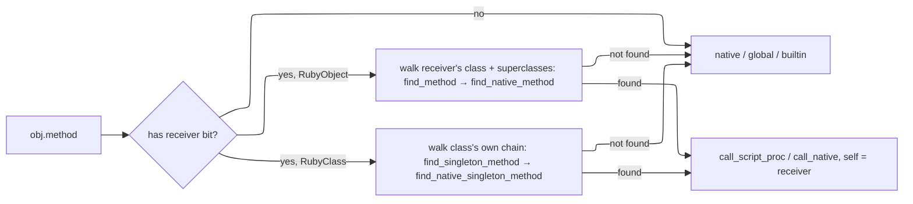
```mermaid
---
displayMode: compact
config:
  layout: elk
  themeVariables:
    fontSize: 12px
---
flowchart LR
    A[obj.method] --> B{has receiver bit?}
    B -->|no| C[native / global / builtin]
    B -->|yes, RubyObject| D[walk receiver's class + superclasses: find_method → find_native_method]
    B -->|yes, RubyClass| F[walk class's own chain: find_singleton_method → find_native_singleton_method]
    D -->|found| E[call_script_proc / call_native, self = receiver]
    D -->|not found| C
    F -->|found| E
    F -->|not found| C
```

**Ivars and cvars** route through `self`, not globals. `GetIvar`/`SetIvar` read/write `self`'s OWN ivars table — `self.ivars` when `self` is a `RubyObject` (an instance's own storage), or the class's separate `ivars` table when `self` is a `RubyClass` itself (a class body's top-level statements, or a `def self.foo` singleton method). These are genuinely different slots even for the same `@name` — not inherited, not shared, not a fallback of one onto the other; `class A; @x = 6; def initialize; @x = 2; end; end` really does hold two independent `6` and `2`. Outside either context ivars are a silent no-op/`nil`, matching Ruby's forgiving semantics. `GetCvar`/`SetCvar` are unrelated storage, always on `self`'s class regardless of whether `self` is an instance or the class itself (`cvar_class` handles both), walking `superclass` — a write lands on the nearest ancestor that already defines the variable, or the current class if none does. Cvar access outside a class context raises, since Ruby has no cvar scope there either.

**Constants are lexically scoped**, not flat globals — `class A; class B; X = 1; end; end` puts `X` on `B`, not in a shared namespace. This needs two links distinct from the ones above: `RubyClass#lexical_parent` (source nesting, set at `MakeClass` time from `self` — *not* `superclass`, which tracks inheritance) and `ScriptProc#lexical_scope` (the class a method was `def`'d in, captured once at `DefMethod` time, since a method's `self` at call time is its receiver, not its lexical home).

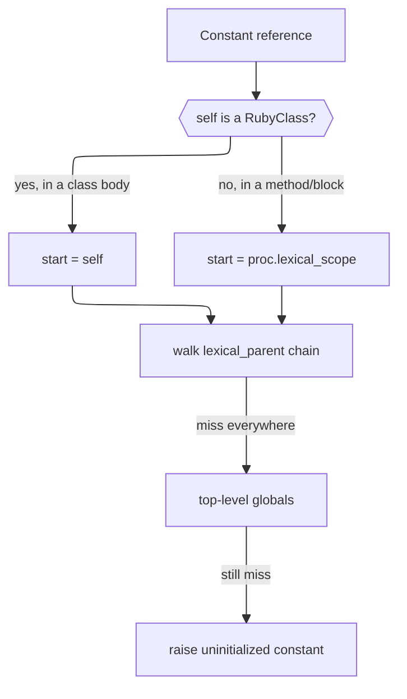
```mermaid
---
displayMode: compact
config:
  layout: elk
  themeVariables:
    fontSize: 12px
---
flowchart TD
    A[Constant reference] --> B{{self is a RubyClass?}}
    B -->|yes, in a class body| C[start = self]
    B -->|no, in a method/block| D[start = proc.lexical_scope]
    C --> E[walk lexical_parent chain]
    D --> E
    E -->|miss everywhere| F[top-level globals]
    F -->|still miss| G[raise uninitialized constant]
```

A plain `Constant` reference (`X`) walks that lexical chain. An explicit path (`A::B::X`, parsed as `ConstPath`) instead does a direct, non-walking lookup in each resolved namespace's own table — closer to Ruby, where `::` doesn't re-trigger lexical search. Blocks are lexically *transparent* (inherit the enclosing frame's `lexical_scope`, same mechanism as `self` inheritance); methods are opaque (fixed at `def` time, ignores the caller).

Not yet implemented: `include`. Script-defined class-side (singleton) methods (`def self.foo`) ARE implemented — see "Script-defined singleton methods" below.

**Native methods.** `RubyClass` also holds a `native_methods` table (`Sym id → NativeCallable`), parallel to `methods` but for Crystal-implemented instance methods — the mechanism base types use. `Integer`, `Float`, `NilClass`, `TrueClass`, `FalseClass`, `Symbol`, `String`, `Array`, `Hash`, and `Range` are all implemented this way (see `src/adjutant/builtins/`) — the base-types work is complete at this level. `Regexp`/`MatchData` (see "Regexp and MatchData" below) use the same `native_methods` mechanism but need a `RubyObject` SUBCLASS rather than plain `ivars` for their real internal state (a compiled `::Regex`, a `::Regex::MatchData`) — the pattern to follow for any future builtin with similar needs, not the plain-`ivars` shape `Range` and the rest use. `find_native_method` walks the superclass chain the same way `find_method` does. Dispatch checks `find_method` first, so a script-defined method always shadows a native one of the same name.

Unlike `Interpreter#define_native`, `RubyClass#define_native_method` takes `risk : RiskProfile` with **no default** — base types are registered in bulk in one place, exactly where it's easiest to wave a whole batch through as `RiskProfile.none` without thinking; the missing default forces that judgment call per method.

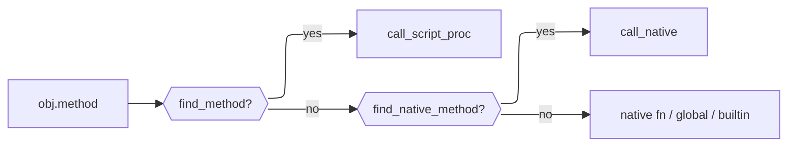
```mermaid
---
displayMode: compact
config:
  layout: elk
  themeVariables:
    fontSize: 12px
---
flowchart LR
    A[obj.method] --> B{{find_method?}}
    B -->|yes| C[call_script_proc]
    B -->|no| D{{find_native_method?}}
    D -->|yes| E[call_native]
    D -->|no| F[native fn / global / builtin]
```

**Script-defined singleton methods.** `def self.foo` inside a class body attaches to a separate `singleton_methods` table on `RubyClass` (`Sym id → ScriptProc`, parallel to `methods`), via `Op::DefSingleton`. The receiver is resolved from `self` at the point the `def` runs — inside a class body `self` is the class itself (same mechanism `GetClass`/`SetClass` already use for the class body generally), so the parser must recognize `self` as a real `SelfNode`, not treat it as an ordinary identifier: `def self.foo` and `def some_other_object.foo` share one receiver-parsing path, but only the `self` case reliably means "the enclosing class." `find_singleton_method` walks the superclass chain, same shape as `find_method` — a subclass with no singleton method of its own inherits its ancestor's, and can shadow it by defining its own.

**Native singleton methods.** `RubyClass` also holds a separate `native_singleton_methods` table (`Sym id → NativeCallable`), for Crystal-implemented *class-level* methods — today used exclusively for a native `new`. This is how a stateful builtin (e.g. a future `File`) gets constructed: `RubyObject` is open to subclassing (`FileObject < RubyObject` with real typed ivars, e.g. an open handle, instead of the shared `ivars : Hash(Int32, Value)` table), and a native `new` allocates that subclass directly and returns it — the generic path can't express this, since it always allocates a bare `RubyObject`.

`.new` dispatch checks `find_native_singleton_method` first (walking the superclass chain, same shape as `find_native_method`) and only falls through to the generic `initialize`-driven path if the class has none. A native singleton method receives the `RubyClass` itself as `args.first` (there's no receiver instance yet — that's the point of `new`), followed by the constructor arguments, and is responsible for its own allocation.

Native singleton methods and script-defined singleton methods share dispatch order (script `find_singleton_method` checked first, native `find_native_singleton_method` second — same shadowing rule as instance methods) but are otherwise independent tables — as long as both are registered on the SAME `RubyClass` instance, which in practice means: a native `new` (or other native singleton method) must be registered on a class before any script-level `def self.foo` targeting it runs, and that has to happen within the class's original definition (a class body executes against the specific `RubyClass` object `Op::MakeClass` allocates for it, fresh, every time `class Foo; end` is compiled and run — see "Constants are assign-once" above; there is no later, separate script-side `class Foo; end` that could extend an already-existing class, since that would be reopening, which Adjutant deliberately doesn't support).

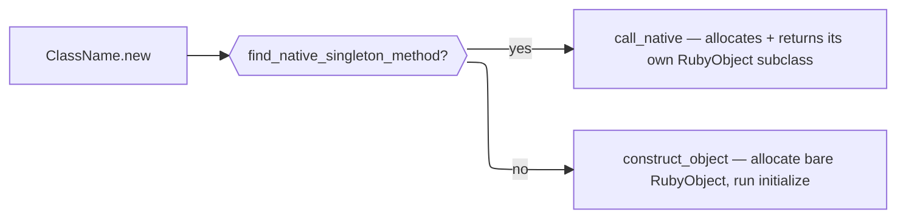
```mermaid
---
displayMode: compact
config:
  layout: elk
  themeVariables:
    fontSize: 12px
---
flowchart LR
    A[ClassName.new] --> B{{find_native_singleton_method?}}
    B -->|yes| C["call_native — allocates + returns its own RubyObject subclass"]
    B -->|no| D["construct_object — allocate bare RubyObject, run initialize"]
```

**Super dispatch.** `super` compiles to its own opcode (`Op::Super`), not a disguised `Op::Call` — an earlier implementation did exactly that (interned the literal string `"super"` as the method name), which never actually worked: dispatch had no special-casing for that name, so every `super` call unconditionally raised `R008` regardless of context. `Op::Super` carries no method name at all; `VM#dispatch_super` reads it off the CURRENT frame at the point `super` runs (`Frame#proc#name`), and resolves against `self`'s REAL runtime ancestor chain (`RubyClass#ancestors`, real Ruby's linearized MRO — self, its own included modules in reverse order recursively, then its superclass's own `ancestors`), searching everything right AFTER wherever the current proc's own `lexical_scope` sits in that chain. This isn't a fixed one-hop jump to `lexical_scope.superclass` — that stopped being correct once `include` existed: a module included directly into `lexical_scope` sits BETWEEN it and its superclass in the real MRO, and `super` called from inside a MODULE's own method has no `superclass` of its own to fall back on at all — only the actual receiver's full ancestry knows what comes next. `self` itself never changes throughout: the found method runs with `self_val: f.self_val`, the original receiver, so a bare call made from inside the resolved method's own body still resolves against the receiver's REAL (dynamic) class — the same virtual-dispatch behavior any other inherited method gets. A proc with no `lexical_scope` (a top-level function, or a block) has nothing to start from, and resolves the same way a genuine "no ancestor defines this" case does — `R014`, raised as `NoMethodError` (not `R008`/`NameError`: the name resolved to a real method once, the one `super` is called FROM, so this is "resolved, then deliberately looked one level up, and found nothing," not "unresolved"). Singleton-method `super` (`def self.foo; super; end`) resolves the SAME way, on the singleton side — `self`'s real singleton ancestor chain (`RubyClass#singleton_ancestors`), not `self`'s instance ancestors. That path had its own, separate history: it originally searched instance method tables instead of the singleton ones at all (a real, pre-existing bug predating both `include` and `extend`), fixed on its own first, then extended to walk `extended_modules` once `extend` itself existed — see this section's own "Mixins" entry, below, for the full detail.

Argument forwarding has two independent forms, both real Ruby distinctions: `super(a, b)`/`super()` compile explicit arguments exactly like an ordinary call. Bare `super` — no parens, no arguments written at all ("zsuper") — instead forwards the enclosing method's CURRENT parameter values, read live off `Frame#locals` at the point `super` runs (`VM#zsuper_bindings`), not the values originally passed in — a param reassigned earlier in the method body is forwarded with its NEW value. `zsuper_bindings` walks `Frame#proc#ast_params` in slot order: a plain/default param forwards positionally; a splat param's CURRENT array is re-expanded into separate positional args, not passed on as one array; a kwarg param forwards as a keyword argument via a separate hash, same shape an ordinary keyword call already uses. Both explicit and zsuper forms implicitly forward the enclosing method's own block (`Frame#block`) — real Ruby's default, and unconditional in both forms; only the ARGUMENTS differ between them, never the block. The forwarded block reuses `Frame#block_outer_locals` (not `Frame#locals`) as its closure context — the scope it was ORIGINALLY attached with at its own creation site, the same reuse `Op::Yield` itself makes when actually invoking a block; using `Frame#locals` instead would silently rebind the block to the wrong enclosing scope. There's no grammar for an explicit block literal on `super` (`super { ... }`) — `SuperNode` carries no `blk` field, and `parse_super` never attaches one; only implicit forwarding exists today.

`RiskWalker` treats `SuperNode` as a call site (`RiskWalker#walk_super`), the same as an ordinary `Call` — explicit argument expressions are walked for risk, and the target is resolved the same way `VM#dispatch_super` resolves it at runtime (`RubyClass#ancestors`, self's real linearized MRO, searching everything after wherever the current method's own `lexical_scope` sits in it — not a fixed one-hop jump to `.superclass`; see `walk_super_target`'s own comment). `walk_super_target` originally shipped with the simpler one-hop version, matching `dispatch_super`'s own original shape — found and fixed together with `dispatch_super`'s rewrite once `include` existed (see this section's "Mixins" writeup): without this, a `super` call statically resolving through an included module showed up as `RiskUnresolved` even though it resolved correctly at runtime, a silent static/dynamic mismatch. zsuper's forwarded parameters are deliberately NOT re-walked here: a bare reference to an already-bound local carries no risk of its own at the point it's referenced again (see `walk_identifier`) — only the ORIGINATING expression, wherever the value first came from, does. Dynamic risk-flow enforcement needed no separate work at all: `dispatch_super`'s native-method branch calls the exact same `call_native` every other native call goes through, which already runs `check_risk_flow` — reached automatically by construction, not a parallel check that could drift out of sync.

**Mixins.** `include` is a real Ruby `Module` instance method, not a keyword — `token.cr`'s `KwInclude` was removed (see that file's own comment) so `include Foo` lexes as an ordinary identifier and parses through the normal bare-call path with zero new grammar. Registered once on the bootstrapped `Module` class (`builtins/mixins.cr`); available from both `class`/`module` bodies since `Class.superclass == Module` (`Interpreter#bootstrap_core_hierarchy`) and `VM#dispatch_call`'s self-is-rclass branch already resolved bare calls against `self.rclass`'s own method chain before `include` existed — that dispatch path's own comment explicitly anticipated `include` by name. Landed in this order, each independently tested: the keyword removal and parsing; `RubyClass#included_modules` plus the native method that populates it (registration only, no resolution yet — a real, if temporary, no-op); `find_method`/`find_native_method` extended to walk `included_modules` (own methods first, then modules in REVERSE insertion order — real Ruby's MRO, last included sits closest — recursing into each module's own includes too); then `super`'s resolution rewritten to match, once a genuine, non-hypothetical break was found (below).

Registering `include` surfaced a real, more general gap along the way: `NativeCallContext` had no way to access `self` at all for a native method reached via the implicit-self/self-is-rclass dispatch path — that path never prepends a receiver into `args` the way explicit-receiver dispatch does (the `args.first` convention every other native method in `builtins/*.cr` relies on), and `call_native` had no `self_val` parameter of its own. Fixed with `VM#current_self_val` (native functions execute in-line without pushing their own frame, so the currently-running frame genuinely is still the calling frame at that point) and a new `self_val` method on `NativeCallContext`, implemented by its one real implementor (`NativeFunctionCall`) and its one test double (`FakeContext`, `spec_helper.cr`).

`RubyClass#find_method`/`find_native_method` being the single shared choke point every dispatch path already used — ordinary calls, `super`, and `RiskWalker`'s own static resolution — meant module-aware method lookup reached all three from one change, for FREE, once extended. `RiskWalker` needed one piece of its own regardless: it never executes anything (a purely static walk), so `include`'s runtime effect (mutating `RubyClass#included_modules`) had to be mirrored statically — `walk_class`/`walk_module` recognize a bare `include SomeModule` statement (`include_call?`) and call `register_static_include` to do that mirroring directly during the walk, treating the statement itself as purely structural afterward (like `def` — no risk contribution of its own, no generic re-walk; walking it generically was tried first and reverted, since `RiskWalker`'s bare-call resolution doesn't model "self is the class currently being defined" outside a method body, and gave every `include` statement a spurious unresolved finding).

`super`'s resolution needed a real, non-optional rewrite, not just an "interaction check" — `dispatch_super` previously jumped straight from the current method's own class to `class.superclass`, which stops being correct the moment a module can sit BETWEEN a class and its superclass in the ancestor chain, and breaks outright for `super` called from inside a module's own method (a module has no `superclass` of its own to fall back on — only the real receiver's full ancestry knows what comes next). Fixed via a new `RubyClass#ancestors` — the real linearized MRO (self, its own included modules in reverse order recursively, then its superclass's own `ancestors`; works for both classes and modules uniformly, since a module's `superclass` is always `nil`) — with `dispatch_super` now searching everything after wherever the current method's own `lexical_scope` sits in self's REAL runtime ancestors, rather than a fixed one-hop jump. See "Super dispatch," above, for the full detail; `walk_super_target` (`RiskWalker`) needed the identical fix for the identical reason, found in the same pass — without it, a `super` call statically resolving through an included module showed up as `RiskUnresolved` even though it resolved correctly at runtime.

Deliberately out of scope at `include`-time, filed rather than silently expanded into: module de-duplication in `RubyClass#include_module`/`#ancestors` (a module included twice, or reachable via two different paths, appears more than once — not a correctness problem for resolution, since the right answer is still found, just possibly checked against the same module redundantly, but real Ruby de-duplicates and this doesn't yet).

**`extend`.** Filed separately when `include` shipped, then built in its own later session once `include` was real code rather than a guess — same shape throughout, mirrored onto the SINGLETON side (a class/module object's own callable methods) rather than the instance side. Landed in the same small, independently-tested steps `include` used, plus one `include` didn't need:

- A genuine prerequisite, fixed first and on its own: singleton-method `super` (`def self.foo; super; end`) had always searched `find_method`/`find_native_method` — the INSTANCE tables — a real, pre-existing bug predating `include`/`extend` entirely (self here IS the class object itself, not an instance of it; the right tables are `find_singleton_method`/`find_native_singleton_method`). Fixed on its own, before `extend` existed, since testing `extend`+`super` meaningfully wasn't possible while the underlying mechanism was broken regardless of modules being in the picture at all.
- `RubyClass#extended_modules` — genuinely separate storage from `included_modules`, not a reused field: the two lists mean different things (instance resolution vs. singleton resolution), and an `include`d module showing up in singleton resolution (or vice versa) would be a real correctness bug, not a harmless simplification.
- `find_singleton_method`/`find_native_singleton_method` extended to walk `extended_modules`, reusing each extended module's own INSTANCE-side recursive lookup (`find_own_or_included_method`) rather than inventing a parallel "extended" variant — this is the actual meaning of `extend`: a module's ordinary `def foo` methods become the extending class's singleton methods, so `extend M` where `M` itself `include`s `N` correctly surfaces `N`'s methods too, for free.
- `RiskWalker`'s own static recognition (`extend_call?`/`register_static_extend`), an exact mirror of `include`'s own — same reasoning throughout, since `RiskWalker` still never executes anything regardless of which mixin mechanism is in play.
- `super`'s singleton resolution rewritten to match — genuinely more complex than the instance-side version, not just a find-and-replace: a new `RubyClass#singleton_ancestors` returns `Array({RubyClass, Bool})` rather than a flat class list, because (unlike `include`, where a class and an included module both store their methods in the SAME `.methods` table, checkable uniformly) an extended module's own contribution needs its ORDINARY method table checked, while `self` and its superclasses need `.singleton_methods` — a flat list can't represent "which table this entry means," so each entry carries which one to use.

**`extend`/`include` via an explicit receiver are permanently excluded (U018), not a missing feature.** Decided once `extend` itself was real, working code and the natural next question — "what about `obj.extend(M)`?" — had a concrete implementation to weigh against, not just a hypothetical. Tracing it found the explicit-receiver form (`X.extend(M)`, `obj.extend(M)`, `X.include(M)`, `obj.include(M)`) simply didn't resolve at all — no dispatch path checks a receiver's own class's class for these the way the bare/implicit-self path does — surfacing as a generic, misleading `R008` that reads like a typo rather than a boundary. Rather than fix that dispatch gap, the decision was to formalize it as excluded: `UNSUPPORTED.md` gained a third standing principle alongside its first two — a declared class/module/object's behavior should be reasoned about from its own text, not something that can change later, conditionally, at runtime, regardless of whether risk-flow analysis could still resolve it. `class X; extend M; end` is a one-time, textually-fixed claim; `X.extend(M)` written anywhere else is an ordinary statement that could run conditionally, in a loop, or twice, and the concern isn't whether THIS script happens to write it unconditionally — it's that the language shouldn't offer a form whose reasonability depends on usage discipline. Enforced via the same `EXCLUDED_METHODS` mechanism `send`/`eval` already use (`error_catalog.cr`) — the bare/declarative form never reaches that check at all, since it resolves successfully via a different path first, so the table entry only ever fires for the excluded shape. `class_eval`/`module_eval`/`instance_exec`/`class_exec` joined `eval`/`instance_eval` (U006) in the same pass, for the identical reason — a block whose contents were never fixed at declaration time, run in a shifted binding — previously left as a "plausible but not declared" gap in that table's own comment, now made explicit once the underlying principle was named clearly enough to declare with confidence.

**Bare `include` at the top level of a script.** Built 2026-08-16, scoped and confirmed against real Ruby `irb` sessions first: top-level `include M` mutates `Object`'s own ancestor chain directly, and the mixed-in module's methods stay ordinary PUBLIC instance methods — reachable via explicit receiver from any `Object` instance, not scoped to `main` alone. `include`/`extend` are registered only as `Module` instance methods (`builtins/mixins.cr`), reached exclusively via `dispatch_call`'s self-is-rclass branch — a bare call made from inside a `class`/`module` body, where `self` genuinely IS the `RubyClass` being defined. At the top level, `self` is `main`, a `RubyObject`, not a `RubyClass`, and `Object` doesn't itself inherit from `Module` (the real hierarchy runs the other way — `Module < Object`), so that branch could never reach `include`/`extend` no matter how far up `Object`'s own chain it walked. Fixed with a single new check in `dispatch_call`'s implicit-self `RubyObject` branch, gated on `self_val.same?(interp.main)` — restricted to `main` specifically, the same "only reachable RubyObject-self case" precedent `Op::DefSingleton`'s own top-level guard already established, rather than a general per-object mechanism. On a match, it calls `RubyClass#include_module` directly on `obj.rclass` (`Object`) — the exact method `builtins/mixins.cr`'s own `include` native function calls, just targeting `Object` instead of whatever `self_rclass` a class/module body would supply. No changes needed to `RubyClass#find_method`/`find_native_method` or their `included_modules`-walking — that machinery already existed from `include`'s original build-out and picks this up automatically, which is why explicit-receiver calls on OTHER, unrelated `Object` instances work too, not just bare calls at the top level.

`extend` at the top level was deliberately left excluded, not approximated with `include`'s own mechanism. Confirmed via a separate real `irb` trace: top-level `extend M` writes to a genuine PER-OBJECT singleton class belonging to `main` alone — `Object`'s own ancestors stay untouched, sibling `Object.new` instances are unaffected, and `Object.foo` itself doesn't pick up the extended method either. `RubyObject` has no storage for a per-instance singleton method table at all today (only `RubyClass` carries one), and adding one — even scoped to `main` alone — is real, separate work, filed as its own item rather than folded into this one. The new top-level `include` check does NOT match on `"extend"`; a bare top-level `extend M` falls through exactly as it did before this change, to the same `EXCLUDED_METHODS`/U018 catch. See `UNSUPPORTED.md`'s `U018` entry, which now carries a clarifying note distinguishing top-level bare `include`/`extend` (this item; `extend` still excluded on its own separate grounds) from the explicit-receiver forms U018 itself covers (unchanged, still excluded everywhere, top level included).

**`is_a?` never checked `included_modules`, only found 2026-08-24 building `Legate::Stream`** — a real, previously-undiscovered gap, inconsistent with method resolution rather than a missing feature: `find_method`/`find_native_method` have walked `included_modules` correctly since `include` itself was built (this section, above), but `is_a_target?` (`vm.cr`, backing both `is_a?` and `rescue`'s own class filtering — `compile_rescue_clause_test` calls real `is_a?`) only ever walked the superclass chain. A class that `include`s a module could correctly DISPATCH to that module's methods but `some_instance.is_a?(TheModule)` still answered `false` — surfaced immediately by `Legate::Stream`'s own first spec assertion, since `Legate::Stream` is a genuinely `include`d module (see LEGATE.md §6's own note on why, over a simulated equivalent). Fixed with one added check per superclass-chain step (`cls.included_modules.includes?(target)`) — direct includes only, not a module's own nested includes expanded transitively (real Ruby's `ancestors` does that; nothing in Adjutant includes-a-module-that-itself-includes-a-module yet for the gap to matter in practice). Same fix also correctly extends `rescue SomeModule => e` to match an error whose class includes that module, for free — untested by this session specifically (no such error hierarchy exists yet to exercise it), but falls out of the same code path.

**Top-level `def` is implicitly private.** Built 2026-08-16, confirmed against real Ruby `irb` sessions first: a top-level `def` lands in `Object.private_methods`, not `Object.methods` — unreachable via an explicit receiver from outside `self` (`x.hello`/`Object.new.hello`/`Object.hello` all raise `NoMethodError`), while a bare call and `self.hello` both still work. A real "proper subset" gap, not an ordinary missing-feature one: before this shipped, a script that raises in real Ruby (`x.hello` on an unrelated `Object.new`) SUCCEEDED in Adjutant, since nothing checked visibility at all. Deliberately NOT a reopening of `U008` (`private`/`protected`/`public` stays excluded as a script-DECLARABLE feature, for its own, separate reasons) — this is a single, fixed, always-on rule with no `private` keyword involved anywhere in a script.

Built as real per-class storage, not a boolean flag on `ScriptProc` (an earlier, narrower design considered and dropped once the actual request came in): `RubyClass` gained `private_methods`/`native_private_methods` — `Set(Int32)` overlays alongside the existing `methods`/`native_methods` tables, not duplicate copies of the callables themselves — plus an `is_private` opt-in kwarg on `define_method`/`define_native_method` (default `false`; redefining a name without it resets visibility back to public, matching real Ruby, where a subclass overriding an inherited private method without redeclaring `private` gets a public override). Populated exactly two ways today: `Op::DefMethod` (vm.cr) marks a definition private whenever it executed with a `RubyObject` self rather than a `RubyClass` one — provably always `main`, not a fresh runtime check, since `compile_def`'s own `@def_depth` guard (see "Mixins," `Op::DefSingleton`'s comment) already rejects any `def` nested inside another `def`/lambda body at COMPILE time, the only other way a `RubyObject` self could reach this opcode. Native functions can opt in the same way via `Interpreter#define_native`'s/`Builtins.define`'s own new `is_private` kwarg — plumbed all the way through, but not flipped on for any existing native registration by this change; a native method choosing to register itself private (matching how most real `Kernel` methods are) is a separate, per-function decision left for later.

`find_method_private?`/`find_native_method_private?` mirror `find_method`/`find_native_method`'s own walk EXACTLY (own table, then included modules recursively, then superclass) rather than answering "is this name private anywhere in the chain" — a `Bool?`-returning inner pair (`find_own_or_included_method_private?` and its native twin) reports `nil` for "doesn't resolve at this level," distinct from `false` ("resolves here, and is public"), so the outer walk stops at the exact same point `find_method` itself would and reports THAT entry's visibility — a closer override with no `private` of its own correctly reads as public even if a farther ancestor marked the same name private, matching real Ruby. Enforcement is a single new check (`dispatch_call`'s `raise_if_private_call`, vm.cr) in the explicit-receiver `RubyObject` branch, run once a method/native method has already been found: private and the receiver ISN'T the same object as `self` at the call site (`same?`, object identity — not "was this spelled `self.`," matching real Ruby's own relaxed rule that `self.hello` and any receiver aliasing `self` both stay allowed) raises `R023` as `NoMethodError`.

### `to_s`/`inspect`

`to_s`/`inspect` are ordinary, overridable instance methods, with a default on `Object` (`builtins/object.cr`) that every other type either inherits or overrides — matching real Ruby, where a script's own `def to_s` on any class is respected everywhere a value gets rendered, not just via an explicit call.

`Object#to_s`'s default renders `"#<ClassName>"`. `Object#inspect`'s default lists instance variables in insertion order (`"#<ClassName @x=1, @y=\"hi\">"`), each rendered via its own real, recursive `inspect` call (`ncc.call_method`) rather than hand-rolled recursion — matching real Ruby's own default `Object#inspect`, minus the memory address (`0x...`), which has no debugging value here (not stable across runs, nothing script-side can correlate it against, and Adjutant doesn't expose real addresses to begin with). It guards against a non-`RubyObject` receiver (a scalar like `5`/`"a"`, or an `Array`/`Hash`, all of which reach it by inheritance before having their own `inspect`) falling through and crashing on an unconditional cast — those fall back to the plain Crystal-level `Value#inspect` instead, which already handles every true scalar correctly.

Every IMPLICIT render path — string interpolation (`Op::Concat`), `puts`, `print`, `p` (all in `vm.cr`) — goes through two small VM methods, `render_to_s`/`render_inspect`, which call real dispatch (`call_method`) for anything that could have an override (`RubyObject`, `LabeledArray`, `LabeledHash`), and fall back to `Value#to_s`/`Value#inspect` directly only for true scalars (unreachable for redefinition anyway, since `U003` forbids reopening any class) and `RubyClass` values (see "Known gap," below). This is what makes a script's own `def to_s`/`def inspect` override visible everywhere a value gets rendered, not just via an explicit `.to_s` call — and it's why `nil` genuinely differing between the two (`nil.to_s == ""`, `nil.inspect == "nil"`, matching real Ruby) now holds consistently everywhere, rather than needing several independent call sites to individually agree on it.

`Array`/`Hash` both have real, recursive `inspect` — each element (or, for `Hash`, each key AND value) rendered via ITS OWN real `inspect`, so a nested custom object's override is respected. `to_s` is a real dispatch call onto `inspect` for both, not a separate algorithm — matching real Ruby, which aliases them exactly. `Hash#inspect` additionally uses real Ruby's `name: value` shorthand for every `Symbol` key, never hash-rocket (confirmed against a real `irb` session) — `SIMPLE_SYMBOL_KEY` (`builtins/hash.cr`) decides only which of the two spellings to use (a bare name, or the name's own quoted-string form for an irregular one), never whether the shorthand applies; it always does for a `Symbol` key.

`Range` has genuinely SEPARATE `to_s`/`inspect` — unlike `Array`/`Hash`, real Ruby's own `Range#to_s`/`#inspect` differ when a bound isn't a plain number (`to_s` renders each bound via its own `to_s`, unquoted for a `String` bound; `inspect` via its own `inspect`, quoted). A `nil` bound — endless/beginless range SYNTAX (`1..`, `..10`) now parses and works end to end (`endless-ranges` branch, 2026-08-18/19; `RangeLiteral#start_node`/`#end_node` are `Node?`, `parse_primary` gained a `RangeIncl`/`RangeExcl` case for the beginless form, `compile_range` emits a plain `nil` literal for a missing bound — `Op::MakeRange`/`make_range_object` already accepted one unconditionally, via the pre-existing `Range.new(nil, x)` constructor path) — correctly renders with that bound OMITTED entirely (`"1.."`, `"..5"`), matching real Ruby, not the `"nil..5"` this section used to describe as a known gap.

Every `Range` method that needs a real bound now checks for `nil` and raises `RangeError` the way real Ruby does, rather than silently returning `nil`/an empty result: `#each`/`#step` walk forever on a missing END (the caller is expected to `break`); `#to_a` raises on a missing END (no `break` escape hatch the way `#each` has); `#min`/`#first` raise on a missing BEGIN, `#max`/`#last` on a missing END — four DISTINCT messages for what are really only two underlying conditions, confirmed against Ruby's own C source rather than assumed (`#max`/`#last` both fire on a nil end but word it differently from each other; same for `#min`/`#first` on a nil begin). `#begin`/`#end` are the one pair that never raise regardless — real Ruby's own plain accessors, not fallible "get the actual value" methods the way `#first`/`#last` are. `#first(n)` (the count-argument form) now implements real semantics too — an Array of the first `n` elements, walked via `#succ` the same way `#each`/`#to_a`/`#step` already did, working on an endless range with no special-casing (it stops after `n` regardless of whether there's a real upper bound to compare against) — `Array#first(n)`/`#last(n)` had the identical gap for a different receiver type; fixed the same way, as a plain slice over the elements already in hand (no `#succ`-walking needed), reusing R031 as-is for both (see `array.cr`). `#include?`/`#member?` treat a nil bound as "no constraint on that side" (an endless range includes everything above its start) rather than "nothing satisfies this side," which is what the underlying comparison helper's own nil handling would otherwise produce.

A container recursing into elements it doesn't own means it could recurse into ITSELF, directly or through another container. `NativeCallContext#guard_rendering(obj_id, cycle_result, &block)` — one VM-level `Set(UInt64)`, keyed on each container's own Crystal `object_id` (free, since `LabeledArray`/`LabeledHash` are `Reference` types) — returns `cycle_result` immediately without running the block if `obj_id` is already being rendered, otherwise marks it, runs the block, and always clears the mark again before returning, even if the block raises. Block-based rather than a begin/end pair a caller has to bracket correctly itself, so the cleanup is structural, not something every future caller has to get right individually. Global to the whole rendering call, not per-container-type state, so a cycle running through a DIFFERENT container type (an `Array` inside a `Hash` inside that same `Array`) is caught by the same mechanism, with no per-type tracking needed.

A `RubyClass` value's own `def self.to_s`/`def self.inspect` override is respected by every implicit path too, not just an explicit call — `render_to_s`/`render_inspect` check `rclass_override?` (whether `find_singleton_method`/`find_native_singleton_method` finds a REAL registered override) BEFORE dispatching, rather than dispatching unconditionally and rescuing on failure: a blanket rescue would also swallow a genuine exception a script's own override deliberately raises, which real Ruby propagates rather than silently falling back to the default rendering. No override found means the exact same default rendering as before this check existed (the qualified name) — real Ruby's own `Class#to_s` default doesn't require an actual registered method to exist either. A class WITH an override was already `respond_to?`-visible before this fix (same two tables `respond_to?`'s own check consults); a class withOUT one remains a documented, accepted, narrower gap — real Ruby's `Class#to_s` is a genuine inherited `Object` method reachable through the metaclass chain, which Adjutant doesn't model. Explicit-call `inspect` on a class value ITSELF was a separate, earlier-fixed bug, not a design gap — `MyClass.inspect` used to raise `NoMethodError` outright, since no dispatch path resolved it at all (`exec_builtin`'s universal fallback, `vm.cr`, had a `"to_s"` case but no matching `"inspect"` one); fixed by adding that case, mirroring `"to_s"` exactly.

`Proc` gained real `to_s`/`inspect` — `#<Proc file:line (lambda)>`, `file:line` reflecting the lambda's CREATION site (threaded through from the calling frame at `Op::MakeProc`, stored as `__filename`/`__line` ivars — `vm.cr`'s `make_lambda_object`), not wherever `.call` later happens to run from. Deliberately omits the memory address real Ruby's own format includes (same reasoning as `Object#inspect`'s own omission) but keeps `file:line`, genuine debugging value for a script with several lambdas. Before this, `Proc` had no `to_s`/`inspect` at all, meaning it fell through to `Object`'s own default — and since `Proc`'s own internal representation ivar is literally named `__sproc`, the OLD behavior LEAKED that implementation detail into user-visible output (`#<Proc __sproc=#<Proc>>`), not merely an incomplete rendering.

`Exception` gained real `inspect` — `#<ClassName: message>`, calling real dispatch on `to_s` (not reading the raw `message` ivar directly), so a script's own subclass overriding `to_s` has that reflected in `inspect` too, matching real Ruby's own default `Exception#inspect` implementation. Registered once on the base `Exception` class, inherited by every subclass, using `obj.rclass.name` (the actual instance's class) rather than the class the defining method happened to be registered on.

**A recurring closure-capture bug, found and fixed twice while writing this work, worth naming as its own pattern**: a native singleton `new` closing over `cls` from its OWN definition-time scope, rather than reading the actual receiver (`args.first.as_rclass`), silently builds an instance of the WRONG class whenever a subclass with no `new` of its own inherits that singleton method. First found in `Exception`'s (and `NameError`'s) own `new` — `TypeError.new("msg")` silently built an `Exception`-classed object, not a `TypeError`-classed one, invisible in the existing test suite since every test constructed typed errors via `raise TypeError, "msg"` instead, a genuinely separate, already-correct path (`make_error_object`, `vm.cr`). The identical bug turned up independently in `Regexp.new` while writing ITS OWN `to_s`/`inspect` coverage, unrelated to the `Exception` fix directly — same fix (`args.first.as_rclass`) applied there too. Worth checking for this same shape (`define_singleton(cls, ...) do |args| ... SomeObject.new(cls, ...) ... end`, closure `cls` used instead of the receiver) in any FUTURE native singleton `new` this codebase adds.

### Regexp and MatchData

Built 2026-08-14, one continuous session, from lexer literal syntax
through String integration. `Regexp`/`MatchData` are the first
builtin types whose real state can't fit in `ivars` — `ivars` only
holds `Value`s, and there's no `Value` variant for a compiled Crystal
`::Regex` or a `::Regex::MatchData`. Both follow the exact pattern
`Proc`'s `outer_locals` field already established (see "The Object
model" above): a `RubyObject` subclass (`RegexpObject`,
`MatchDataObject`, `builtins/regexp.cr`) with real, additional, typed
Crystal fields alongside the inherited `ivars` — `RegexpObject` wraps
`regex : ::Regex`; `MatchDataObject` wraps `md : ::Regex::MatchData`
plus `subject : String` (kept explicit rather than trusting an assumed
`::Regex::MatchData#string` accessor to exist) and `regexp_value :
Value` (the `Regexp` `#match` was called on, threaded through at
construction so `MatchData#regexp` has something real to return).

**Literal syntax and the division/regex lexer ambiguity.**
`/pattern/flags` reuses the same interpolation machinery
double-quoted strings already had (`@in_interp`/`@interp_brace_depth`
in `lexer.cr`, generalized behind a new `InterpKind` enum so
`continue_interp` knows whether it's resuming a string or a regex),
but pattern text is captured RAW — unlike `decode_string_escapes` for
strings, a regex literal's own backslash sequences (`\d`, `\1`, `\A`)
belong to the regex engine's syntax, not Adjutant's, so nothing
decodes them. The harder problem: a bare `/` is genuinely ambiguous
between division and a regex literal's opening delimiter
(`x / y` vs. `/abc/`), and Adjutant has no expr-beg/expr-end parser
state the way real Ruby's own lexer does. `regex_starts_here?`
approximates it from the previous token alone — most kinds fall
cleanly into "can end an expression" (division) or "can't" (regex
opens) via a static `EXPR_END_KINDS` set, with a bare `Identifier`
resolved by real Ruby's own spacing heuristic (`foo /bar/` is a regex
argument, `foo / bar` is division) — but this alone over-fires for a
bare `/`/`/=` with nothing to actually close, and for `def /(o)`
defining the operator method itself: `regex_closable_ahead?`, a
bounded non-consuming lookahead to the next unescaped `/` or newline,
gates the decision so a line with no real closing delimiter always
falls back to division/`SlashEq`.

**PCRE2 vs. Onigmo — the one load-bearing compatibility gotcha.**
Crystal's `::Regex` is PCRE2-backed; real Ruby's is Onigmo. The single
most likely silent-wrong-answer trap between them: real Ruby's `^`/`$`
ALWAYS match line boundaries, not gated by any flag, while PCRE2 only
does that under `Regex::Options::MULTILINE` — and Ruby's own `/m` flag
means something different entirely (dot matches newline, PCRE2's
`DOTALL`). `Builtins.regex_options` (`builtins/regexp.cr`) passes
`MULTILINE` to Crystal UNCONDITIONALLY for exactly this reason,
mapping Adjutant's own `Regexp::MULTILINE` flag to `DOTALL` instead —
getting this backwards would silently break every `^`/`$` match in a
pattern that didn't explicitly ask for multiline behavior. Covered by
a dedicated regression spec (`regexp_spec.cr`'s "^ and $ always match
line boundaries" describe block) specifically so a future
"simplification" back to a naive 1:1 flag translation gets caught.
Several exact Crystal API names used elsewhere in this area
(`Regex::Options` member spelling, `Regex::MatchData#begin`/`#end`/
`#[]`/`#[]?`, `String#split`'s Regex overload) were used from memory
without a local toolchain to verify against — flagged inline at each
use site, not asserted as fact.

**Two pre-existing VM dispatch tables didn't know about the new type,
and silently no-opped rather than erroring — found via real
end-to-end tests, not by inspection.** Both are the "hardcoded
per-type table, not general method dispatch" shape, and both were
fixed by adding a branch rather than by generalizing the mechanism
(scoped narrowly on purpose):

- `case`/`when` doesn't compile `when pattern` into an ordinary
  receiver call the way `.===(x)`'s own dot-call syntax does —
  `Compiler#compile_case` emits a bare `Op::Call` with no receiver bit
  set, which falls through to `exec_builtin`'s own hardcoded `"==="`
  case (`vm.cr`) — previously branching only on `Class`/`Range`. A
  real, working `Regexp#===` native method existed and was reachable
  via `.===(x)` dot-call, but `when /pattern/` never reached it at
  all. Fixed by adding a `RegexpObject` branch to that same table.
- `obj[i]` bracket indexing (`exec_get_index`, `vm.cr`) was a fixed
  case statement over `Array`/`Hash`/`String` only, falling to a
  silent `Value.nil_value` for anything else — so `MatchData#[]`,
  though registered correctly as a native method, was completely
  unreachable via `md[0]` syntax. Fixed via `exec_get_index_fallback`,
  which calls a `RubyObject` receiver's own native `[]` method through
  the same synchronous `call_native` path `dispatch_call`'s ordinary
  `.foo` receiver-call branch already uses. Deliberately does NOT
  cover a SCRIPT-defined `[]` (`find_method`, not
  `find_native_method`) — that would need `call_script_proc`'s
  frame-push-and-resume machinery, which `exec_get_index_fallback`
  has no way to do from inside a single synchronous opcode handler.
  Moot today regardless: `def [](i)` can't be written in script at all
  yet (see UNSUPPORTED.md's U017 — no combined `[]` lexer token), so
  only native `[]` methods exist to reach in the first place.
  `Op::SetIndex`/`exec_set_index` (the write side) has the identical
  shape of gap and was NOT touched by this fix.

**`$~`/`$1`-`$9`/`$&`/`` $` ``/`$'`/`$+` were considered and
deliberately dropped, not deferred — U011 enforced as part of this
same decision.** Real Ruby's own match globals were traced seriously:
the parser had (and still has, for every OTHER `$name`) zero support
for `$`-prefixed globals at all — not a lexer gap, a genuine `grep` of
`parser.cr` for `TokenKind::GVar` came back empty entirely, confirming
UNSUPPORTED.md's own U011 exclusion (a global mutable channel bypasses
the IFC/risk-flow model's parameter/return-value/ivar tracking) was a
real, load-bearing design boundary, not an oversight to patch around.
Building `$~` would have meant carving a narrow, reasoned exception
into that boundary. The actual capability check: `MatchData` already
exposes everything the globals would (`#[]`, `#captures`,
`#pre_match`, `#post_match`, `#string`, `#begin`/`#end`, `#regexp`),
reachable from any variable holding a match result — the ONE genuine
(not just less convenient) gap is real Ruby's own `#sub`/`#gsub` block
form, which only ever yields the matched STRING, never a `MatchData`
— `$~` is the only path to capture groups there in real Ruby too, not
an Adjutant limitation. `Regexp#match`/`String#match`'s OWN block
form — genuinely different in real Ruby, yielding a real `MatchData`
directly — covers the case that actually mattered and was built
instead (`define(cls, interp, "match")` in both `builtins/regexp.cr`
and `builtins/string.cr`, using the previously-discarded `blk`
parameter; only invoked on an actual match, returning the block's own
value in place of the `MatchData`, matching real Ruby exactly). U011
itself went from "lexed but never consumed, generic P002 either way"
to actively enforced the same session: `primary`'s `TokenKind::GVar`
case (`parser.cr`) is the only place a `GVar` token is ever consumed
anywhere in this parser, deliberately a dead end, raising a real
`U011` diagnostic by name — covering both a read and an assignment
target uniformly, since assignment parsing bottoms out through the
same `primary` entry point for its left-hand side.

**`Regexp`/`MatchData`'s own `to_s`/`inspect`**, built 2026-08-17 and
confirmed against a real `irb` session rather than assumed — every
format below was checked directly, not guessed at. `Regexp#to_s`
renders `(?enabled-disabled:pattern)` (flag letters always `m`, `i`,
`x` order on both sides of the `-`, that whole `-disabled` section
omitted when every flag is enabled); `#inspect` the source form,
`/pattern/enabledflags`, ALSO escaping an unescaped `/` in the pattern
as `\/` (`escape_slashes`, `builtins/regexp.cr` — a one-character
lookback, skipping an already-escaped `\/` rather than double-escaping
it; a genuinely doubled backslash before a slash isn't independently
confirmed to round-trip correctly). `MatchData#inspect` renders `#<MatchData
"whole" 1:"g1" 2:"g2">`, a NAMED capture group showing its own name
instead of a number (`mid:"b"`, via `::Regex#name_table` — an
UNVERIFIED Crystal API guess, same standing caveat as this section's
other `::Regex`/`::Regex::MatchData` surface), a non-participating
group as bare `N:nil`. Both `flag_letters` (splits enabled/disabled
letters once, shared by `to_s`/`inspect`) and `escape_slashes` live in
`builtins/regexp.cr`, module-level.

**`Value#inspect`'s `String` case did NO escaping at all before this**
— `io << '"' << r << '"'`, verbatim, no matter what `r` contained.
Found while writing `MatchData#inspect`'s own test coverage, which was
the first thing anywhere to actually assert on ESCAPED content rather
than just "some string came back" — a genuinely foundational bug, not
specific to `MatchData` at all: any `String` containing a literal `"`
rendered as invalid, unparseable output wherever `#inspect` was used.
Fixed in `value.cr` (the single shared implementation every caller
already routed through) to escape `"`, `\`, `\n`, `\t` — deliberately
not the full set real Ruby's own `String#inspect` produces (`\e`,
`\0`, `\a`, `\b`, `\f`, `\v`, non-ASCII/invalid-encoding handling),
which stay real, separate, lower-confidence gaps rather than guessed
at without a way to verify each one directly.

### Information flow control (risk flow)

Every `Value` carries an optional `RiskFlowLabel` — for scalars this is a plain stored field; for array/hash values it's computed from the live `LabeledArray`/`LabeledHash` object instead (see below), so a `Value` copy never goes stale even after the container it wraps is mutated elsewhere. When two labeled values are combined, their labels are joined via `RiskFlowLabel.join`, which computes the least upper bound in the label lattice — a powerset lattice over `ProvenanceTag`, ordered by set inclusion (join = tag-set union). See `research/IFC_DESIGN.md` for the full design rationale.

A `RiskFlowLabel` holds a `Set(ProvenanceTag)`. Each `ProvenanceTag` is `{kind, origin, sensitivity}`:

- `kind` is a `ProvenanceKind` enum member (`File`, `Host`, `Env`, `UserInput`, ...) — a closed set, not a bare symbol, so it's typo-checked at compile time.
- `origin` is a concrete identifier for the source (a path, host, env var name, ...) — always recorded, since it's what makes a later risk-flow prompt or audit entry meaningful ("about to POST `/etc/passwd`", not "about to POST some file").
- `sensitivity` (`Sensitivity::None`/`Elevated`/`High`) is looked up from a `RiskFlowPolicy` at tag-creation time via `RiskFlowPolicy#sensitivity_for` — not hardcoded per module, since a module has no way to know on its own that `/etc/passwd` matters differently from `/etc/hosts`.

Two same-origin tags merge to the worse (more sensitive) of the two rather than duplicating; sensitivity is monotonic — no operation lowers it once joined onto a value (declassification was considered and explicitly rejected, see `research/IFC_DESIGN.md`).

**Containers** (`Array`/`Hash`-typed values) don't store their label on the `Value` struct at all — `Value#raw` wraps a `LabeledArray`/`LabeledHash`, and the label lives as a mutable field on *that* object, shared by reference the same way the underlying elements already are. This is why `Op::SetIndex` and `arr << x` can accumulate a pushed/assigned value's label onto the container permanently (monotonic, same as scalar sensitivity — overwriting or removing the tainted element does not clear the container's label). See `research/IFC_DESIGN.md`'s "Container labeling" section for why the simpler "join onto the `Value`'s own label field" design doesn't work (a `Value` is a struct popped off the stack; there's no slot to write an updated label back to) and why `LabeledArray`/`LabeledHash` hand-write their read/mutate methods rather than including `Indexable`/`Enumerable` (both trigger a Crystal 1.20.3 compiler stack overflow over `Value`'s self-referential union type).

**A native method building a NEW container from an EXISTING one's contents must seed the new label from the SOURCE container's own `.label`, not just re-derive one from the copied/kept elements** — a real, repeated gap found and fixed across `Array#select`/`#reject`/`#sort`/`#reverse`/`#map`, `Array#push` (a mutation, not a new container, but the identical underlying gap: it wasn't joining the pushed value's label onto the receiver's own label at all), `Hash#to_a`/`#merge`, and `Range#to_a` — all 2026-08-13. The container's own label can carry taint no individual element reflects (e.g. a direct `declare_sensitivity` call on the container itself, or — per the monotonic rule above — taint retained from an element removed earlier), and a join over only the elements a method happens to keep silently drops that the moment a script calls `select`/`sort`/`merge`/etc. The shared helper is `Builtins.joined_label(values, seed = nil)` (`builtins/helpers.cr`, generic over which container type is involved — nothing in it is Array- or Hash-specific): callers pass the SOURCE's own `.label` (or, for `merge`, every source hash's label, joined) as `seed`, not just the values ending up in the result. Reach for this directly for any future method with this shape rather than re-deriving the fold.

Labels and tags are `JSON::Serializable` (a custom converter handles the `Set(ProvenanceTag)` field, since Crystal's `JSON::Serializable` only supports `Array` natively). `Interpreter#risk_flow_log` is a `RiskFlowLog` (also `JSON::Serializable`) that records a `RiskFlowEvent` per join for post-hoc audit/debugging, separate from the live label on each `Value` — enabled via `Interpreter.new(risk_flow_tracking: true)`, defaulting to disabled (`#record` is then a no-op, so every join site can call it unconditionally without branching on the flag itself).

`Interpreter#risk_flow_policy` is a required `RiskFlowPolicy` (agent-loaded `JSON::Serializable`; Adjutant never reads a policy path off disk itself) with two lookups: `#sensitivity_for(kind, origin)` (origin → sensitivity, via `SensitivityPattern` rules matched by `exact` or `regex` pattern type, highest explicit `priority` wins, a tie at the top priority raises `AmbiguousRiskFlowPolicyError`) and `#action_for(tag, sensitivity)` (the `(RiskTag, Sensitivity) → RiskFlowAction` table, via `RiskFlowRule` rows; `Sensitivity::None` always resolves to `RiskFlowAction::Allow` regardless of table contents, and returns the matched `RiskFlowRule?` alongside the action). `RiskFlowAction` is `Allow`/`Ask`/`Reject`.

There is no `Interpreter.new` default that means "skip risk assessment" — `risk_flow_policy` and `on_risk_flow_decision` (a `RiskFlowDecisionRequest -> RiskFlowDecision` callback) are both required constructor params, always, with no defaults. An embedder who genuinely wants no risk assessment must say so explicitly via `RiskFlowPolicy.reject_all` (a policy that rejects every non-`None`-sensitivity flow unconditionally, with no `risk_flow_rules` needed) rather than by omission — Adjutant does not silently permit risky calls just because an integration didn't think about IFC. The callback is required unconditionally too, even for a `reject_all` policy that will never actually call it — Crystal can't express "required only if the policy could produce `Ask`" as a type constraint, so requiring it always is what makes the guarantee a checked one rather than a runtime surprise deep in a script.

**Enforcement** is implemented: `VM#call_native` runs a risk flow check before every native call whose `RiskProfile` has any `RiskTag` and whose arguments include a labeled value. For each `(RiskTag, ProvenanceTag)` pair, `action_for` decides `Allow`/`Ask`/`Reject`; non-`Allow` results become `RiskFlowMatch`es (rule + triggering tag), sorted worst-first (`Reject` > `Ask`, then `Sensitivity`) into a `RiskFlowDecisionRequest`. A `Reject` (from a rule, or from `reject_all`, or from the `on_risk_flow_decision` callback answering an `Ask` with `Reject`) raises a script-catchable error: script-visible class `RiskFlowRejectedError` (a `RiskFlowPolicyError` subclass, itself a `StandardError`), following the same `RuntimeError` + `error_value` mechanism every other script-raised error uses — not a separate Crystal exception hierarchy, since the dispatch loop's rescue-and-unwind machinery only catches `RuntimeError` specifically. A script can `rescue RiskFlowRejectedError`, `rescue RiskFlowPolicyError`, or a bare `rescue` to catch it; the script (and the LLM that authored it) never needs to know whether the rejection came from a hard policy rule or a live decision — both look identical from inside the script.

**Label propagation alone has a real blind spot**: it only ever sees taint that flowed *through* a labeling call. A script that writes a sensitive-looking value directly (`delete_file("/etc/passwd")`, no intermediate `read_file` call or variable at all) produces no `RiskFlowLabel` for anything to track — the automatic, label-driven check above has nothing to see. `NativeCallContext#declare_sensitivity(tag, kind, origin, sensitivity = nil)` closes this: a native function whose own argument *is* the risky subject (a path being deleted, a URL being posted to) calls it directly on that argument's literal content, consulting `sensitivity_for` itself (or using an already-known `sensitivity` to skip the lookup) and feeding the result into the same `RiskFlowMatch`/`RiskFlowDecisionRequest`/enforcement machinery as the automatic check — same sorting, same callback, same script-catchable error. This is why `declare_sensitivity` exists as a distinct, explicit call rather than something the VM could infer automatically: only the native function itself knows which of its arguments (if any) is the dangerous one, and in what role (Ruby has no static typing or required argument-naming to infer this from). See `samples/run_script.cr`'s `delete_file` for the pattern, and `samples/scripts/risk_flow_declared_literal.rb`/`risk_flow_declared_variable.rb` for scripts that specifically exercise it (a bare literal and a misleadingly-named variable, respectively — both invisible to label propagation, both caught by this).

**Currently implemented**: `RiskFlowLabel`/`ProvenanceTag`/`Sensitivity` and their join semantics; `LabeledArray`/`LabeledHash` container labeling; the `RiskFlowLog` recording mechanism; every VM dispatch-loop join site; `RiskFlowPolicy`/`SensitivityPattern`/`RiskFlowRule`/`RiskFlowAction` and their lookup logic; the full `call_native` enforcement check and `declare_sensitivity` described above. **Not yet implemented**: no higher-level agent-facing API beyond the raw `RiskFlowDecisionRequest`/`RiskFlowDecision` callback shape (no helper for rendering a request as a human-readable string, no structured audit-trail export beyond what `RiskFlowLog` already provides); no approval cache (an `Ask` for the same origin→sink flow re-prompts every time within one script run — see `research/IFC_DESIGN.md`'s open questions); no real, shippable File IO/HTTP native module — `samples/run_script.cr`'s `SampleModule` demonstrates the labeling/`declare_sensitivity` pattern with simulated I/O, but isn't itself a production module.

The `RiskFlowLabel` field adds one pointer width to every `Value` struct. When no label is present the field is `nil`, which is a predictable nil-check on the hot path — easily branch-predicted and potentially eliminated by the compiler when risk flow tracking is disabled.

### Writing a ScriptModule

A `ScriptModule` is the unit of capability exposure. Implement the abstract class:

```crystal
class MyModule < Adjutant::ScriptModule
  def name : String
    "agent/mymodule"
  end

  def load(interp : Adjutant::Interpreter) : Nil
    interp.define_native("my_func", risk: Adjutant::RiskProfile.none) do |args|
      # args is Array(Adjutant::Value)
      result = do_something(args.first.as_string)
      Adjutant::Value.string(result)
    end
  end
end

interp.modules.register(MyModule.new)
```

For simpler cases, register with a block:

```crystal
interp.modules.register("agent/mymodule") do |i|
  i.define_native("my_func") { |args| Adjutant::Value.string("hello") }
end
```

Scripts load the module with `require "agent/mymodule"`. Each module is loaded at most once per interpreter instance regardless of how many times the script calls `require`.

For risk flow tracking, a module has two responsibilities depending on what kind of function it's writing:

**A function that produces data** (reads a file, fetches a URL, ...) attaches a label to the value it returns, looking up sensitivity from the interpreter's policy (native code closes over `interp` already, via the `define`/`define_native` block, so no extra plumbing is needed):

```crystal
interp.define_native("fetch_data") do |args|
  url = args.first.as_string
  data = http_get(url)
  sensitivity = interp.risk_flow_policy.sensitivity_for(Adjutant::ProvenanceKind::Host, url)
  label = Adjutant::RiskFlowLabel.of(Adjutant::ProvenanceKind::Host, url, sensitivity)
  Adjutant::Value.string(data, label)
end
```

**A function that consumes a risky argument directly** (deletes a path, posts to a URL, ...) should call `ncc.declare_sensitivity` on that argument's literal content, rather than relying only on whatever label the caller happened to attach — otherwise a script that never touched a labeling function at all (a bare `delete_file("/etc/passwd")`, or a misleadingly-named variable holding the same string) produces no label and goes entirely unnoticed. `declare_sensitivity` feeds the same enforcement machinery — including the possibility of an `Ask` prompt or a `RiskFlowRejectedError` — as the automatic, label-driven check:

```crystal
interp.define_native("delete_file",
  risk: Adjutant::RiskProfile.new(tags: Set{Adjutant::RiskTag::DeletesFiles})) do |args, _blk, ncc|
  path = args.first.as_string
  ncc.declare_sensitivity(Adjutant::RiskTag::DeletesFiles, Adjutant::ProvenanceKind::File, path)
  File.delete(path)
  Adjutant::Value.bool(true)
end
```

A function can do both if it both consumes a risky argument and returns risky data.

#### Native keyword arguments

A native function can accept keyword arguments by declaring which names it will accept:

```crystal
interp.define_native("configure", kwarg_names: Set{"timeout"}) do |args, blk, ncc|
  timeout = ncc.kwargs.try(&.["timeout"]?).try(&.as_int) || 30_i64
  Adjutant::Value.int(timeout)
end
```

An undeclared keyword still raises `R012` ("unknown keyword"), exactly the same diagnostic a script-defined method's `bind_args` would raise for the same mistake — a native function with no `kwarg_names` at all (the default) rejects every keyword, matching every native call's behavior before this existed.

**Deliberately not modeled on `Param`/AST defaults.** A script-defined kwarg's default (`def f(x: 1); end`) is compiled bytecode — `Compiler#emit_default_prologue` turns the default expression into real instructions (`HasKwarg`/test, jump-if-supplied, compile the expression, `SetLocal`) spliced into the proc's own chunk, evaluated by `execute` when the frame runs. A native call has no compiled chunk and no frame to run a prologue in, so `Param#default : Node?` has nothing to evaluate against at a native call site — reusing it verbatim would be a type mismatch with no evaluator behind it.

Instead, `NativeCallable#kwarg_names` is name-only — no declared default value or expression anywhere. A native function that wants a default for an omitted key reads `NativeCallContext#kwargs` itself and falls back in plain Crystal, as `configure` does above. This mirrors mruby's own `mrb_get_args` kwargs convention: the C function pre-fills a buffer with its own defaults *before* calling `mrb_get_args`, which then only overwrites the slots the caller actually supplied by name — there's no separate declarative default mechanism there either, the native function just self-serves. Same spirit here, and the same style `testing/assert_module.cr`'s `assert` already uses for positional presence checks (`args.first?.try { ... } || "assertion"`).

`kwargs` is threaded through `NativeCallContext` (a `Hash(String, Value)?`, `nil` when the call passed none), **not** added as a parameter to `NativeFunc`'s own signature (`Proc(Array(Value), ScriptProc?, NativeCallContext, Value)`). Widening that `Proc`'s arity would touch every existing native function definition across the codebase for a capability most of them don't need; routing through the context instead makes it opt-in per function.

A native `.new` (`define_native_singleton_method`) accepts `kwarg_names` the same way, and rides the exact same `call_native` path (`check_unknown_native_keywords!`, `check_risk_flow`) as any other native call — see `VM#construct`'s native-`.new` branch.

**Risk-flow, both sides, extended to cover kwargs — not just positional args:**

- **Static:** `RiskWalker#walk_call` folds keyword-argument VALUES into its risk walk (`node.kwargs`), not just `node.args`. This closed a real, pre-existing gap found while designing this feature: a risky expression in a keyword position (`configure(handler: delete_file(path))`) was completely invisible to static analysis before — `node.kwargs` was simply never walked at all, the same shape of blind spot the positional-args fix closed on 2026-07-18. Not previously load-bearing (natives always rejected kwargs outright before this session, so a risky native call reached via a kwarg value couldn't happen), but native kwarg support makes it a live path.
- **Dynamic:** `VM#check_risk_flow` now scans `kwargs.values` labels alongside `args` — a labeled value reaching a risk-tagged native call via a keyword argument is enforced exactly like a positional one. Before this, `check_risk_flow` only ever looked at `args`.

**A real, separate VM bug found and fixed while testing this** (not specific to native kwargs conceptually, just first exposed by it): `VM`'s `@pending_kwargs` instance variable — set by `Op::SetKwargNames` right before a call, read by `Op::Call`'s handler — was only ever cleared *after* `dispatch_call` returned normally. If `dispatch_call` raised instead (e.g. `check_risk_flow` rejecting a kwarg-carrying call), that reset was skipped entirely, leaving `@pending_kwargs` stale for whatever `Op::Call` executed *next* — including `compile_rescue_clause_test`'s own compiled `is_a?` check, used to match a raised exception against a `rescue ClassName => e` clause's class list. `is_a?` declares no `kwarg_names`, so the leaked keyword got spuriously rejected with `R012`, masking the real exception entirely. Fixed by wrapping the `dispatch_call` invocation in `begin/ensure` so `@current_block`/`@current_block_locals`/`@pending_kwargs` reset unconditionally. Worth noting for anyone touching `Op::Call` again: **any** raise mid-dispatch while VM-instance-variable-held per-call state is set will leak into whatever call runs next, script-visible exception or not — this wasn't reachable before native kwargs simply because every kwarg-carrying native call died synchronously at the old unconditional `reject_kwargs!` step, with no window for the state to survive into an unrelated later call.

Native functions have no positional-arg defaults or arity binding of their own yet — see `SCOPE.md`'s "Standard library surface" entry; deliberately scoped separately from this work, since it would need a materially different, more invasive binding mechanism touching every existing native registration.

### Side-effect risk

Every native callable carries a static `RiskProfile`, declared at registration time, so the harness can warn a user about a script's effects *before* running it — independent of IFC, which only tracks data flow once a script is running.

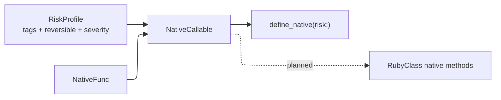
```mermaid
---
displayMode: compact
config:
  layout: elk
  themeVariables:
    fontSize: 12px
---
flowchart LR
    RP[RiskProfile
tags + reversible + severity] --> NC[NativeCallable]
    NF[NativeFunc] --> NC
    NC --> DN["define_native(risk:)"]
    NC -.planned.-> RC[RubyClass native methods]
```

`RiskTag` names *why* a call is risky (`ReadsFiles`, `WritesFiles`, `DeletesFiles`, `Recursive`, `ExecutesCode`, `NetworkEgress`, `ElevatedPrivilege`, `ModifiesEnvironment`). `Reversibility` (`Yes`/`No`/`Depends`) and `Severity` (`Info`/`Warning`/`Error`) are *conclusions* drawn from those tags.

Tags are the reason; reversibility and severity are consequences — a `RiskProfile` with no tags must be `Reversibility::Yes` and `Severity::Info`. Setting either otherwise on an empty-tag profile raises immediately, by design: it means a `RiskTag` is missing, not that the fields should be set freely.

```crystal
# Pure — the default, no need to state it explicitly.
interp.define_native("square") { |args| ... }

# Effectful:
interp.define_native("delete_file",
  risk: Adjutant::RiskProfile.new(
    tags: Set{Adjutant::RiskTag::DeletesFiles},
    reversible: Adjutant::Reversibility::No,
    severity: Adjutant::Severity::Error,
  )) { |args| ... }
```

`Reversibility::Depends` requires a `note` explaining the call-site condition that determines it (e.g. a flag toggling in-place writes) — this can't be resolved statically and is treated as "escalate and ask" until argument-level analysis exists.

`NativeCallable` pairs a `NativeFunc` with its `RiskProfile` and is the shared representation for any Crystal-implemented callable — `ScriptModule` functions via `define_native`, and `RubyClass` native methods for base types (`Integer`, `Float`, `NilClass`, `TrueClass`, `FalseClass`, `Symbol`, `String`, `Array`, `Hash`) — so a risk-manifest walker has exactly one place to look regardless of whether a call resolves to a required module or a base type's method.

#### Structured risk: RiskNode and RiskAggregator

A flat union of `RiskProfile`s across a script loses conditionality: an `if`/`else` with a safe branch and a destructive branch would merge into one tag set, as if both could happen in one run. `RiskNode` (`risk_node.cr`) mirrors the AST's control-flow shape instead, so aggregation respects it.

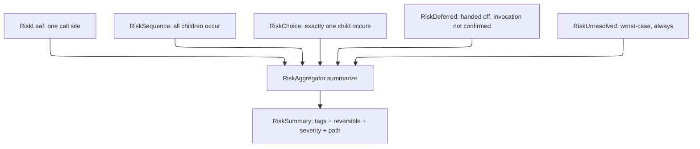
```mermaid
---
displayMode: compact
config:
  layout: elk
  themeVariables:
    fontSize: 12px
---
flowchart TD
    Leaf["RiskLeaf: one call site"] --> Agg[RiskAggregator.summarize]
    Seq["RiskSequence: all children occur"] --> Agg
    Choice["RiskChoice: exactly one child occurs"] --> Agg
    Deferred["RiskDeferred: handed off, invocation not confirmed"] --> Agg
    Unresolved["RiskUnresolved: worst-case, always"] --> Agg
    Agg --> Sum[RiskSummary: tags + reversible + severity + path]
```

- `RiskSequence` — straight-line code and loop bodies (`iterated: true` for the latter, since a script can't generally know its own iteration count statically). Aggregates by union: all children's tags apply, severity/reversibility take the worst single child.
- `RiskChoice` — `if`/`elsif`/`else`, `case`/`when`, rescue clauses. Aggregates by taking the **single worst-case branch**, not a union — `origin` (`"if"`, `"case"`, ...) is preserved so the summary's `path` names which branch caused it.
- `RiskDeferred` — a `Lambda` literal or constant-held lambda passed as a call argument (see the `RiskWalker` node-coverage table below). Wraps the lambda's own walked-body risk, but unlike `RiskSequence`, the wrapped risk isn't confirmed to run — the callee MIGHT invoke it, or might not, and the walker can't see into the callee's own body to tell. Deliberately aggregated at the child's FULL severity (same philosophy as `RiskUnresolved` always ranking worst-case below — this project treats "can't confirm" as a reason to surface loudly, not a reason to under-report), with the path prefixed `"deferred: <reason>"` so presentation can still distinguish "this will happen" from "this was handed off, invocation not confirmed."
- `RiskUnresolved` — a call site the walker couldn't statically resolve. Always ranks worst-case (`Severity::Error`). Should be rare, since dynamic dispatch is a forbidden language feature (see below) specifically to keep every call site staticaly resolvable; a common `RiskUnresolved` is a signal something needs fixing in the walker or the forbidden list, not a case to silently downgrade.

`RiskAggregator.summarize(node) : RiskSummary` walks a tree once and returns the single worst-case path through it — not every possible path, since presentation needs one concrete story ("this script may delete files if the `--force` branch is taken"), not a combinatorial list.

`RiskAggregator.all_findings(node) : Array(RiskFinding)` is the complementary entry point: every `RiskLeaf`/`RiskUnresolved` anywhere in the tree, each with its own `branch_path` (which `Choice` branches led there) and `iterated?` flag — not collapsed to one worst-case story. `RiskAggregator` takes no view on presentation; a host UX groups, filters, or sorts `RiskFinding`s itself (e.g. dedup repeated calls to the same function, or show only `Severity::Error` entries).

#### TypeInference

A `Call` node can only resolve to a `NativeCallable`/`ScriptProc` if its receiver's class is known. `TypeInference` (`type_inference.cr`) infers this statically, without running the script — a minimal pass, not full type inference.

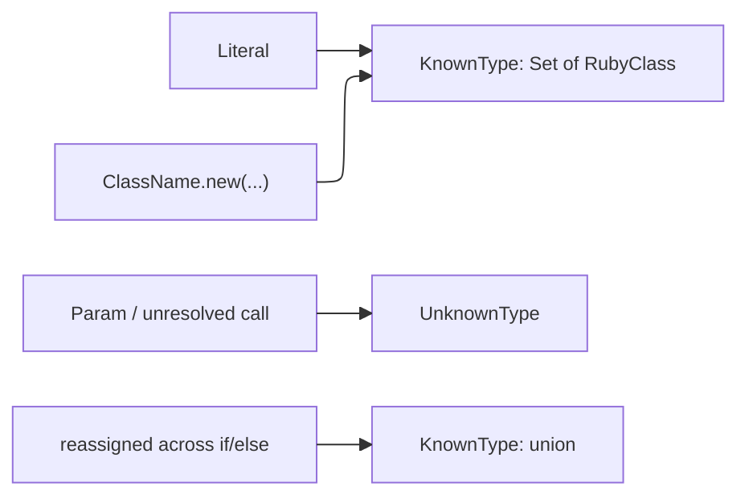
```mermaid
---
displayMode: compact
config:
  layout: elk
  themeVariables:
    fontSize: 12px
---
flowchart LR
    Lit[Literal] --> Known[KnownType: Set of RubyClass]
    New["ClassName.new(...)"] --> Known
    Param[Param / unresolved call] --> Unknown[UnknownType]
    Branch["reassigned across if/else"] --> Union["KnownType: union"]
```

`TypeHint` (`type_hint.cr`) mirrors `RiskNode`'s sum-type reasoning: a local var reassigned a different known type in each branch of an `if`/`case` is a real union, not an inference failure — only genuinely untraceable values (params, unresolved call returns) are `UnknownType`. Loops merge the same way, treating "ran 0 times" vs. "ran once" as a 2-way branch.

`BUILTIN_CLASS_NAMES` is the extension point for the `Lit --> Known` edge above — a flat map from AST literal-node class to its builtin `RubyClass` name, consulted by `known_builtin`. `IntLiteral`/`Integer` was the only entry until 2026-07-21, when `ArrayLiteral`/`Array` and `HashLiteral`/`Hash` were added (closing a SCOPE.md Will Fix item — `[1, 2, 3].each { }` previously inferred its receiver as `UnknownType`, so `RiskWalker` fell back to `RiskUnresolved` for the call itself, purely from a missing map entry, not any real ambiguity — an array or hash literal's class is exactly as certain as an int literal's). `String` remains unentered as of this writing. No other part of the pass needed to change for this — `RiskWalker`'s own resolution (`walk_known_receiver_call`/`resolve_on_class`) was already generic over any `KnownType`, regardless of which class it named.

Hash literals accept two key spellings as of 2026-08-08: `key => val` (any expression as key) and symbol-shorthand `key: val` (`Parser#parse_hash_key`/`#label_follows?`, parser.cr) — an `Identifier`, `Constant`, or any keyword token immediately hugging a `:` (no space; reuses the same `@next.space_before?` adjacency test `operand_immediately_follows?` already used for unary `-`/`+`) becomes a `SymbolLiteral` key, consuming both the label and its colon before the value is parsed as an ordinary expression. Real Ruby's reserved-word-as-label allowance (`class:`, `if:`, ...) falls out for free from checking `TokenKind`'s `Kw`-prefix generically rather than hand-listing keywords. No ternary ambiguity: the label check only ever runs at hash key-parsing position, structurally before any `?` could appear, so `{ a: cond ? 1 : 2 }` and `{ (cond ? "x" : "y") => 1 }` both parse correctly with no special-casing. Deliberately scoped to braced hash literals only — bareword call-site kwargs (`foo(retries: 3)`, no braces) remain unimplemented, a separate mechanism entirely (see the `Parser#parse_param`-adjacent comment, parser.cr). The compiler needed no changes (`compile_hash` already compiles each key/value node generically, and `SymbolLiteral` already had its own `compile_node` case from ordinary `:sym` literals) — but landing this surfaced a real gap in the risk walker (see the next paragraph), since it made the spelling any Ruby-trained model reaches for first far more likely to actually trigger it.

`ArrayLiteral`/`HashLiteral` elements are walked for risk as of 2026-08-08 (`RiskWalker#walk_collection_literal`, risk_walker.cr) — every array element, and every hash pair's key AND value, as a flat `RiskSequence` (all evaluate unconditionally when the literal is built, so nothing here is a `Choice`). Before this, both node kinds fell through `walk_node`'s generic `else` branch, which only runs `@inference.infer_node` for env-tracking — and `infer_node` itself (`BUILTIN_CLASS_NAMES`, previous paragraph) just returns a fixed `"Array"`/`"Hash"` `TypeHint` without recursing into elements at all. Net effect: a risky call embedded in a literal (`{ path: dangerous_delete() }`, `[dangerous_delete()]`) produced zero findings from `RiskAggregator.summarize` — confirmed via `samples/scripts/risk_static/risk_static_array_literal.rb`/`risk_static_hash_literal.rb` against real `assess_script` output before the fix landed. Runtime enforcement was never affected by this — `VM#call_native`'s `check_risk_flow` fires from the call itself regardless of AST position — this was purely a blind spot in what a script author sees BEFORE running code. Recursion (a literal nested inside another literal) works for free, since `walk_node` dispatches back into `walk_collection_literal` for any nested `ArrayLiteral`/`HashLiteral` it finds among the elements/pairs, the same way any other recursive `walk_*` method here composes.

#### RiskWalker

`RiskWalker` (`risk_walker.cr`) builds the actual `RiskNode` tree from a parsed `Body`, using `TypeInference` to resolve each `Call`'s receiver. The walker never runs `interp.eval` — it only parses and walks, so it must discover `def`/`class`/`module` declarations itself as it goes, rather than relying on the interpreter's already-executed globals.

The diagram below covers `Call` receiver resolution specifically — `walk_call`'s full picture also unconditionally walks every argument and receiver expression, and folds in a `BlockNode`/wraps a `Lambda`-literal-argument `RiskDeferred`, before combining with whichever receiver-resolution path below applies; see the node-coverage table further down for those.

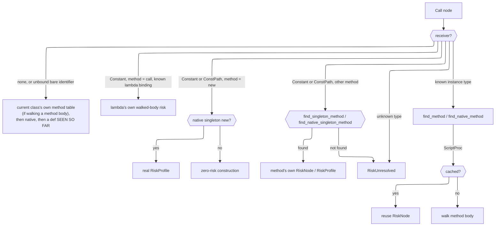
```mermaid
---
displayMode: compact
config:
  layout: elk
  themeVariables:
    fontSize: 12px
---
flowchart TD
    Call[Call node] --> Recv{{receiver?}}
    Recv -->|none, or unbound bare identifier| GlobalLookup["current class's own method table\n(if walking a method body),\nthen native, then a def SEEN SO FAR"]
    Recv -->|Constant, method = call, known lambda binding| ConstLambda[lambda's own walked-body risk]
    Recv -->|Constant or ConstPath, method = new| Ctor{{native singleton new?}}
    Ctor -->|yes| CtorRisk[real RiskProfile]
    Ctor -->|no| CtorZero[zero-risk construction]
    Recv -->|Constant or ConstPath, other method| SingLookup{{find_singleton_method / find_native_singleton_method}}
    SingLookup -->|found| SingRisk[method's own RiskNode / RiskProfile]
    SingLookup -->|not found| Unresolved
    Recv -->|known instance type| ClassLookup["find_method / find_native_method"]
    Recv -->|unknown type| Unresolved[RiskUnresolved]
    ClassLookup -->|ScriptProc| Memo{{cached?}}
    Memo -->|yes| Cached[reuse RiskNode]
    Memo -->|no| WalkBody[walk method body]
```

**Def/class discovery follows the same order rule the VM's linear execution would.** A top-level `def`/`class`/`module` is only visible to calls *after* it in the walk — a call before its definition is `RiskUnresolved`, matching the `NameError` the same script would raise at runtime. This is a deliberate design choice, not an accident of implementation: the walker never executes anything, so there's no "hoisting" pass to fall back on, and mirroring the runtime's own order sensitivity keeps the assessment honest about what would actually run.

The one place order does NOT matter is **calls between a class's own methods**: a method body is only ever invoked after `.new`, by which point the whole class body has finished executing and every method is registered — so `walk_class` walks a class body's bare statements in order (registering `def`s and running any non-`def` statement immediately, same rule as top-level) while method bodies themselves (walked lazily via `walk_script_method`, on first call) always see the class's final, complete method table regardless of source order within it.

`walk_class`/`walk_module` register three different statement shapes into three different places, mirroring how the VM itself would: a plain `def` into `methods`, `def self.foo` (a `SelfNode` receiver — see "Script-defined singleton methods" above) into `singleton_methods`, and a nested `class`/`module` statement into the ENCLOSING class's own `constants` table via `walk_nested` — this last one is what makes `M::A` resolvable as a `ConstPath` afterward; without it, `A` would only be reachable in the walker's flat `@known_classes` map by its bare name, not through `M` specifically, which is not how Ruby scoping actually works.

**`ClassName.new` (or `M::A.new`) resolves to a real `RiskLeaf`, not unconditional zero risk, when the class registered a native singleton `new`** (see "Native singleton methods" above) — `walk_constructor_call` checks `find_native_singleton_method` the same way `resolve_on_class` checks `find_native_method` for an ordinary receiver call. A class with no native `new` still resolves construction as zero risk, matching prior behavior for the common (script-`initialize`-only) case.

**Any other `ClassName.method` or `M::A.method` call resolves against the class's own singleton tables**, not its instance tables — `walk_class_receiver_call` checks `find_singleton_method` then `find_native_singleton_method`, mirroring the VM's dispatch fix for the same distinction (a `RubyClass` receiver is never looked up in `find_method`, which is for instances of that class). `.new` keeps its own dedicated sub-path above rather than going through this generic one, since it alone has an always-available fallback when nothing is registered. A bare `Constant` receiver resolves directly via `resolve_class`; a `ConstPath` receiver (`M::A`, or deeper nesting) resolves via `resolve_const_path`, which walks the namespace chain through each resolved class's own `constants` table — the same non-lexical, direct-lookup semantics as the VM's `Op::GetConstantFrom` (see "Constants are lexically scoped" above), NOT the lexical-parent walk a bare `Constant` reference would use.

`RiskWalker` keeps two of its own tables for this — `@top_level_procs` (defs seen so far) and `@known_classes` (classes built so far) — checked before falling back to `@interp`'s live state, which only reflects genuinely pre-existing things (builtins, or classes from a prior `interp.eval` in the host program). `TypeInference` gained two injectable resolvers so its own `ClassName.new`/`M::A.new` inference can see the walker's own not-yet-executed classes too, without `TypeInference` needing to know `RiskWalker` exists: `class_resolver : String -> RubyClass?` (bare names, defaulting to a live-global lookup) and `const_path_resolver : ConstPath -> RubyClass?` (namespaced paths, defaulting to the same namespace-chain walk `resolve_const_path` does, against `@interp`'s live state instead of the walker's own tables).

**Node coverage.** Every AST shape isomorphic to one already handled reuses the same `RiskNode` shape:

AST node                                                                                     |Treated as                                                                                                                                                                                                                                                                                                                                                                                                                          
---------------------------------------------------------------------------------------------|------------------------------------------------------------------------------------------------------------------------------------------------------------------------------------------------------------------------------------------------------------------------------------------------------------------------------------------------------------------------------------------------------------------------------------
`IfNode`, `UnlessNode`, `CaseNode`                                                           |`RiskChoice` — exactly one branch runs                                                                                                                                                                                                                                                                                                                                                                                              
`WhileNode`, `LoopNode`, `ForNode`, `ModifierWhile`                                          |`RiskSequence` with `iterated: true` (a `ForNode`'s loop variable(s) also declared `UnknownType` in the inner scope — see "Bare identifiers" below)                                                                                                                                                                                                                                                                                 
`ModifierIf`                                                                                 |`RiskChoice` of one statement vs. nothing                                                                                                                                                                                                                                                                                                                                                                                           
`BeginNode`                                                                                  |`RiskChoice(body, clause_1, clause_2, ...)` wrapped in a `RiskSequence` with `ensure` — body and every `rescue` clause are mutually exclusive (at most one runs), but ensure always runs afterward regardless of which (each clause's bound variable, if any, also declared `UnknownType` in that clause's own scope)                                                                                                               
`ClassNode`, `ModuleNode`                                                                    |Body walked immediately (bare statements), nested `def`s registered onto a `RubyClass`/module being built                                                                                                                                                                                                                                                                                                                           
`Assign`, `OpAssign`, `CondAssign`, `MultiAssign`, `IndexAssign`                             |Value expression(s) walked for risk (not just inferred for type) — a risky call used as an initializer or right-hand side is never silently dropped                                                                                                                                                                                                                                                                                 
`Call`'s `args` and receiver expression                                                      |Each walked unconditionally (`walk_call_arg`/`walk_node`) — an argument or receiver expression runs synchronously at the call site regardless of what the callee does with its value afterward, so this is safe and certain, same footing as any other expression                                                                                                                                                                   
`BlockNode` (`{ }`/`do...end` attached to a `Call`)                                          |Folded unconditionally into that call's own risk, wrapped `iterated: true`, walked with the block's own params declared `UnknownType` in the *enclosing* env (real closure semantics — a block can read/write outer locals, unlike a method body's isolated scope) — `yield` inside the callee is a real, statically-visible invocation contract, so (unlike a `Lambda` passed as an argument, below) invocation itself is confirmed
`Lambda` literal, or a constant-held `Lambda` (`CONST = ->(){}`), passed as a `Call` argument|Walked eagerly (same memoized-by-identity treatment `walk_script_method` gives a `def`), wrapped `RiskDeferred` — invocation by the callee isn't confirmed the way a block's `yield` is, only possible, so folding it in unconditionally would overstate risk                                                                                                                                                                       
`CONST.call(...)` where `CONST` is a known constant-held `Lambda`                            |Resolves directly to the lambda's own walked-body risk, no `RiskDeferred` — the invocation is confirmed, happening at this exact call site, not handed off elsewhere                                                                                                                                                                                                                                                                

**Bare identifiers mirror the VM's own local-vs-call disambiguation rule, not a simpler "always a value read" assumption.** A bare name with nothing following it (`delete_file`, no parens/args/block) is genuinely ambiguous at parse time — the same ambiguity real Ruby has, which the compiler resolves via `scope.resolve_local`: a name already bound as a local wins; otherwise it compiles to `Op::GetGlobal`, which itself falls through to an implicit zero-arg method call attempt at runtime if no global/constant of that name exists (see "Constants are assign-once" above). `walk_identifier` mirrors this exactly using `env` (the walker's own equivalent of compile-time local scope — params, prior assignments, and the loop/block/rescue-variable declarations noted in the table above) via `env.has_key?(name)`: present means a real local read (no risk of its own); absent falls through to the same `walk_bare_name_call` helper an explicit `foo()` call already used, so both forms resolve identically. This was a genuine, previously-silent gap (found via the person's own testing) — before this, EVERY bare identifier was treated as a harmless value read regardless of whether a same-named callable actually existed, so a risky function called without parens was invisible to static assessment while the parenthesized form was correctly caught.

**A bare call also resolves against the CURRENT class's own method table first, when walking a method body**, not just native functions/top-level defs — `@current_self_class` (and `@current_self_is_singleton`, since a singleton method body resolves bare sibling calls against a different table pair than an instance method body does) is set for the duration of `walk_script_method`'s body walk, save/restored the same way `@in_progress` already is, so a class's own methods calling each other bare (`def first; second; end`) resolve correctly regardless of definition order — matching the VM's own real dispatch order (`obj.rclass.find_method` checked before anything else for an instance-method implicit-self call), which already walks the ancestor chain up to `Object`, so this one check subsumes native-function/top-level-def resolution too for anything already registered there.

Two things worth calling out beyond node coverage:

- **Method bodies are memoized by `ScriptProc` identity**, walked once using only their own parameter scope — not the caller's inferred argument types. This is correct for memoization (a method's risk can't depend on which call site happens to invoke it) but is a real precision loss: **`def process(f); f.read; end` always sees `f` as `UnknownType` inside `process`**, regardless of what any call site passes, so `f.read` resolves as `RiskUnresolved` even when every caller passes a known `File`. Fixing this properly means adding real parameter type declarations to the language (more Crystal-like, less Ruby-like) — not a bigger inference pass, since the ambiguity is inherent to having no per-method contract at all. The one narrow exception: a `Lambda` bound to a CONSTANT (`F1 = ->(){}`) is resolvable regardless of how it's later referenced, not because of parameter-type inference but because `Op::SetConstant` enforces assign-once at runtime (see "Constants are assign-once" above) — the walker can trust `F1` never silently became something else, so `F1.call(...)` resolves directly and `F1` passed as an argument resolves via `RiskDeferred`. An ordinary (non-constant) variable holding a lambda gets no such treatment — genuine aliasing, same `UnknownType` fate as `f` above.
- **Recursion** gets the same treatment as loops: a `ScriptProc` already being walked (direct or mutual recursion) short-circuits to a plain `RiskLeaf` instead of re-descending, so the walker always terminates.
- **A `Lambda` literal that's neither passed as a call argument nor bound to a constant — just assigned to a variable, or a bare standalone expression — is never walked at all.** `walk_node`'s dispatch has no `when Lambda` case; a bare lambda falls to the generic "literal, no risk of its own" branch, same as any other value. Confirmed 2026-08-10 as a deliberate choice, not an oversight found and left unfixed: flagging every lambda LITERAL as risky the moment it's written would be a false alarm for the common case of a lambda that's declared but never actually invoked — dead code, from a risk-flow perspective. The real backstop is dynamic: `VM#call_native`'s `check_risk_flow` runs unconditionally at every native call, regardless of how deeply nested in lambdas/blocks/stored-and-later-called indirection the call chain is — so nothing risky can actually execute without being caught at the point of real invocation, even when the static walker stayed silent about the possibility. This is the same underlying philosophy as `RiskDeferred` for argument-passed lambdas (don't overstate risk for invocation that isn't confirmed), just extended one step further to lambdas that aren't even offered to anything yet.

`ScriptProc` carries an optional `ast_body`/`ast_params` (set by the compiler at `compile_def`) purely so `RiskWalker` can walk a method's real control-flow shape — the VM itself never reads these fields. `RiskWalker` also builds throwaway `ScriptProc`s (empty `Chunk`, real `ast_body`) for the `def`s it discovers itself — never executed, only walked.

A worked example: `samples/assess_script.cr` parses a script file (never running it) and prints both `RiskAggregator.summarize`'s worst-case path and every `RiskAggregator.all_findings` entry; `samples/scripts/risky_example.rb` exercises the `if`/`while`/def-discovery paths together.

## Error reporting

Errors are structured data, rendered late — not strings built at the raise site.

A `Diagnostic` (`diagnostic.cr`) carries a **code**, one or more **spans**, and a `data` hash of substitutions. It carries no prose at all: the summary, the "why", and the "help" line are looked up in `ErrorCatalog` (`error_catalog.cr`) by code, with `{placeholder}`s filled from `data`. `DiagnosticRenderer` (`diagnostic_renderer.cr`) turns one into Markdown or plain text, quoting the offending source line from a `SourceMap` and drawing carets beneath the span.

The code's letter encodes the **kind** of problem (`P` syntax, `C` static semantics, `R` runtime, `U` deliberately unsupported, `F` risk flow), never the subsystem that raised it — enforcement moves between phases, and an identifier that changes under refactoring can't serve as a translation key or a spec assertion. See [ERRORS.md](./ERRORS.md).

Three consequences worth knowing before adding a raise site:

- **Position fidelity differs by phase, and spans are nullable to match.** The parser has line, column, and a lexeme size; the compiler has `Node#line`/`#column` but no end position; the VM has a line and no column at all. A renderer degrades cleanly — no column means no caret row, no length means a one-character caret — so a phase can emit diagnostics now and gain precision later without changing anything else.
- **`Span#filename` is nullable too**, for a different reason: the compiler is never told what file it is compiling. Nil means "the unit being compiled," and the renderer resolves it from a filename the caller supplies.
- **A nil `diagnostic` is permanent, and means "the script raised this".** Every raise site in Adjutant now carries a diagnostic, but `diagnostic` stays nilable and `render_error` still returns nil, because a `RuntimeError` covers two different things. Adjutant reporting a failure it classified has a code. A script raising its own error — `raise "boom"`, a re-raise from `ensure`, the builtin `raise` — does not, and must not: the message belongs to the script's author, and no catalog entry could say anything true about it. Consumers fall back to `message` for those, which is the right thing to show. This is not migration scaffolding to be tidied away later; making it non-nilable would force a meaningless code onto every `raise` a script performs.

Hosts should reach diagnostics through the interpreter rather than assembling the pieces themselves: `interp.parse` registers source and returns a `Body`, `interp.eval(body, filename)` runs an already-assessed one, and `interp.render_error` renders a diagnostic-carrying error or returns nil for a raise site not yet migrated. Driving `Adjutant::Parser` directly still works but skips registration, producing diagnostics with a position and no snippet — working, but visibly worse, with nothing to indicate why.

VM-raised diagnostics keep the structured report separate from the script-visible error object: `RuntimeError#error_value` is what a script `rescue`s and carries only the diagnostic's summary, in ordinary Ruby-shaped prose. The code, the "why", and the "help" are for whoever reads the interpreter's output — a script has no use for them, and putting Adjutant-specific structure into a rescuable object would diverge from Ruby for no gain.

The `I` series is treated differently from every other letter: those errors mean Adjutant is broken, not the script. They carry no `help`, because there is nothing the reader can do to their own code and a suggestion would send them editing something that was never at fault. Renderers append a report footer instead, pointing at `Interpreter#report_url` — a property, defaulting upstream, that a host should repoint at wherever ITS users report problems. Their `why` is written for whoever debugs Adjutant from a pasted report, not for the person who hit it.

No colour is emitted anywhere, deliberately: the primary reader is an LLM under an agent harness, where ANSI escapes are noise in a captured log, and carets don't need colour to work.

`SourceMap` retains script source keyed by filename. Nothing changed about how source is read — `Lexer` already slurped the whole IO into a string for peek/backtrack — it was simply discarded once tokens existed. Keyed by filename because `require` evals further files, so a diagnostic's file isn't always the top-level script's.

### Working on diagnostics

[ERRORS.md](./ERRORS.md) is documentation for whoever *hits* an error — a script author, an LLM that generated the script, or a host integrator. Keep implementation reasoning out of it. The notes below are the maintainer-facing half.

`src/adjutant/error_catalog.cr` is authoritative for wording; ERRORS.md is the reader-facing index. A spec fails the build if the two disagree on codes or placeholders, so the duplication cannot drift silently.

**Adding a code:** add an `Entry` to `ENTRIES`, add a row to the matching table in ERRORS.md, and for a `U` code add the entry to UNSUPPORTED.md. Wording rules, learned the hard way: name the construct, since the reader needs to know what to stop writing; never reference a file in this repository, because a repo-internal path means nothing to a script author or a model; and keep `why` and `help` distinct, because a reader who understands the why still needs the what-instead.

**Why the letter encodes the kind of problem and not the subsystem.** Enforcement moves between phases as the implementation improves — the nested-`def` check (U004) moved from the VM to the compiler mid-session. An identifier that changes when code is refactored is not an identifier, and cannot serve as a translation key, a spec assertion, or something to look up. The corollary when adding a code is to ask *who can reach this*, not *what went wrong*: that question is what separates `I` from `H`, and getting it wrong means telling someone to report their own mistake as our bug.

**Specific decisions worth not re-litigating:**

- **P001 has no `why`/`help`.** It stands in for every `expect` failure — a missing `)`, `,`, or `then` — and any explanation covering all of them is too vague to act on. Span labels carry the specifics. P003 was split out because missing-`end` is the one syntax error with something general worth saying, and the only one whose caret actively misleads.
- **R001 and U003 share one guard.** Both come from the assign-once constant rule, told apart by whether both values are classes. They were one conflated message until 2026-07-28, which meant a script that had merely written `FOO = 1` twice was told about redefining classes.
- **The rescuable class is set independently of the code.** R008 raises `NameError` because real Ruby does, and the proper-subset mandate outranks scheme tidiness. F001 keeps `RiskFlowRejectedError` for the same reason. `error_value` carries the diagnostic's summary only — never the code, why, or help — so a script sees ordinary Ruby-shaped prose.
- **`Diagnostic#primary` is nilable** for the `H` series, which has no honest script position: most fire before a script exists, and where one is running the position would implicate innocent source. `to_line` omits the position rather than inventing `line 0`.
- **`H` codes deliberately share no exception class.** H001/H002/H004 are `HostArgumentError < ArgumentError` because they really are bad arguments, which keeps a host's existing `rescue ArgumentError` working. H003 stays `AmbiguousRiskFlowPolicyError` — an ambiguous policy is configuration state, not one call's arguments, and a shared parent would assert something false about it.
- **H004 is unreachable except from a native function**, since `invoke_proc` is only exposed through `NativeCallContext`. It therefore always unwinds through `call_native` and surfaces as N001 carrying the H004 text. Kept classified as `H` anyway, so it stays correct if `invoke_proc` is ever exposed elsewhere.
- **`I` codes ride on three different exception classes**, following the same "the class stays accurate" rule as `H`. Compile-phase ones are `CompileError`, run-phase ones `RuntimeError`, and I007 is `InternalError` because risk aggregation is neither — a host calls `RiskAggregator.summarize` directly, and forcing it into either of the others would misdescribe when it happened.
- **L003 has no trigger test.** Reaching it needs 4096 live intermediate values in one expression, and both the call-depth ceiling and the parser's own recursion arrive first. A real guard, but an untested one.
- **`L` help text must not promise absent knobs.** `ExecutionLimits` exposes `instruction_limit` and `call_depth_limit`, so L002 and L004 can say the host may raise them. L001 and L003 guard fixed constants. A spec asserts L003's help does *not* mention a setting, since that is the detail that rots when someone later adds one.
- **U008–U015 enforcement is tracked as a `Must Fix` item in [SCOPE.md](./SCOPE.md)** (Error reporting group), not in ERRORS.md — ERRORS.md says only that they're unenforced today, since a script author has no use for where the tracking lives.
- **U016 is enforced at two different pipeline points, not by two different decisions.** A bare `begin...end while cond` statement raises U016 at parse time (`Parser#reject_do_while`); the same construct reached via assignment (`x = begin...end while cond`, or a compound-assignment sibling) raises it at compile time (`Compiler#compile_modifier_while`, unwrapping one layer of assignment before checking for a `BeginNode`) — the two forms simply reach the point where the shape is knowable at two different stages.
- **U017 checks the method name in `Compiler#compile_def`**, before anything else about the def, including the `@def_depth` nesting check U004 also lives there. `===` joined the enforced set 2026-08-07, once the lexer grew a real `TripleEq` token (`Lexer#scan_eq`, maximal-munch ahead of `EqEq`) — before that, `def ===(x)` split into `EqEq` + a stray `Eq` and failed with an unrelated `P002` partway through the method body instead of reaching U017 at all. `[]`/`[]=` still need no enforcement of their own: same reason `===` needed a token first — there's no combined `[]`/`[]=` lexer token, so `def [](i)` already fails to parse before reaching this check.

## Unsupported and out-of-scope features

Some Ruby-like features are intentionally excluded — either because they'd break static risk assessment, or because they're a deliberate scoping cut. Both kinds are documented in [UNSUPPORTED.md](./UNSUPPORTED.md), with the reasoning that closed the door on each, what to write instead, and whether the construct currently fails loudly. Anyone tempted to add one of these should read that first.

The test for a newly proposed feature is always *"does this let a call site's target or effect become unknowable before running the script?"* If it does, it's a static-analysis exclusion and no amount of implementation effort makes it safe to add. If it doesn't, it's an ordinary scoping cut, and revisiting it is a normal scoping conversation.

## Not yet implemented / known missing

Known gaps and not-yet-implemented features (as distinct from the deliberate exclusions above) are tracked in [SCOPE.md](./SCOPE.md), which holds "Must Fix" and "Will Fix" items.
