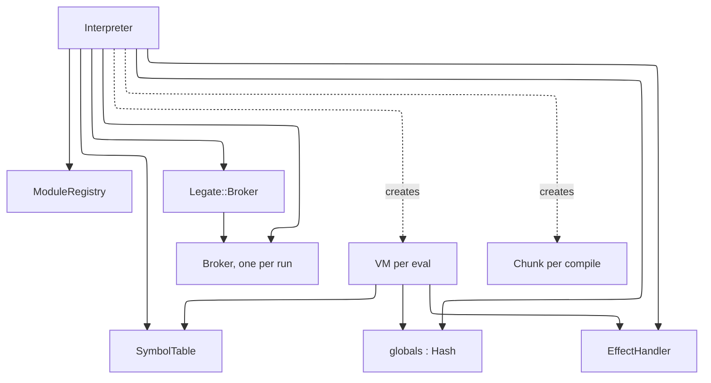
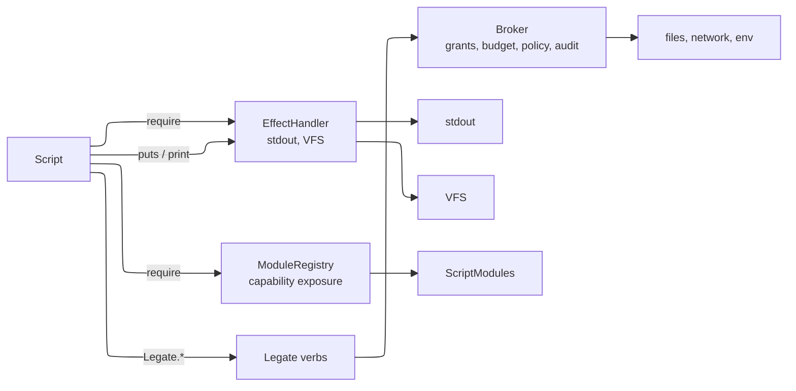
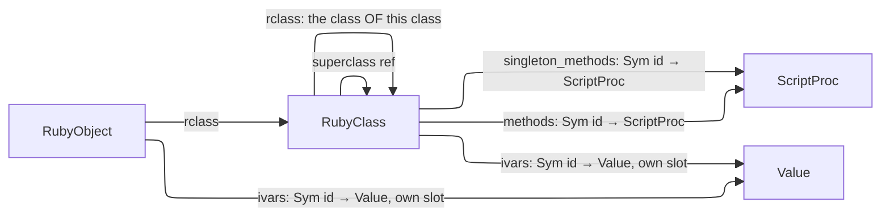
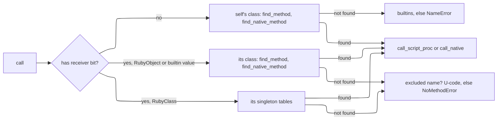
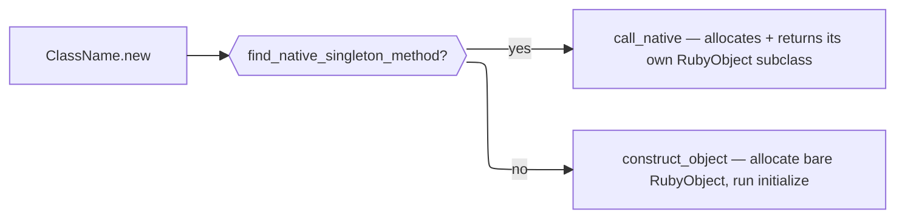
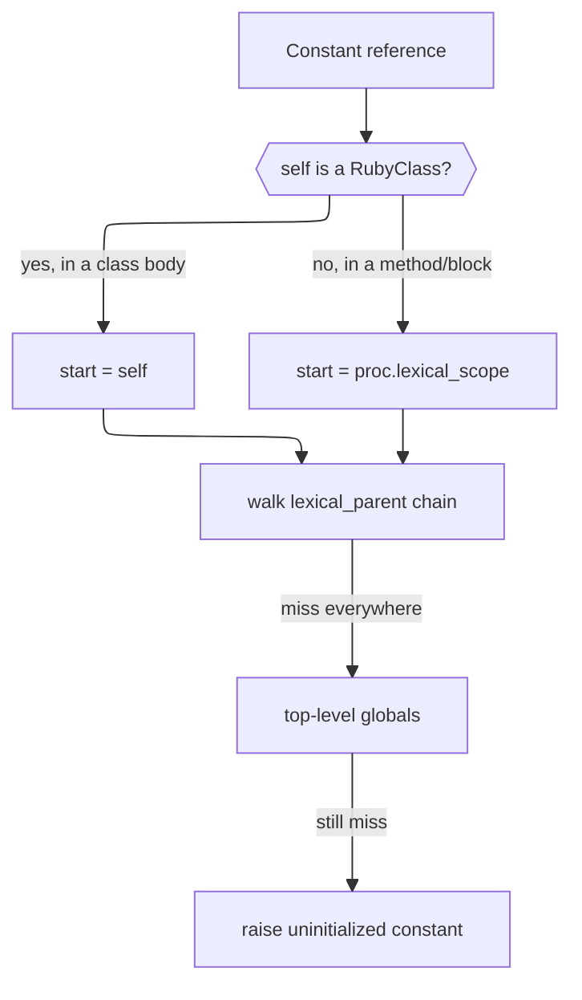
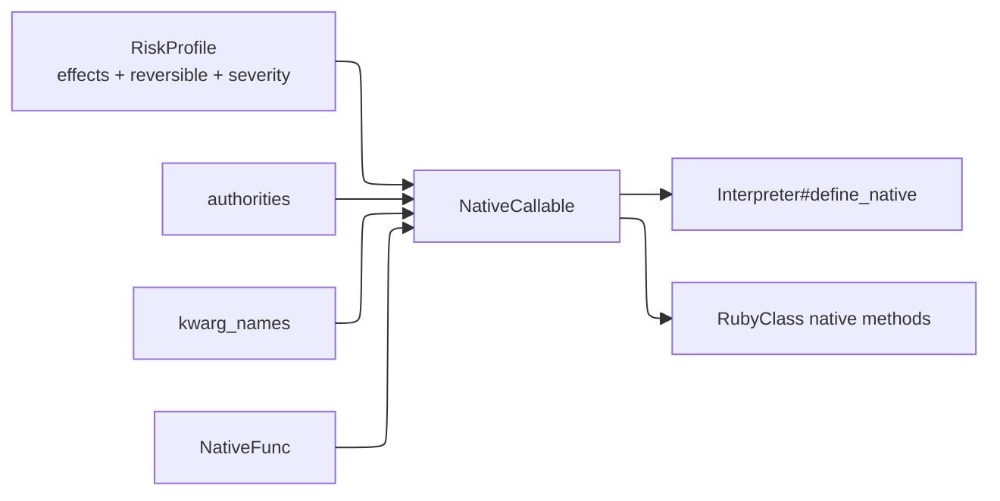
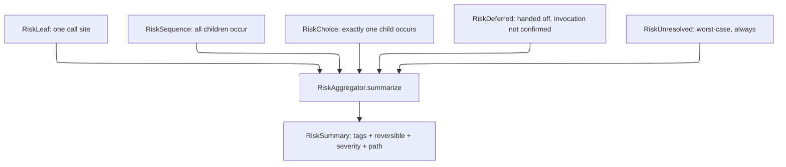
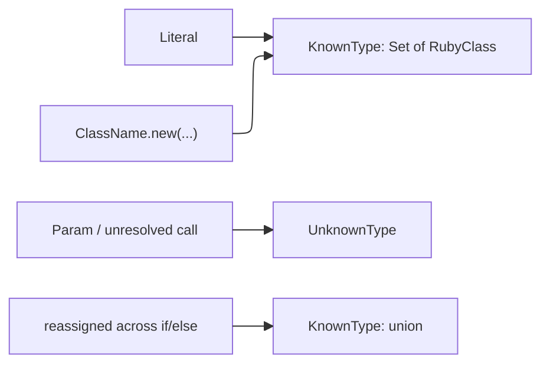
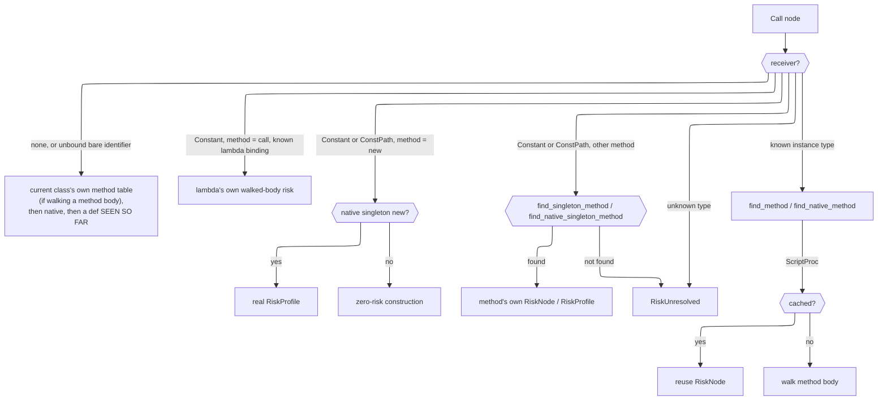

# Development Guide

How Adjutant works inside, for contributors and maintainers who need to understand, debug or extend it. It describes the current design and the reasoning a contributor needs; the history of how each piece got here is in the commit log.

## Dependencies

1. Install `ops`, either as a gem (`gem install ops_team`) or with Homebrew (`brew tap nickthecook/crops && brew install ops`).
2. If you aren't on macOS or an `apt`-based Linux, [install Crystal](https://crystal-lang.org/install/).

## Getting started

Command                                 |Description                                                                
----------------------------------------|---------------------------------------------------------------------------
`ops up`                                |Set everything up, including `crystal` via `apt` or `brew` where applicable
`ops build-debug`, `ops build`, `ops bd`|Debug build of every target in `bin/debug`                                 
`ops build-release`, `ops br`           |Release build of every target in `bin/release`                             
`ops lint`                              |Run `ameba` on `src/`                                                      
`ops clean`                             |Remove debug and release builds                                            
`ops wipe`                              |Clean, and clear the compiler cache                                        
`ops test_specs`                        |Run the Crystal specs                                                      
`ops test_scripts`                      |Build the script runner and run `spec/scripts/`                            
`ops test`                              |Specs, scripts, build and lint                                             

The build targets (`shard.yml`) are `test_runner`, `run_script` and `assess_script`.

### Samples

`samples/run_script.cr` runs a script through both risk layers: a static assessment before execution, then live risk-flow enforcement during it, prompting on stdin for any `Ask`. Its native module (`read_file`, `fetch_url`, `delete_file`, `post_data`, and `remove_path` and `configure` for keyword arguments) shows how native functions label data and declare sensitivity. Run `ops build`, then `bin/debug/run_script samples/scripts/risk_flow/risk_flow_ask.rb`. The other scripts in `samples/scripts/risk_flow/` show a run with no prompt, a hard rejection, and `declare_sensitivity` catching a risky literal.

`samples/assess_script.cr` parses a script without running it and prints its worst-case risk path and every finding: `bin/debug/assess_script samples/scripts/risk_static/risk_static_01.rb`. The scripts in `samples/scripts/risk_static/` exercise branches, loops, method discovery, collection literals and lambdas.

## How Adjutant works

Adjutant is a bytecode interpreter for a subset of Ruby, meant for scripts written by models and run by an agent harness. Four goals shape it: safe execution of untrusted scripts, an auditable effect boundary, syntax a Ruby-trained model already knows, and information flow control. Anything it accepts must behave as Ruby does; see [UNSUPPORTED.md](./UNSUPPORTED.md) for what it rejects instead.

### Pipeline overview


```mermaid
---
displayMode: compact
config:
  layout: elk
  themeVariables:
    fontSize: 12px
---
flowchart LR
    src[Source IO]
    lex[Lexer]
    par[Parser]
    com[Compiler]
    vm[VM]
    val[Value]

    src --> lex --> par --> com --> vm --> val
```

Each stage produces a self-contained artifact: `Array(Token)`, `Body` (the AST), `Chunk` (bytecode) and a `Value`. The stages are independently testable.

### Ownership and lifetime


```mermaid
---
displayMode: compact
config:
  layout: elk
  themeVariables:
    fontSize: 12px
---
flowchart TD
    interp[Interpreter]
    sym[SymbolTable]
    reg[ModuleRegistry]
    globals[globals : Hash]
    ef[EffectHandler]
    broker[Broker, one per run]
    lbroker[Legate::Broker]
    vm[VM per eval]
    chunk[Chunk per compile]

    interp --> sym
    interp --> reg
    interp --> globals
    interp --> ef
    interp --> broker
    interp --> lbroker
    lbroker --> broker
    interp -.creates.-> vm
    interp -.creates.-> chunk
    vm --> sym
    vm --> globals
    vm --> ef
```

The `Interpreter` is long-lived, meant to span an agent session. The symbol table, module registry and globals persist across `eval` calls; so do top-level methods, which are methods of Object. Top-level local variables don't: each `eval` gets a fresh top-level scope. A fresh `VM` runs each `eval`, sharing the interpreter's globals. One `Broker` per run holds the budget, audit log and open stream sources; `Legate::Broker` wraps it with Legate's grants.

### The Lexer

`Lexer` reads its whole `IO` into a String, since scanning needs random access, and produces `Token`s: a kind, the lexeme, line, column and `space_before?`, which says whether whitespace or a comment preceded the token. Source is UTF-8 throughout; identifiers are ASCII.

Ruby resolves several ambiguities from parser state the lexer doesn't have. Adjutant approximates them from the previous token and spacing:

- **`/`** divides after a token that can end an expression, starts a regex after an identifier only with space before and none after (`grep /foo/`), and otherwise starts a regex. A regex also needs a closing `/` on the same line, which keeps `def /(o)` and a lone `/` as operators (`regex_starts_here?`).
- **`<<`** opens a heredoc only with an uppercase or quoted identifier; bare `<<ID` also needs a token before it that can't end an expression, as for `/`.
- **`===`, `=~` and `!~`** are single tokens, so they get their own precedence and can be named as methods (and rejected, for `===`, by U017).

`%w[]` and `%i[]` are one token holding the raw body, which the parser splits on whitespace. Bracket delimiters nest; `\` keeps the next character, including a space. `%W`, `%I`, `%q`, `%Q` and `%r` aren't supported.

Heredocs (`<<ID`, `<<-ID`, `<<~ID`, the identifier optionally quoted) are resolved whole when the opener is scanned, since the string belongs at the opener's position while its body sits on later lines. The body is found by indexing the source without moving the cursor, so the rest of the opener's line scans normally. A single-quoted body becomes one String token; an interpolating body is tokenized by a sub-lexer whose source is the body, reusing the string-interpolation machinery. When scanning reaches the newline that starts the body, it jumps past it. One heredoc opener per line is supported.

### The Parser

`Parser` is recursive descent with a Pratt loop for binary operators, producing a `Body` of `Node`s that carry source positions.

**Spacing rules,** all through `Token#space_before?`, as Ruby's own lexer does it:

- `-` touching a numeric literal makes a negative literal: `-0.0.to_s` is `"-0.0"`, while `- 0.0.to_s` negates the call's result. `-a.to_s` is always `-(a.to_s)`.
- A bare call's first argument may start with `-` or `+` only with space before and none after: `eq -1, -1` is a call, while `a - b`, `a-b` and `n - 1` are binary, whether or not `a` is a local.
- `name(...)` is `name`'s own argument list; `name (6/3), 2` passes a parenthesized expression as a bare call's first argument.
- `key: value` needs the colon touching the key.

**`name [x]`** is indexing if `name` is a known local, otherwise a call with an array argument, as Ruby decides it at parse time. The parser tracks known locals in `@local_scopes`: a `def` pushes an empty scope, a block or lambda a copy of the enclosing one, and a `for` variable or `rescue => e` binding joins the current scope.

**Assignment** is resolved as soon as an assignable target is parsed, whatever precedence level the enclosing parse is at, since Ruby's grammar keys assignment on the target: `7 == tot = sum(3, 4)` is `7 == (tot = sum(3, 4))`, and `c = b = 5` chains. A multiple assignment's targets are parsed with `resolve_assignment: false`, since the `=` belongs to the multiple assignment. The right-hand side is parsed with `parse_expression(0)`, which includes `and` and `or`; that is a known divergence (SCOPE.md).

**Context flags.** `@no_do_block` stops a `while` or `for` header from taking the loop's `do` as a block. `@no_pipe` makes `|` end a block parameter's default (`|x = 9|`); it is suspended inside a nested block literal and restored after, so `{ |x = (a | b)| }` needs its parentheses.

**Desugaring.** `attr_reader`, `attr_writer` and `attr_accessor` with literal Symbols become the DefNodes the hand-written methods would, spliced into the enclosing body by `append_statement`: RiskWalker registers only DefNodes that are direct statements of a class body. `recv.attr = value` builds an `AttrAssign`, so the receiver is evaluated once. `def name=(v)` is recognised by an identifier touching a lone `=`. `alias` becomes a call to `__alias__`.

**Escapes.** Double-quoted strings decode Ruby's escapes, and an unknown escape drops the backslash (`"\d" == "d"`); single-quoted strings decode only `\\` and `\'`. Regex literals are never decoded: their backslashes belong to the regex engine.

**Rejections by name.** A global variable (`$x`) raises U011 when parsed. A bare `begin...end while cond` raises U016. `rescue e` is accepted as `rescue => e`, a divergence logged in SCOPE.md.

### The Compiler

`Compiler` walks the AST into a `Chunk`: fixed-size instructions (an opcode and immediates `a : UInt8`, `b : UInt16`, `c : UInt32`) and a constant pool. Jumps are patched after the fact.

**Scopes and locals.** Every body that holds locals has a `CompilerScope` mapping names to frame slots: the top-level program, each method, block and lambda body, and each class or module body. Method, block and lambda bodies compile in a child `Compiler` and get their own frame at runtime, so their slots start at 0. A class or module body runs in its enclosing frame, so its scope continues the slot numbering (`starting_slot`) and has no `parent`, since it can't see enclosing locals. `begin` opens no scope.

A block's scope has a `parent` chain mirroring the lexical nesting, ending at a method boundary. A name found in an enclosing scope compiles to `GetOuter`/`SetOuter` with a depth and slot; at runtime a frame's `outer_locals` is an `OuterChain` of the enclosing frames' own `locals` arrays, so a write reaches the real variable at any depth. A name in no scope compiles to `GetGlobal`/`SetGlobal`. A method, the top level or a class body defines a new local on first assignment; a block, lambda or `for` body stores it as a global instead, which is a Must Fix divergence (SCOPE.md). A `rescue => e` binding always defines a local in the current scope.

**Procs.** Each method, block and lambda body compiles to a `ScriptProc` in the parent chunk's constant pool, carrying its AST (`ast_body`, `ast_params`) for the risk walker and for argument binding. `MakeProc` pushes it; with `a=1`, for a lambda, it wraps it in a `Proc` object with the closure it captured.

**Default parameters** compile to a prologue at the top of the proc: for each parameter with a default, a check (`GetArgc` against the parameter's position, or `HasKwarg` by name) and, if omitted, the default expression and a store. Defaults run in order, so a default can use earlier parameters: `def add(a, b = a + 1)`.

**Loops and jumps.** `@loop_stack` holds a `LoopScope` per enclosing loop; `@ensure_stack` holds the begin regions open around the code being compiled. A `break`, `next` or `redo` that leaves begin regions first emits `EnterEnsure` and each region's ensure body, innermost first, down to the loop's `ensure_depth_at_entry` (or 0 inside a block, which has its own compiler). `LoopScope` is a struct, so fields are updated through the array index. A `break` outside a loop compiles to `BlockBreak`.

**Float literals** out of Float64's range become a signed 0.0 or Infinity, as IEEE-754 and mruby give, rather than failing to parse. The true base-10 exponent is computed from the digits first, so a 41-digit mantissa with `e-383` is judged by its real magnitude.

**Rejections.** The compiler raises U001 for a `&blk` parameter, U004 for a nested `def`, U016 for an assigned do-while and U017 for an operator method name that compiles to a fixed opcode.

### The VM

`VM` is a stack machine: a value stack, a frame stack and the shared globals. A `Frame` holds its `ScriptProc`, instruction pointer, stack base, `locals`, `outer_locals`, `self_val` and handler entries. The dispatch loop is a `case` on `Op`, compiled to a jump table.

**Non-recursive calls.** A script call pushes a frame and returns; the same loop runs it, and `Ret` restores the caller. Script recursion uses one Crystal frame, bounded by `ExecutionLimits#call_depth_limit`. Native code that must run script code synchronously (a block passed to `each`, `initialize` from `new`, `call_method`) uses `invoke_internal`, which swaps in a fresh frame array and value stack and runs a nested loop until that frame returns.

**Argument binding** (`bind_args`) walks the proc's parameters in order: a plain parameter takes the next positional argument, a splat collects the rest into a labelled Array, and a keyword parameter is taken by name from the call's keywords, else left for its default, else R011. Unknown keywords raise R012. Missing positional arguments are left nil and extras ignored, with no ArgumentError; that is a Must Fix divergence (SCOPE.md).

**Closures and blocks.** `SetBlock` captures the current frame and its `outer_locals` where the block literal is written; the call hands them to the callee as `block_outer_locals`, and `yield` runs the block with them, so it closes over where it was written. A block run by a native method (`invoke`) closes over the current frame, which is its defining frame while the call is live. A stored `Proc` is run by `invoke_proc` with its own captured closure. Yield targets that a native call would otherwise lose are carried on the frame (`block_yield`, `own_yield`).

**`self` and implicit calls.** `self` lives on the frame and is never nil: at top level it is `Interpreter#main`, an Object. `DefMethod` defines on self's class, so a top-level `def` is a private method of Object, callable bare or as `self.foo` from anywhere. A receiverless call resolves against self: an object's class, or for a class or module body its singleton tables and then its class's instance methods up to Object, which is how `puts` and native functions resolve there. Then builtins, then NameError.

**Constants** are assign-once: reassigning raises R001, and reopening a class or module raises U003, stricter than Ruby's warning so the risk walker can trust a constant.

**Limits.** `ExecutionLimits` bounds instructions (default unlimited) and call depth (default 256), raising script-catchable errors. `DefSingleton` on an object (rather than a class) defines on the object's class, since objects have no singleton tables.

### Operators

Every operator compiles to a fixed opcode except `<=>` and `=~`, which are method calls; `ValueOps` holds the type dispatch for builtin operands. A script can define `<=>`, from which `<`, `<=`, `>`, `>=` and `==` derive for its objects, standing in for Comparable: `==` is `(a <=> b) == 0`, and an error from `<=>` counts as not equal. Without `<=>`, `==` on objects is identity. Defining any operator that compiles to an opcode (`==`, `===`, the comparisons, arithmetic and bitwise operators) raises U017, since the definition would never run (`OVERLOADABLE_OPERATOR_NAMES`, despite its name, lists these). The `+`, `-` and `/` opcodes do call a native method on an object operand, which is how Time's `+` and `Legate::Path#/` work.

`===` is the `TripleEq` opcode, shared by `a === b` and `case`/`when`: a class matches instances of itself or its descendants, a Range checks its bounds (a nil bound is no limit), a Regexp matches, a Proc is called with the subject, and anything else uses `==`. It is fixed like `==`, so `x.===(y)` is an undefined method. The two call sites push their operands in the same order, subject then pattern: `case` pushes the subject once and each pattern on top of it, and `a === b` compiles its right operand first to match.

### Exception handling

`begin`/`rescue`/`ensure` is bytecode. Each frame keeps a stack of `HandlerEntry`s, one per active `begin` construct, each with an optional `rescue_ip` and `ensure_ip`. `Try` pushes an entry; `SetEnsure` adds its target to the entry `Try` just pushed, or pushes its own for an ensure-only construct. One entry per construct, rather than separate rescue and ensure stacks, keeps the order between constructs, so a more recent ensure-only `begin` is found before an older `rescue`.

When an instruction raises a RuntimeError, the loop walks the frames for the innermost entry: a `rescue_ip` is jumped to (clearing the rescue portion), otherwise an `ensure_ip` (stashing the error in `@pending_reraise`; `EndEnsure` re-raises it unless the ensure body raised its own). Rescue clauses are tried in source order, each clause's classes left to right, first match wins; a miss re-raises and the unwind continues. A bare `rescue` catches StandardError. `else` runs after the rescue portion is cleared, so its errors reach the construct's `ensure` but not its `rescue`. A method body is an implicit `begin`.

A script raise builds an error object of a real class (`Exception`, StandardError and the rest, bootstrapped by the Interpreter), which is what `rescue => e` binds. A native method raises through `ncc.raise_error` (a catalog code and a Ruby class) or `ncc.raise_error_class` (a computed message, for a nested class like `Legate::Malformed`). `raise_error_class` can also set attributes as ivars, for errors a script must branch on, such as `Legate::Redirect#status`; the error's class must define readers for them.

**`break` from a block** compiles to `BlockBreak`, which pops block frames. If none remain, the block was run by a native method: `BlockBreakSignal`, a plain Exception no script can rescue, unwinds to the nearest `call_native`, which returns the value. If a frame remains that yielded to the block, that frame's call ends with the value, as in Ruby. A `break` outside any loop or block is ignored, a divergence (SCOPE.md).

**Fatal signals.** `FatalSignal` (a denied grant, an exhausted budget, `Legate.fail`) is a plain Exception, not a RuntimeError: the dispatch loop never tries to match it against a `rescue`, and `call_native` re-raises it before its catch-all turns anything else into N001. That is what makes it unrescuable even by `rescue Exception`. An enforcer's fatal error must be a FatalSignal.

### The effect boundary


```mermaid
---
displayMode: compact
config:
  layout: elk
  themeVariables:
    fontSize: 12px
---
flowchart LR
    script[Script]
    ef[EffectHandler<br/>stdout, VFS]
    reg[ModuleRegistry<br/>capability exposure]
    leg[Legate verbs]
    br[Broker<br/>grants, budget, policy, audit]
    stdout[stdout]
    vfs[VFS]
    mods[ScriptModules]
    world[files, network, env]

    script -->|puts / print| ef --> stdout
    script -->|require| ef --> vfs
    script -->|require| reg --> mods
    script -->|Legate.*| leg --> br --> world
```

A script touches the outside world three ways. `EffectHandler`, supplied by the host, carries stdout and the virtual filesystem `require` reads. `ModuleRegistry` holds the modules a script can `require`, the manifest of what it can load. Legate's verbs reach files, the network and the environment, each through `Legate::Broker`, which checks the wall-clock budget, the grants (the perimeter) and the risk-flow policy, and writes an audit record. Ruby's own effectful classes (`File`, `ENV`, `system`, ...) aren't provided (U021).

#### Stream sources and `OpenSources`

A stream verb's iterator holds an OS resource (a file, an HTTP connection) for the length of a walk. It closes itself when the source is exhausted, but three ordinary cases never get there: `first(n)` and `take(n)` break out of the walk, which is what makes them lazy; an exception propagates out of it; or the script stops referring to the stream. So every stream source registers with the run's `OpenSources`, and `Interpreter#eval` closes whatever is left in an `ensure`, so the next script on the same Interpreter starts clean. Scope is the run, not the process: the process is the host application.

Two simpler designs don't work. Closing when a walk halts breaks sibling streams sharing a pull position (LEGATE.md §6.1, tested in `stream_spec.cr`): after `a = s.select {}; b = s.select {}; a.first(2)`, `b.to_a` keeps pulling from the same source. And Crystal's `finalize` may never run before the descriptor limit is hit, and runs at an arbitrary time on an arbitrary thread, where touching the broker, budget or audit log is unsafe.

`close_all` closes in reverse order of registration, so a wrapping source (`records`' `:jsonl` path wraps a line iterator) closes before what it wraps. Each close is rescued and the errors are returned, not raised: it runs from an `ensure`, often while the script's own error is unwinding, and a cleanup failure must not replace it. The count of open sources is capped by `ResourceLimits#max_open_streams`, since closing at the end of the run bounds a leak in time but not in number.

### The Value model

Every runtime value is a `Value` struct: a `raw` union (`Nil`, `Bool`, `Int64`, `Float64`, `String`, `Sym`, `ScriptProc`, `LabeledArray`, `LabeledHash`, `RubyClass`, `RubyObject`) and an optional risk-flow label. A struct, so scalars need no heap allocation; Crystal's union carries its own discriminant. A container's label lives on the `LabeledArray` or `LabeledHash` itself, shared by every Value holding it.

`Value#==` and `#hash` use `raw` alone, ignoring labels, so a labelled key matches an unlabelled lookup. Containers compare and hash by reference in a Crystal Hash, and an Integer and an equal Float are the same key; both differ from Ruby and are Must Fix (SCOPE.md).

Symbols are `Sym`s: an id and the interned name. One `SymbolTable` per Interpreter, so symbol comparison is an integer compare.

### The Object model


```mermaid
---
displayMode: compact
config:
  layout: elk
  themeVariables:
    fontSize: 12px
---
flowchart LR
    RubyClass -->|superclass ref| RubyClass
    RubyClass -->|rclass: the class OF this class| RubyClass
    RubyClass -->|methods: Sym id → ScriptProc| ScriptProc
    RubyClass -->|singleton_methods: Sym id → ScriptProc| ScriptProc
    RubyClass -->|ivars: Sym id → Value, own slot| Value
    RubyObject -->|rclass| RubyClass
    RubyObject -->|ivars: Sym id → Value, own slot| Value
```

`RubyClass` and `RubyObject` sit directly in the Value union. A class has method tables keyed by symbol id (script `methods`, `native_methods`, and their singleton counterparts), a `superclass`, an `rclass` (its class: `Integer.rclass` is Class), a `lexical_parent`, `constants`, class-level `ivars`, `included_modules`, `extended_modules`, and private-method overlays.

**Bootstrap.** Object, Class and Module are circular (Object's class is Class, Class's superclass is Module, Class's class is Class), so the Interpreter allocates all three and then links them, as CRuby does. There is no BasicObject. Every other class defaults to superclass Object and class Class. Class and Module can't be instantiated (U002).

**Dispatch.**


```mermaid
---
displayMode: compact
config:
  layout: elk
  themeVariables:
    fontSize: 12px
---
flowchart LR
    A[call] --> B{has receiver bit?}
    B -->|no| S[self's class: find_method, find_native_method]
    B -->|yes, RubyObject or builtin value| D[its class: find_method, find_native_method]
    B -->|yes, RubyClass| F[its singleton tables]
    S -->|not found| C[builtins, else NameError]
    D -->|found| E[call_script_proc or call_native]
    F -->|found| E
    S -->|found| E
    D -->|not found| X[excluded name? U-code, else NoMethodError]
    F -->|not found| X
```

A call with a receiver resolves on the receiver: an object or builtin value against its class's instance tables, a class against its singleton tables. Each lookup (`find_method`, `find_native_method`, and the singleton pair) checks a class's own table, then its included modules (last included first, recursively), then moves to the superclass. A name that resolves nowhere and that Adjutant excludes (`send`, `eval`) raises its U-code; otherwise NoMethodError.

**Visibility.** A top-level `def` is private, as in Ruby; a native method can register private with `is_private`. Private means callable without a receiver or with `self.` only (R023). Scripts can't declare visibility (U008). Privacy is decided by the definition that wins lookup.

**Native methods.** Builtin types are native methods on their classes (`builtins/`), each a `NativeCallable`. `define_native_method` has no default risk profile, so each registration decides it. `+`, the comparisons, `[]` and `[]=` on builtins are opcodes, so native code can't reach them through `call_method`; `ncc.add`, `ncc.compare` and `ncc.values_equal?` exist for that.

**Construction.**


```mermaid
---
displayMode: compact
config:
  layout: elk
  themeVariables:
    fontSize: 12px
---
flowchart LR
    A[ClassName.new] --> B{{find_native_singleton_method?}}
    B -->|yes| C["call_native — allocates + returns its own RubyObject subclass"]
    B -->|no| D["construct_object — allocate bare RubyObject, run initialize"]
```

A native `new` (a native singleton method) allocates its own object: a builtin with state that isn't a Value (a compiled Regex, a Time, an open stream) subclasses `RubyObject` with typed fields and calls `super(rclass)`. It must allocate `args.first.as_rclass`, the receiver, not a class captured at registration, or a subclass gets instances of its parent. Otherwise `new` allocates a RubyObject and runs `initialize`.

**Singleton methods.** `def self.foo` in a class body defines on the class's singleton table (`DefSingleton`). `extend M` makes M's instance methods singleton methods of the class; `include M` adds M to the instance-side lookup. Both are native methods of Module, so they work bare in any class or module body. A top-level `include` mixes into Object, as Ruby's `main` does; a top-level `extend`, and either with an explicit receiver, is excluded (U018).

**`super`** is its own opcode: it takes the current method's name and searches the receiver's `ancestors` after the method's `lexical_scope`, so a module between a class and its superclass is found. A class method's `super` searches `singleton_ancestors`, whose entries also say which table to check. Bare `super` forwards the method's current parameter values, read from the frame when it runs.

**Constants** are lexically scoped:


```mermaid
---
displayMode: compact
config:
  layout: elk
  themeVariables:
    fontSize: 12px
---
flowchart TD
    A[Constant reference] --> B{{self is a RubyClass?}}
    B -->|yes, in a class body| C[start = self]
    B -->|no, in a method/block| D[start = proc.lexical_scope]
    C --> E[walk lexical_parent chain]
    D --> E
    E -->|miss everywhere| F[top-level globals]
    F -->|still miss| G[raise uninitialized constant]
```

`A::B::X` looks up each step in that namespace's own constants, without the lexical walk. Blocks inherit the enclosing frame's lexical scope; methods fix it when defined.

**Ivars and cvars.** `@x` reads self's ivars: an object's own, or a class's class-level ivars in its body and class methods, which are separate slots. `@@x` belongs to self's class and is found up the superclass chain.

**Universal methods** (`class`, `superclass`, `is_a?`, `respond_to?`, `equal?`, `dup`, `clone`, and the fallbacks for `to_s`, `inspect` and `==`) are VM builtins in `exec_builtin`, not methods on Object, so `respond_to?` doesn't see them. `dup` and `clone` copy an object's ivars shallowly and run `initialize_copy` if defined. `is_a?` checks the superclass chain and direct includes only. Several of these differ from Ruby in edge cases, logged in SCOPE.md.

### `to_s` and `inspect`

Both are ordinary methods a script can override, with defaults on Object: `#<Foo>` and `#<Foo @x=1, @y="hi">`, without Ruby's memory address. Every implicit rendering (interpolation, `puts`, `print`, `p`) goes through `render_to_s`/`render_inspect`, which dispatch for anything that can be overridden and render scalars directly. A class's own `def self.to_s` is checked for before dispatching, so an override's own exception still propagates.

Array and Hash render each element with its own `inspect`; `to_s` is `inspect`. Hash uses `key: value` for every Symbol key, quoted when needed. Range renders bounds with `to_s` or `inspect` to match. A container that contains itself renders as `[...]` or `{...}`: `ncc.guard_rendering` keeps a VM-wide set of containers being rendered, keyed by Crystal `object_id`.

### Regexp and MatchData

`Regexp` and `MatchData` hold state that isn't a Value (`::Regex`, `::Regex::MatchData`), so each is a RubyObject subclass with typed fields, the pattern every stateful builtin follows. Regex literals interpolate like strings, but their text reaches the engine undecoded.

Crystal's regex engine is PCRE2; Ruby's is Onigmo. In Ruby, `^` and `$` always match at line boundaries, which PCRE2 does only with its MULTILINE option, so `Builtins.regex_options` always passes it, and maps Ruby's `m` flag (dot matches newline) to DOTALL. A spec guards this, since a naive one-to-one flag mapping would quietly break every `^` and `$`.

There is no `$~` or `$1` (U011): a global side channel would bypass risk-flow tracking. `MatchData` exposes everything they would, and `match` takes a block that receives the MatchData.

### Information flow control (risk flow)

Every Value may carry a `RiskFlowLabel`: a set of `ProvenanceTag`s, each a `kind` (`File`, `Host`, `Env`, ...), an `origin` (the path, host or variable name) and a `sensitivity` (`None`, `Elevated`, `High`) taken from the policy when the tag is made. Combining values joins their labels (set union, same-origin tags keeping the worse sensitivity). Sensitivity never decreases; declassification was rejected (see research/IFC_DESIGN.md).

A container's label is a mutable field on the container, so storing a labelled value into it (`<<`, `[]=`) raises its label for good, even if the element is later removed. A native method that builds a new container from an existing one must seed the new label from the source container's label (`Helpers.joined_label`'s `seed`), not only from the elements it kept.

**Enforcement.** Before a native call whose `NativeCallable` declares authorities, `VM#check_risk_flow` checks every labelled argument, keywords included, against each authority: `RiskFlowPolicy#action_for(authority, sensitivity)` gives Allow, Ask or Reject. Non-Allow results become `RiskFlowMatch`es, worst first, in a `RiskFlowDecisionRequest`; Reject raises RiskFlowRejectedError, which a script can rescue, and Ask goes to the host's `on_risk_flow_decision`. There is no default that skips assessment: the policy and callback are required, and `RiskFlowPolicy.reject_all` is the explicit "no flows" choice.

**Literals.** Labels only exist where data passed through a labelling call, so `delete_file("/etc/passwd")` would carry none. `ncc.declare_sensitivity(authority, kind, origin)` makes a native function check its own subject: it looks the origin up in the policy and runs the same check. Call it before checking whether the subject exists, as the broker does, so a rejected sensitive path doesn't reveal whether it exists.

**The flow log.** `Interpreter.new(risk_flow_tracking: true)` records every join as a `RiskFlowEvent`, for audit and debugging; disabled, `record` is a no-op. Labels, tags and the log are JSON::Serializable.

### Writing a ScriptModule

A `ScriptModule` is a unit a script loads with `require`:

```crystal
class MyModule < Adjutant::ScriptModule
  def name : String
    "agent/mymodule"
  end

  def load(interp : Adjutant::Interpreter) : Nil
    interp.define_native("my_func") do |args|
      Adjutant::Value.string(do_something(args.first.as_string))
    end
  end
end

interp.modules.register(MyModule.new)
```

Or with a block: `interp.modules.register("agent/mymodule") { |i| i.define_native("my_func") { |args| ... } }`. A module loads once per Interpreter however often it's required.

A function that **produces data** labels what it returns, with sensitivity from the policy:

```crystal
interp.define_native("fetch_data") do |args|
  url = args.first.as_string
  sensitivity = interp.risk_flow_policy.sensitivity_for(Adjutant::ProvenanceKind::Host, url)
  label = Adjutant::RiskFlowLabel.of(Adjutant::ProvenanceKind::Host, url, sensitivity)
  Adjutant::Value.string(http_get(url), label)
end
```

A function that **consumes a risky argument** declares its authority, so labelled arguments are checked, and declares its subject's sensitivity, so a literal is checked too:

```crystal
interp.define_native("delete_file",
  risk: Adjutant::RiskProfile.new(effects: Set{Adjutant::Effect::DeletesFiles},
    reversible: Adjutant::Reversibility::No, severity: Adjutant::Severity::Error),
  authorities: Set{Adjutant::Authority::Delete}) do |args, _blk, ncc|
  path = args.first.as_string
  ncc.declare_sensitivity(Adjutant::Authority::Delete, Adjutant::ProvenanceKind::File, path)
  File.delete(path)
  Adjutant::Value.bool(true)
end
```

**Naming collisions with Crystal's stdlib are expected.** Adjutant names things as Ruby does, so `Log`, `Random` and `Match` also name Crystal types. Keep the Adjutant name and qualify (`::`) the stdlib reference at the sites that need it, with a short comment. For example, `Legate::Verbs::Random` hides `::Random` for every file in `legate/verbs/`, so those files write `::Random::Secure`.

#### Native keyword arguments

A native function accepts keywords by naming them; any other keyword raises R012, as for a script method:

```crystal
interp.define_native("configure", kwarg_names: Set{"timeout"}) do |args, blk, ncc|
  timeout = ncc.kwargs.try(&.["timeout"]?).try(&.as_int) || 30_i64
  Adjutant::Value.int(timeout)
end
```

There are no declared defaults: a native call has no frame to run a default expression in, so the function supplies its own when a key is missing, as mruby's `mrb_get_args` does. Keywords arrive through `NativeCallContext#kwargs` rather than a wider `NativeFunc` signature, so functions that don't use them are unaffected. A native `new` accepts `kwarg_names` the same way. Keyword values are walked by the risk walker and checked by `check_risk_flow` exactly as positional ones. Native functions don't check positional arity (SCOPE.md).

### Side-effect risk

Every native callable carries a static `RiskProfile`, declared when registered, so a harness can report a script's effects before running it.


```mermaid
---
displayMode: compact
config:
  layout: elk
  themeVariables:
    fontSize: 12px
---
flowchart LR
    RP[RiskProfile<br/>effects + reversible + severity] --> NC[NativeCallable]
    AU[authorities] --> NC
    KW[kwarg_names] --> NC
    NF[NativeFunc] --> NC
    NC --> DN["Interpreter#define_native"]
    NC --> RC["RubyClass native methods"]
```

Two vocabularies answer two questions. `Effect` is what a call does to the world, and so why it's risky: `ReadsFiles`, `WritesFiles`, `DeletesFiles`, `MovesFiles`, `Recursive`, `ExecutesCode`, `NetworkEgress`, `ExternalOutput`, `ElevatedPrivilege`, `ModifiesEnvironment`. `Authority` is what a call may do, which is enforced: `Read`, `Write`, `Delete`, `Net`, `Ambient`, `Log`. A move needs Delete and Write authority but destroys nothing, so `mv` declares only `MovesFiles`.

An authority is a **grant** (what a provider authorizes against, through `Broker#authorize`), a **sink** (declared in a callable's `authorities`, so `check_risk_flow` checks labelled arguments reaching it), or both. `Ambient` is only a grant, for `Legate.env`'s allowlist; `Log` is only a sink, since `Legate.log` has no grant.

Effects are the reason; `Reversibility` and `Severity` are conclusions. A profile with no effects must be reversible and Info, and anything else raises, since the missing piece is an effect. `Reversibility::Depends` needs a `note` naming the condition.

`EffectProvider` has one implementer, `Legate::Broker`, and its `authorities` is not yet read by anything. It exists for two things that will need to iterate providers rather than dispatch to them: a unified config, where each provider parses its own section, and LEGATE.md §10.1's grant inference. That inference is specified as walking the call graph for `Legate.*` names; it should key on registered providers instead, or a second provider would get enforcement but no static manifest.

#### Destructive verbs

A Legate verb that would destroy an existing destination refuses, and its bang variant does it: `write!`, `cp!`, `mv!`. The perimeter can't catch this kind of loss, since a destination inside a granted write root is exactly what the grant permits, so the refusal has to be the verb's. The bang means only "the more destructive form". Deleting has no destination, so it splits by name instead: `rm` (a file), `rmdir` (an empty directory), `rmdir!` (a tree). That also made `Effect::Recursive` usable: `rmdir!` always recurses, so the name is the fact, where a `recursive:` flag would need its literal value read. `cp` keeps `recursive:`, which is about the source, beside its bang, which is about the destination.

Symlinks: a symlink named directly is resolved by the perimeter (`check_root_maybe_missing` realpaths the deepest existing ancestor, and replaces a dangling link with its target), so one pointing outside every root is denied, whether or not its target exists. Verbs still don't follow symlinks where it matters: to report a dangling link at a destination as occupied, and so that `rmdir!` doesn't descend into a linked directory, since only the tree's root is authorized. A tree copy, `cp`'s recursive one or `mv`'s cross-device fallback, goes through `Legate::TreeCopy`, which recreates each link as a link and never follows one, so every entry stays inside the authorized root.

#### Structured risk: RiskNode and RiskAggregator

A flat union of profiles would merge an `if`'s safe branch and destructive branch as if both ran. `RiskNode` keeps the control-flow shape:


```mermaid
---
displayMode: compact
config:
  layout: elk
  themeVariables:
    fontSize: 12px
---
flowchart TD
    Leaf["RiskLeaf: one call site"] --> Agg[RiskAggregator.summarize]
    Seq["RiskSequence: all children occur"] --> Agg
    Choice["RiskChoice: exactly one child occurs"] --> Agg
    Deferred["RiskDeferred: handed off, invocation not confirmed"] --> Agg
    Unresolved["RiskUnresolved: worst-case, always"] --> Agg
    Agg --> Sum[RiskSummary: tags + reversible + severity + path]
```

- `RiskSequence`: children that all run; `iterated: true` for a loop body. Effects union; the worst severity and reversibility win.
- `RiskChoice`: exactly one child runs (`if`, `case`, rescue clauses). The worst branch wins, and its origin is kept for the path.
- `RiskDeferred`: a lambda passed as an argument, which the callee may or may not call. Counted in full, as unresolved calls are.
- `RiskUnresolved`: a call the walker couldn't resolve, counted as Error. Adjutant has no dynamic dispatch, so these should be rare; a common one means the walker needs work.

`RiskAggregator.summarize` returns the single worst path; `all_findings` returns every leaf with its branch path and whether it's iterated, leaving grouping and filtering to the host.

#### TypeInference

A call resolves only if its receiver's class is known. `TypeInference` infers local variables' types without running the script:


```mermaid
---
displayMode: compact
config:
  layout: elk
  themeVariables:
    fontSize: 12px
---
flowchart LR
    Lit[Literal] --> Known[KnownType: Set of RubyClass]
    New["ClassName.new(...)"] --> Known
    Param[Param / unresolved call] --> Unknown[UnknownType]
    Branch["reassigned across if/else"] --> Union["KnownType: union"]
```

Integer, Array and Hash literals and `ClassName.new` have a known type; other literals, parameters and call results are unknown. A variable given different types on different branches gets a union (`TypeHint.merge`); a loop is merged as zero or one passes. `BUILTIN_CLASS_NAMES` maps literal node classes to builtin types.

#### RiskWalker

`RiskWalker` builds the RiskNode tree from a parsed `Body`, with `TypeInference` resolving receivers. It never runs the script, so it discovers `def`, `class` and `module` as it walks.


```mermaid
---
displayMode: compact
config:
  layout: elk
  themeVariables:
    fontSize: 12px
---
flowchart TD
    Call[Call node] --> Recv{{receiver?}}
    Recv -->|none, or unbound bare identifier| GlobalLookup["current class's own method table\n(if walking a method body),\nthen native, then a def SEEN SO FAR"]
    Recv -->|Constant, method = call, known lambda binding| ConstLambda[lambda's own walked-body risk]
    Recv -->|Constant or ConstPath, method = new| Ctor{{native singleton new?}}
    Ctor -->|yes| CtorRisk[real RiskProfile]
    Ctor -->|no| CtorZero[zero-risk construction]
    Recv -->|Constant or ConstPath, other method| SingLookup{{find_singleton_method / find_native_singleton_method}}
    SingLookup -->|found| SingRisk[method's own RiskNode / RiskProfile]
    SingLookup -->|not found| Unresolved
    Recv -->|known instance type| ClassLookup["find_method / find_native_method"]
    Recv -->|unknown type| Unresolved[RiskUnresolved]
    ClassLookup -->|ScriptProc| Memo{{cached?}}
    Memo -->|yes| Cached[reuse RiskNode]
    Memo -->|no| WalkBody[walk method body]
```

- **Order.** A top-level def, class or module is visible only to calls after it, as at runtime, where an earlier call is a NameError. Calls between a class's own methods resolve whatever their order, since methods run after the class body. The walker keeps its own tables of defs and classes seen, consulted before the Interpreter's.
- **Class bodies.** `walk_class` registers instance and singleton defs, nests inner classes and modules in its constants (so `M::A` resolves), mirrors `include` and `extend`, and walks other statements immediately.
- **Receivers.** A class receiver resolves against its singleton tables, `.new` against a native `new` (else zero risk), a known instance type against its class, and an unknown type is unresolved.
- **Bare names.** A bare identifier is a local read if the Env binds it, otherwise an implicit call, as the compiler decides. A bare call in a method body resolves against that method's class first.
- **Method bodies** are walked once, on first call, with every parameter unknown, and memoized per ScriptProc, so a method's risk doesn't depend on its caller. So `def process(f); f.read; end` never learns what `f` is. Recursion becomes a leaf marked recursive, escalated like a loop.
- **Blocks and lambdas.** A block attached to a call is folded in as an iterated body, closing over the enclosing Env. A lambda literal, or a constant bound to one, passed as an argument is walked and wrapped in RiskDeferred; `CONST.call` resolves to the lambda's risk directly. A lambda assigned to a variable isn't walked: which lambda a variable holds can't be known.
- **Coverage.** `if`, `unless` and `case` are Choices; loops are iterated Sequences; `begin` is a Choice of the body and each rescue clause followed by the ensure; an assignment's right-hand side, every call argument and receiver, and every element of a collection literal are walked.

## Error reporting

Errors are data, rendered late. A `Diagnostic` carries a code, spans and substitution data, and no prose: the summary, `why` and `help` come from `ErrorCatalog` by code. `DiagnosticRenderer` renders Markdown or plain text, quoting the source line from the Interpreter's `SourceMap` with carets under the span. The code's letter names the kind of problem, never the subsystem; see [ERRORS.md](./ERRORS.md).

- **Spans are as precise as their phase.** The parser knows line, column and length; the compiler line and column, and a length when the raise site works one out; the VM only the line. A renderer draws no carets without a column and one without a length. A nil filename means the unit being compiled; the renderer supplies it.
- **A nil diagnostic means the script raised the error itself.** `raise "boom"`, or a re-raise, belongs to the script's author and has no code, so `render_error` returns nil and the host shows the message.
- **The rescuable object stays Ruby-shaped.** A RuntimeError's `error_value`, what a script rescues, carries only the summary. The code, `why` and `help` are for whoever reads the output.
- **I codes** mean Adjutant is broken: no `help`, a report footer pointing at `Interpreter#report_url` instead, and a `why` written for the maintainer.

Hosts should go through the Interpreter: `interp.parse` registers the source and returns a Body, `interp.eval(body, filename)` runs an assessed Body, and `interp.render_error` renders. Using `Parser` directly skips registration, and diagnostics lose their snippets.

### Working on diagnostics

ERRORS.md is for whoever hits an error; this is the maintainer's half. `error_catalog.cr` is authoritative, and a spec fails if ERRORS.md disagrees on codes or placeholders.

**Adding a code:** an `Entry` in `ENTRIES`, a row in ERRORS.md, and for a U code an entry in UNSUPPORTED.md (and a `skill_spec.cr` coverage decision). Name the construct; never mention a repository file, which means nothing to the reader; keep `why` and `help` distinct. Choose the letter by who can reach the failure, not by what failed.

**Decisions not to relitigate:**

- **P001 has no `why` or `help`.** It covers every expected-token failure; span labels carry the specifics. P003 exists because a missing `end` has something general to say.
- **R001 and U003 share one guard**, the assign-once constant rule, told apart by whether both values are classes.
- **The rescuable class is set apart from the code.** R008 raises NameError, and F001 RiskFlowRejectedError, because the subset rule outranks tidiness.
- **H codes share no exception class.** H001, H002 and H004 are `HostArgumentError < ArgumentError`, being bad arguments; H003 stays `AmbiguousRiskFlowPolicyError`, being configuration state. H004 is reachable only from a native function, so it surfaces as N001 carrying H004's text.
- **I codes ride on the accurate class**: CompileError, RuntimeError, or `InternalError` for I007, raised by `RiskAggregator.summarize`, which is neither.
- **L help text must not promise a setting that doesn't exist.** L002 and L004 name `ExecutionLimits` settings; L001 and L003 guard fixed constants, and a spec asserts L003's help mentions no setting. L003 has no trigger test: the call-depth limit and parser recursion come first.
- **U016 is enforced in two places** because it can be written two ways: the parser rejects a bare `begin...end while`, the compiler the assigned form.
- **U017 is checked first in `compile_def`**, before the nesting check.
- **Unenforced U codes** are tracked in SCOPE.md's Error reporting group; ERRORS.md only says they're unenforced.

## Unsupported features

Some Ruby features are excluded on purpose, either because they would make a call's target or effect unknowable before running the script, or as a scoping cut. [UNSUPPORTED.md](./UNSUPPORTED.md) records each, with the reasoning, what to write instead, and whether it fails loudly. The test for a proposed feature is *"does this let a call site's target or effect become unknowable before running the script?"* If so, no implementation effort makes it safe.

## Known gaps

[SCOPE.md](./SCOPE.md) tracks defects and missing features: Must Fix (anything that runs differently from Ruby, and security defects) and Will Fix.
