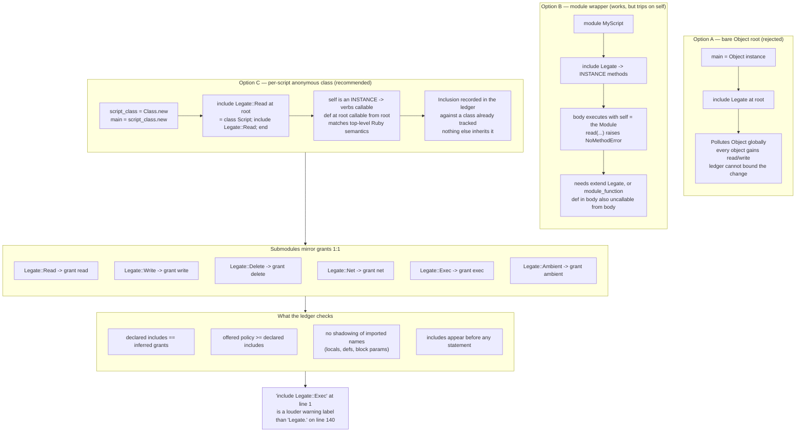
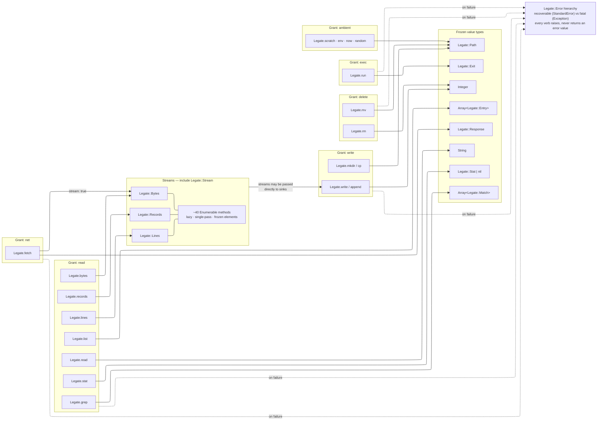
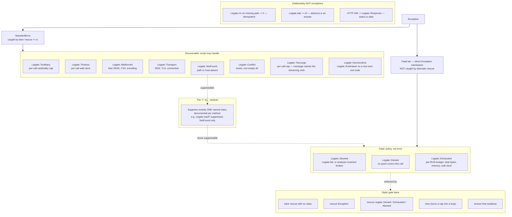

# Legate — External API Specification

**Status** Design document. Normative where it says MUST; advisory elsewhere.
**Audience** Two readers: the model writing Legate scripts (§2–§7 are the schema it needs) and the implementer building the runtime (§8–§11 are the obligations).

---

## 1. Scope and principles

Legate is a proper subset of Ruby. This document specifies only the **external surface**: the verbs that touch the world and the types they return. The pure core (Enumerable, String, Hash, Numeric, JSON, Regexp) is specified separately; it is ordinary Ruby with mutation removed.

Seven principles govern every decision below.

1. **One chokepoint.** Every effect passes through `Legate`. A reviewer greps `Legate\.\w+` and has a complete list of what a script can do.
2. **No handles.** No object in Legate holds an open file descriptor or socket that a script can store, pass, or close. Authority is exercised, not held.
3. **One error regime.** Legate raises, because Ruby raises. A model's priors about failure handling are correct everywhere or nowhere; they must be correct everywhere.
4. **Policy is not error.** A grant denial is the system working. It is unrescuable by construction (§9.2), not merely discouraged.
5. **Frozen and pure.** Every value returned by Legate is deeply frozen. Every method on those values is a pure function of its receiver.
6. **Errors teach.** A cap that fires MUST raise with a message naming the verb that would have worked. The exception message is the documentation.
7. **Never fight muscle memory.** Where Legate retains a Ruby construct, it MUST behave exactly as Ruby does. Novel vocabulary is cheap to learn; altered semantics for a familiar keyword are not, because the author will not know to look them up. Anything Legate cannot support in full it removes outright (§1.2, §8.7) rather than reshaping.

### 1.1 Why a module and not top-level verbs

`Legate.read` costs one extra token over `read` and buys three things: it cannot be shadowed by a local variable, it is unambiguously greppable, and it signals novelty — so the model consults the spec rather than assuming `File`'s full surface. The prefix is the point.

### 1.2 What is deliberately absent

`File`, `Dir`, `IO`, `Pathname`, `ENV`, `Socket`, `Net::*`, `Kernel#open`, `Kernel#system`, backticks, `%x[]`, `Process`, `Thread`, `Marshal`, `YAML`, `JSON.load`, `eval`, `send`, `ObjectSpace`, `at_exit`, `trap`.

A Legate runtime MUST undefine these constants and methods rather than leaving them present-but-broken. A `NameError` at parse time is a clean failure; a `NoMethodError` at line 340 of a long-running script is not.

### 1.3 Execution model

A Legate script is evaluated as the body of a **fresh anonymous class, instantiated once**:

```
script_class = Class.new     # created per script; nothing else inherits from it
main         = script_class.new
```

This is an implementation detail of the runtime and MUST NOT be visible in the language. The consequence is that every top-level construct behaves exactly as it does in an ordinary Ruby script:

At script root               |Behaviour                                                  |Same as plain Ruby?           
-----------------------------|-----------------------------------------------------------|------------------------------
`def helper`                 |instance method on the script class; callable from the body|yes                           
`include M`                  |mixes into the script class only                           |yes, and `Object` is untouched
`extend M`                   |singleton of the instance                                  |yes                           
`CONST = 1`                  |scoped to the script class                                 |yes                           
`class Parser` / `module Fmt`|nested definitions, ordinary semantics                     |yes                           

Two alternatives were rejected. Evaluating at a bare `Object` root means a top-level `include` mutates `Object` globally, which the risk ledger cannot bound. Requiring an explicit `module MyScript … end` wrapper works, but costs two rules that cut against Ruby habit — `extend` rather than `include` for the verbs, and `def self.helper` rather than `def helper` — both of which must then be taught and will be forgotten. The anonymous class buys the same containment with nothing to teach (principle 7).

**Capabilities do not descend into nested definitions.** A class defined inside a script does not inherit the script's includes:

```ruby
include Legate::Read

class Parser
  def load(p) = read(p)      # NoMethodError — Parser includes nothing
end
```

This is intended: helper classes are pure unless they declare otherwise, and any nested declaration is recorded in the ledger. Because it will nonetheless surprise, the diagnostic MUST name the cause — *"`read` is not available here: `Legate::Read` is included on the script root, not on `Parser`. Use `Legate.read`, or include `Legate::Read` in `Parser`."*


*Execution model: why a per-script anonymous class, and how the submodules relate to the inclusion ledger.*

---

## 2. Conventions

### 2.1 The error regime

**Legate raises.** There is no result-value convention, no `err?`, no `.or`, no `.must`.

Error values are better suited to static analysis in isolation, but Legate scripts are written by models fluent in ordinary Ruby, where `Hash#fetch`, `Integer()` and `JSON.parse` all raise. A surface where the core language raises and the capability layer returns values forces the author to track two regimes, and its priors will win: it will write `rescue` around Legate calls and omit the value checks. Consistency with the host language is worth more than the analytical convenience, and §10 recovers most of the latter anyway.

```ruby
config = Legate.read("config.json")          # raises Legate::NotFound if absent

rows = begin
         Legate.records("data.jsonl", format: :jsonl).to_a
       rescue Legate::Malformed => e
         Legate.log "bad input", path: e.path
         []
       end
```

### 2.2 Two tiers

Every Legate exception is either **recoverable** (under `StandardError`) or **fatal** (a direct subclass of `Exception`). The distinction is not severity but *who is permitted to recover*. See §9.

Because `rescue => e` catches only `StandardError`, idiomatic Ruby cannot accidentally swallow a fatal exception. The static gate ensures it cannot deliberately swallow one either.

### 2.3 What does not raise

Three cases where failure is an ordinary answer rather than an error. Each is a deliberate exception to §2.1 and MUST be documented as such at the call site.

Case                            |Returns           |Why                                                                
--------------------------------|------------------|-------------------------------------------------------------------
`Legate.stat` on a missing path |`nil`             |"Does this exist" is a question with a negative answer             
HTTP non-2xx from `Legate.fetch`|`Legate::Response`|A status code is data about the response, not a failure of the call
`Legate.rm` on a missing path   |`0`               |Removal is idempotent; the postcondition holds                     

The general rule: **the outcome of the operation raises; the content of the result is data.**

### 2.4 Paths

Every verb that names a filesystem location accepts a `String` or a `Legate::Path`. Implementations MUST convert strings to `Legate::Path` at the boundary and perform all policy checks on the converted value.

Scripts are encouraged to use `Legate::Path` throughout: it makes traversal bugs into construction errors rather than broker rejections.

### 2.5 Nilable variants

Some verbs have a variant that returns `nil` in place of raising. The rule is exact:

> A nilable variant suppresses **exactly one** named exception class, documented on the method, and **never** a fatal one.

`Legate.read?` returns `nil` when the path is absent. It still raises `Legate::Denied` if no grant covers the path, and still raises `Legate::TooLarge` if the file exceeds the read limit. Suppression is per-class, not blanket.

**Naming.** In Ruby, `?` denotes a predicate — `empty?`, `include?`. It is safe on operators and accessors, where a boolean reading is impossible:

```ruby
hash[:key]?      # -> value or nil
array[9999]?     # -> element or nil
entry.stat?      # -> Legate::Stat or nil
```

For word-named verbs, where `Legate.read?` would plausibly read as "can I read this?", use the `missing:` keyword instead:

```ruby
Legate.read("config.json", missing: nil)     # -> String or nil
Legate.read("config.json", missing: "{}")    # -> String or the default
```

Implementations MAY provide `Legate.read?` as an alias but SHOULD NOT advertise it in the model-facing schema.

### 2.6 Encoding

All text returned by Legate is UTF-8. Invalid byte sequences are replaced with U+FFFD unless the verb is given `scrub: false`, in which case invalid input raises `Legate::Malformed`. Binary data is returned only by `Legate.bytes` and is tagged ASCII-8BIT.

### 2.7 Verb availability and the optional manifest

Every verb is available fully qualified, always, with no setup:

```ruby
Legate.read("config.json")
```

`Legate` is additionally partitioned into submodules that mirror the grants one-for-one (§7). A script MAY include them to drop the prefix:

```ruby
include Legate::Read
include Legate::Write

rows = records("input.jsonl", format: :jsonl)
write "out.json", rows.map { it[:id] }.to_json
```

Submodule        |Grant    |Verbs                                                
-----------------|---------|-----------------------------------------------------
`Legate::Read`   |`read`   |`read` `stat` `list` `grep` `lines` `bytes` `records`
`Legate::Write`  |`write`  |`write` `append` `mkdir` `cp`                        
`Legate::Delete` |`delete` |`rm` `mv`                                            
`Legate::Net`    |`net`    |`fetch`                                              
`Legate::Exec`   |`exec`   |`run`                                                
`Legate::Ambient`|`ambient`|`scratch` `env` `now` `random` `log` `fail`          

**The manifest is optional and MUST remain so.** Grants are inferred from the call graph regardless (§10.1), so the analysis never depends on the declaration. Where includes are present, the analyser cross-checks them against the inference and the policy — a free additional signal, not a requirement.

Optionality is what makes the submodules costless: an author who cannot recall whether `grep` lives in `Legate::Read` writes `Legate.grep` and is correct. The submodules are something to reach for, never something to learn.

Two constraints apply when a manifest is used, both statically checked (§10.4):

- Includes MUST precede any executable statement. Ruby's `include` mutates the ancestor chain where it executes, so a mid-script include changes the meaning of the lines above it on a second reading.
- No local variable, method definition, parameter or block parameter may shadow an imported verb name. Ruby resolves the script's own definitions ahead of an included module, so a stray `def read` silently displaces a capability with a lookalike.

`Legate::Exec` and `Legate::Delete` are importable like the rest, rather than permanently qualified as a warning label — an asymmetric rule is one more thing to misremember, and `include Legate::Exec` on line 1 is a louder, policy-checkable warning than a `Legate.` prefix on line 140.

### 2.8 Determinism

`Legate.now` and `Legate.random` are the only sources of nondeterminism. They are grants, not core functions, so a policy may pin them for replay. Nothing else in Legate varies between two runs given identical inputs.

---

## 3. Type index

Type                          |Returned by             |Kind        
------------------------------|------------------------|------------
`Legate::Path`                |constructed by script   |frozen value
`Legate::Stat`                |`Legate.stat`           |frozen value
`Legate::Entry`               |`Legate.list` (elements)|frozen value
`Legate::Match`               |`Legate.grep` (elements)|frozen value
`Legate::Response`            |`Legate.fetch`          |frozen value
`Legate::Exit`                |`Legate.run`            |frozen value
`Legate::Lines`               |`Legate.lines`          |stream      
`Legate::Bytes`               |`Legate.bytes`          |stream      
`Legate::Records`             |`Legate.records`        |stream      
`Legate::Error` and subclasses|raised                  |exception   

Streams share the `Legate::Stream` protocol (§6). Everything else is an immutable record.


*Grants, verbs, and the value types each verb returns.*

---

## 4. `Legate` — the verb module

Signatures use Ruby keyword-argument syntax. `->` names the return type. **Raises** lists the recoverable exceptions specific to the verb; every verb may additionally raise the fatal tier (§9.2), which is not repeated below.

### 4.1 Reading — grant `read`

```ruby
Legate.read(path, limit: policy.read_limit, scrub: true, missing: :raise)  -> String
```
Whole-file read. MUST check size before allocating. Raises `Legate::TooLarge` whose message names `Legate.lines` and `Legate.bytes`. Default limit 8 MiB.
**Raises** `NotFound`, `TooLarge`, `Malformed` (encoding, when `scrub: false`). **Suppressible** `NotFound`, via `missing:`.

```ruby
Legate.stat(path)  -> Legate::Stat | nil
```
Returns `nil` for a non-existent path (§2.3). One call replaces `exist?`, `file?`, `directory?`, `size` and `mtime`, and gives a single consistent snapshot rather than five racing ones.
**Raises** nothing recoverable.

```ruby
Legate.list(pattern, limit: 100_000)  -> Array<Legate::Entry>
```
Glob. `Legate.list("src/*")` is `ls`; `Legate.list("**/*.rb")` is `find`. Results sorted lexically for determinism. Symlinks reported, not followed. An empty match is an empty Array, not an error.
**Raises** `TooMany`.

```ruby
Legate.grep(pattern, paths, context: 0, limit: 10_000)  -> Array<Legate::Match>
```
Content search. `pattern` is a `Regexp` or `String`; `paths` is a glob string or an Array. Binary files skipped. This verb exists so that scripts do not need the `exec` grant to run `rg`.
**Raises** `TooMany`, `Timeout`.

### 4.2 Streaming reads — grant `read`

```ruby
Legate.lines(path, max_line: 1_048_576, scrub: true)  -> Legate::Lines
Legate.bytes(path, chunk: 65_536)                     -> Legate::Bytes
Legate.records(path, format:, headers: true)          -> Legate::Records
```
`format:` is `:jsonl` or `:csv`. Streams are lazy, single-pass, constant-memory (§6).

Note the timing: these verbs raise `NotFound` and `Denied` **eagerly**, at construction, not on first iteration. A lazy failure that surfaces three method calls later is unreadable in a stack trace and confusing to a model. Parse and cap failures necessarily raise during iteration.
**Raises** at construction `NotFound`; during iteration `Malformed`, `TooLarge` (a line exceeding `max_line`), `Timeout`.

### 4.3 Writing — grant `write`

```ruby
Legate.write(path, data)   -> Integer   # bytes written
Legate.append(path, data)  -> Integer
```
`data` is a `String` or any Enumerable of Strings, including a Legate stream — so a pipeline never materialises merely to reach disk. Parent directories are created automatically. `write` MUST be atomic: temporary file in the same directory, `fsync`, then `rename`.
**Raises** `Conflict`, `Exhausted` (fatal, on write-budget breach).

```ruby
Legate.mkdir(path)                       -> Legate::Path
Legate.cp(from, to, recursive: false)    -> Legate::Path
```
`mkdir` is always recursive and always idempotent — it succeeds on an existing directory, removing the `unless exist?` dance from every script.
**Raises** `NotFound` (`cp` source), `Conflict`.

### 4.4 Destruction — grant `delete`

```ruby
Legate.rm(path, recursive: false)  -> Integer   # entries removed
Legate.mv(from, to)                -> Legate::Path
```
`rm` subsumes `rmdir` and `unlink`; without `recursive:` it raises `Legate::Conflict` on a non-empty directory. `rm` on a missing path returns `0` (§2.3).

`mv` sits here rather than under `write` because it destroys the source. A script holding `write` but not `delete` can achieve a move only as `cp` followed by `rm`, which it cannot do — and that is the correct outcome, since the two grants exist precisely to be separable.

Creating data and destroying it are different authorities, and policies routinely want to grant the first without the second. Splitting them also means a script that deletes announces the fact in its manifest line (§2.7).
**Raises** `NotFound` (`mv` source), `Conflict`.

### 4.5 Network — grant `net`

```ruby
Legate.fetch(url,
          method: :get,
          headers: {},
          body: nil,
          stream: false,
          timeout: 30,
          limit: policy.fetch_limit,
          redirects: 5)  -> Legate::Response
```
One verb covers all of HTTP. `body:` accepts a String or an Enumerable, so uploads stream. With `stream: true` the response's `body` is a `Legate::Bytes`; otherwise a `String` subject to `limit` (default 32 MiB).

The boundary is important: transport failures raise; HTTP status codes do not. A 500 is an answer.
**Raises** `Transport` (DNS, TLS, connection, redirect loop), `Timeout`, `TooLarge`.

### 4.6 Execution — grant `exec`

```ruby
Legate.run(argv, stdin: nil, timeout: 60, cwd: nil, limit: 8_388_608)  -> Legate::Exit
```
`argv` MUST be an Array of Strings. A String argument is a **parse-time** error, not a runtime one — there is no shell, so there is no shell injection. `argv[0]` is resolved to an absolute path and checked against the binary allowlist after resolution.

A nonzero exit code does **not** raise; it is reported on `Legate::Exit#code`. The subprocess failing is data about the subprocess.
**Raises** `Timeout`, `NotFound` (binary absent).

### 4.7 Ambient — grant `ambient`

```ruby
Legate.scratch                -> Legate::Path    # writable temp dir, granted by default
Legate.env(name)              -> String | nil # allowlisted names only; nil if unset
Legate.now                    -> Time         # frozen; may be pinned by policy
Legate.random(n = nil)        -> Float | Integer
Legate.log(message, **fields) -> nil          # structured, to the audit stream
Legate.fail(message)          -> no return    # raises Legate::Aborted (fatal)
```

`Legate.scratch` is pre-granted precisely so that a script needing working space does not have to ask for a broader `write` grant. It is emptied when the script exits.

`Legate.env` returns `nil` for an unset-but-allowlisted name and raises `Legate::Denied` for a name outside the allowlist — the distinction between "no value" and "not your business".

---

## 5. Value types

### 5.1 `Legate::Path`

Pure. Constructing, joining and inspecting a path requires no grant; only passing one to a verb does.

```ruby
Legate::Path["logs"] / "app.log"  -> Legate::Path   # `/` joins
path.parent                    -> Legate::Path
path.basename                  -> String
path.ext                       -> String      # ".log", or ""
path.stem                      -> String      # "app"
path.parts                     -> Array<String>
path.absolute?                 -> Boolean
path.under?(other)             -> Boolean
path.to_s                      -> String
```

`/` MUST raise `Legate::Malformed` on an absolute right-hand operand or any component equal to `..`. This turns the entire class of traversal-by-concatenation bugs into a construction-time error rather than a broker rejection, which is a better place to catch it and a clearer message when it fires.

### 5.2 `Legate::Stat`

```ruby
stat.type   -> :file | :dir | :symlink | :other
stat.size   -> Integer
stat.mtime  -> Time
stat.mode   -> Integer
stat.file?  -> Boolean
stat.dir?   -> Boolean
```

### 5.3 `Legate::Entry`

```ruby
entry.path   -> Legate::Path
entry.type   -> :file | :dir | :symlink | :other
entry.size   -> Integer
entry.mtime  -> Time
```
Entries carry stat data so that `Legate.list` followed by a size filter costs one syscall pass, not two.

### 5.4 `Legate::Match`

```ruby
match.path     -> Legate::Path
match.line_no  -> Integer
match.text     -> String
match.before   -> Array<String>   # empty unless context: was given
match.after    -> Array<String>
```

### 5.5 `Legate::Response`

```ruby
response.status   -> Integer
response.ok?      -> Boolean          # 200..299
response.headers  -> Hash             # downcased keys, frozen
response.body     -> String | Legate::Bytes
response.url      -> String           # final URL after redirects
response.json     -> Hash | Array     # raises Legate::Malformed
response.raise!   -> self             # raises Legate::Transport unless ok?
```

`raise!` exists for the common case where the script genuinely wants a non-2xx to be fatal, without forcing that choice on every caller.

### 5.6 `Legate::Exit`

```ruby
exit.code        -> Integer
exit.ok?         -> Boolean   # code.zero?
exit.out         -> String
exit.err         -> String
exit.truncated?  -> Boolean
exit.duration    -> Float
exit.raise!      -> self      # raises Legate::NonZeroExit unless ok?
```

---

## 6. `Legate::Stream` — the streaming protocol

`Legate::Lines`, `Legate::Bytes` and `Legate::Records` all include `Legate::Stream`. This is the single most important design decision in the specification: **a stream is not an IO object, it is an Enumerable.** The model's Ruby priors about `map`, `select` and `each_slice` are therefore correct, while its priors about `open`, `close`, `seek` and `rewind` have nothing to attach to.

### 6.1 Semantics

- **Lazy.** No element is read until demanded.
- **Constant memory.** Element size bounded by `max_line` or `chunk`.
- **Eager on authority.** Grant and existence checks happen at construction (§4.2).
- **Single pass.** Iterating a stream a second time MUST re-open the source and re-check the grant, and MUST emit a distinct audit record, so a script accidentally reading a terabyte twice is visible.
- **Frozen elements.** Each yielded value is frozen; the stream holds no mutable buffer visible to the script.

### 6.2 Streaming-safe operators

Return a new stream; memory stays constant.

`map` `select` `reject` `flat_map` `filter_map` `take` `take_while` `drop` `drop_while` `each_slice` `each_cons` `with_index` `zip` `chunk_while` `uniq_by(n)` (bounded window)

### 6.3 Streaming-safe terminals

Return a bounded value.

`each` `sum` `count` `min` `max` `min_by` `max_by` `reduce` `find` `first(n)` `any?` `all?` `none?` `include?` `top_by(n)` `tally(limit:)`

`top_by(n)` exists because `sort_by { }.first(n)` cannot stream. `tally` takes a cardinality limit, since its input streams but its output need not.

### 6.4 Materialising terminals

`to_a` `sort` `sort_by` `group_by` `uniq`

These MUST be bounded by the policy's memory cap and raise `Legate::TooLarge` on breach, with a hint naming `each_slice`, `top_by` or `tally`. Implementations SHOULD allow the static analyser to require an explicit `limit:` on these calls, making the unbounded step visible in source rather than only at runtime.

### 6.5 Worked example

```ruby
codes = Legate.lines("logs/app.log")
           .select { it.include?("ERROR") }
           .map    { it.split("\t")[2] }
           .tally(limit: 1_000)

Legate.write "errors.json", codes.to_json

# sink streams too — nothing materialises
Legate.write "clean.jsonl",
          Legate.records("raw.jsonl", format: :jsonl)
             .reject { it[:spam] }
             .map(&:to_json)
```

---

## 7. Grants and policy

A script runs under a policy fixed before the first line executes. Grants cannot be acquired, escalated or delegated at runtime.

```yaml
grants:
  read:
    roots: ["/work/input", "/work/logs"]
  write:
    roots: ["/work/output"]
  delete:
    roots: ["/work/output/tmp"]     # narrower than write, deliberately
  net:
    hosts: ["api.example.com"]
    methods: [get, post]
  exec:
    binaries: ["/usr/bin/git", "/usr/bin/rg"]
  ambient:
    env: ["TZ", "LANG"]
    now: pinned            # or: live
limits:
  read_limit: 8MiB         # per call — recoverable
  fetch_limit: 32MiB       # per call — recoverable
  memory: 512MiB           # per run  — fatal
  wall_clock: 300s         # per run  — fatal
  total_read: 4GiB         # per run  — fatal
  total_write: 1GiB        # per run  — fatal
```

Absent grants are denied. **Per-call limits are recoverable; per-run budgets are fatal.** Hitting the 8 MiB read limit is advice — the script should switch to `Legate.lines`. Hitting the 4 GiB total-read budget is exhaustion, and permitting a script to catch and retry past it reinstates exactly the denial-of-service the budget existed to prevent.

---

## 8. Implementation requirements

These are the obligations that make the specification above true rather than decorative.

### 8.1 Path resolution and TOCTOU

1. Convert every path argument to `Legate::Path` at the verb boundary.
2. Resolve symlinks fully (`realpath`) and confirm the result is under a granted root.
3. **Do not then re-open by name.** Hold a directory descriptor for each granted root at startup and perform the operation with `openat` relative to it, using `O_NOFOLLOW` on the final component.

Step 3 is usually skipped and is where sandboxes of this kind are broken: a symlink planted between the check and the open defeats steps 1 and 2 entirely.

### 8.2 Network

- Resolve the hostname, check **every** resulting address against the private, loopback, link-local and metadata ranges, then pin the chosen address for the connection.
- Re-run the full check at every redirect hop. A permitted host that 302s to `169.254.169.254` is the standard SSRF.
- Enforce `limit` on the response as bytes arrive, not after.
- TLS verification is mandatory and not configurable.

### 8.3 Execution

- Reject a String `argv` statically. There is no shell, no `sh -c`, no `PATH` search.
- Resolve `argv[0]` to an absolute path and compare against the allowlist after resolution.
- Run with a clean environment containing only allowlisted variables.
- Enforce `timeout` with a process-group kill, not a signal to the leader.

### 8.4 Caps

Enforce at three levels, on the assumption that the higher ones will eventually fail: per-call limits in the verb; per-run budgets in the broker; memory, CPU and file descriptors at the OS via cgroups or `rlimit`.

`Legate.lines` MUST enforce `max_line` inside the read loop. A one-terabyte file containing no newline is a single line, and a naïve implementation will buffer all of it.

### 8.5 Exception construction

- Every Legate exception carries `code`, `message`, `hint` and, where applicable, `path` and `verb`.
- Fatal exceptions MUST be raised in a way that survives `ensure` blocks: an `ensure` that returns or raises while a fatal exception is in flight MUST be treated as an analyser error (§10) and, at runtime, MUST NOT suppress it.
- Backtraces MUST be trimmed to script frames. Runtime internals in a trace are noise to the model and an information leak to an adversary.

### 8.6 Diagnostics for removed constructs

The vocabulary in §4 is novel, so priors do not fight it. The **removals** in §1.2 are where habit will collide with the language, and no amount of design avoids that. Three requirements make the collision cheap:

1. **Remove, never cripple.** Undefine the constant or method entirely. A partially-implemented `File` invites the author to assume the other thirty-nine methods exist.
2. **Fail at parse time where possible.** `File.read`, `send`, `eval`, `retry`, bare `rescue` and a String `argv` are all detectable statically. A diagnostic before execution costs one turn; a failure on line 340 of a long run costs the whole run.
3. **Name the replacement.** Every removal diagnostic MUST state the Legate equivalent, or state plainly that none exists.

Written                        |Diagnostic                                                          
-------------------------------|--------------------------------------------------------------------
`File.read(p)`                 |not available — use `Legate.read(p)`                                
`File.open(p) { }`             |not available — use `Legate.lines(p)` to stream, or `Legate.read(p)`
`Dir.glob(p)`                  |not available — use `Legate.list(p)`                                
`` `git log` `` / `system(…)`  |not available — use `Legate.run(["git", "log"])`                    
`Net::HTTP…`                   |not available — use `Legate.fetch(url)`                             
`arr << x`, `s.gsub!`          |mutation removed — use `arr + [x]`, `s.gsub`                        
`eval`, `send`, `define_method`|removed; no equivalent                                              
`retry`                        |removed — it converts a resource cap into a loop                    

An author who meets one of these once writes correct Legate for the remainder of the session. That is the cheapest documentation channel available, and it is the same mechanism as the cap messages in §9.1.

### 8.7 Audit log

Every verb call appends one structured record: timestamp, verb, arguments (paths canonicalised, bodies hashed not stored), grant consulted, decision, bytes moved, duration, and the exception class raised if any. Re-iteration of a stream logs a distinct record. Every fatal exception is logged before unwinding begins, in case an `ensure` misbehaves. The log is the artefact a human reviews; it should be readable without the script.

---

## 9. Exception taxonomy


*The full exception hierarchy: recoverable vs fatal, suppression via nilable variants, and what the static gate bans.*

### 9.1 Recoverable tier — `Legate::Error < StandardError`

Caught by an ordinary `rescue => e`. These are expected conditions a script should handle.

Class                |Meaning                                      |Message MUST hint at              
---------------------|---------------------------------------------|----------------------------------
`Legate::NotFound`   |path or binary absent                        |—                                 
`Legate::Malformed`  |bad JSON, CSV, encoding, or path construction|—                                 
`Legate::TooLarge`   |per-call byte or memory cap                  |the streaming verb or `each_slice`
`Legate::TooMany`    |per-call cardinality cap                     |`limit:` or `each_slice`          
`Legate::Timeout`    |per-call wall clock                          |—                                 
`Legate::Transport`  |DNS, TLS, connection, redirect loop          |—                                 
`Legate::Conflict`   |destination exists, non-empty directory      |`recursive:`                      
`Legate::NonZeroExit`|`Legate::Exit#raise!` on a non-zero exit code|the exit code and truncated `err` 

A `TooLarge` message MUST read like: *"config.json is 1.4 GB, over the 8 MiB read limit — use `Legate.lines(path)` to stream."* Models reliably read exception messages and unreliably read specifications; this is the cheapest documentation channel available.

### 9.2 Fatal tier — direct subclasses of `Exception`

Not caught by `rescue => e`, and not catchable at all under §10.

Class              |Meaning                                                 
-------------------|--------------------------------------------------------
`Legate::Denied`   |no grant covers this call                               
`Legate::Exhausted`|per-run budget breached: total bytes, memory, wall clock
`Legate::Aborted`  |`Legate.fail`, or a runtime invariant broken            

The design intent: a denial is not a malfunction to be handled but the policy functioning as specified. A model writing defensively robust code will wrap risky calls in `rescue`, and that reflex must not be able to convert a security boundary into a retry loop. Placing these outside `StandardError` means idiomatic Ruby cannot swallow them by accident; §10.2 ensures it cannot do so on purpose.

### 9.3 Placement rule

When adding a new failure mode, ask: *would a correct script ever want to continue after this?* If yes, it is recoverable. If continuing would either defeat a policy or repeat an exhausted budget, it is fatal. Severity is not the criterion; recoverability is.

---

## 10. Obligations on the static analyser

The specification is shaped to make these checks cheap. An implementation SHOULD perform them.

### 10.1 Dataflow

1. **Grant inference.** Walk the call graph, collect every `Legate.*` call, and emit the minimum policy the script requires. Compare against the offered policy and refuse over-granted runs.
2. **Taint to argv.** Any value derived from `read`, `fetch`, `lines`, `records` or `env` reaching `Legate.run`'s `argv` is a hard error, not a warning.
3. **Taint to path.** The same value reaching a path argument requires an intervening `Path#under?` check or construction via `Path#/`.
4. **Unbounded materialisation.** Flag any stream reaching a §6.4 terminal without an explicit bound.
5. **Double consumption.** Flag a stream iterated twice; legal, but almost always a mistake.

Checks 2 and 3 are the security-critical pair. Checks 4 and 5 exist because size, like taint, propagates along data edges — one machinery, two purposes.

### 10.2 Exception discipline

Exceptions are worse for flow analysis than return values: every call site gains a control-flow edge to every enclosing handler, so the CFG stops being a tree. Five restrictions recover most of the tractability, and each is independently justified.

Rule                                                          |Reason                                                               
--------------------------------------------------------------|---------------------------------------------------------------------
`rescue` MUST name one or more classes                        |a bare `rescue` makes the handler edge set universal and uncomputable
`rescue Exception` is forbidden                               |it is the only syntax that catches the fatal tier                    
`rescue Legate::Denied` / `Exhausted` / `Aborted` is forbidden|direct evasion of §9.2                                               
`retry` is forbidden                                          |converts a cap into a loop; makes budget analysis undecidable        
`ensure` MUST NOT return, raise, or `break`                   |silently discards an in-flight exception, including a fatal one      
re-raising as a different class is forbidden                  |would permit laundering a fatal exception into a recoverable one     

### 10.3 The inclusion ledger

Legate permits `include` and `extend` only in a lexical class, module or script body — never dynamically, and never against an arbitrary receiver (`Object.include(M)` is removed). Every inclusion is therefore known before the first statement executes, and the analyser records it as a `(target, module, source_location)` triple.

The ledger is **sealed** once the script's declarations are processed: the capability graph is fully known in advance and cannot grow. Any unqualified call resolving to a module the ledger does not record for that target is a hard error, not a lookup miss.

Four checks follow.

Check                                                                 |Enforces                                                                                                   
----------------------------------------------------------------------|-----------------------------------------------------------------------------------------------------------
Includes precede all executable statements                            |a mid-script include changes the meaning of the lines above it                                             
No local, `def`, parameter or block parameter shadows an imported verb|Ruby resolves own definitions ahead of included modules; a stray `def read` silently displaces a capability
Declared includes ⊆ inferred grants                                   |a manifest that over-declares is misleading documentation                                                  
Offered policy ⊇ inferred grants                                      |refuse over-granted runs                                                                                   

Note the direction of the third check. Because the manifest is optional (§2.7), an *absent* include is not an error — the grant is inferred from the call site regardless. A *present but unused* include is, since its only purpose is to describe the script accurately.

### 10.4 Raise-set inference

Because the effectful surface is 21 verbs with fixed, documented raise sets, the analyser can compute a **checked-exception set** for every function in the script — the way Java's `throws` works, but inferred rather than declared. This is not possible in general Ruby, and it earns back much of what §2.1 gave up.

Three uses:

- **Lint.** A `rescue` clause naming a class the protected body cannot raise is dead code and a sign of confused authorship.
- **Documentation.** A function's inferred raise set is exactly the list of failure modes a caller should handle; emit it into the model-facing schema.
- **Completeness.** Optionally require that a script's top level handles, or deliberately declines to handle, every recoverable class its body can raise.

---

## 11. Surface count

Group                                     |Count                              
------------------------------------------|-----------------------------------
Verbs on `Legate`                         |21                                 
Submodules (one per grant, optional sugar)|6                                  
Value types                               |6                                  
Methods across all value types            |~48                                
Stream operators and terminals            |~40 (all familiar Enumerable names)
Grant kinds                               |6                                  
Exception classes                         |10 (7 recoverable, 3 fatal)        

Roughly **116 names**, of which about 40 are Enumerable methods the model already knows perfectly, and 10 are exception classes whose handling follows ordinary Ruby reflexes. The 6 submodules are optional and need not be learned at all. The genuinely novel vocabulary is the 21 verbs and 6 types — comfortably a single page of context.

Nothing in §1.3 requires explanation, which is the point: a Legate script is a Ruby script whose standard library has been replaced. The only guidance an author needs is the verb table and the removal list, and the removal list teaches itself at the first collision (§8.6).
