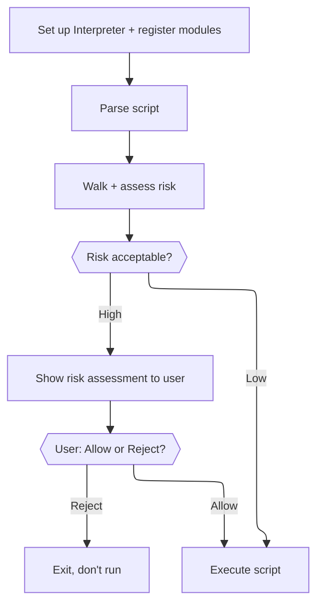
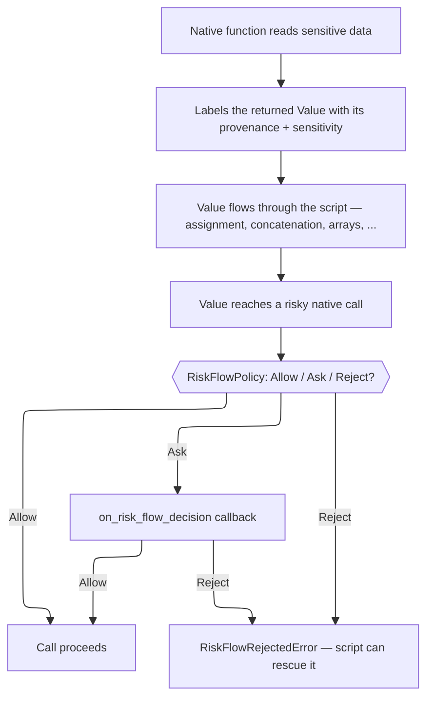

# adjutant.cr

A Crystal shard that defines and implements a safe Ruby-like scripting interpreter for agent harnesses: with a controlled effect boundary, module capability registry, static risk assessment, and dynamic information flow control (risk flow).

> **WARNING**: This shard is a work in progress and in development until this warning is removed.

> See [DISCLOSURE](./DISCLOSURE.md) for information how AI is used by this project.

## Installation

1. Add the dependency to your `shard.yml`:

```yml
dependencies:
  adjutant:
    github: modelarmy/adjutant.cr
```

2. Run `shards install`

## The idea

Adjutant runs Ruby-like scripts — typically written by an LLM — inside a host application (an "agent"). Two independent, complementary layers keep that safe:

- **Static risk assessment**: before running a script at all, walk it and see which risky native calls it *could* make (`RiskWalker`/`RiskAggregator`), based purely on the call shapes in the source. Catches "this script calls something dangerous" regardless of what data flows through it.
- **Risk flow (dynamic IFC)**: while the script actually runs, track where sensitive data came from and stop it before it reaches a dangerous call, live — including calls with no traceable data flow at all (a script that just writes `delete_file("/etc/passwd")` directly). Catches "this specific call, with this specific data, is dangerous right now," which static analysis alone cannot know for anything that isn't a literal.

Neither layer replaces the other — see [`samples/run_script.cr`](./samples/run_script.cr) for both working together against the same script.

## Quick start

The fastest path to a running interpreter. `RiskFlowPolicy.reject_all` means every risk flow decision is a hard Reject with no prompting — the safest possible default, and the right choice until you're ready to write a real policy (see "Risk flow" below).

```crystal
require "adjutant"

effect = Adjutant::TestEffectHandler.new # or your own EffectHandler subclass

interp = Adjutant::Interpreter.new(
  risk_flow_policy: Adjutant::RiskFlowPolicy.reject_all,
  on_risk_flow_decision: ->(req : Adjutant::RiskFlowDecisionRequest) { Adjutant::RiskFlowDecision::Reject },
  effect: effect,
)

interp.modules.register("agent/io") do |i|
  i.define_native("read_input") { |_args| Adjutant::Value.string(gets || "") }
end
interp.modules.require("agent/io", interp)

result = interp.eval(%(puts("hello, " + read_input())))
puts effect.stdout
```

`risk_flow_policy` and `on_risk_flow_decision` are always required — there is no default that silently means "skip risk assessment." An integration that wants no risk assessment has to say so explicitly via `RiskFlowPolicy.reject_all`, not by omission. See "Risk flow" below for what these actually do once you're ready to move past the quick-start default.

`Adjutant::Interpreter` owns a symbol table and globals that persist across multiple `eval` calls, making it suitable for a long-lived agent session.

## Static risk assessment

Assess a script's risk *before* running it, purely from its call shapes.



### 1. Register modules with risk profiles

Every native function a script can call is registered with a `RiskProfile` — the tags, reversibility, and severity that make static assessment possible. Most functions are pure (`RiskProfile.none`, the default); anything with a real side effect should say so explicitly.

```crystal
interp.modules.register("agent/io") do |i|
  i.define_native("read_input") { |_args| Adjutant::Value.string(gets || "") }

  i.define_native("delete_file",
    risk: Adjutant::RiskProfile.new(
      tags: Set{Adjutant::RiskTag::DeletesFiles},
      reversible: Adjutant::Reversibility::No,
      severity: Adjutant::Severity::Error,
    )) { |args| Adjutant::Value.nil_value }

  i.define_native("times") do |args, blk, ncc|
    if (count = args.first?.try(&.as_int?)) && blk
      count.times { |i| ncc.invoke(blk, [Adjutant::Value.int(i)]) }
      Adjutant::Value.int(count)
    else
      Adjutant::Value.nil_value
    end
  end
end
interp.modules.require("agent/io", interp)
```

#### What `ncc` gives you

The third block param above (`ncc`) is a `NativeCallContext` — passed to every native function, it's how one reaches back into the VM for things a native function can't safely do standalone (calling back into script code, comparing/ordering `Value`s the same way script operators do, declaring risk on its own arguments). All of it is optional to use — a simple native function like `delete_file` above never touches it.

|Method                                  |Use it for                                                                                                                                                                                                                                                                                     |
|----------------------------------------|-----------------------------------------------------------------------------------------------------------------------------------------------------------------------------------------------------------------------------------------------------------------------------------------------|
|`invoke(blk, args)`                     |Calling a **live call-site block** your function received — the `{ }`/`do...end` attached to the call itself (`blk` above; see `times`).                                                                                                                                                       |
|`invoke_proc(proc_obj, args)`           |Calling a **stored `Proc`** passed to your function as a plain argument (from a `->(){}` literal held in a variable) — not a call-site block. Pass the `Proc` `RubyObject` itself, not an unwrapped script proc; it carries its own closure correctly no matter when or from where you call it.|
|`values_equal?(a, b)`                   |Real Ruby `==` — needed if your function compares two `Value`s (e.g. a `Hash`-like container checking a key).                                                                                                                                                                                  |
|`compare(a, b, op)`                     |Real Ruby ordering (`:<`, `:<=`, `:>`, `:>=`) for two `Value`s — needed if your function orders or sorts values it didn't originate.                                                                                                                                                           |
|`call_method(recv, name, args)`         |Calling a method BY NAME on a `Value` the normal script-dispatch way, when your function needs to invoke a receiver's own method generically rather than assuming a specific native implementation.                                                                                            |
|`declare_sensitivity(tag, kind, origin)`|Marking your function's OWN argument as risk-sensitive when the risk lives in the literal content passed in, not in a label the caller already attached — see "Risk flow" below.                                                                                                               |

`invoke` vs. `invoke_proc` is the one distinction worth being deliberate about: a call-site block is always invoked while its defining frame is still live, but a stored `Proc` might be called much later, possibly from your native function's own frame — `invoke_proc` is what keeps that `Proc`'s closure correct regardless.

### 2. Parse the script (without running it)

```crystal
begin
  body = File.open("script.rb") { |io| Adjutant::Parser.new(io.gets_to_end, "script.rb").parse }
rescue e : Adjutant::ParseError
  STDERR.puts "Parse error: #{e.message}"
end
```

### 3. Walk and assess risk

```crystal
walker = Adjutant::RiskWalker.new(interp)
tree = walker.walk_body(body)

summary = Adjutant::RiskAggregator.summarize(tree)   # single worst-case path
findings = Adjutant::RiskAggregator.all_findings(tree) # every individual finding
```

`summary` gives a `RiskSummary` — `tags`, `reversible`, `severity`, and the `path` of branches that led to the worst case, plus `iterated?` if it's inside a loop or recursion. `findings` gives every `RiskFinding` in the script, each with its own `branch_path` and `iterated?`, for a host UX that wants to show more than just the worst case (group repeated calls, filter by severity, and so on). Neither makes any UI decision — that's left entirely to the host application. See [`samples/assess_script.cr`](./samples/assess_script.cr) for a worked example that prints both.

### 4. Decide, then execute

```crystal
if summary.severity.error? || summary.severity.warning?
  # Show `summary` and/or `findings` to the user via your own UI, then:
  # if the user rejects, stop here — don't call eval.
end

result = interp.eval(body)
puts "Result: #{result}"
```

`interp.eval` also accepts a source string or `IO` directly (parsing internally) if you don't need the intermediate `Body` for risk assessment:

```crystal
begin
  result = interp.eval(File.open("script.rb"), "script.rb")
rescue e : Adjutant::RuntimeError
  STDERR.puts "Script error: #{e.message}"
rescue e : Adjutant::ParseError
  STDERR.puts "Parse error: #{e.message}"
end

# Inspect what the script wrote to stdout.
puts effect.stdout
```

Globals persist across `eval` calls on the same interpreter instance, so scripts can be evaluated incrementally across a conversation turn.

### Assessing without a live script (compile-only)

You can also compile without executing — useful for pre-validating LLM-generated scripts, independent of the risk walker above:

```crystal
begin
  chunk = interp.compile(source, "script.rb")
  # chunk is an Adjutant::Chunk you can inspect or execute later
rescue Adjutant::ParseError => e
  STDERR.puts "Invalid script: #{e.message}"
end
```

### Current limitations

Static risk assessment is best-effort, not a guarantee — it can only see what a script's call *shapes* look like, not what data actually flows through them at runtime (that's what risk flow, below, is for). See [DEVELOPMENT.md](./DEVELOPMENT.md)'s "Structured risk" and "RiskWalker" sections for what's fully covered (control flow, most `Assign` shapes, def/class discovery) versus not yet (blocks/lambdas, `yield`, and method parameters, which are always treated as unknown-typed — see the documented precision gap there).

## Risk flow (dynamic information flow control)

Static assessment can't know what a script will actually do with data it doesn't control — a script that reads a file and only sometimes posts it externally, or a script that receives a URL from elsewhere and fetches it, has runtime behavior no static walk can predict. Risk flow tracks sensitive data as the script runs and interrupts before it reaches a dangerous call.



### How data gets labeled

A native function that reads sensitive data (a file, a network response, environment variables, ...) consults the interpreter's policy for that specific origin, then attaches a `RiskFlowLabel` to the `Value` it returns. That label travels automatically with the value through everything the script does with it — arithmetic, string interpolation, arrays, hashes — with no further work needed from module authors.

```crystal
interp.define_native("read_file") do |args|
  path = args.first.as_string
  sensitivity = interp.risk_flow_policy.sensitivity_for(Adjutant::ProvenanceKind::File, path)
  label = Adjutant::RiskFlowLabel.of(Adjutant::ProvenanceKind::File, path, sensitivity)
  Adjutant::Value.string(File.read(path), label)
end
```

### Declaring sensitivity on a sink's own argument

Label-based tracking alone has a real blind spot: it only ever sees taint that flowed *through* a labeling call. A script that writes a sensitive-looking value directly (`delete_file("/etc/passwd")`, no intermediate variable at all) produces no label for anything to track. A native function whose own argument is the risky subject — a path being deleted, a URL being posted to — should declare sensitivity on that argument's literal content directly, regardless of whether the caller happened to label it:

```crystal
interp.define_native("delete_file",
  risk: Adjutant::RiskProfile.new(tags: Set{Adjutant::RiskTag::DeletesFiles})) do |args, _blk, ncc|
  path = args.first.as_string
  ncc.declare_sensitivity(Adjutant::RiskTag::DeletesFiles, Adjutant::ProvenanceKind::File, path)
  File.delete(path)
  Adjutant::Value.bool(true)
end
```

This closes the gap for both a bare literal and a misleadingly-named variable holding one — the check runs on the argument's actual content, not on whatever label (if any) happened to be attached. See [`samples/run_script.cr`](./samples/run_script.cr) for the full worked example, including scripts that specifically exercise this.

### Writing a policy

A `RiskFlowPolicy` has two tables: `sensitivity_patterns` (origin → sensitivity, by `exact` match or `regex`, highest explicit `priority` wins) and `risk_flow_rules` (`RiskTag` × `Sensitivity` → `Allow`/`Ask`/`Reject`). `Sensitivity::None` always allows, regardless of the rule table. Load one from JSON — the same way you'd load it from a config file in a real deployment:

```crystal
policy = Adjutant::RiskFlowPolicy.from_json(<<-JSON
  {
    "sensitivity_patterns": [
      { "kind": "File", "pattern": "/etc/passwd", "priority": 10, "sensitivity": "High" },
      { "kind": "File", "pattern_type": "regex", "pattern": "^/etc/", "priority": 0, "sensitivity": "Elevated" }
    ],
    "risk_flow_rules": [
      { "tag": "DeletesFiles", "sensitivity": "Elevated", "action": "Ask" },
      { "tag": "DeletesFiles", "sensitivity": "High", "action": "Reject" }
    ]
  }
  JSON
)
```

### Handling an Ask — the interactivity is yours to design

`on_risk_flow_decision` is called synchronously with a `RiskFlowDecisionRequest` (the call name, its `RiskProfile`, and every `RiskFlowMatch` — the specific rule and tainted provenance that triggered the decision, sorted worst-first) whenever policy resolves to `Ask`. Adjutant never generates any end-user-facing text itself — an integration may need the prompt in any language, any format, any UI — it only supplies the structured data. Building the actual prompt (terminal, chat UI, whatever) is entirely up to you:

```crystal
on_risk_flow_decision: ->(req : Adjutant::RiskFlowDecisionRequest) {
  puts "About to call #{req.call_name} (#{req.filename}:#{req.line})"
  req.matches.each { |m| puts "  - #{m.tag.kind}:#{m.tag.origin} (#{m.tag.sensitivity})" }
  print "Allow? [y/N]: "
  gets.try(&.strip.downcase) == "y" ? Adjutant::RiskFlowDecision::Allow : Adjutant::RiskFlowDecision::Reject
}
```

A rejected call (from a matched `Reject` rule, or an `Ask` your callback answered with `Reject`) raises a script-catchable error — the script can `rescue RiskFlowPolicyError` (or its subclass `RiskFlowRejectedError`) to report something concise, or let it propagate as an uncaught error.

### Current limitations

Risk flow tracks explicit data flow only (assignment, arithmetic, string/array/hash construction) — not implicit flow through control structure (see [`research/IFC_DESIGN.md`](./research/IFC_DESIGN.md) for why this scope was chosen deliberately). There's no approval cache yet, so an `Ask` for the same origin repeats every time it's reached within one script run.

## Development

See [DEVELOPMENT.md](./DEVELOPMENT.md) for how to build, run the samples, and understand the internals. See [`research/IFC_DESIGN.md`](./research/IFC_DESIGN.md) for the risk flow design's full reasoning trail.

## Contributions, by invitation!

*With apologies*, at this time contributions are *by invitation only* and limited to people I know and see often.

These are early days for _Adjutant_ and I am busy with family and work.

At this time I want to work on this at a manageable pace.
