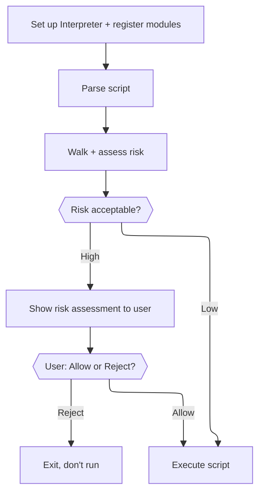

# adjutant.cr

A Crystal shard that defines and implements a safe Ruby-like scripting interpreter for agent harnesses: with a controlled effect boundary, module capability registry, and information flow control.

> **WARNING**: This shard is a work in progress and in development until this warning is removed.

> See [DISCLOSURE](./DISCLOSURE.md) for information how AI is used by this project.

## Installation

1. Add the dependency to your `shard.yml`:

```yml
dependencies:
  adjutant:
    github: modelarmy/adjutant.cr
```

2. Run `shards install`

## Usage

The entry point is `Adjutant::Interpreter`. It owns a symbol table and globals that persist across multiple `eval` calls, making it suitable for a long-lived agent session.

Adjutant is built to let a host application assess a script's risk *before* running it — not just execute it and hope for the best. The typical flow:



### 1. Set up the interpreter and register modules

Every native function a script can call is registered with a `RiskProfile` — the tags, reversibility, and severity that make static assessment possible. Most functions are pure (`RiskProfile.none`, the default); anything with a real side effect should say so explicitly.

```crystal
require "adjutant"

# Define the physical effect boundary — what the script can write and read.
effect = Adjutant::TestEffectHandler.new  # or your own EffectHandler subclass

# Set execution limits (optional).
limits = Adjutant::ExecutionLimits.new(
  instruction_limit: 100_000_u64,
  call_depth_limit:  256
)

interp = Adjutant::Interpreter.new(effect: effect, limits: limits)

# Register capabilities the script is allowed to use.
# Scripts access these exclusively via `require`.
interp.modules.register("agent/io") do |i|
  i.define_native("read_input") { |_args| Adjutant::Value.string(gets || "") }

  i.define_native("delete_file",
    risk: Adjutant::RiskProfile.new(
      tags: Set{Adjutant::RiskTag::DeletesFiles},
      reversible: Adjutant::Reversibility::No,
      severity: Adjutant::Severity::Error,
    )) { |args| Adjutant::Value.nil_value }

  i.define_native("times") do |args, blk, ncc|
    if (count = args.first?.try(&.as_int?)) && blk
      count.times { |i| ncc.invoke(blk, [Adjutant::Value.int(i)]) }
      Adjutant::Value.int(count)
    else
      Adjutant::Value.nil_value
    end
  end
end
interp.modules.require("agent/io", interp)
```

### 2. Parse the script (without running it)

```crystal
begin
  body = File.open("script.rb") { |io| Adjutant::Parser.new(io.gets_to_end, "script.rb").parse }
rescue e : Adjutant::ParseError
  STDERR.puts "Parse error: #{e.message}"
end
```

### 3. Walk and assess risk

```crystal
walker = Adjutant::RiskWalker.new(interp)
tree = walker.walk_body(body)

summary = Adjutant::RiskAggregator.summarize(tree)   # single worst-case path
findings = Adjutant::RiskAggregator.all_findings(tree) # every individual finding
```

`summary` gives a `RiskSummary` — `tags`, `reversible`, `severity`, and the `path` of branches that led to the worst case, plus `iterated?` if it's inside a loop or recursion. `findings` gives every `RiskFinding` in the script, each with its own `branch_path` and `iterated?`, for a host UX that wants to show more than just the worst case (group repeated calls, filter by severity, and so on). Neither makes any UI decision — that's left entirely to the host application. See `samples/assess_script.cr` for a worked example that prints both.

### 4. Decide, then execute

```crystal
if summary.severity.error? || summary.severity.warning?
  # Show `summary` and/or `findings` to the user via your own UI, then:
  # if the user rejects, stop here — don't call eval.
end

result = interp.eval(body)
puts "Result: #{result}"
```

`interp.eval` also accepts a source string or `IO` directly (parsing internally) if you don't need the intermediate `Body` for risk assessment:

```crystal
begin
  result = interp.eval(File.open("script.rb"), "script.rb")
rescue e : Adjutant::RuntimeError
  STDERR.puts "Script error: #{e.message}"
rescue e : Adjutant::ParseError
  STDERR.puts "Parse error: #{e.message}"
end

# Inspect what the script wrote to stdout.
puts effect.stdout
```

Globals persist across `eval` calls on the same interpreter instance, so scripts can be evaluated incrementally across a conversation turn.

### Assessing without a live script (compile-only)

You can also compile without executing — useful for pre-validating LLM-generated scripts, independent of the risk walker above:

```crystal
begin
  chunk = interp.compile(source, "script.rb")
  # chunk is an Adjutant::Chunk you can inspect or execute later
rescue Adjutant::ParseError => e
  STDERR.puts "Invalid script: #{e.message}"
end
```

### Current limitations

Risk assessment is static and best-effort, not a guarantee — see [DEVELOPMENT.md](./DEVELOPMENT.md)'s "Structured risk" and "RiskWalker" sections for what's fully covered (control flow, most `Assign` shapes, def/class discovery) versus not yet (blocks/lambdas, `yield`, and method parameters, which are always treated as unknown-typed — see the documented precision gap there).

## Development

See [DEVELOPMENT.md](./DEVELOPMENT.md) for how to build, run the samples, and understand the internals.

## Contributions, by invitation!

*With apologies*, at this time contributions are *by invitation only* and limited to people I know and see often.

These are early days for _Adjutant_ and I am busy with family and work.

At this time I want to work on this at a manageable pace.
