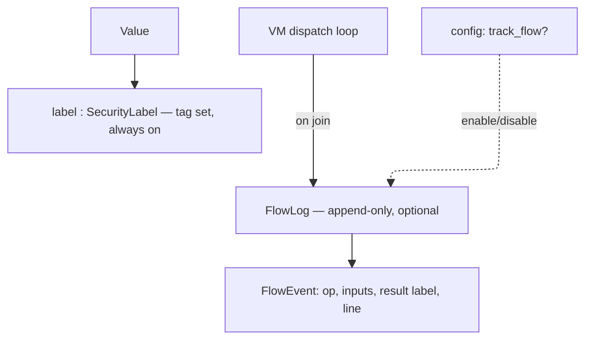
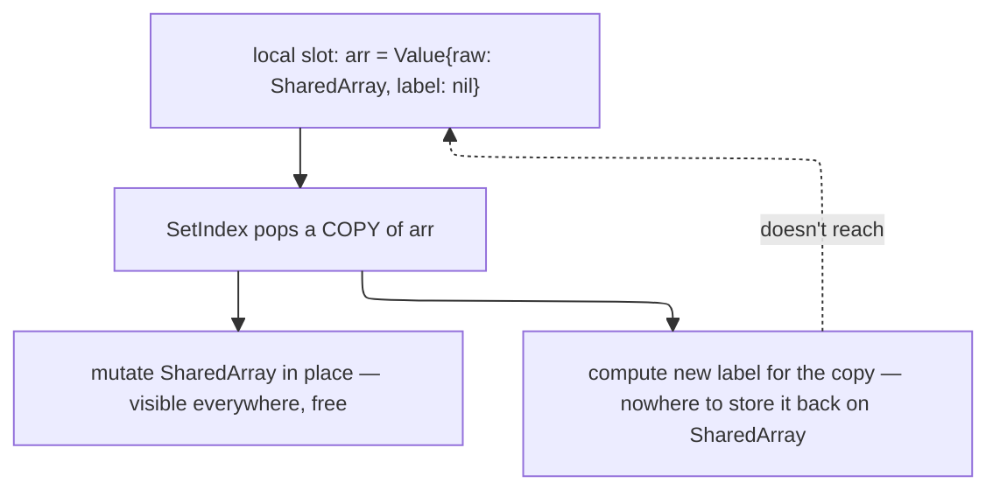
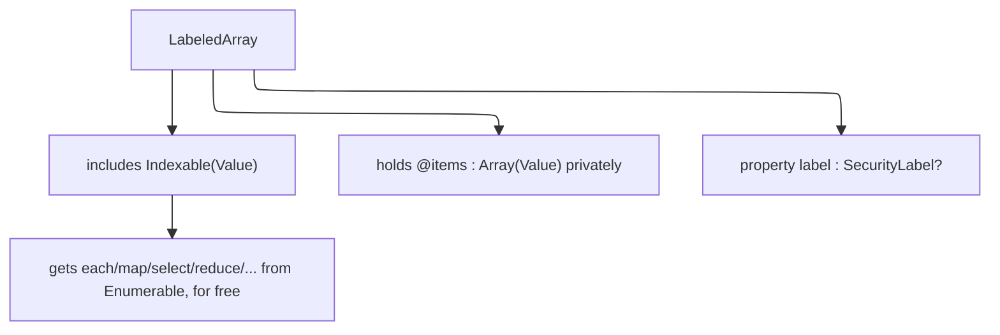
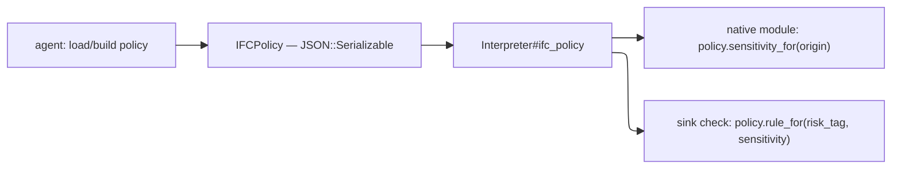

# IFC design — lattice, labels, flow log, VM propagation, container labeling

Status: lattice types and `FlowLog` plumbing implemented (`SecurityLabel`,
`ProvenanceTag`, `ProvenanceKind`, `Sensitivity`, `FlowLog`/`FlowEvent`,
all `JSON::Serializable`; `Interpreter#flow_log`, `flow_tracking:` param).
VM propagation for value-construction opcodes is implemented and tested:
`exec_binary` (Add/Sub/Mul/Div/Mod/BitAnd/BitOr/Xor/Shl/Shr/Lt/Lte/Gt/Gte),
`Op::Eq`, `Op::Concat`, `Op::MakeArray`, `Op::MakeHash`, `Op::MakeRange` all
join operand labels into the result and record a `FlowEvent`.

**`Op::SetIndex` (container mutation) is blocked, not yet implemented** —
see "Container labeling (Stage 3.5, decided)" below for why the original
plan (join the incoming value's label onto the container in place) doesn't
actually work given `Value`'s struct semantics, and the revised direction
(`LabeledArray`/`LabeledHash` wrapper types) needed before `SetIndex` can
be finished. Scope: Phase 8 (IFC / `SecurityLabel`), pieces of five
(lattice → VM propagation → sink policy → enforcement → agent-facing API),
with an added Stage 3.5 (container labeling) between VM propagation and
finishing `SetIndex`. This document covers the lattice, VM propagation,
and container-labeling pieces.

## Goal

Detect, at the moment a risky native call is about to fire, that the data
flowing into it has sensitive provenance — and interrupt execution so the
agent/user can decide whether to proceed. Secondarily, produce a complete,
reviewable flow record after execution for troubleshooting and audit.

## Why taint tracking, not full Denning IFC

Full IFC (implicit flows via control-flow and termination channels) is
expensive and, per empirical study of real-world JS security problems, rarely
necessary: a lightweight explicit-flow taint analysis was sufficient for most
studied problems, and tracking hidden implicit flows did not surface issues
that explicit-flow tracking missed (Staicu et al., "An Empirical Study of
Information Flows in Real-World JavaScript").

Adjutant tracks **explicit flows only**: assignment, arithmetic/string/array
operations, argument passing, return values. Control-flow-driven (implicit)
leaks are out of scope for this phase.

This also matches Adjutant's own risk model: `RiskTag` values
(`WritesFiles`, `NetworkEgress`, `ExecutesCode`, ...) describe *sinks* an
untrusted/sensitive value must not reach unnoticed — the integrity/taint
tradition (Biba-style: does untrusted data reach a trusted operation?), not
the secrecy tradition (Bell-LaPadula: can this leak past a public boundary?).

## Tag shape

A tag is not a bare symbol. It carries identity, not just category:

```crystal
struct ProvenanceTag
  getter kind : ProvenanceKind      # File, Network, Env, UserInput, ...
  getter origin : String            # concrete identifier — path, host, var name
  getter sensitivity : Sensitivity  # None, Elevated, High — see below
end

enum ProvenanceKind
  File
  Network
  Env
  UserInput
end

enum Sensitivity
  None
  Elevated
  High
end
```

(As implemented: `kind` is a closed `ProvenanceKind` enum, not a bare
symbol as originally sketched here — decided during Stage 2, so typos are
caught at compile time and JSON serialization has a stable representation.)

Rationale:
- `kind` + `origin` together are what makes a sink-time prompt to the user
  meaningful: "about to POST `/etc/passwd`" not "about to POST some file."
  This came directly out of the concern that a coarse `:file`/`:network` tag
  can't distinguish a public README from `/etc/passwd`.
- `origin` is always populated — it's plain provenance, no policy decision
  needed to record it.
- `sensitivity` is populated by consulting policy *at tag-creation time*,
  not hardcoded per module. A File IO module reading `/etc/hosts` vs
  `/etc/passwd` can't know which one matters — that's a path-pattern policy
  lookup the module consults when it creates the tag, not a property of the
  module itself.

## Label

```crystal
class SecurityLabel
  getter tags : Set(ProvenanceTag)
end
```

Every `Value` carries an optional `SecurityLabel` (nilable field, one
pointer width, same as the current stub — cheap on the hot path when IFC
tracking or the label itself is absent).

## Lattice

Powerset lattice over `ProvenanceTag`, ordered by set inclusion (⊆).

- **Join** (`SecurityLabel.join`) = set union of tags. Matches the general
  Denning join-as-accumulation model, and the WebKit IFC paper's approach of
  using a powerset lattice over concrete provenance elements (there: web
  domains; here: file paths / hosts / env vars / etc.) rather than a small
  fixed lattice like `{L, H}`.
- **Sensitivity ordering within a join**: worst wins — `High > Elevated >
  None` — mirroring the existing `RiskAggregator` pattern of ranking
  severity/reversibility and always taking the worse outcome on join
  (`summarize_sequence`'s `max_by` over `rank`). A value built from one
  sensitive source and one non-sensitive source stays sensitive.
- No meet operation is needed yet — nothing currently requires computing a
  greatest lower bound; only join (accumulation during execution) and the
  sink comparison (below) are used.

## Sink check (live, at call time)

At a native call site with a static `RiskProfile`, compare the profile's
`RiskTag`s against the `sensitivity` of the `SecurityLabel`s on the incoming
argument `Value`s. Not just "does a tag of matching `kind` exist" — the
`sensitivity` field is what actually drives escalation. Exact policy
(which `RiskTag` × `Sensitivity` combinations interrupt vs. pass silently)
is deferred to the sink-policy phase (piece 3 of 5), but the label/lattice
must expose enough (`kind`, `origin`, `sensitivity`) for that policy to be
expressive — e.g. distinguishing "internal doc → internal server" (quiet)
from "`/etc/passwd` → anywhere" (escalate).

## Flow log (post-hoc, optional)

Live sink checks only need the *current* joined label. Audit and
troubleshooting need the *history* of how a label was built — two values
that both end up tainted `{file:/etc/passwd, network:internal-db}` can have
arrived there via different paths, and that path matters when debugging the
IFC implementation itself.

Rather than embedding history in every label (expensive, defeats the
"cheap on the hot path" goal), keep it as a separate, optional component:

```crystal
class FlowLog
  # append-only; one entry per join performed during execution
end

struct FlowEvent
  getter op : String            # what VM operation triggered the join
  getter inputs : Array(SecurityLabel?)
  getter result : SecurityLabel?
  getter line : Int32           # or pc, for locating in source
end
```

- `SecurityLabel` stays label-only: tag set, no history. Always on.
- `FlowLog` is owned by the `Interpreter`/VM, populated only when enabled.
  Disabled: join still happens (label computation unaffected), nothing is
  appended — zero overhead when off.
- This split also gives a natural home for the future "enable/disable flow
  tracking per execution" config: a single boolean the dispatch loop checks
  before calling `flow_log.record(...)`, without touching the label type.
- Post-hoc audit = replay/dump the `FlowLog` after the script completes.



## VM propagation (piece 2, decided)

Survey of `vm.cr` / `value.cr` on branch `implement-ifc` @ `f2f4f34` found:

- `Value#label`, `#with_label`, `#join_label` already exist (from the
  lattice piece's stub work). Not yet called anywhere in the VM.
- **Free propagation**: `GetLocal`/`SetLocal`/`GetOuter`/`SetOuter`/
  `GetGlobal`/`SetGlobal`/`Ret`/`Dup` and other pure stack moves already
  carry the label correctly with zero code changes — `Value` is a struct,
  copied whole, so the label field travels automatically wherever a
  `Value` is moved without being combined with another `Value`.
- **Missing — every combination/construction site drops the label**
  (status: **implemented, Stage 3**): `exec_binary`'s arithmetic/bitwise/
  comparison helpers (`arith_add`, `arith_op`, `arith_div`, `arith_mod`,
  `int_op`, `exec_shl`, `compare_op`), `Op::Eq`, `Op::Concat`,
  `Op::MakeArray`, `Op::MakeHash`, `Op::MakeRange` previously constructed a
  fresh `Value` with `label: nil` (or no label argument at all), discarding
  whatever labels the operands carried. Fixed: each of these now joins the
  labels of its inputs (`SecurityLabel.join`, folded across N parts for
  `Concat`/`MakeArray`/`MakeHash`) into the result's label, and records a
  `FlowEvent` via `Interpreter#flow_log`. Tested in
  `spec/adjutant/ifc_propagation_spec.cr` — both final-label assertions and
  `FlowLog` contents, per the "verify via flow log" testing approach
  decided alongside the staged test plan.
- **Sink check hook point**: `VM#call_native` — every `NativeCallable`
  call (the only place a `RiskProfile` lives) routes through this single
  method, with the callable's `risk : RiskProfile` and every argument
  `Value` (labels included) already in hand. This is the natural
  attachment point for the live sink check in piece 3; propagation itself
  does not need to change this method.

### Containers: labels must accumulate into the container itself, not just its elements (superseded — see Stage 3.5 below)

**This subsection's original conclusion turned out to be incomplete; kept
here for the record, corrected below.**

Motivating case:

```ruby
arr = []
arr[0] = read_file("/etc/passwd")   # tainted value into a slot
post(arr)                            # sink call
```

The sink check at `post(arr)` inspects the label of the `Value` actually
passed to the sink — the array itself, not its elements. If `Op::SetIndex`
only ever left the taint sitting on `arr.as_array[0]`, the array's own
top-level label would stay `nil` and the sink check would miss it
entirely: the exact explicit-flow-through-assignment case IFC exists to
catch.

Originally decided: `Op::SetIndex` joins the incoming value's label into
the *container's* own label, described as mutation-time accumulation,
same principle as `MakeArray`/`MakeHash` construction.

**Why this doesn't actually work as stated**: `Value` is a struct, and
`SetIndex` as compiled only receives a *copy* of the container's `Value`
popped off the stack — not the local/ivar/global slot it came from. The
underlying Crystal `Array`/`Hash` object is a reference type, so *element*
mutation is shared for free (visible from every copy), but `label` is a
separate field on each `Value` struct copy, not stored inside the
array/hash object — so computing a new joined label on the popped copy has
nowhere durable to persist to. The next `GetLocal arr` reads the label
from the original (unmodified) slot. Concretely, this "decided" design was
never actually implementable without also solving how to write the
relabeled container back to its origin — see Stage 3.5 below for why that
write-back approach was rejected in favor of a different fix.



**Known consequence, still accepted for whatever mechanism ends up
implementing container accumulation**: container labels are monotonic —
they never shrink, even if the tainted element is later overwritten or
removed (`arr[0] = "clean"`, `arr.delete_at(0)`). This is a real precision
loss (false positives accumulate on long-lived containers, worse for
deeply nested containers where a full re-scan to recompute "am I still
tainted" would be the only precise alternative and is not worth the cost).
Accepted because it's the same direction already chosen for sensitivity in
the lattice design (monotonic, worst-wins, no declassification) —
consistent, and fails safe rather than silently under-tainting.

**Mitigations, not solved by the VM alone**:
- *Reassignment* is the cheap, general way for a script to shed
  accumulated container taint: labels are on values, not variable
  bindings, so binding a fresh value to the same variable name starts
  clean. Worth documenting as the standard recommendation for script/agent
  authors once IFC ships.
- *Native container-emptying methods* (`Array#clear`, `Hash#clear`, and
  similarly a future `#replace`) are a second, deliberate mechanism: since
  the postcondition (empty, or exactly some other container's contents)
  is known statically at that call, no re-scan is needed — the label can
  simply be reset (`clear`) or recomputed from the replacement's own
  label (`replace`), rather than continuing to accumulate. This is a
  **native-method-author convention**, not a VM-level rule: each such
  method must explicitly reset/recompute the label itself
  (`container_value.with_label(nil)` or equivalent) — the VM's join logic
  has no special case for it. Partial removal (`pop`, `delete_at`) is
  deliberately left *not* resetting the label — genuinely ambiguous
  without a scan, so it stays conservative by default rather than
  guessing.
- Exact `clear`/`replace` semantics are not being spelled out now — this
  section documents the convention and defers concrete implementation to
  when `Array`/`Hash` native methods needing it are actually written (to
  be reflected in `DEVELOPMENT.md` at that point, not here).

## Container labeling (Stage 3.5, decided)

Discovered while implementing `Op::SetIndex` for the container
accumulation described above: the "join into the container's own label"
plan has no valid implementation given `Value`'s struct semantics (see the
superseded subsection above for the full explanation — in short, a
`Value` copy popped by `SetIndex` has no path to write an updated label
back to the slot the container came from).

Two fixes were considered:

- **Write-back**: have `SetIndex` return the updated container, and teach
  the compiler to re-store it to whatever addressable slot (`Local`,
  `IVar`, `CVar`, `Global`) the target expression came from, reusing the
  existing `SetLocal`/`SetIvar`/`SetCvar`/`SetGlobal` opcodes for the
  store. Rejected: doesn't handle nested (`a[0][1] = x`) or computed
  (`foo()[0] = x`) targets, since those have no simple addressable origin
  to write back to — only a documented gap for those cases, or a second,
  harder problem (recursive write-back to the outermost addressable
  origin).
- **Move the label onto the container object itself** (decided): give
  `Array`/`Hash`-backed values their own owning wrapper type with a
  mutable `label` field, shared by reference exactly the way the
  underlying elements already are. This makes container labeling exactly
  as free as element mutation already is — no write-back, no
  addressability problem, nested/computed targets just work because the
  label lives on the object being reached, not on a `Value` copy of it.

Ruled out as part of reaching this decision:
- Making `Value` itself a class (not a struct) — would undo the "cheap,
  automatically-propagating on copy" property every other part of this
  design (free propagation through `GetLocal`/`SetLocal`/etc., cheap
  stack/frame storage) depends on. Not worth it to fix one opcode.
- Subclassing `Array(Value)`/`Hash(Value, Value)` directly (`class
  LabeledArray < Array(Value)`) — Crystal's stdlib collection types are
  not designed for behavior-preserving subclassing: methods like `map`,
  `select`, `dup`, `+`, and slicing construct a plain `Array`/`Hash`
  internally rather than `self.class.new`, so a subclass would silently
  lose its label the moment any such method ran. This would reintroduce
  the exact "label quietly disappears" bug this whole piece exists to fix.

**Direction (decided, implementation not yet started)**: wrap, don't
subclass. `LabeledArray`/`LabeledHash`-style types that hold a plain
`Array(Value)`/`Hash(Value, Value)` privately and implement
`Indexable(Value)` (for the array case; `Enumerable` methods — `map`,
`select`, `reduce`, etc. — come for free from `Indexable`'s
`unsafe_fetch`/`size`) rather than inheriting from the stdlib type. This
keeps `map`/`select`/etc. actually defined *on the wrapper type*, so label
propagation through them is something Adjutant controls, not something
the stdlib silently drops.



**Survey findings** (every `as_array`/`as_hash` call site, plus
`builtins/array.cr`/`builtins/hash.cr`, reviewed before settling the API
below):

|Area               |Sites                                                                                                            |Impact                                                                                                                                                                                                                                                                                                                   |
|-------------------|-----------------------------------------------------------------------------------------------------------------|-------------------------------------------------------------------------------------------------------------------------------------------------------------------------------------------------------------------------------------------------------------------------------------------------------------------------|
|`value.cr`         |4 accessors (`as_array`, `as_hash`, `as_array?`, `as_hash?`) + `array?`/`hash?` predicates + the `ValueRaw` union|The actual type definitions — everything else follows from here                                                                                                                                                                                                                                                          |
|`builtins/array.cr`|9                                                                                                                |All reduce to `Indexable`/`Enumerable`-style ops (`.size`, `.empty?`, `.push`, `.pop`, `.any?`, `.map`, `.each`) — expected to need **no call-site changes**                                                                                                                                                             |
|`builtins/hash.cr` |7                                                                                                                |Same — `.size`, `.empty?`, `.keys`, `.values`, `.has_key?`, `.each`                                                                                                                                                                                                                                                      |
|`vm.cr`            |11                                                                                                               |`exec_get_index`/`exec_set_index` (2), `values_equal?`'s array/hash cases (2), `arith_add`'s array `+` (1, genuine new-array construction — needs `LabeledArray.new(...)` instead of a bare literal), `exec_shl`'s array `<<` (1, **same write-back gap as `SetIndex`, same fix**), `exec_builtin`'s `.size` fallback (1)|
|`interpreter.cr`   |0 direct, 2 predicate                                                                                            |Unaffected beyond the predicate implementation itself                                                                                                                                                                                                                                                                    |
|specs              |~32 across 7 files                                                                                               |Mostly read-only assertions (`.size`, `[]`, `.map(&.as_int)`) — expected to keep working unchanged                                                                                                                                                                                                                       |

Smaller than initially estimated: most of the edit surface is
`value.cr` plus a handful of direct-construction sites in `vm.cr`, not "most
native Array/Hash methods" as originally flagged.

One incidental, pre-existing bug noted (not IFC, not fixed here):
`Value#to_s`'s `case` has no `when Array`/`when Hash` branch, so arrays/
hashes don't render as `[1, 2, 3]` today — falls through to
`"#<Array(Adjutant::Value)>"`. Worth a `DEVELOPMENT.md` "known missing"
entry at some point.

**Settled API shape (as implemented — revised from the original sketch during implementation)**:

The original sketch called for `include Indexable(Value)`. That was
tried first but hits a Crystal compiler stack overflow (Crystal
1.20.3): `Value`'s raw union includes `LabeledArray` itself, making
`Value` a self-referential type, and instantiating `Indexable`/
`Enumerable`'s generic methods over a self-referential element type
appears to blow up the compiler's overload resolution (deep recursion
through `lookup_matches`/`instantiate`/`match_block_arg`, eventually a
literal stack overflow in the compiler process, not a normal type
error). `LabeledHash`'s `include Enumerable({Value, Value})` hit a
related, more directly diagnosed compiler restriction first (Crystal
rejects `Value` as a generic type argument outright: "can't use Value
as a generic type argument yet, use a more specific type") — likely the
same underlying cause via a different code path.

**Resolution**: neither wrapper includes a generic collection module.
Each hand-writes the small, fixed set of methods actually used
elsewhere in the codebase instead:

```crystal
class LabeledArray
  property label : SecurityLabel?

  def initialize(@items : Array(Value) = [] of Value, @label : SecurityLabel? = nil)
  end

  def size : Int32
    @items.size
  end

  def empty? : Bool
    @items.empty?
  end

  def [](index : Int) : Value
    @items[index]
  end

  def []?(index : Int) : Value?
    @items[index]?
  end

  def each(& : Value ->) : Nil
    @items.each { |v| yield v }
  end

  def map(& : Value -> Value) : Array(Value)
    @items.map { |v| yield v }
  end

  def any?(& : Value -> Bool) : Bool
    @items.any? { |v| yield v }
  end

  def to_a : Array(Value)
    @items.dup
  end

  # Only ever used (values_equal?) to check element-wise equality of two
  # same-length arrays — not a general zip, so this returns the
  # all?-style Bool the one real call site needs.
  def zip(other : LabeledArray, & : Value, Value -> Bool) : Bool
    @items.each_with_index.all? { |v, i| yield v, other[i] }
  end

  def push(value : Value) : LabeledArray
    @items.push(value)
    self
  end

  def pop : Value
    @items.pop
  end

  def pop? : Value?
    @items.pop?
  end

  def []=(index : Int, value : Value) : Value
    @items[index] = value
  end

  def dup_items : Array(Value) # escape hatch for +, which builds a new (unlabeled-by-default) array
    @items.dup
  end
end
```

`LabeledHash` mirrors this over `Hash(Value, Value)`: `size`, `empty?`,
`[]`, `[]?`, `[]=`, `has_key?`, `keys`, `values`, `each`, and `all?`
(needed by `values_equal?`'s hash case) are all hand-written direct
delegates — never included a generic module to begin with, since
Crystal has no single `Indexable`-equivalent for hash-like types.

**Known limitation, accepted**: `map`/`any?`/etc. as hand-written above
always return a plain `Array(Value)`/`Bool`, not a `LabeledArray` — same
consequence the original `Indexable`-based design would have had anyway
(`Enumerable#map` always constructs a plain `Array` internally,
regardless of the receiver's type). So native methods that construct a
*new* container from an existing one (`Array#map`, future `#select`,
etc.) must explicitly wrap the result themselves
(`Value.new(LabeledArray.new(recv.as_array.map { ... }, joined_label), nil)`)
rather than getting it for free — an extra step, but contained to methods
that already build a new container, not a propagation gap.

**Consequence for Stage 4**: once this lands, `Op::SetIndex`'s original
join logic (join the incoming value's label onto `target.label`, in
place — no write-back needed, since `label` now lives on the shared
`LabeledArray`/`LabeledHash` object) becomes the correct, straightforward
implementation, as does the same fix for `exec_shl`'s `arr << x`. Stage 4
is effectively unblocked once Stage 3.5 lands, and should need little
beyond those two join calls.

## Policy object (decided)

A single IFC policy, loaded from JSON (not YAML — indentation errors in
YAML are hard to catch; JSON's explicit structure avoids that class of
bug), modeled as `JSON::Serializable` so the *agent* embedding Adjutant can
load/construct it however it likes (parse a file at an agent-provided path,
build it in code, etc.) and simply pass the resulting object in — Adjutant
itself does not read policy paths off disk internally.

The policy object is attached to `Interpreter` (`Interpreter#ifc_policy`)
so any native module or sink check can query it. Two lookup shapes it needs
to support:

- **origin → sensitivity**: path/host pattern matching, consulted by a
  native module at tag-creation time (e.g. File IO module checking whether
  the path it just opened matches a sensitive pattern).
- **(RiskTag, Sensitivity) → action**: the sink table, consulted at call
  time to decide whether a risky call with tainted arguments should
  interrupt.

Exact JSON schema for both is deferred to the sink-policy phase (piece 3) —
this section fixes the *access pattern*, not the schema.



## Declassification (decided: not supported — sensitivity is monotonic)

Considered and rejected for this phase. Reasoning:

- Approval in Adjutant's model is naturally **per-sink-event** ("this
  script may POST this to this host right now"), not a statement that the
  underlying data is safe in general. Lowering a label after one approval
  risks a script later doing something with that same (or derived) data
  that the user never actually saw or approved — the classic laundering
  problem declassification mechanisms (e.g. Jif's scoped `declassify`)
  exist to guard against.
- Concrete case that motivated this: script reads `/etc/passwd`, user
  approves one network POST, script continues and later writes the same
  tainted value to a log file. The concern was avoiding a second prompt for
  data "already approved" — but the fix for that is not lowering the
  label. Sensitivity never decreases once joined onto a value: not on
  approval, not on use, not via any operation defined here.
- The actual problem worth solving — avoiding repeat interrupts for the
  *same* origin-to-sink flow within one script run — belongs in the
  sink-policy phase as an **approval cache keyed by (tag, sink)**, separate
  from the lattice entirely. The lattice/label design has no declassify
  operation and does not need one.

This keeps the lattice simple: join only ever holds sensitivity steady or
escalates it, with no path for a value to become less sensitive during
execution.

## Open questions for the next design conversation (sink policy, piece 3)

- Exact `RiskTag` × `Sensitivity` policy table / rule language, and the
  origin-pattern → sensitivity JSON schema.
- Approval cache: keyed by (tag identity, sink) — what counts as "the same
  flow" for suppressing repeat prompts within one script run (exact origin
  match? origin pattern? tag kind alone?).

## Carried forward to VM propagation implementation (piece 2)

- Exact `clear`/`replace` label-reset semantics for `Array`/`Hash` native
  methods — convention decided (reset on full-empty/full-replace, stay
  conservative on partial removal), concrete implementation deferred to
  when those native methods are written.
- Whether `Op::MakeRange`'s two-or-three-element array encoding (see
  `bytecode.cr` comment: real `Range` object type not yet implemented)
  needs any special handling beyond the same join-across-elements rule
  used for `MakeArray` — flagged in case the eventual real `Range` type
  changes this.

## References

- Denning, "A Lattice Model of Secure Information Flow" (1976) — foundational
  lattice/join model.
- Bell-LaPadula (secrecy) and Biba (integrity) — the two directions a
  lattice-ordered policy can run; Adjutant's `RiskTag` sinks are integrity-style.
- Staicu, Schoepe, Balliu, Pradel, "An Empirical Study of Information Flows
  in Real-World JavaScript" — explicit-flow-only taint tracking is
  sufficient for most real security problems; implicit-flow tracking adds
  cost without proportionate benefit. https://arxiv.org/pdf/1906.11507
- Austin, Flanagan, "Information Flow Control in WebKit's JavaScript
  Bytecode" — powerset lattice over concrete provenance elements (web
  domains), same shape proposed here for file paths / hosts / env vars.
  https://arxiv.org/pdf/1401.4339
- CamFlow survey — taint tracking as IFC-with-one-tag-type, policy applied
  only at sink points, matching Adjutant's `RiskProfile`-gated call sites.
  https://arxiv.org/pdf/1506.04391
