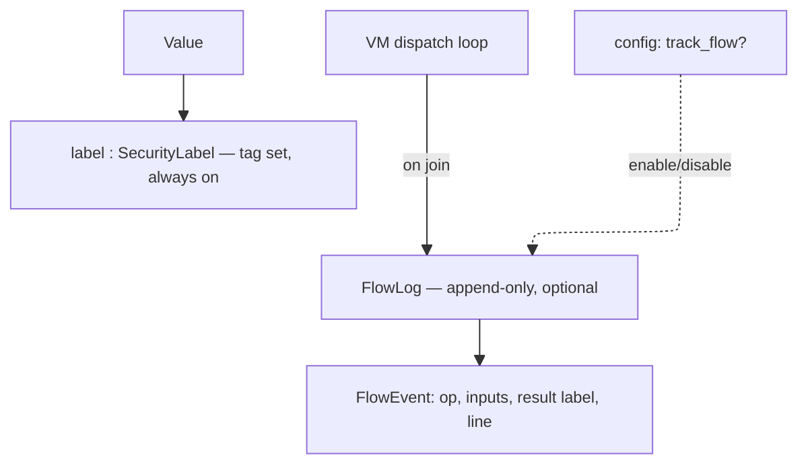

# IFC design — lattice, labels, flow log

Status: draft, pre-code. Scope: Phase 8 (IFC / `SecurityLabel`), first of five
pieces (lattice → VM propagation → sink policy → enforcement → agent-facing
API). This document covers the lattice piece only.

## Goal

Detect, at the moment a risky native call is about to fire, that the data
flowing into it has sensitive provenance — and interrupt execution so the
agent/user can decide whether to proceed. Secondarily, produce a complete,
reviewable flow record after execution for troubleshooting and audit.

## Why taint tracking, not full Denning IFC

Full IFC (implicit flows via control-flow and termination channels) is
expensive and, per empirical study of real-world JS security problems, rarely
necessary: a lightweight explicit-flow taint analysis was sufficient for most
studied problems, and tracking hidden implicit flows did not surface issues
that explicit-flow tracking missed (Staicu et al., "An Empirical Study of
Information Flows in Real-World JavaScript").

Adjutant tracks **explicit flows only**: assignment, arithmetic/string/array
operations, argument passing, return values. Control-flow-driven (implicit)
leaks are out of scope for this phase.

This also matches Adjutant's own risk model: `RiskTag` values
(`WritesFiles`, `NetworkEgress`, `ExecutesCode`, ...) describe *sinks* an
untrusted/sensitive value must not reach unnoticed — the integrity/taint
tradition (Biba-style: does untrusted data reach a trusted operation?), not
the secrecy tradition (Bell-LaPadula: can this leak past a public boundary?).

## Tag shape

A tag is not a bare symbol. It carries identity, not just category:

```crystal
struct ProvenanceTag
  getter kind : Symbol        # :file, :network, :env, :user_input, ...
  getter origin : String      # concrete identifier — path, host, var name
  getter sensitivity : Sensitivity  # None, Elevated, High — see below
end

enum Sensitivity
  None
  Elevated
  High
end
```

Rationale:
- `kind` + `origin` together are what makes a sink-time prompt to the user
  meaningful: "about to POST `/etc/passwd`" not "about to POST some file."
  This came directly out of the concern that a coarse `:file`/`:network` tag
  can't distinguish a public README from `/etc/passwd`.
- `origin` is always populated — it's plain provenance, no policy decision
  needed to record it.
- `sensitivity` is populated by consulting policy *at tag-creation time*,
  not hardcoded per module. A File IO module reading `/etc/hosts` vs
  `/etc/passwd` can't know which one matters — that's a path-pattern policy
  lookup the module consults when it creates the tag, not a property of the
  module itself.

## Label

```crystal
class SecurityLabel
  getter tags : Set(ProvenanceTag)
end
```

Every `Value` carries an optional `SecurityLabel` (nilable field, one
pointer width, same as the current stub — cheap on the hot path when IFC
tracking or the label itself is absent).

## Lattice

Powerset lattice over `ProvenanceTag`, ordered by set inclusion (⊆).

- **Join** (`SecurityLabel.join`) = set union of tags. Matches the general
  Denning join-as-accumulation model, and the WebKit IFC paper's approach of
  using a powerset lattice over concrete provenance elements (there: web
  domains; here: file paths / hosts / env vars / etc.) rather than a small
  fixed lattice like `{L, H}`.
- **Sensitivity ordering within a join**: worst wins — `High > Elevated >
  None` — mirroring the existing `RiskAggregator` pattern of ranking
  severity/reversibility and always taking the worse outcome on join
  (`summarize_sequence`'s `max_by` over `rank`). A value built from one
  sensitive source and one non-sensitive source stays sensitive.
- No meet operation is needed yet — nothing currently requires computing a
  greatest lower bound; only join (accumulation during execution) and the
  sink comparison (below) are used.

## Sink check (live, at call time)

At a native call site with a static `RiskProfile`, compare the profile's
`RiskTag`s against the `sensitivity` of the `SecurityLabel`s on the incoming
argument `Value`s. Not just "does a tag of matching `kind` exist" — the
`sensitivity` field is what actually drives escalation. Exact policy
(which `RiskTag` × `Sensitivity` combinations interrupt vs. pass silently)
is deferred to the sink-policy phase (piece 3 of 5), but the label/lattice
must expose enough (`kind`, `origin`, `sensitivity`) for that policy to be
expressive — e.g. distinguishing "internal doc → internal server" (quiet)
from "`/etc/passwd` → anywhere" (escalate).

## Flow log (post-hoc, optional)

Live sink checks only need the *current* joined label. Audit and
troubleshooting need the *history* of how a label was built — two values
that both end up tainted `{file:/etc/passwd, network:internal-db}` can have
arrived there via different paths, and that path matters when debugging the
IFC implementation itself.

Rather than embedding history in every label (expensive, defeats the
"cheap on the hot path" goal), keep it as a separate, optional component:

```crystal
class FlowLog
  # append-only; one entry per join performed during execution
end

struct FlowEvent
  getter op : String            # what VM operation triggered the join
  getter inputs : Array(SecurityLabel?)
  getter result : SecurityLabel?
  getter line : Int32           # or pc, for locating in source
end
```

- `SecurityLabel` stays label-only: tag set, no history. Always on.
- `FlowLog` is owned by the `Interpreter`/VM, populated only when enabled.
  Disabled: join still happens (label computation unaffected), nothing is
  appended — zero overhead when off.
- This split also gives a natural home for the future "enable/disable flow
  tracking per execution" config: a single boolean the dispatch loop checks
  before calling `flow_log.record(...)`, without touching the label type.
- Post-hoc audit = replay/dump the `FlowLog` after the script completes.



## Open questions for the next design conversation (sink policy, piece 3)

- Exact `RiskTag` × `Sensitivity` policy table / rule language.
- Where the path-pattern sensitivity policy lives (config file? in-code
  defaults + override?) and how a `ScriptModule` author consults it when
  creating a tag.
- Declassification: is there ever a legitimate way to lower a label's
  sensitivity mid-script (e.g. after an explicit user confirmation), or is
  sensitivity strictly monotonic for now?

## References

- Denning, "A Lattice Model of Secure Information Flow" (1976) — foundational
  lattice/join model.
- Bell-LaPadula (secrecy) and Biba (integrity) — the two directions a
  lattice-ordered policy can run; Adjutant's `RiskTag` sinks are integrity-style.
- Staicu, Schoepe, Balliu, Pradel, "An Empirical Study of Information Flows
  in Real-World JavaScript" — explicit-flow-only taint tracking is
  sufficient for most real security problems; implicit-flow tracking adds
  cost without proportionate benefit. https://arxiv.org/pdf/1906.11507
- Austin, Flanagan, "Information Flow Control in WebKit's JavaScript
  Bytecode" — powerset lattice over concrete provenance elements (web
  domains), same shape proposed here for file paths / hosts / env vars.
  https://arxiv.org/pdf/1401.4339
- CamFlow survey — taint tracking as IFC-with-one-tag-type, policy applied
  only at sink points, matching Adjutant's `RiskProfile`-gated call sites.
  https://arxiv.org/pdf/1506.04391
