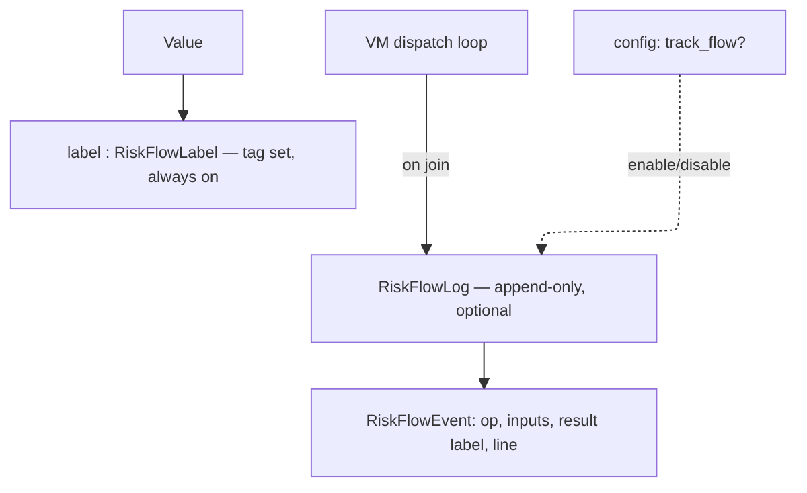
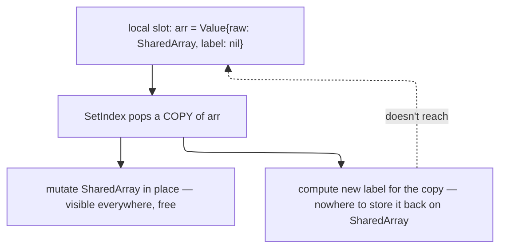
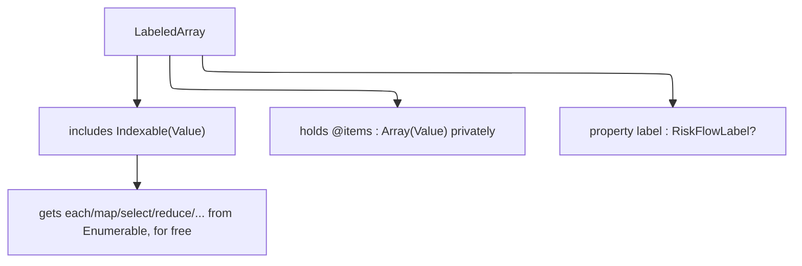
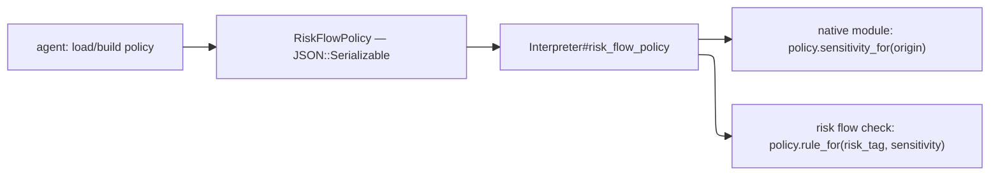

# Risk flow design — lattice, labels, risk flow log, VM propagation, container labeling, policy

Status: implemented and tested — `RiskFlowLabel`/`ProvenanceTag`/
`ProvenanceKind`/`Sensitivity` and their join semantics; `RiskFlowLog`/
`RiskFlowEvent` (via `Interpreter#risk_flow_log`, `risk_flow_tracking:`
param), all `JSON::Serializable`; every VM dispatch-loop join site
(`exec_binary`'s arithmetic/comparison family, `Eq`, `Concat`,
`MakeArray`/`MakeHash`/`MakeRange`, `SetIndex`, `<<`); `LabeledArray`/
`LabeledHash` container wrapper types and their label accumulation;
`RiskFlowPolicy`/`SensitivityPattern`/`RiskFlowRule`/`RiskFlowAction`
(via `Interpreter#risk_flow_policy`, now a required constructor param —
see "Enforcement" below for why the earlier optional-with-permissive-
default design was rejected) and their lookup logic; `RiskFlowMatch`/
`RiskFlowDecisionRequest`/`RiskFlowDecision` (`risk_flow_decision.cr`);
and piece 4 (enforcement) itself — `VM#call_native` runs the risk flow
check before every tagged native call with labeled arguments, raising a
script-catchable `RiskFlowRejectedError` on `Reject` (from a rule,
`reject_all`, or an `Ask` resolved to `Reject` via the required
`on_risk_flow_decision` callback).

**Not yet implemented**: piece 5 (agent-facing API) — nothing beyond the
raw `RiskFlowDecisionRequest -> RiskFlowDecision` callback shape exists
yet for an embedding agent to build a richer UI/prompt against. The
approval cache (avoid re-prompting for an already-approved origin→sink
flow within one script run) is also still undesigned — see "Open
questions" below.

Scope: Phase 8 (IFC / `RiskFlowLabel`), all five pieces (lattice → VM
propagation → risk flow policy → enforcement → agent-facing API), plus
an added Stage 3.5 (container labeling) that landed between VM
propagation and finishing `SetIndex`/`<<` once the original "join onto
the `Value`'s own label field" plan turned out not to work (see
"Container labeling" below). This document covers the lattice, VM
propagation, container-labeling, and risk-flow-policy pieces; piece 4
(enforcement) and piece 5 (agent-facing API) are being designed now, in
the sections following the older material below.

## Goal

Detect, at the moment a risky native call is about to fire, that the data
flowing into it has sensitive provenance — and interrupt execution so the
agent/user can decide whether to proceed. Secondarily, produce a complete,
reviewable flow record after execution for troubleshooting and audit.

## Why taint tracking, not full Denning IFC

Full IFC (implicit flows via control-flow and termination channels) is
expensive and, per empirical study of real-world JS security problems, rarely
necessary: a lightweight explicit-flow taint analysis was sufficient for most
studied problems, and tracking hidden implicit flows did not surface issues
that explicit-flow tracking missed (Staicu et al., "An Empirical Study of
Information Flows in Real-World JavaScript").

Adjutant tracks **explicit flows only**: assignment, arithmetic/string/array
operations, argument passing, return values. Control-flow-driven (implicit)
leaks are out of scope for this phase.

This also matches Adjutant's own risk model: `RiskTag` values
(`WritesFiles`, `NetworkEgress`, `ExecutesCode`, ...) describe *sinks* an
untrusted/sensitive value must not reach unnoticed — the integrity/taint
tradition (Biba-style: does untrusted data reach a trusted operation?), not
the secrecy tradition (Bell-LaPadula: can this leak past a public boundary?).

## Tag shape

A tag is not a bare symbol. It carries identity, not just category:

```crystal
struct ProvenanceTag
  getter kind : ProvenanceKind      # File, Host, Env, UserInput, ...
  getter origin : String            # concrete identifier — path, host, var name
  getter sensitivity : Sensitivity  # None, Elevated, High — see below
end

enum ProvenanceKind
  File
  Host
  Env
  UserInput
end

enum Sensitivity
  None
  Elevated
  High
end
```

(As implemented: `kind` is a closed `ProvenanceKind` enum, not a bare
symbol as originally sketched here — decided during Stage 2, so typos are
caught at compile time and JSON serialization has a stable representation.
Also: this member was originally named `Network`, renamed to `Host`
during risk flow policy design (piece 3) — `origin` for this kind is always a
hostname/URL string, never a broader network fact like a port or
protocol, so `Host` names what's actually stored more precisely. Renamed
directly with no migration/mapping layer, since nothing had persisted
data using the old name yet. `RiskTag::NetworkEgress` is unaffected — a
different concept, the *action* of egressing over the network, not the
provenance kind of a value.)

Rationale:
- `kind` + `origin` together are what makes a sink-time prompt to the user
  meaningful: "about to POST `/etc/passwd`" not "about to POST some file."
  This came directly out of the concern that a coarse `:file`/`:network` tag
  can't distinguish a public README from `/etc/passwd`.
- `origin` is always populated — it's plain provenance, no policy decision
  needed to record it.
- `sensitivity` is populated by consulting policy *at tag-creation time*,
  not hardcoded per module. A File IO module reading `/etc/hosts` vs
  `/etc/passwd` can't know which one matters — that's a path-pattern policy
  lookup the module consults when it creates the tag, not a property of the
  module itself.

## Label

```crystal
class RiskFlowLabel
  getter tags : Set(ProvenanceTag)
end
```

Every `Value` carries an optional `RiskFlowLabel` (nilable field, one
pointer width, same as the current stub — cheap on the hot path when IFC
tracking or the label itself is absent).

## Lattice

Powerset lattice over `ProvenanceTag`, ordered by set inclusion (⊆).

- **Join** (`RiskFlowLabel.join`) = set union of tags. Matches the general
  Denning join-as-accumulation model, and the WebKit IFC paper's approach of
  using a powerset lattice over concrete provenance elements (there: web
  domains; here: file paths / hosts / env vars / etc.) rather than a small
  fixed lattice like `{L, H}`.
- **Sensitivity ordering within a join**: worst wins — `High > Elevated >
  None` — mirroring the existing `RiskAggregator` pattern of ranking
  severity/reversibility and always taking the worse outcome on join
  (`summarize_sequence`'s `max_by` over `rank`). A value built from one
  sensitive source and one non-sensitive source stays sensitive.
- No meet operation is needed yet — nothing currently requires computing a
  greatest lower bound; only join (accumulation during execution) and the
  risk flow check comparison (below) are used.

## Risk flow check (live, at call time)

At a native call site with a static `RiskProfile`, compare the profile's
`RiskTag`s against the `sensitivity` of the `RiskFlowLabel`s on the incoming
argument `Value`s. Not just "does a tag of matching `kind` exist" — the
`sensitivity` field is what actually drives escalation. Exact policy
(which `RiskTag` × `Sensitivity` combinations interrupt vs. pass silently)
is deferred to the risk flow policy phase (piece 3 of 5), but the label/lattice
must expose enough (`kind`, `origin`, `sensitivity`) for that policy to be
expressive — e.g. distinguishing "internal doc → internal server" (quiet)
from "`/etc/passwd` → anywhere" (escalate).

## Risk flow log (post-hoc, optional)

Live risk flow checks only need the *current* joined label. Audit and
troubleshooting need the *history* of how a label was built — two values
that both end up tainted `{file:/etc/passwd, network:internal-db}` can have
arrived there via different paths, and that path matters when debugging the
IFC implementation itself.

Rather than embedding history in every label (expensive, defeats the
"cheap on the hot path" goal), keep it as a separate, optional component:

```crystal
class RiskFlowLog
  # append-only; one entry per join performed during execution
end

struct RiskFlowEvent
  getter op : String            # what VM operation triggered the join
  getter inputs : Array(RiskFlowLabel?)
  getter result : RiskFlowLabel?
  getter line : Int32           # or pc, for locating in source
end
```

- `RiskFlowLabel` stays label-only: tag set, no history. Always on.
- `RiskFlowLog` is owned by the `Interpreter`/VM, populated only when enabled.
  Disabled: join still happens (label computation unaffected), nothing is
  appended — zero overhead when off.
- This split also gives a natural home for the future "enable/disable flow
  tracking per execution" config: a single boolean the dispatch loop checks
  before calling `flow_log.record(...)`, without touching the label type.
- Post-hoc audit = replay/dump the `RiskFlowLog` after the script completes.



## VM propagation (piece 2, decided)

Survey of `vm.cr` / `value.cr` on branch `implement-ifc` @ `f2f4f34` found:

- `Value#label`, `#with_label`, `#join_label` already exist (from the
  lattice piece's stub work). Not yet called anywhere in the VM.
- **Free propagation**: `GetLocal`/`SetLocal`/`GetOuter`/`SetOuter`/
  `GetGlobal`/`SetGlobal`/`Ret`/`Dup` and other pure stack moves already
  carry the label correctly with zero code changes — `Value` is a struct,
  copied whole, so the label field travels automatically wherever a
  `Value` is moved without being combined with another `Value`.
- **Missing — every combination/construction site drops the label**
  (status: **implemented, Stage 3**): `exec_binary`'s arithmetic/bitwise/
  comparison helpers (`arith_add`, `arith_op`, `arith_div`, `arith_mod`,
  `int_op`, `exec_shl`, `compare_op`), `Op::Eq`, `Op::Concat`,
  `Op::MakeArray`, `Op::MakeHash`, `Op::MakeRange` previously constructed a
  fresh `Value` with `label: nil` (or no label argument at all), discarding
  whatever labels the operands carried. Fixed: each of these now joins the
  labels of its inputs (`RiskFlowLabel.join`, folded across N parts for
  `Concat`/`MakeArray`/`MakeHash`) into the result's label, and records a
  `RiskFlowEvent` via `Interpreter#risk_flow_log`. Tested in
  `spec/adjutant/ifc_propagation_spec.cr` — both final-label assertions and
  `RiskFlowLog` contents, per the "verify via flow log" testing approach
  decided alongside the staged test plan.
- **Risk flow check hook point**: `VM#call_native` — every `NativeCallable`
  call (the only place a `RiskProfile` lives) routes through this single
  method, with the callable's `risk : RiskProfile` and every argument
  `Value` (labels included) already in hand. This is the natural
  attachment point for the live risk flow check in piece 3; propagation itself
  does not need to change this method.

### Containers: labels must accumulate into the container itself, not just its elements (superseded — see Stage 3.5 below)

**This subsection's original conclusion turned out to be incomplete; kept
here for the record, corrected below.**

Motivating case:

```ruby
arr = []
arr[0] = read_file("/etc/passwd")   # tainted value into a slot
post(arr)                            # sink call
```

The risk flow check at `post(arr)` inspects the label of the `Value` actually
passed to the sink — the array itself, not its elements. If `Op::SetIndex`
only ever left the taint sitting on `arr.as_array[0]`, the array's own
top-level label would stay `nil` and the risk flow check would miss it
entirely: the exact explicit-flow-through-assignment case IFC exists to
catch.

Originally decided: `Op::SetIndex` joins the incoming value's label into
the *container's* own label, described as mutation-time accumulation,
same principle as `MakeArray`/`MakeHash` construction.

**Why this doesn't actually work as stated**: `Value` is a struct, and
`SetIndex` as compiled only receives a *copy* of the container's `Value`
popped off the stack — not the local/ivar/global slot it came from. The
underlying Crystal `Array`/`Hash` object is a reference type, so *element*
mutation is shared for free (visible from every copy), but `label` is a
separate field on each `Value` struct copy, not stored inside the
array/hash object — so computing a new joined label on the popped copy has
nowhere durable to persist to. The next `GetLocal arr` reads the label
from the original (unmodified) slot. Concretely, this "decided" design was
never actually implementable without also solving how to write the
relabeled container back to its origin — see Stage 3.5 below for why that
write-back approach was rejected in favor of a different fix.



**Known consequence, still accepted for whatever mechanism ends up
implementing container accumulation**: container labels are monotonic —
they never shrink, even if the tainted element is later overwritten or
removed (`arr[0] = "clean"`, `arr.delete_at(0)`). This is a real precision
loss (false positives accumulate on long-lived containers, worse for
deeply nested containers where a full re-scan to recompute "am I still
tainted" would be the only precise alternative and is not worth the cost).
Accepted because it's the same direction already chosen for sensitivity in
the lattice design (monotonic, worst-wins, no declassification) —
consistent, and fails safe rather than silently under-tainting.

**Mitigations, not solved by the VM alone**:
- *Reassignment* is the cheap, general way for a script to shed
  accumulated container taint: labels are on values, not variable
  bindings, so binding a fresh value to the same variable name starts
  clean. Worth documenting as the standard recommendation for script/agent
  authors once IFC ships.
- *Native container-emptying methods* (`Array#clear`, `Hash#clear`, and
  similarly a future `#replace`) are a second, deliberate mechanism: since
  the postcondition (empty, or exactly some other container's contents)
  is known statically at that call, no re-scan is needed — the label can
  simply be reset (`clear`) or recomputed from the replacement's own
  label (`replace`), rather than continuing to accumulate. This is a
  **native-method-author convention**, not a VM-level rule: each such
  method must explicitly reset/recompute the label itself
  (`container_value.with_label(nil)` or equivalent) — the VM's join logic
  has no special case for it. Partial removal (`pop`, `delete_at`) is
  deliberately left *not* resetting the label — genuinely ambiguous
  without a scan, so it stays conservative by default rather than
  guessing.
- Exact `clear`/`replace` semantics are not being spelled out now — this
  section documents the convention and defers concrete implementation to
  when `Array`/`Hash` native methods needing it are actually written (to
  be reflected in `DEVELOPMENT.md` at that point, not here).

## Container labeling (Stage 3.5, decided)

Discovered while implementing `Op::SetIndex` for the container
accumulation described above: the "join into the container's own label"
plan has no valid implementation given `Value`'s struct semantics (see the
superseded subsection above for the full explanation — in short, a
`Value` copy popped by `SetIndex` has no path to write an updated label
back to the slot the container came from).

Two fixes were considered:

- **Write-back**: have `SetIndex` return the updated container, and teach
  the compiler to re-store it to whatever addressable slot (`Local`,
  `IVar`, `CVar`, `Global`) the target expression came from, reusing the
  existing `SetLocal`/`SetIvar`/`SetCvar`/`SetGlobal` opcodes for the
  store. Rejected: doesn't handle nested (`a[0][1] = x`) or computed
  (`foo()[0] = x`) targets, since those have no simple addressable origin
  to write back to — only a documented gap for those cases, or a second,
  harder problem (recursive write-back to the outermost addressable
  origin).
- **Move the label onto the container object itself** (decided): give
  `Array`/`Hash`-backed values their own owning wrapper type with a
  mutable `label` field, shared by reference exactly the way the
  underlying elements already are. This makes container labeling exactly
  as free as element mutation already is — no write-back, no
  addressability problem, nested/computed targets just work because the
  label lives on the object being reached, not on a `Value` copy of it.

Ruled out as part of reaching this decision:
- Making `Value` itself a class (not a struct) — would undo the "cheap,
  automatically-propagating on copy" property every other part of this
  design (free propagation through `GetLocal`/`SetLocal`/etc., cheap
  stack/frame storage) depends on. Not worth it to fix one opcode.
- Subclassing `Array(Value)`/`Hash(Value, Value)` directly (`class
  LabeledArray < Array(Value)`) — Crystal's stdlib collection types are
  not designed for behavior-preserving subclassing: methods like `map`,
  `select`, `dup`, `+`, and slicing construct a plain `Array`/`Hash`
  internally rather than `self.class.new`, so a subclass would silently
  lose its label the moment any such method ran. This would reintroduce
  the exact "label quietly disappears" bug this whole piece exists to fix.

**Direction (decided, implementation not yet started)**: wrap, don't
subclass. `LabeledArray`/`LabeledHash`-style types that hold a plain
`Array(Value)`/`Hash(Value, Value)` privately and implement
`Indexable(Value)` (for the array case; `Enumerable` methods — `map`,
`select`, `reduce`, etc. — come for free from `Indexable`'s
`unsafe_fetch`/`size`) rather than inheriting from the stdlib type. This
keeps `map`/`select`/etc. actually defined *on the wrapper type*, so label
propagation through them is something Adjutant controls, not something
the stdlib silently drops.



**Survey findings** (every `as_array`/`as_hash` call site, plus
`builtins/array.cr`/`builtins/hash.cr`, reviewed before settling the API
below):

|Area               |Sites                                                                                                            |Impact                                                                                                                                                                                                                                                                                                                   |
|-------------------|-----------------------------------------------------------------------------------------------------------------|-------------------------------------------------------------------------------------------------------------------------------------------------------------------------------------------------------------------------------------------------------------------------------------------------------------------------|
|`value.cr`         |4 accessors (`as_array`, `as_hash`, `as_array?`, `as_hash?`) + `array?`/`hash?` predicates + the `ValueRaw` union|The actual type definitions — everything else follows from here                                                                                                                                                                                                                                                          |
|`builtins/array.cr`|9                                                                                                                |All reduce to `Indexable`/`Enumerable`-style ops (`.size`, `.empty?`, `.push`, `.pop`, `.any?`, `.map`, `.each`) — expected to need **no call-site changes**                                                                                                                                                             |
|`builtins/hash.cr` |7                                                                                                                |Same — `.size`, `.empty?`, `.keys`, `.values`, `.has_key?`, `.each`                                                                                                                                                                                                                                                      |
|`vm.cr`            |11                                                                                                               |`exec_get_index`/`exec_set_index` (2), `values_equal?`'s array/hash cases (2), `arith_add`'s array `+` (1, genuine new-array construction — needs `LabeledArray.new(...)` instead of a bare literal), `exec_shl`'s array `<<` (1, **same write-back gap as `SetIndex`, same fix**), `exec_builtin`'s `.size` fallback (1)|
|`interpreter.cr`   |0 direct, 2 predicate                                                                                            |Unaffected beyond the predicate implementation itself                                                                                                                                                                                                                                                                    |
|specs              |~32 across 7 files                                                                                               |Mostly read-only assertions (`.size`, `[]`, `.map(&.as_int)`) — expected to keep working unchanged                                                                                                                                                                                                                       |

Smaller than initially estimated: most of the edit surface is
`value.cr` plus a handful of direct-construction sites in `vm.cr`, not "most
native Array/Hash methods" as originally flagged.

One incidental, pre-existing bug noted (not IFC, not fixed here):
`Value#to_s`'s `case` has no `when Array`/`when Hash` branch, so arrays/
hashes don't render as `[1, 2, 3]` today — falls through to
`"#<Array(Adjutant::Value)>"`. Worth a `DEVELOPMENT.md` "known missing"
entry at some point.

**Settled API shape (as implemented — revised from the original sketch during implementation)**:

The original sketch called for `include Indexable(Value)`. That was
tried first but hits a Crystal compiler stack overflow (Crystal
1.20.3): `Value`'s raw union includes `LabeledArray` itself, making
`Value` a self-referential type, and instantiating `Indexable`/
`Enumerable`'s generic methods over a self-referential element type
appears to blow up the compiler's overload resolution (deep recursion
through `lookup_matches`/`instantiate`/`match_block_arg`, eventually a
literal stack overflow in the compiler process, not a normal type
error). `LabeledHash`'s `include Enumerable({Value, Value})` hit a
related, more directly diagnosed compiler restriction first (Crystal
rejects `Value` as a generic type argument outright: "can't use Value
as a generic type argument yet, use a more specific type") — likely the
same underlying cause via a different code path.

**Resolution**: neither wrapper includes a generic collection module.
Each hand-writes the small, fixed set of methods actually used
elsewhere in the codebase instead:

```crystal
class LabeledArray
  property label : RiskFlowLabel?

  def initialize(@items : Array(Value) = [] of Value, @label : RiskFlowLabel? = nil)
  end

  def size : Int32
    @items.size
  end

  def empty? : Bool
    @items.empty?
  end

  def [](index : Int) : Value
    @items[index]
  end

  def []?(index : Int) : Value?
    @items[index]?
  end

  def each(& : Value ->) : Nil
    @items.each { |v| yield v }
  end

  def map(& : Value -> Value) : Array(Value)
    @items.map { |v| yield v }
  end

  def any?(& : Value -> Bool) : Bool
    @items.any? { |v| yield v }
  end

  def to_a : Array(Value)
    @items.dup
  end

  # Only ever used (values_equal?) to check element-wise equality of two
  # same-length arrays — not a general zip, so this returns the
  # all?-style Bool the one real call site needs.
  def zip(other : LabeledArray, & : Value, Value -> Bool) : Bool
    @items.each_with_index.all? { |v, i| yield v, other[i] }
  end

  def push(value : Value) : LabeledArray
    @items.push(value)
    self
  end

  def pop : Value
    @items.pop
  end

  def pop? : Value?
    @items.pop?
  end

  def []=(index : Int, value : Value) : Value
    @items[index] = value
  end

  def dup_items : Array(Value) # escape hatch for +, which builds a new (unlabeled-by-default) array
    @items.dup
  end
end
```

`LabeledHash` mirrors this over `Hash(Value, Value)`: `size`, `empty?`,
`[]`, `[]?`, `[]=`, `has_key?`, `keys`, `values`, `each`, and `all?`
(needed by `values_equal?`'s hash case) are all hand-written direct
delegates — never included a generic module to begin with, since
Crystal has no single `Indexable`-equivalent for hash-like types.

**Known limitation, accepted**: `map`/`any?`/etc. as hand-written above
always return a plain `Array(Value)`/`Bool`, not a `LabeledArray` — same
consequence the original `Indexable`-based design would have had anyway
(`Enumerable#map` always constructs a plain `Array` internally,
regardless of the receiver's type). So native methods that construct a
*new* container from an existing one (`Array#map`, future `#select`,
etc.) must explicitly wrap the result themselves
(`Value.new(LabeledArray.new(recv.as_array.map { ... }, joined_label), nil)`)
rather than getting it for free — an extra step, but contained to methods
that already build a new container, not a propagation gap.

**Consequence for Stage 4**: once this lands, `Op::SetIndex`'s original
join logic (join the incoming value's label onto `target.label`, in
place — no write-back needed, since `label` now lives on the shared
`LabeledArray`/`LabeledHash` object) becomes the correct, straightforward
implementation, as does the same fix for `exec_shl`'s `arr << x`. Stage 4
is effectively unblocked once Stage 3.5 lands, and should need little
beyond those two join calls.

## Policy object (decided)

A single IFC policy, loaded from JSON (not YAML — indentation errors in
YAML are hard to catch; JSON's explicit structure avoids that class of
bug), modeled as `JSON::Serializable` so the *agent* embedding Adjutant can
load/construct it however it likes (parse a file at an agent-provided path,
build it in code, etc.) and simply pass the resulting object in — Adjutant
itself does not read policy paths off disk internally.

The policy object is attached to `Interpreter` (`Interpreter#risk_flow_policy`)
so any native module or risk flow check can query it. Two lookup shapes it needs
to support:

- **origin → sensitivity**: path/host pattern matching, consulted by a
  native module at tag-creation time (e.g. File IO module checking whether
  the path it just opened matches a sensitive pattern).
- **(RiskTag, Sensitivity) → action**: the risk flow rules table,
  consulted at call time to decide whether a risky call with tainted
  arguments should interrupt.

Exact JSON schema for both is deferred to the risk flow policy phase (piece 3) —
this section fixes the *access pattern*, not the schema.



## Declassification (decided: not supported — sensitivity is monotonic)

Considered and rejected for this phase. Reasoning:

- Approval in Adjutant's model is naturally **per-sink-event** ("this
  script may POST this to this host right now"), not a statement that the
  underlying data is safe in general. Lowering a label after one approval
  risks a script later doing something with that same (or derived) data
  that the user never actually saw or approved — the classic laundering
  problem declassification mechanisms (e.g. Jif's scoped `declassify`)
  exist to guard against.
- Concrete case that motivated this: script reads `/etc/passwd`, user
  approves one network POST, script continues and later writes the same
  tainted value to a log file. The concern was avoiding a second prompt for
  data "already approved" — but the fix for that is not lowering the
  label. Sensitivity never decreases once joined onto a value: not on
  approval, not on use, not via any operation defined here.
- The actual problem worth solving — avoiding repeat interrupts for the
  *same* origin-to-sink flow within one script run — belongs in the
  risk flow policy phase as an **approval cache keyed by (tag, sink)**, separate
  from the lattice entirely. The lattice/label design has no declassify
  operation and does not need one.

This keeps the lattice simple: join only ever holds sensitivity steady or
escalates it, with no path for a value to become less sensitive during
execution.

## Risk flow policy (piece 3, decided)

Builds on the already-decided policy-object access pattern (agent-loaded
`JSON::Serializable`, attached to `Interpreter#risk_flow_policy`) and the
existing `RiskProfile`/`RiskTag`/`RiskAggregator` vocabulary (see
`risk_profile.cr`, `risk_aggregator.cr`) rather than inventing a parallel
one — the risk flow check reuses the same `RiskTag` enum static risk analysis
already tags every `NativeCallable` with.

### Actions

Three, not two:

- **`allow`**: proceed, no interruption.
- **`ask`**: pause and surface the concrete flow (tag's origin, sink's
  description) to the agent/user for a live decision. Non-deterministic
  outcome — depends on who's asked. Requires something to ask, which
  doesn't exist yet (see "Not covered here" below).
- **`reject`**: policy has already decided no, unconditionally — no
  prompt, script gets an error at that call site. Considered and added
  deliberately (not in the original two-action sketch) for two reasons:
  organizational rules that should never be silently approved regardless
  of who's asked (compliance-style hard limits), and unattended
  execution, where there's no live human to `ask` and something has to
  define the deterministic fallback rather than leaving it undefined or
  silently defaulting to `allow`.

```crystal
enum RiskFlowAction
  Allow
  Ask
  Reject
end
```

### Table shape, not a formula

Considered a formula (multiply a `RiskTag`'s static severity rank by the
label's `Sensitivity` rank, escalate past a threshold) against an
explicit `(RiskTag, Sensitivity) → RiskFlowAction` table. Rejected the
formula: a single shared threshold can't express that different actions
care about sensitivity differently at the same sensitivity level — e.g.
`DeletesFiles` needs to escalate at `Sensitivity::Elevated` already (a
"critical dataset" shouldn't be silently deleted even if not the most
sensitive category), while `NetworkEgress` reasonably stays quiet at
`Elevated` and only escalates at `High`. Expressing that in a formula
means per-tag multipliers, which is the table again with extra
indirection. The table says this directly and is easier to audit later
("show every rule where DeletesFiles is allowed").

Decided: explicit table, `Sensitivity::None → Allow` as the universal
default (unlabeled/non-sensitive data never blocks anything, regardless
of tag — matches every worked example so far: a public README, a tmp
file, an internal-to-internal flow are all `None` and none of them
should prompt), with per-`(RiskTag, Sensitivity)` override rows only
where the action differs from that default. Most tags won't need a row
for every sensitivity level in practice.

### Pattern matching for sensitivity lookup (decided)

Considered and rejected, in order:

1. **First-match-wins, order in the array is the priority** — simplest,
   but silently wrong if a policy author lists a general rule after a
   specific one; the mistake produces no error, just a rule that quietly
   never fires.
2. **Most-specific-match-wins, computed automatically** (e.g. by counting
   wildcard characters or comparing pattern length) — rejected once a
   concrete example showed it doesn't generalize: hostnames get more
   specific reading *left* (`this.example.com` more specific than
   `example.com`), file paths get more specific reading *right*
   (`/etc/passwd` more specific than `/etc/*`), so no single
   syntax-driven specificity rule works across both without Adjutant
   having to understand path vs. host semantics — which defeats the
   point of a generic pattern mechanism.
3. **A glob pattern type** (`/etc/*`), considered as a third option
   alongside `exact`/`regex` — rejected: adds a second pattern language
   to maintain and explain for something `regex` already covers, and
   Crystal's built-in glob support is filesystem-oriented (lists actual
   matching paths on disk), not a string-matching primitive suited to
   arbitrary origins (hostnames, non-existent future paths, etc.).
   `prefix`/`suffix` types were floated as glob's cheap common-case
   replacement, then also dropped rather than adding two more
   pattern-type variants for cases `regex` already handles.

**Decided**: two pattern types, `exact` (default, needs no extra field)
and `regex` (explicit). Specificity is stated directly by the policy
author via an explicit `priority : Int32` field — highest priority wins
among matching rules, not inferred from pattern syntax or array
position. If two matching rules tie at the top priority for the same
origin, that's ambiguous policy — a load-time error, not a silent
pick — since with explicit priorities a tie can no longer be blamed on
"we can't compute specificity"; it means the author's priorities
actually collide.

```json
{
  "sensitivity_patterns": [
    { "kind": "File", "pattern": "/etc/passwd", "priority": 10, "sensitivity": "High" },
    { "kind": "File", "pattern": "/etc/hosts", "priority": 10, "sensitivity": "None" },
    { "kind": "File", "pattern_type": "regex", "pattern": "^/etc/", "priority": 0, "sensitivity": "Elevated" },
    { "kind": "Host", "pattern_type": "regex", "pattern": "\\.com$", "priority": 0, "sensitivity": "Elevated" },
    { "kind": "Host", "pattern_type": "regex", "pattern": "\\.gmail\\.com$", "priority": 5, "sensitivity": "High" },
    { "kind": "Host", "pattern": "mybiz.example.com", "priority": 10, "sensitivity": "None" }
  ],
  "risk_flow_rules": [
    { "tag": "DeletesFiles", "sensitivity": "Elevated", "action": "Ask" },
    { "tag": "DeletesFiles", "sensitivity": "High", "action": "Ask" },
    { "tag": "NetworkEgress", "sensitivity": "High", "action": "Ask" },
    { "tag": "ElevatedPrivilege", "sensitivity": "High", "action": "Reject" }
  ]
}
```

```crystal
enum PatternType
  Exact
  Regex
end

struct SensitivityPattern
  include JSON::Serializable
  getter kind : ProvenanceKind
  getter pattern_type : PatternType = PatternType::Exact
  getter pattern : String
  getter priority : Int32
  getter sensitivity : Sensitivity

  def matches?(origin : String) : Bool
    case pattern_type
    in .exact? then pattern == origin
    in .regex? then Regex.new(pattern).matches?(origin)
    end
  end
end

struct RiskFlowRule
  include JSON::Serializable
  getter tag : RiskTag
  getter sensitivity : Sensitivity
  getter action : RiskFlowAction
end

class RiskFlowPolicy
  include JSON::Serializable

  getter sensitivity_patterns : Array(SensitivityPattern)
  getter risk_flow_rules : Array(RiskFlowRule)

  # origin → sensitivity lookup, consulted by native modules at
  # tag-creation time (e.g. File IO checking the path it just opened).
  # Highest-priority match wins; a tie among matches at the top priority
  # is ambiguous policy (see rationale above), not resolved silently.
  # No match at all → Sensitivity::None.
  def sensitivity_for(kind : ProvenanceKind, origin : String) : Sensitivity
    matches = sensitivity_patterns.select { |p| p.kind == kind && p.matches?(origin) }
    return Sensitivity::None if matches.empty?
    top_priority = matches.max_of(&.priority)
    top = matches.select { |p| p.priority == top_priority }
    raise "ambiguous IFC policy: #{top.size} rules tie at priority #{top_priority} for #{kind}:#{origin}" if top.size > 1
    top.first.sensitivity
  end

  # (RiskTag, Sensitivity) → action lookup, consulted at the risk flow check.
  # Sensitivity::None always allows regardless of table contents — the
  # universal default is not overridable by a rule, only sensitivities
  # above None can be.
  def action_for(tag : RiskTag, sensitivity : Sensitivity) : RiskFlowAction
    return RiskFlowAction::Allow if sensitivity.none?
    risk_flow_rules.find { |r| r.tag == tag && r.sensitivity == sensitivity }
      .try(&.action) || RiskFlowAction::Allow
  end
end
```

Note the ambiguity check as sketched happens at lookup time (first time
a colliding origin is actually queried), not at policy-load time — an
open question below is whether it should instead be validated eagerly
when the policy is loaded, which would catch the mistake before any
script runs rather than only when a script happens to touch the
colliding origin.

A call's overall action is the worst (highest-priority) action across
every `(tag, incoming-label-sensitivity)` pair the call touches — same
worse-wins combining principle `RiskAggregator#rank` already uses for
severity/reversibility, applied here across `Reject > Ask > Allow`
instead. A `NativeCallable` can have multiple `RiskTag`s and receive
multiple labeled arguments; the check is the max over the full cross
product, not just the first match.

### Not covered here (deferred to enforcement, piece 4)

This section defines *what gets decided*, not how the decision takes
effect. Actually interrupting execution needs a real mechanism to ask
a human/agent and get an answer back — `EffectHandler` currently has no
such hook (it's strictly `write_stdout`/`vfs_read`/`vfs_exists?`, physical
effects only, per its own doc comment). Adding that hook, wiring the risk
flow check into `call_native`, and defining `reject`'s and an unanswerable
`ask`'s error/exception shape are piece 4's problem, not piece 3's.

## Enforcement (piece 4, decided)

### Interactivity: a synchronous callback, not a new EffectHandler hook

Considered adding a new `EffectHandler` method for asking the user.
Rejected in favor of a plain callback (`RiskFlowDecisionRequest ->
RiskFlowDecision`) passed to `Interpreter.new` — `EffectHandler` models
physical side effects (stdout, filesystem); "ask a human" isn't a
physical effect Adjutant performs, it's a decision point Adjutant pauses
at and hands off. The callback is called synchronously, in-fiber, at the
call site — Adjutant does not decide *how* the agent actually surfaces
the prompt (terminal, chat UI, whatever); that's entirely the agent's
concern, matching the "leave interactivity to the agent" principle this
was designed under from the start.

### RiskFlowDecisionRequest carries matched (rule, tag) pairs, not raw arguments

Considered including the call's raw arguments (rendered/truncated
strings) in the request, reasoning an agent might want to show "about to
`File.delete(\"/etc/passwd\")`", not just abstract provenance. Rejected:
positional arguments have no reliable way to tell the agent *which* arg
was the dangerous one (no named-parameter information, even if Adjutant
had it, since Ruby itself doesn't require naming at the call site) — an
agent trying to build a good prompt from raw args would have to guess.
The actual tainted value's provenance (`ProvenanceTag`, with its
concrete `origin` string) is what triggered the policy match in the
first place, and is strictly more precise: `RiskFlowDecisionRequest`
carries `matches : Array(RiskFlowMatch)`, each pairing the specific
`RiskFlowRule` that fired with the specific `ProvenanceTag` that
triggered it — not a flattened set of either, since a call can have
several independently-tainted arguments and the pairing (which tag
caused which rule to fire) is exactly the information a flattened
representation would lose. `matches` is never summarized down to "the
one reason" — every contributing pair is included, sorted worst-first
(`RiskFlowAction` then `Sensitivity`, ties preserving discovery order)
so an agent that only wants "the primary reason" can reasonably take
`matches.first` without computing its own ranking, while an agent that
wants the full picture still has it.

### RiskFlowRule can be nil even for a non-Allow action

`RiskFlowMatch#rule` is `RiskFlowRule?`, not `RiskFlowRule` — a
`RiskFlowPolicy.reject_all` policy produces `RiskFlowAction::Reject`
with no specific rule behind it (see `RiskFlowPolicy#action_for`'s
`reject_all_flows?` branch). `RiskFlowMatch` carries its own `action`
field independent of `rule` so callers never need to unwrap a nilable
rule just to know what action resulted — found as a real bug during
implementation (the first draft used `rule.not_nil!`, which would have
crashed on exactly the `reject_all` case, the safe-default path this
whole design exists to protect).

### RiskFlowPolicy and the decision callback are both required, unconditionally

Revisits the original plan (optional `RiskFlowPolicy?`, `nil` meaning
"no risk assessment, everything allowed"). Rejected: a lazy integration
that never thinks about IFC would silently get zero protection by
omission, which is exactly backwards for a security-relevant default.
Decided: both `risk_flow_policy : RiskFlowPolicy` and
`on_risk_flow_decision : RiskFlowDecisionRequest -> RiskFlowDecision`
are required `Interpreter.new` params, no defaults, always — not
conditionally required only when a policy could actually produce `Ask`
(Crystal can't express that as a type constraint, since it depends on
the policy's *data*, not its type; making it unconditional keeps the
guarantee a real, checked one instead of a runtime surprise).

An embedder who genuinely wants "no risk assessment" must say so
explicitly via `RiskFlowPolicy.reject_all` — a policy that rejects every
non-`None`-sensitivity flow unconditionally, requiring no
`risk_flow_rules` at all (and, unlike a generated exhaustive rule table
covering every `RiskTag`, never silently stops covering a `RiskTag`
added later, since it's a real short-circuit in `action_for`, not data
that can drift out of sync). `reject_all`, not `allow_all`, is what
Adjutant ships as the "I want out" escape hatch — choosing the safe
extreme rather than the permissive one when someone reaches for a
"just make it compile" option.

### Unattended execution is the agent's problem, not Adjutant's

Originally, `Ask` with no callback configured was going to fail-safe to
`Reject`. Revisited once the policy/callback became mandatory: since a
callback is now always present, "no callback" can no longer happen —
there is nothing left for Adjutant to have an opinion about. An agent
that wants unattended-as-reject behavior configures a callback that
always returns `RiskFlowDecision::Reject`; an agent that wants
unattended-as-allow configures one that returns `Allow`. Either way it's
an explicit, visible choice in the agent's own integration code, not a
hidden Adjutant default — matching the same "no default that lets you
skip thinking about it" principle as `RiskFlowPolicy` itself.

### Rejection is script-catchable, deliberately, and doesn't distinguish its cause

A rejected call raises an error the script can `rescue` — the LLM that
authored the script sees the outcome either way (an uncaught exception
surfaces as an eval failure on the next turn; a caught one lets the
script report something more concise), so catchability is strictly
better than an unconditional hard-stop with no compensating benefit.
The script-visible class is `RiskFlowRejectedError < RiskFlowPolicyError
< StandardError`, bootstrapped by `Interpreter#bootstrap_error_classes`
alongside `RuntimeError`/`TypeError`/etc. Deliberately does not
distinguish *why* a call was rejected (a matched `Reject` rule, a
`reject_all` policy, or a callback answering `Ask` with `Reject`) — from
the script's point of view a risky call it tried to make simply didn't
happen, and which of those three produced that outcome isn't useful
information for the script's own logic to branch on.

Mechanically, this does **not** mean a separate Crystal-level exception
hierarchy — found as a real bug during implementation: the VM's
rescue-and-unwind dispatch loop only catches `RuntimeError`
specifically (`rescue ex : RuntimeError` in `execute`), the single
Crystal exception type every script-catchable error already uses,
carrying an `error_value : Value?` (a `RubyObject` of the actual
script-visible class) to convey identity — the same mechanism `raise`,
division-by-zero, and every other internal VM error already use. A
first draft that raised a bespoke `RiskFlowRejectedError < Exception`
compiled fine but would never actually have been caught by a script's
`rescue`, since the dispatch loop's unwind logic would never see it as
the `RuntimeError` it's looking for. `raise_risk_flow_rejected` follows
the established `RuntimeError.new(message, filename, line,
error_value: make_error_object(cls, message))` pattern exactly.

### AmbiguousRiskFlowPolicyError stays out of this entirely

Unaffected by the above — it's a malformed-policy error (two
`sensitivity_patterns` rules tying at the same priority), an
agent/embedder configuration bug, not something a running script did
wrong. It remains a plain Crystal `Exception`, not participating in the
`RuntimeError`/`error_value` script-catchable mechanism at all — a
script must not be able to `rescue` its way past a broken policy any
more than it could catch an internal Adjutant bug. See "Pattern matching
for sensitivity lookup" above for the original reasoning.

### Open questions for piece 4 (enforcement) and beyond

- Eager vs. lazy ambiguous-priority validation: should `RiskFlowPolicy`
  check for tied-priority collisions across the whole
  `sensitivity_patterns` array at load time (catches a policy mistake
  before any script runs), or is the lazy per-lookup check sketched
  above (only raises if a script actually queries a colliding origin)
  good enough? Leaning eager, since a load-time check is strictly
  better information for the same cost and doesn't depend on a script
  happening to exercise the bad rule — not fully settled here.
- The approval cache (avoid re-prompting for an already-approved
  origin→sink pair within one script run, from the declassification
  discussion) — still not designed; `on_risk_flow_decision` now exists
  as the real prompting mechanism to cache against, so this is
  unblocked, just not yet done.
- Piece 5 (agent-facing API): nothing beyond the raw
  `RiskFlowDecisionRequest`/`RiskFlowDecision` callback shape exists for
  an embedding agent to build a richer UI/prompt against — no helper
  for rendering a request as a human-readable string, no structured
  audit-trail export beyond what `RiskFlowLog` already provides.

## Carried forward to VM propagation implementation (piece 2)

- Exact `clear`/`replace` label-reset semantics for `Array`/`Hash` native
  methods — convention decided (reset on full-empty/full-replace, stay
  conservative on partial removal), concrete implementation deferred to
  when those native methods are written.
- Whether `Op::MakeRange`'s two-or-three-element array encoding (see
  `bytecode.cr` comment: real `Range` object type not yet implemented)
  needs any special handling beyond the same join-across-elements rule
  used for `MakeArray` — flagged in case the eventual real `Range` type
  changes this.

## References

- Denning, "A Lattice Model of Secure Information Flow" (1976) — foundational
  lattice/join model.
- Bell-LaPadula (secrecy) and Biba (integrity) — the two directions a
  lattice-ordered policy can run; Adjutant's `RiskTag` sinks are integrity-style.
- Staicu, Schoepe, Balliu, Pradel, "An Empirical Study of Information Flows
  in Real-World JavaScript" — explicit-flow-only taint tracking is
  sufficient for most real security problems; implicit-flow tracking adds
  cost without proportionate benefit. https://arxiv.org/pdf/1906.11507
- Austin, Flanagan, "Information Flow Control in WebKit's JavaScript
  Bytecode" — powerset lattice over concrete provenance elements (web
  domains), same shape proposed here for file paths / hosts / env vars.
  https://arxiv.org/pdf/1401.4339
- CamFlow survey — taint tracking as IFC-with-one-tag-type, policy applied
  only at sink points, matching Adjutant's `RiskProfile`-gated call sites.
  https://arxiv.org/pdf/1506.04391
