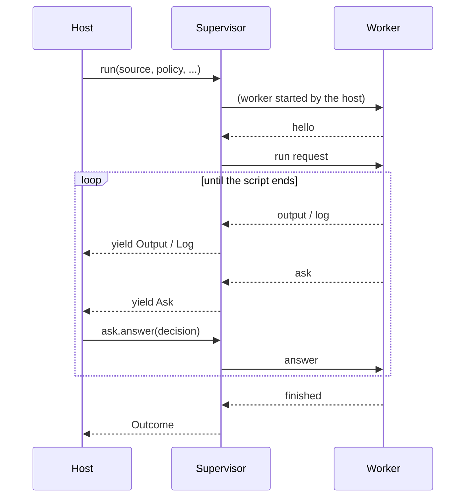

# Worker and Supervisor design

Status: partly built. Built: the run limits it relies on
(`max_asks`, decisions off the wall clock) and the protocol: its
framing, messages and payloads (`src/adjutant/protocol.cr`,
`src/adjutant/protocol_payloads.cr`). `Worker` and `Supervisor` are
proposed.

## Purpose

A host runs Adjutant in a child process, so that a defect in Adjutant
costs a run, not the host. A crash, a hang, exhaustion or heap
corruption in the child ends the child; the host gets an outcome
saying so and carries on.

The child is the host's own executable started with a reserved
argument, so a host that ships one binary still ships one binary. The
same protocol serves a standalone `adjutant` executable, so a host
that would rather ship a package changes the path it starts and
nothing else.

Two types, both in Adjutant:

- **`Adjutant::Worker`** runs in the child: it reads one request,
  runs it through an `Interpreter`, and reports back.
- **`Adjutant::Supervisor`** runs in the host: it owns the pipes, the
  framing, the clocks and the caps, and yields events to the host.

The host never reads or writes a byte of the protocol.

## Principles

1. **One request per worker.** A worker serves one assessment or one
   run, then exits. Nothing outlives a run, as "per run means per
   `eval`" (HANDOFF.md §4.10) already requires in-process.
2. **The worker enforces; the Supervisor backstops.** Every limit a
   script can meet is enforced in the worker, where it becomes a
   diagnostic the script's author can read. The Supervisor enforces
   the same limits again, more loosely, and kills the worker when one
   is crossed; only a misbehaving worker crosses them.
3. **Once a request is sent, the worker is untrusted.** Isolation
   assumes a script might take over the worker process through an
   Adjutant defect while it runs. The binary stays honest, and so
   does the host, which runs the same code but never ran the script.
   Everything the Supervisor reads is therefore parsed strictly and
   bounded before it is parsed, and no message from the worker can
   stop a clock the Supervisor can't restart. A tampered binary is a
   different compromise, of both sides at once, and nothing at run
   time defends against it.
4. **Every violation ends the run.** The Supervisor never skips,
   repairs or guesses at a message it doesn't accept. It kills the
   worker and reports why (HANDOFF.md §3.5).

## Shape



An assessment has the same shape without the loop.

## The host's side

### Starting a worker

The host's `main` begins with:

```crystal
Adjutant::Worker.main(ARGV) { |interp| register_natives(interp) }
```

`Worker.main` returns at once unless `ARGV.first?` is
`Worker::ARGUMENT` (`"__adjutant-worker"`). Otherwise it serves one
request and exits, never returning. Its block runs against each
`Interpreter` the worker builds, before any script code, and is where
the host registers its natives and modules. It runs for assessments
too, since `RiskWalker` needs each native's `RiskProfile`.

A native registered there runs in the worker. One that needs the
host's state (a conversation, a credential store) can't reach it;
it needs a request/response round trip like `ask`, which this design
does not yet provide (see Open decisions).

A native must not write to `STDOUT`, which is the protocol pipe;
script output goes through the worker's `EffectHandler`.

### Handing over a process

```crystal
process = Process.new(Process.executable_path.not_nil!, [Adjutant::Worker::ARGUMENT],
  input: :pipe, output: :pipe, error: :pipe)
supervisor = Adjutant::Supervisor.new(process)
```

`Supervisor.new` raises `ArgumentError` unless the process's input,
output and error are all pipes (`Process#input?` and its siblings are
non-nil). The host chooses how the worker starts: directly, under an
OS sandbox launcher, or as the standalone `adjutant` executable.
`Supervisor.spawn` covers the common case: the current executable,
`Worker::ARGUMENT`, three pipes. It raises when
`Process.executable_path` is nil.

After an upgrade replaces the executable on disk,
`Process.executable_path` may name the new binary; the handshake
refuses a worker speaking another protocol version.

A Supervisor serves one request, as its worker does.

### Requests

```crystal
outcome = supervisor.run(source, policy_yaml, filename: "task.rb",
  files: {"helpers.rb" => helpers}, limits: Adjutant::ExecutionLimits.new,
  ceiling: 15.minutes) do |event|
  case event
  in Adjutant::Supervisor::Output then ui.append(event.text)
  in Adjutant::Supervisor::Log    then log.info { event.message }
  in Adjutant::Supervisor::Ask    then event.answer(ui.approve?(event.request))
  end
end
```

`assess(source, policy_yaml, filename:)` takes the same block and
returns an `Assessment`: the `RiskSummary`, the findings, and any parse
diagnostics. An assessment yields `Log` events only.

`files` is the virtual filesystem `require` reads; it travels with the
request, so the worker never asks the host for a file mid-run. `limits`
is `ExecutionLimits`, which stays out of the policy document. `ceiling`
is required: see Clocks.

### Events

`event` is the union `Output | Log | Ask`, so a `case … in` over it
must name every member; a host misses a new event at compile time,
not in production.

- **`Output`**: `text`, a chunk of the script's standard output, in
  order. Chunks don't align with `puts` calls.
- **`Log`**: `severity`, `source` and `message`, from the worker's
  `::Log` (the Broker's, among others).
- **`Ask`**: `request`, a `Protocol::DecisionRequest` (see Payloads),
  and `answer(decision : RiskFlowDecision)`. The host must
  call `answer` exactly once before the block returns. If it returns
  without answering, the Supervisor kills the worker and raises
  `Supervisor::UnansweredAskError`; defaulting to `Reject` would hide
  a host defect. Answering twice raises too.

The block runs in the Supervisor's reading fiber. While it runs, the
worker can't make progress past its next message, which is the
back-pressure on output. While an `Ask` is with the host, the worker
is blocked waiting for the answer, so nothing else arrives.

### Outcomes

`run` returns one of these, a union for the same reason as the events:

Outcome    |From      |Carries                                                                  
-----------|----------|-------------------------------------------------------------------------
`Completed`|worker    |the result's `inspect`, audit records, risk-flow events                  
`Raised`   |worker    |a `Diagnostic`, its plain-text rendering, audit records, risk-flow events
`Fatal`    |worker    |a `FatalSignal`'s kind, message and data, audit records                  
`Crashed`  |Supervisor|exit status, the tail of stderr                                          
`TimedOut` |Supervisor|which clock expired, the tail of stderr                                  
`Violated` |Supervisor|what the worker did wrong, the tail of stderr                            

`Raised` covers everything the worker can render: parse, compile and
runtime errors, an uncaught script exception, and the host-facing
errors `Interpreter#render_error` accepts. The worker renders it,
because only the worker has the source map, `require`d files
included.

`Crashed` is any exit without a `finished` message. Crystal's own
reports (a stack overflow, a segfault's backtrace) go to stderr, which
is why the last part of it travels with every Supervisor outcome.

### What a host can trust

What the Supervisor observes for itself is fact: the exit status, how
long the run took, when each message arrived, how many Asks it
answered, how much output it accepted, and which of its limits it
enforced. Everything the worker says is testimony: its output, logs,
Ask descriptions, outcome, audit records, risk-flow events and stderr.
Testimony is accurate while the worker is honest, and is whatever a
script wants once it has taken the worker over.

A lying Ask does no harm by itself. An approval grants something only
inside the worker, a taken-over worker needs no permission, and what
bounds it then is the OS sandbox (Later). Testimony becomes dangerous
when it outlives the worker or steers the host:

1. **Audit trails.** A host keeps the worker's audit records and
   risk-flow events marked as reported by the worker, beside the
   Supervisor's own observations, and never presents them alone as
   evidence of what a run did.
2. **Remembered decisions.** Nothing a worker says carries into
   another run. An approval may last the rest of its own run at most;
   a decision kept across runs records what the host decided and
   observed, never a worker's description of a flow.
3. **Automatic decisions.** A host that answers Asks by rule (allow
   anything whose `risk` has no effects, say) lets the worker choose
   the rule's input. That is safe only while the answer's effect stays
   inside the worker.

## The protocol

### Framing

Newline-delimited JSON: one message per line, UTF-8. JSON escapes
control characters inside strings, so a newline can only end a
message.

Each side reads with `IO#gets('\n', limit)`, whose limit is in bytes,
the newline included. A line that reaches the limit without a newline
is a violation; so is a stream that ends inside a line, a line that
isn't valid UTF-8, and a line that isn't exactly one JSON object with
a known `type` and its keys, no more and no fewer. Messages are
`JSON::Serializable::Strict`, with `use_json_discriminator` on `type`,
and enum values are read only by the name they're written as
(HANDOFF.md §4.19). Crystal's JSON parser refuses anything after the
object, and the discriminator copies each message through a
`JSON::Builder`, which stops past 99 levels of nesting; both raise a
`JSON::Error`, so a deeply nested message is a violation, not a stack
overflow.

Newline-delimited JSON was chosen over length-prefixed frames because
a contributor can read the pipe with `tee`; `gets` stopping at its
byte limit gives the same bound.

Limit                             |Default|Why                                                 
----------------------------------|-------|----------------------------------------------------
Worker line, as read by Supervisor|1 MiB  |the host's exposure to a hostile worker             
Supervisor line, as read by worker|64 MiB |a request carries the source and every `files` entry
`output` chunk                    |64 KiB |worker splits larger writes                         
`finished` result `inspect`       |256 KiB|worker truncates and says so                        

### Messages

Worker to Supervisor:

Type       |Fields                                         |When                                
-----------|-----------------------------------------------|------------------------------------
`hello`    |`protocol` (Int32), `adjutant` (version string)|first, before reading anything      
`output`   |`text`                                         |during a run                        
`log`      |`severity`, `source`, `message`                |any time after `hello`              
`ask`      |`id` (Int32), `request`                        |during a run                        
`audit`    |`record`                                       |after a run, one per audit record   
`risk_flow`|`event`                                        |after a run, one per risk-flow event
`assessed` |`outcome`: `assessment` or `raised`            |last, for an assessment             
`finished` |`outcome`: `completed`, `raised` or `fatal`    |last, for a run                     

Supervisor to worker:

Type    |Fields                                                                 |When            
--------|-----------------------------------------------------------------------|----------------
`assess`|`source`, `filename`, `policy`                                         |after `hello`   
`run`   |`source`, `filename`, `policy`, `files`, `limits`, `risk_flow_tracking`|after `hello`   
`answer`|`id`, `decision` (`allow` or `reject`)                                 |after each `ask`

`policy` is the YAML document, as `Policy.from_yaml` takes it; the
worker parses it, so an invalid policy is a `Raised` outcome naming
the dotted path, as in-process.

### Payloads

A message carrying a core value (`request`, `summary`, `audit` and
the rest) carries a description of it: a `Protocol::Payload` built
with `from`, never turned back into the core type. The reading side
gets data to show, not objects to use. Rebuilding the core types
would run untrusted input through their constructors, or around them:
`RiskProfile`'s constructor enforces invariants that
`JSON::Serializable` skips, and a `RiskFlowOrigin` resolves real paths
and compiles regexes as it settles. A host that wants one prompt for
both kinds of run builds the same description in-process
(`DecisionRequest.from`).

Audit records and risk-flow events travel one per message, after the
run, so a long run's logs never make one line too long. An audit
timestamp keeps its nanoseconds, which `Time#to_json` would drop.

A description names its fields as its core type does. A spec compares
the two sets of instance variables, so a field added to a core type
fails until its description gains it or the spec names it as derived
(`RiskFlowOrigin`'s compiled regex).

### Ordering

The Supervisor accepts, and the worker sends, exactly this:

1. `hello`, whose `protocol` equals the Supervisor's.
2. Any number of `output`, `log` and `ask`, with nothing after an
   `ask` until its `answer`. An `answer` whose `id` isn't the pending
   `ask`'s is a violation on the worker's side.
3. For a run, any number of `audit` and `risk_flow`; then one
   `assessed` or `finished`, matching the request, with an outcome
   that request can end in.
4. End of stream and exit. Anything after the last message is a
   violation.

An exit status other than 0 after `finished` is reported on the
outcome but doesn't replace it.

## Clocks and caps

A run has three clocks.

1. **`wall_clock`** (worker, from the policy). Measures the run,
   minus time spent waiting for an `answer` (`Budget#off_clock`).
   Expiry raises the fatal `Exhausted`.
2. **The deadline** (Supervisor). `wall_clock` plus a grace period,
   paused while an `Ask` is with the host. Expiry kills the worker:
   `TimedOut(:deadline)`.
3. **The ceiling** (Supervisor, the `ceiling:` argument). Never
   pauses. It bounds everything a misbehaving worker could stretch:
   `ask` after `ask`, or a host that never answers. Expiry kills the
   worker: `TimedOut(:ceiling)`. It has no default, because only the
   host knows how long a user may take to decide.

Caps, enforced in the worker and backstopped by the Supervisor:

- **Asks per run.** A script that asks hundreds of times is betting on
  a reflexive approval. The policy's `max_asks` bounds it: the worker
  raises `Exhausted` at the Ask past it, and the Supervisor kills a
  worker that sends that Ask anyway.
- **Output.** Standard output isn't a budget today. The Supervisor
  caps the total it accepts; whether the worker gets a matching budget
  is open.

The Supervisor drains stderr in its own fiber from the start, keeping
the last 64 KiB, so a worker writing to stderr can't block on a full
pipe.

## Changes elsewhere in Adjutant

1. A `::Log` backend in the worker that writes `log` messages.

The VM writes to `STDOUT` only when an `Interpreter` has no
`EffectHandler`; the worker always installs one.

## Testing

The protocol code works over a reader and a writer, with `Process`
only at the edges, so specs run a worker in a fiber over `IO.pipe`s
without starting a process. A few specs start the real thing.

Each check gets a case it must reject (HANDOFF.md §4.7): a line one
byte over the limit, an unknown key, an unknown type, a wrong protocol
version, an `answer` for another `id`, a message after `finished`, a
`log` while an `ask` is pending, an exit without `finished`, an `ask`
past the cap, and a block that returns without answering.

## Later

- **OS sandboxing.** The worker, after reading its request and before
  parsing the script, restricts itself to what the policy grants:
  Landlock and seccomp on Linux, Seatbelt on macOS, a Job Object and
  AppContainer on Windows. A defect in the Broker then meets the
  kernel's limit. The request is read first because the grants decide
  the rules.
- **The `adjutant` executable**: `Worker.main` compiled on its own, as
  a shard target.

## Open decisions

- **Stray writes to `STDOUT`.** Today a native that prints corrupts
  the protocol and ends the run as `Violated`. The worker could keep
  the pipe on a duplicate descriptor and point `STDOUT` at stderr
  (`IO::FileDescriptor#reopen` exists; a duplicate needs `LibC.dup`),
  turning stray output into crash-report noise.
- **Host round trips.** A native needing host state would need a
  general request/response message, of which `ask` is the first case.
  Wait for a native that needs it.
- **Structured results.** `Completed` carries `inspect` text. A host
  wanting data back would need a JSON form of `Value`, bounded by
  nesting depth.
- **Approval cache.** research/IFC_DESIGN.md's open question, not yet
  built, matters more once asks are capped: a cache keeps a repeated,
  already-approved flow from spending the cap. Kept in the worker, it
  lasts one run; kept in the host across runs, it must follow What a
  host can trust, point 2.
